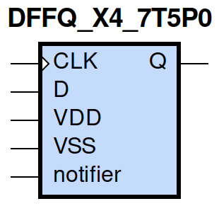

=======================================
gf180mcu_fd_sc_mcu7t5v0__dffq_x4
=======================================

**gf180mcu_fd_sc_mcu7t5v0__dffq_x4 symbol**

**gf180mcu_fd_sc_mcu7t5v0__dffq_x4 schematic**

.. image:: sc7_sch/DFFQ_X4_sch.png
    :height: 300px
    :width: 500 px
    :align: center
    :alt: gf180mcu_fd_sc_mcu7t5v0__dffq_x4 schematic

**gf180mcu_fd_sc_mcu7t5v0__dffq_x4 layout**

.. image:: sc7_lay/DFFQ_X4_lay.png
    :height: 400px
    :width: 700 px
    :align: center
    :alt: gf180mcu_fd_sc_mcu7t5v0__dffq_x4 layout

.. include:: images.rst

DFFQ_X4 is a poistive edge triggered D-type flip flop, 4X drive strength

|
| Attributes

============= ======================
**Attribute** **Value**
area          79.027200 µm\ :sup:`2`
============= ======================

|

TRUTH TABLE

===== === ======
Input     Output
D     CLK Q
L     ↑   L
H     ↑   H
===== === ======

|
| FUNCTIONAL SCHEMATIC
| |image236|
| CONSTRAINTS

================== =============== ============= ============
**Constraint Pin** **Related Pin** **setup(ns)** **hold(ns)**
D(LH)              CLK(LH)         0.2460        0.0630
D(HL)              CLK(LH)         0.2460        0.1030
================== =============== ============= ============

|

================== =============== ===========================
**Constraint Pin** **Related Pin** **Minimum Pulse Width(ns)**
CLK(LHL)           CLK(LH)         0.3680
CLK(LHL)           CLK(LH)         0.5440
CLK(HLH)           CLK(HL)         0.5650
CLK(HLH)           CLK(HL)         0.3820
================== =============== ===========================

|
| PIN CAPACITANCE (pf)

======= ======== ====================
**Pin** **Type** **Capacitance (pf)**
CLK     input    0.0034
D       input    0.0024
======= ======== ====================

|
| DELAY AND OUTPUT TRANSITION TIME corresponding to min slew and load

+---------------+------------+--------------------+--------------+-------------------+----------------+---------------+
| **Input Pin** | **Output** | **When Condition** | **Tin (ns)** | **Out Load (pf)** | **Delay (ns)** | **Tout (ns)** |
+---------------+------------+--------------------+--------------+-------------------+----------------+---------------+
| CLK(LH)       | Q(HL)      | !D                 | 0.0100       | 0.0010            | 0.7011         | 0.0343        |
+---------------+------------+--------------------+--------------+-------------------+----------------+---------------+
| CLK(LH)       | Q(LH)      | D                  | 0.0100       | 0.0010            | 0.7111         | 0.0364        |
+---------------+------------+--------------------+--------------+-------------------+----------------+---------------+

|
| DYNAMIC ENERGY

+---------------+--------------------+--------------+------------+-------------------+---------------------+
| **Input Pin** | **When Condition** | **Tin (ns)** | **Output** | **Out Load (pf)** | **Energy (uW/MHz)** |
+---------------+--------------------+--------------+------------+-------------------+---------------------+
| CLK           | !D                 | 0.0100       | Q(HL)      | 0.0010            | 0.9839              |
+---------------+--------------------+--------------+------------+-------------------+---------------------+
| CLK           | D                  | 0.0100       | Q(LH)      | 0.0010            | 1.0675              |
+---------------+--------------------+--------------+------------+-------------------+---------------------+
| D(LH)         | !CLK               | 0.0100       | n/a        | n/a               | 0.1085              |
+---------------+--------------------+--------------+------------+-------------------+---------------------+
| D(LH)         | CLK                | 0.0100       | n/a        | n/a               | -0.0067             |
+---------------+--------------------+--------------+------------+-------------------+---------------------+
| CLK(LH)       | !D                 | 0.0100       | n/a        | n/a               | 0.2147              |
+---------------+--------------------+--------------+------------+-------------------+---------------------+
| CLK(LH)       | D                  | 0.0100       | n/a        | n/a               | 0.2143              |
+---------------+--------------------+--------------+------------+-------------------+---------------------+
| D(HL)         | !CLK               | 0.0100       | n/a        | n/a               | 0.1614              |
+---------------+--------------------+--------------+------------+-------------------+---------------------+
| D(HL)         | CLK                | 0.0100       | n/a        | n/a               | 0.0097              |
+---------------+--------------------+--------------+------------+-------------------+---------------------+
| CLK(HL)       | !D                 | 0.0100       | n/a        | n/a               | 0.2871              |
+---------------+--------------------+--------------+------------+-------------------+---------------------+
| CLK(HL)       | D                  | 0.0100       | n/a        | n/a               | 0.2911              |
+---------------+--------------------+--------------+------------+-------------------+---------------------+

|
| LEAKAGE POWER

================== ==============
**When Condition** **Power (nW)**
!CLK&!D            0.4522
!CLK&D             0.4774
CLK&!D             0.5443
CLK&D              0.5720
================== ==============

