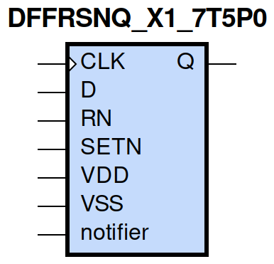
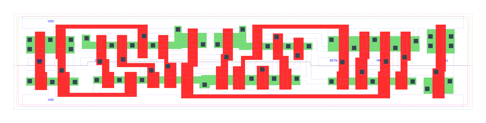

=======================================
gf180mcu_fd_sc_mcu7t5v0__dffrsnq_x1
=======================================

**gf180mcu_fd_sc_mcu7t5v0__dffrsnq_x1 symbol**

**gf180mcu_fd_sc_mcu7t5v0__dffrsnq_x1 schematic**

.. image:: sc7_sch/DFFRSNQ_X1_sch.png
    :height: 300px
    :width: 500 px
    :align: center
    :alt: gf180mcu_fd_sc_mcu7t5v0__dffrsnq_x1 schematic

**gf180mcu_fd_sc_mcu7t5v0__dffrsnq_x1 layout**

.. include:: images.rst

DFFRSNQ_X1 is a positive edge triggered D-type flip flop, active low set/reset, 1X drive strength

|
| Attributes

============= ======================
**Attribute** **Value**
area          85.612800 µm\ :sup:`2`
============= ======================

|

TRUTH TABLE

===== ==== = === ======
Input            Output
RN    SETN D CLK Q
H     H    L ↑   L
H     H    H ↑   H
L     H    X X   L
H     L    X X   H
L     L    X X   L
===== ==== = === ======

|
| FUNCTIONAL SCHEMATIC
| |image248|
| CONSTRAINTS

================== =============== ============= ============
**Constraint Pin** **Related Pin** **setup(ns)** **hold(ns)**
D(HL)              CLK(LH)         0.2920        0.0340
D(LH)              CLK(LH)         0.1600        -0.0170
SETN(LH)           RN(LH)          0.0110        0.0690
SETN(LH)           RN(LH)          -0.0630       0.1140
SETN(LH)           RN(LH)          0.0110        0.0690
SETN(LH)           RN(LH)          -0.0630       0.1140
RN(LH)             SETN(LH)        0.0690        0.0110
RN(LH)             SETN(LH)        0.1140        -0.0630
RN(LH)             SETN(LH)        0.0690        0.0110
RN(LH)             SETN(LH)        0.1140        -0.0630
================== =============== ============= ============

|

================== =============== ================ ===============
**Constraint Pin** **Related Pin** **recovery(ns)** **removal(ns)**
SETN(LH)           CLK(LH)         -0.0860          0.3320
RN(LH)             CLK(LH)         -0.3430          0.5270
================== =============== ================ ===============

|

================== =============== ===========================
**Constraint Pin** **Related Pin** **Minimum Pulse Width(ns)**
CLK(HLH)           CLK(HL)         0.4920
CLK(HLH)           CLK(HL)         0.3270
CLK(LHL)           CLK(LH)         0.4370
CLK(LHL)           CLK(LH)         0.5640
SETN(HLH)          SETN(HL)        0.3980
SETN(HLH)          SETN(HL)        0.6420
SETN(HLH)          SETN(HL)        0.3980
SETN(HLH)          SETN(HL)        0.6420
RN(HLH)            RN(HL)          0.3680
RN(HLH)            RN(HL)          0.5050
RN(HLH)            RN(HL)          0.3680
RN(HLH)            RN(HL)          0.5050
================== =============== ===========================

|
| PIN CAPACITANCE (pf)

======= ======== ====================
**Pin** **Type** **Capacitance (pf)**
CLK     input    0.0034
D       input    0.0023
SETN    input    0.0063
RN      input    0.0074
======= ======== ====================

|
| DELAY AND OUTPUT TRANSITION TIME corresponding to min slew and load

+---------------+------------+--------------------+--------------+-------------------+----------------+---------------+
| **Input Pin** | **Output** | **When Condition** | **Tin (ns)** | **Out Load (pf)** | **Delay (ns)** | **Tout (ns)** |
+---------------+------------+--------------------+--------------+-------------------+----------------+---------------+
| CLK(LH)       | Q(HL)      | !D&RN&SETN         | 0.0100       | 0.0010            | 0.6858         | 0.0446        |
+---------------+------------+--------------------+--------------+-------------------+----------------+---------------+
| CLK(LH)       | Q(LH)      | D&RN&SETN          | 0.0100       | 0.0010            | 0.8109         | 0.0568        |
+---------------+------------+--------------------+--------------+-------------------+----------------+---------------+
| SETN(HL)      | Q(LH)      | !CLK&!D&RN         | 0.0100       | 0.0010            | 0.5886         | 0.0563        |
+---------------+------------+--------------------+--------------+-------------------+----------------+---------------+
| SETN(HL)      | Q(LH)      | CLK&!D&RN          | 0.0100       | 0.0010            | 0.8742         | 0.0577        |
+---------------+------------+--------------------+--------------+-------------------+----------------+---------------+
| SETN(HL)      | Q(LH)      | !CLK&D&RN          | 0.0100       | 0.0010            | 0.5887         | 0.0561        |
+---------------+------------+--------------------+--------------+-------------------+----------------+---------------+
| SETN(HL)      | Q(LH)      | CLK&D&RN           | 0.0100       | 0.0010            | 0.8744         | 0.0574        |
+---------------+------------+--------------------+--------------+-------------------+----------------+---------------+
| RN(HL)        | Q(HL)      | !CLK&!D&SETN       | 0.0100       | 0.0010            | 0.2092         | 0.0432        |
+---------------+------------+--------------------+--------------+-------------------+----------------+---------------+
| RN(HL)        | Q(HL)      | CLK&!D&SETN        | 0.0100       | 0.0010            | 0.2094         | 0.0431        |
+---------------+------------+--------------------+--------------+-------------------+----------------+---------------+
| RN(HL)        | Q(HL)      | !CLK&D&SETN        | 0.0100       | 0.0010            | 0.2093         | 0.0432        |
+---------------+------------+--------------------+--------------+-------------------+----------------+---------------+
| RN(HL)        | Q(HL)      | CLK&D&SETN         | 0.0100       | 0.0010            | 0.2094         | 0.0431        |
+---------------+------------+--------------------+--------------+-------------------+----------------+---------------+
| RN(HL)        | Q(HL)      | !CLK&!D&!SETN      | 0.0100       | 0.0010            | 0.2088         | 0.0426        |
+---------------+------------+--------------------+--------------+-------------------+----------------+---------------+
| RN(HL)        | Q(HL)      | !CLK&D&!SETN       | 0.0100       | 0.0010            | 0.2088         | 0.0426        |
+---------------+------------+--------------------+--------------+-------------------+----------------+---------------+
| RN(HL)        | Q(HL)      | CLK&!D&!SETN       | 0.0100       | 0.0010            | 0.2090         | 0.0427        |
+---------------+------------+--------------------+--------------+-------------------+----------------+---------------+
| RN(HL)        | Q(HL)      | CLK&D&!SETN        | 0.0100       | 0.0010            | 0.2090         | 0.0427        |
+---------------+------------+--------------------+--------------+-------------------+----------------+---------------+
| RN(LH)        | Q(LH)      | !CLK&!D&!SETN      | 0.0100       | 0.0010            | 0.2982         | 0.0540        |
+---------------+------------+--------------------+--------------+-------------------+----------------+---------------+
| RN(LH)        | Q(LH)      | !CLK&D&!SETN       | 0.0100       | 0.0010            | 0.2982         | 0.0540        |
+---------------+------------+--------------------+--------------+-------------------+----------------+---------------+
| RN(LH)        | Q(LH)      | CLK&!D&!SETN       | 0.0100       | 0.0010            | 0.3008         | 0.0542        |
+---------------+------------+--------------------+--------------+-------------------+----------------+---------------+
| RN(LH)        | Q(LH)      | CLK&D&!SETN        | 0.0100       | 0.0010            | 0.3010         | 0.0541        |
+---------------+------------+--------------------+--------------+-------------------+----------------+---------------+

|
| DYNAMIC ENERGY

+---------------+--------------------+--------------+------------+-------------------+---------------------+
| **Input Pin** | **When Condition** | **Tin (ns)** | **Output** | **Out Load (pf)** | **Energy (uW/MHz)** |
+---------------+--------------------+--------------+------------+-------------------+---------------------+
| CLK           | !D&RN&SETN         | 0.0100       | Q(HL)      | 0.0010            | 0.5893              |
+---------------+--------------------+--------------+------------+-------------------+---------------------+
| CLK           | D&RN&SETN          | 0.0100       | Q(LH)      | 0.0010            | 0.7112              |
+---------------+--------------------+--------------+------------+-------------------+---------------------+
| SETN          | !CLK&!D&RN         | 0.0100       | Q(LH)      | 0.0010            | 0.5733              |
+---------------+--------------------+--------------+------------+-------------------+---------------------+
| SETN          | CLK&!D&RN          | 0.0100       | Q(LH)      | 0.0010            | 0.6912              |
+---------------+--------------------+--------------+------------+-------------------+---------------------+
| SETN          | !CLK&D&RN          | 0.0100       | Q(LH)      | 0.0010            | 0.4523              |
+---------------+--------------------+--------------+------------+-------------------+---------------------+
| SETN          | CLK&D&RN           | 0.0100       | Q(LH)      | 0.0010            | 0.6913              |
+---------------+--------------------+--------------+------------+-------------------+---------------------+
| RN            | !CLK&!D&SETN       | 0.0100       | Q(HL)      | 0.0010            | 0.3788              |
+---------------+--------------------+--------------+------------+-------------------+---------------------+
| RN            | CLK&!D&SETN        | 0.0100       | Q(HL)      | 0.0010            | 0.6075              |
+---------------+--------------------+--------------+------------+-------------------+---------------------+
| RN            | !CLK&D&SETN        | 0.0100       | Q(HL)      | 0.0010            | 0.3788              |
+---------------+--------------------+--------------+------------+-------------------+---------------------+
| RN            | CLK&D&SETN         | 0.0100       | Q(HL)      | 0.0010            | 0.6067              |
+---------------+--------------------+--------------+------------+-------------------+---------------------+
| RN            | !CLK&!D&!SETN      | 0.0100       | Q(HL)      | 0.0010            | 0.2655              |
+---------------+--------------------+--------------+------------+-------------------+---------------------+
| RN            | !CLK&D&!SETN       | 0.0100       | Q(HL)      | 0.0010            | 0.2637              |
+---------------+--------------------+--------------+------------+-------------------+---------------------+
| RN            | CLK&!D&!SETN       | 0.0100       | Q(HL)      | 0.0010            | 0.4117              |
+---------------+--------------------+--------------+------------+-------------------+---------------------+
| RN            | CLK&D&!SETN        | 0.0100       | Q(HL)      | 0.0010            | 0.4117              |
+---------------+--------------------+--------------+------------+-------------------+---------------------+
| RN            | !CLK&!D&!SETN      | 0.0100       | Q(LH)      | 0.0010            | 0.1495              |
+---------------+--------------------+--------------+------------+-------------------+---------------------+
| RN            | !CLK&D&!SETN       | 0.0100       | Q(LH)      | 0.0010            | 0.1510              |
+---------------+--------------------+--------------+------------+-------------------+---------------------+
| RN            | CLK&!D&!SETN       | 0.0100       | Q(LH)      | 0.0010            | 0.2358              |
+---------------+--------------------+--------------+------------+-------------------+---------------------+
| RN            | CLK&D&!SETN        | 0.0100       | Q(LH)      | 0.0010            | 0.2361              |
+---------------+--------------------+--------------+------------+-------------------+---------------------+
| SETN(HL)      | !CLK&!D&!RN        | 0.0100       | n/a        | n/a               | 0.3510              |
+---------------+--------------------+--------------+------------+-------------------+---------------------+
| SETN(HL)      | !CLK&D&!RN         | 0.0100       | n/a        | n/a               | 0.2364              |
+---------------+--------------------+--------------+------------+-------------------+---------------------+
| SETN(HL)      | CLK&!D&!RN         | 0.0100       | n/a        | n/a               | 0.3511              |
+---------------+--------------------+--------------+------------+-------------------+---------------------+
| SETN(HL)      | CLK&D&!RN          | 0.0100       | n/a        | n/a               | 0.3511              |
+---------------+--------------------+--------------+------------+-------------------+---------------------+
| SETN(HL)      | !CLK&!D&RN         | 0.0100       | n/a        | n/a               | 0.1625              |
+---------------+--------------------+--------------+------------+-------------------+---------------------+
| SETN(HL)      | CLK&!D&RN          | 0.0100       | n/a        | n/a               | 0.0418              |
+---------------+--------------------+--------------+------------+-------------------+---------------------+
| SETN(HL)      | !CLK&D&RN          | 0.0100       | n/a        | n/a               | 0.0418              |
+---------------+--------------------+--------------+------------+-------------------+---------------------+
| SETN(HL)      | CLK&D&RN           | 0.0100       | n/a        | n/a               | 0.0418              |
+---------------+--------------------+--------------+------------+-------------------+---------------------+
| D(HL)         | !CLK&!RN&!SETN     | 0.0100       | n/a        | n/a               | 0.1589              |
+---------------+--------------------+--------------+------------+-------------------+---------------------+
| D(HL)         | !CLK&!RN&SETN      | 0.0100       | n/a        | n/a               | 0.2485              |
+---------------+--------------------+--------------+------------+-------------------+---------------------+
| D(HL)         | CLK&!RN&!SETN      | 0.0100       | n/a        | n/a               | 0.0521              |
+---------------+--------------------+--------------+------------+-------------------+---------------------+
| D(HL)         | CLK&!RN&SETN       | 0.0100       | n/a        | n/a               | 0.0521              |
+---------------+--------------------+--------------+------------+-------------------+---------------------+
| D(HL)         | !CLK&RN&!SETN      | 0.0100       | n/a        | n/a               | 0.1588              |
+---------------+--------------------+--------------+------------+-------------------+---------------------+
| D(HL)         | CLK&RN&!SETN       | 0.0100       | n/a        | n/a               | 0.0521              |
+---------------+--------------------+--------------+------------+-------------------+---------------------+
| D(HL)         | !CLK&RN&SETN       | 0.0100       | n/a        | n/a               | 0.2385              |
+---------------+--------------------+--------------+------------+-------------------+---------------------+
| D(HL)         | CLK&RN&SETN        | 0.0100       | n/a        | n/a               | 0.0521              |
+---------------+--------------------+--------------+------------+-------------------+---------------------+
| CLK(LH)       | !D&!RN&!SETN       | 0.0100       | n/a        | n/a               | 0.2501              |
+---------------+--------------------+--------------+------------+-------------------+---------------------+
| CLK(LH)       | !D&!RN&SETN        | 0.0100       | n/a        | n/a               | 0.2473              |
+---------------+--------------------+--------------+------------+-------------------+---------------------+
| CLK(LH)       | D&!RN&!SETN        | 0.0100       | n/a        | n/a               | 0.3552              |
+---------------+--------------------+--------------+------------+-------------------+---------------------+
| CLK(LH)       | D&!RN&SETN         | 0.0100       | n/a        | n/a               | 0.5177              |
+---------------+--------------------+--------------+------------+-------------------+---------------------+
| CLK(LH)       | !D&RN&!SETN        | 0.0100       | n/a        | n/a               | 0.3048              |
+---------------+--------------------+--------------+------------+-------------------+---------------------+
| CLK(LH)       | D&RN&!SETN         | 0.0100       | n/a        | n/a               | 0.2557              |
+---------------+--------------------+--------------+------------+-------------------+---------------------+
| CLK(LH)       | !D&RN&SETN         | 0.0100       | n/a        | n/a               | 0.2472              |
+---------------+--------------------+--------------+------------+-------------------+---------------------+
| CLK(LH)       | D&RN&SETN          | 0.0100       | n/a        | n/a               | 0.2557              |
+---------------+--------------------+--------------+------------+-------------------+---------------------+
| CLK(HL)       | !D&!RN&!SETN       | 0.0100       | n/a        | n/a               | 0.3080              |
+---------------+--------------------+--------------+------------+-------------------+---------------------+
| CLK(HL)       | !D&!RN&SETN        | 0.0100       | n/a        | n/a               | 0.3115              |
+---------------+--------------------+--------------+------------+-------------------+---------------------+
| CLK(HL)       | D&!RN&!SETN        | 0.0100       | n/a        | n/a               | 0.3571              |
+---------------+--------------------+--------------+------------+-------------------+---------------------+
| CLK(HL)       | D&!RN&SETN         | 0.0100       | n/a        | n/a               | 0.5176              |
+---------------+--------------------+--------------+------------+-------------------+---------------------+
| CLK(HL)       | !D&RN&!SETN        | 0.0100       | n/a        | n/a               | 0.4594              |
+---------------+--------------------+--------------+------------+-------------------+---------------------+
| CLK(HL)       | D&RN&!SETN         | 0.0100       | n/a        | n/a               | 0.3097              |
+---------------+--------------------+--------------+------------+-------------------+---------------------+
| CLK(HL)       | !D&RN&SETN         | 0.0100       | n/a        | n/a               | 0.3115              |
+---------------+--------------------+--------------+------------+-------------------+---------------------+
| CLK(HL)       | D&RN&SETN          | 0.0100       | n/a        | n/a               | 0.3097              |
+---------------+--------------------+--------------+------------+-------------------+---------------------+
| D(LH)         | !CLK&!RN&!SETN     | 0.0100       | n/a        | n/a               | 0.0529              |
+---------------+--------------------+--------------+------------+-------------------+---------------------+
| D(LH)         | !CLK&!RN&SETN      | 0.0100       | n/a        | n/a               | 0.1995              |
+---------------+--------------------+--------------+------------+-------------------+---------------------+
| D(LH)         | CLK&!RN&!SETN      | 0.0100       | n/a        | n/a               | 0.0044              |
+---------------+--------------------+--------------+------------+-------------------+---------------------+
| D(LH)         | CLK&!RN&SETN       | 0.0100       | n/a        | n/a               | 0.0044              |
+---------------+--------------------+--------------+------------+-------------------+---------------------+
| D(LH)         | !CLK&RN&!SETN      | 0.0100       | n/a        | n/a               | 0.0529              |
+---------------+--------------------+--------------+------------+-------------------+---------------------+
| D(LH)         | CLK&RN&!SETN       | 0.0100       | n/a        | n/a               | 0.0044              |
+---------------+--------------------+--------------+------------+-------------------+---------------------+
| D(LH)         | !CLK&RN&SETN       | 0.0100       | n/a        | n/a               | 0.2059              |
+---------------+--------------------+--------------+------------+-------------------+---------------------+
| D(LH)         | CLK&RN&SETN        | 0.0100       | n/a        | n/a               | 0.0044              |
+---------------+--------------------+--------------+------------+-------------------+---------------------+
| RN(HL)        | !CLK&!D&SETN       | 0.0100       | n/a        | n/a               | 0.0510              |
+---------------+--------------------+--------------+------------+-------------------+---------------------+
| RN(HL)        | CLK&!D&SETN        | 0.0100       | n/a        | n/a               | 0.0524              |
+---------------+--------------------+--------------+------------+-------------------+---------------------+
| RN(HL)        | !CLK&D&SETN        | 0.0100       | n/a        | n/a               | 0.0493              |
+---------------+--------------------+--------------+------------+-------------------+---------------------+
| RN(HL)        | CLK&D&SETN         | 0.0100       | n/a        | n/a               | 0.0523              |
+---------------+--------------------+--------------+------------+-------------------+---------------------+
| RN(LH)        | !CLK&!D&SETN       | 0.0100       | n/a        | n/a               | -0.0487             |
+---------------+--------------------+--------------+------------+-------------------+---------------------+
| RN(LH)        | !CLK&D&SETN        | 0.0100       | n/a        | n/a               | -0.0444             |
+---------------+--------------------+--------------+------------+-------------------+---------------------+
| RN(LH)        | CLK&!D&SETN        | 0.0100       | n/a        | n/a               | -0.0487             |
+---------------+--------------------+--------------+------------+-------------------+---------------------+
| RN(LH)        | CLK&D&SETN         | 0.0100       | n/a        | n/a               | -0.0487             |
+---------------+--------------------+--------------+------------+-------------------+---------------------+
| SETN(LH)      | !CLK&!D&!RN        | 0.0100       | n/a        | n/a               | 0.1133              |
+---------------+--------------------+--------------+------------+-------------------+---------------------+
| SETN(LH)      | !CLK&D&!RN         | 0.0100       | n/a        | n/a               | 0.0649              |
+---------------+--------------------+--------------+------------+-------------------+---------------------+
| SETN(LH)      | CLK&!D&!RN         | 0.0100       | n/a        | n/a               | 0.1070              |
+---------------+--------------------+--------------+------------+-------------------+---------------------+
| SETN(LH)      | CLK&D&!RN          | 0.0100       | n/a        | n/a               | 0.1070              |
+---------------+--------------------+--------------+------------+-------------------+---------------------+
| SETN(LH)      | !CLK&!D&RN         | 0.0100       | n/a        | n/a               | 0.0155              |
+---------------+--------------------+--------------+------------+-------------------+---------------------+
| SETN(LH)      | !CLK&D&RN          | 0.0100       | n/a        | n/a               | -0.0248             |
+---------------+--------------------+--------------+------------+-------------------+---------------------+
| SETN(LH)      | CLK&!D&RN          | 0.0100       | n/a        | n/a               | -0.0248             |
+---------------+--------------------+--------------+------------+-------------------+---------------------+
| SETN(LH)      | CLK&D&RN           | 0.0100       | n/a        | n/a               | -0.0248             |
+---------------+--------------------+--------------+------------+-------------------+---------------------+

|
| LEAKAGE POWER

================== ==============
**When Condition** **Power (nW)**
!CLK&!D&!RN&!SETN  0.4517
!CLK&!D&!RN&SETN   0.4639
!CLK&D&!RN&!SETN   0.4501
!CLK&D&!RN&SETN    0.4762
CLK&!D&!RN&!SETN   0.5333
CLK&!D&!RN&SETN    0.5046
CLK&D&!RN&!SETN    0.5353
CLK&D&!RN&SETN     0.5065
CLK&D&RN&SETN      0.7016
!CLK&!D&RN&!SETN   0.4362
!CLK&D&RN&!SETN    0.4330
CLK&!D&RN&!SETN    0.4930
CLK&D&RN&!SETN     0.4902
!CLK&!D&RN&SETN    0.6108
!CLK&D&RN&SETN     0.6014
CLK&!D&RN&SETN     0.5302
================== ==============

