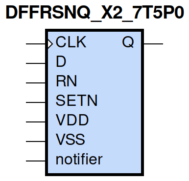
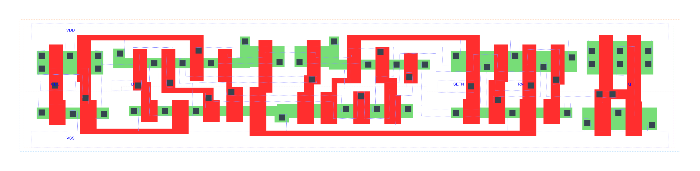

=======================================
gf180mcu_fd_sc_mcu7t5v0__dffrsnq_x2
=======================================

**gf180mcu_fd_sc_mcu7t5v0__dffrsnq_x2 symbol**

**gf180mcu_fd_sc_mcu7t5v0__dffrsnq_x2 schematic**

.. image:: sc7_sch/DFFRSNQ_X2_sch.png
    :height: 300px
    :width: 500 px
    :align: center
    :alt: gf180mcu_fd_sc_mcu7t5v0__dffrsnq_x2 schematic

**gf180mcu_fd_sc_mcu7t5v0__dffrsnq_x2 layout**

.. include:: images.rst

DFFRSNQ_X2 is a positive edge triggered D-type flip flop, active low set/reset, 2X drive strength

|
| Attributes

============= ======================
**Attribute** **Value**
area          90.003200 µm\ :sup:`2`
============= ======================

|

TRUTH TABLE

===== ==== = === ======
Input            Output
RN    SETN D CLK Q
H     H    L ↑   L
H     H    H ↑   H
L     H    X X   L
H     L    X X   H
L     L    X X   L
===== ==== = === ======

|
| FUNCTIONAL SCHEMATIC
| |image251|
| CONSTRAINTS

================== =============== ============= ============
**Constraint Pin** **Related Pin** **setup(ns)** **hold(ns)**
D(HL)              CLK(LH)         0.2980        0.0400
D(LH)              CLK(LH)         0.1660        -0.0170
SETN(LH)           RN(LH)          -0.0400       0.1370
SETN(LH)           RN(LH)          -0.0630       0.1490
SETN(LH)           RN(LH)          -0.0400       0.1370
SETN(LH)           RN(LH)          -0.0630       0.1490
RN(LH)             SETN(LH)        0.1370        -0.0400
RN(LH)             SETN(LH)        0.1490        -0.0630
RN(LH)             SETN(LH)        0.1370        -0.0400
RN(LH)             SETN(LH)        0.1490        -0.0630
================== =============== ============= ============

|

================== =============== ================ ===============
**Constraint Pin** **Related Pin** **recovery(ns)** **removal(ns)**
SETN(LH)           CLK(LH)         -0.0860          0.3320
RN(LH)             CLK(LH)         -0.3320          0.5270
================== =============== ================ ===============

|

================== =============== ===========================
**Constraint Pin** **Related Pin** **Minimum Pulse Width(ns)**
CLK(HLH)           CLK(HL)         0.4920
CLK(HLH)           CLK(HL)         0.3270
CLK(LHL)           CLK(LH)         0.4950
CLK(LHL)           CLK(LH)         0.6220
SETN(HLH)          SETN(HL)        0.4560
SETN(HLH)          SETN(HL)        0.6610
SETN(HLH)          SETN(HL)        0.4560
SETN(HLH)          SETN(HL)        0.6610
RN(HLH)            RN(HL)          0.3580
RN(HLH)            RN(HL)          0.5050
RN(HLH)            RN(HL)          0.3580
RN(HLH)            RN(HL)          0.5050
================== =============== ===========================

|
| PIN CAPACITANCE (pf)

======= ======== ====================
**Pin** **Type** **Capacitance (pf)**
CLK     input    0.0034
D       input    0.0023
SETN    input    0.0063
RN      input    0.0074
======= ======== ====================

|
| DELAY AND OUTPUT TRANSITION TIME corresponding to min slew and load

+---------------+------------+--------------------+--------------+-------------------+----------------+---------------+
| **Input Pin** | **Output** | **When Condition** | **Tin (ns)** | **Out Load (pf)** | **Delay (ns)** | **Tout (ns)** |
+---------------+------------+--------------------+--------------+-------------------+----------------+---------------+
| CLK(LH)       | Q(HL)      | !D&RN&SETN         | 0.0100       | 0.0010            | 0.7282         | 0.0456        |
+---------------+------------+--------------------+--------------+-------------------+----------------+---------------+
| CLK(LH)       | Q(LH)      | D&RN&SETN          | 0.0100       | 0.0010            | 0.8823         | 0.0555        |
+---------------+------------+--------------------+--------------+-------------------+----------------+---------------+
| SETN(HL)      | Q(LH)      | !CLK&!D&RN         | 0.0100       | 0.0010            | 0.6599         | 0.0549        |
+---------------+------------+--------------------+--------------+-------------------+----------------+---------------+
| SETN(HL)      | Q(LH)      | CLK&!D&RN          | 0.0100       | 0.0010            | 0.9459         | 0.0559        |
+---------------+------------+--------------------+--------------+-------------------+----------------+---------------+
| SETN(HL)      | Q(LH)      | !CLK&D&RN          | 0.0100       | 0.0010            | 0.6602         | 0.0549        |
+---------------+------------+--------------------+--------------+-------------------+----------------+---------------+
| SETN(HL)      | Q(LH)      | CLK&D&RN           | 0.0100       | 0.0010            | 0.9461         | 0.0556        |
+---------------+------------+--------------------+--------------+-------------------+----------------+---------------+
| RN(HL)        | Q(HL)      | !CLK&!D&SETN       | 0.0100       | 0.0010            | 0.2462         | 0.0445        |
+---------------+------------+--------------------+--------------+-------------------+----------------+---------------+
| RN(HL)        | Q(HL)      | CLK&!D&SETN        | 0.0100       | 0.0010            | 0.2463         | 0.0444        |
+---------------+------------+--------------------+--------------+-------------------+----------------+---------------+
| RN(HL)        | Q(HL)      | !CLK&D&SETN        | 0.0100       | 0.0010            | 0.2462         | 0.0446        |
+---------------+------------+--------------------+--------------+-------------------+----------------+---------------+
| RN(HL)        | Q(HL)      | CLK&D&SETN         | 0.0100       | 0.0010            | 0.2462         | 0.0444        |
+---------------+------------+--------------------+--------------+-------------------+----------------+---------------+
| RN(HL)        | Q(HL)      | !CLK&!D&!SETN      | 0.0100       | 0.0010            | 0.2456         | 0.0439        |
+---------------+------------+--------------------+--------------+-------------------+----------------+---------------+
| RN(HL)        | Q(HL)      | !CLK&D&!SETN       | 0.0100       | 0.0010            | 0.2456         | 0.0439        |
+---------------+------------+--------------------+--------------+-------------------+----------------+---------------+
| RN(HL)        | Q(HL)      | CLK&!D&!SETN       | 0.0100       | 0.0010            | 0.2457         | 0.0438        |
+---------------+------------+--------------------+--------------+-------------------+----------------+---------------+
| RN(HL)        | Q(HL)      | CLK&D&!SETN        | 0.0100       | 0.0010            | 0.2457         | 0.0438        |
+---------------+------------+--------------------+--------------+-------------------+----------------+---------------+
| RN(LH)        | Q(LH)      | !CLK&!D&!SETN      | 0.0100       | 0.0010            | 0.3622         | 0.0530        |
+---------------+------------+--------------------+--------------+-------------------+----------------+---------------+
| RN(LH)        | Q(LH)      | !CLK&D&!SETN       | 0.0100       | 0.0010            | 0.3622         | 0.0530        |
+---------------+------------+--------------------+--------------+-------------------+----------------+---------------+
| RN(LH)        | Q(LH)      | CLK&!D&!SETN       | 0.0100       | 0.0010            | 0.3664         | 0.0531        |
+---------------+------------+--------------------+--------------+-------------------+----------------+---------------+
| RN(LH)        | Q(LH)      | CLK&D&!SETN        | 0.0100       | 0.0010            | 0.3664         | 0.0529        |
+---------------+------------+--------------------+--------------+-------------------+----------------+---------------+

|
| DYNAMIC ENERGY

+---------------+--------------------+--------------+------------+-------------------+---------------------+
| **Input Pin** | **When Condition** | **Tin (ns)** | **Output** | **Out Load (pf)** | **Energy (uW/MHz)** |
+---------------+--------------------+--------------+------------+-------------------+---------------------+
| CLK           | !D&RN&SETN         | 0.0100       | Q(HL)      | 0.0010            | 0.7526              |
+---------------+--------------------+--------------+------------+-------------------+---------------------+
| CLK           | D&RN&SETN          | 0.0100       | Q(LH)      | 0.0010            | 0.8968              |
+---------------+--------------------+--------------+------------+-------------------+---------------------+
| SETN          | !CLK&!D&RN         | 0.0100       | Q(LH)      | 0.0010            | 0.7444              |
+---------------+--------------------+--------------+------------+-------------------+---------------------+
| SETN          | CLK&!D&RN          | 0.0100       | Q(LH)      | 0.0010            | 0.8646              |
+---------------+--------------------+--------------+------------+-------------------+---------------------+
| SETN          | !CLK&D&RN          | 0.0100       | Q(LH)      | 0.0010            | 0.6233              |
+---------------+--------------------+--------------+------------+-------------------+---------------------+
| SETN          | CLK&D&RN           | 0.0100       | Q(LH)      | 0.0010            | 0.8647              |
+---------------+--------------------+--------------+------------+-------------------+---------------------+
| RN            | !CLK&!D&SETN       | 0.0100       | Q(HL)      | 0.0010            | 0.5371              |
+---------------+--------------------+--------------+------------+-------------------+---------------------+
| RN            | CLK&!D&SETN        | 0.0100       | Q(HL)      | 0.0010            | 0.7694              |
+---------------+--------------------+--------------+------------+-------------------+---------------------+
| RN            | !CLK&D&SETN        | 0.0100       | Q(HL)      | 0.0010            | 0.5372              |
+---------------+--------------------+--------------+------------+-------------------+---------------------+
| RN            | CLK&D&SETN         | 0.0100       | Q(HL)      | 0.0010            | 0.7686              |
+---------------+--------------------+--------------+------------+-------------------+---------------------+
| RN            | !CLK&!D&!SETN      | 0.0100       | Q(HL)      | 0.0010            | 0.4159              |
+---------------+--------------------+--------------+------------+-------------------+---------------------+
| RN            | !CLK&D&!SETN       | 0.0100       | Q(HL)      | 0.0010            | 0.4141              |
+---------------+--------------------+--------------+------------+-------------------+---------------------+
| RN            | CLK&!D&!SETN       | 0.0100       | Q(HL)      | 0.0010            | 0.5618              |
+---------------+--------------------+--------------+------------+-------------------+---------------------+
| RN            | CLK&D&!SETN        | 0.0100       | Q(HL)      | 0.0010            | 0.5618              |
+---------------+--------------------+--------------+------------+-------------------+---------------------+
| RN            | !CLK&!D&!SETN      | 0.0100       | Q(LH)      | 0.0010            | 0.3132              |
+---------------+--------------------+--------------+------------+-------------------+---------------------+
| RN            | !CLK&D&!SETN       | 0.0100       | Q(LH)      | 0.0010            | 0.3147              |
+---------------+--------------------+--------------+------------+-------------------+---------------------+
| RN            | CLK&!D&!SETN       | 0.0100       | Q(LH)      | 0.0010            | 0.4013              |
+---------------+--------------------+--------------+------------+-------------------+---------------------+
| RN            | CLK&D&!SETN        | 0.0100       | Q(LH)      | 0.0010            | 0.4012              |
+---------------+--------------------+--------------+------------+-------------------+---------------------+
| SETN(HL)      | !CLK&!D&!RN        | 0.0100       | n/a        | n/a               | 0.3509              |
+---------------+--------------------+--------------+------------+-------------------+---------------------+
| SETN(HL)      | !CLK&D&!RN         | 0.0100       | n/a        | n/a               | 0.2362              |
+---------------+--------------------+--------------+------------+-------------------+---------------------+
| SETN(HL)      | CLK&!D&!RN         | 0.0100       | n/a        | n/a               | 0.3510              |
+---------------+--------------------+--------------+------------+-------------------+---------------------+
| SETN(HL)      | CLK&D&!RN          | 0.0100       | n/a        | n/a               | 0.3510              |
+---------------+--------------------+--------------+------------+-------------------+---------------------+
| SETN(HL)      | !CLK&!D&RN         | 0.0100       | n/a        | n/a               | 0.1625              |
+---------------+--------------------+--------------+------------+-------------------+---------------------+
| SETN(HL)      | CLK&!D&RN          | 0.0100       | n/a        | n/a               | 0.0418              |
+---------------+--------------------+--------------+------------+-------------------+---------------------+
| SETN(HL)      | !CLK&D&RN          | 0.0100       | n/a        | n/a               | 0.0418              |
+---------------+--------------------+--------------+------------+-------------------+---------------------+
| SETN(HL)      | CLK&D&RN           | 0.0100       | n/a        | n/a               | 0.0418              |
+---------------+--------------------+--------------+------------+-------------------+---------------------+
| D(HL)         | !CLK&!RN&!SETN     | 0.0100       | n/a        | n/a               | 0.1589              |
+---------------+--------------------+--------------+------------+-------------------+---------------------+
| D(HL)         | !CLK&!RN&SETN      | 0.0100       | n/a        | n/a               | 0.2485              |
+---------------+--------------------+--------------+------------+-------------------+---------------------+
| D(HL)         | CLK&!RN&!SETN      | 0.0100       | n/a        | n/a               | 0.0521              |
+---------------+--------------------+--------------+------------+-------------------+---------------------+
| D(HL)         | CLK&!RN&SETN       | 0.0100       | n/a        | n/a               | 0.0521              |
+---------------+--------------------+--------------+------------+-------------------+---------------------+
| D(HL)         | !CLK&RN&!SETN      | 0.0100       | n/a        | n/a               | 0.1588              |
+---------------+--------------------+--------------+------------+-------------------+---------------------+
| D(HL)         | CLK&RN&!SETN       | 0.0100       | n/a        | n/a               | 0.0521              |
+---------------+--------------------+--------------+------------+-------------------+---------------------+
| D(HL)         | !CLK&RN&SETN       | 0.0100       | n/a        | n/a               | 0.2385              |
+---------------+--------------------+--------------+------------+-------------------+---------------------+
| D(HL)         | CLK&RN&SETN        | 0.0100       | n/a        | n/a               | 0.0521              |
+---------------+--------------------+--------------+------------+-------------------+---------------------+
| CLK(LH)       | !D&!RN&!SETN       | 0.0100       | n/a        | n/a               | 0.2501              |
+---------------+--------------------+--------------+------------+-------------------+---------------------+
| CLK(LH)       | !D&!RN&SETN        | 0.0100       | n/a        | n/a               | 0.2473              |
+---------------+--------------------+--------------+------------+-------------------+---------------------+
| CLK(LH)       | D&!RN&!SETN        | 0.0100       | n/a        | n/a               | 0.3551              |
+---------------+--------------------+--------------+------------+-------------------+---------------------+
| CLK(LH)       | D&!RN&SETN         | 0.0100       | n/a        | n/a               | 0.5177              |
+---------------+--------------------+--------------+------------+-------------------+---------------------+
| CLK(LH)       | !D&RN&!SETN        | 0.0100       | n/a        | n/a               | 0.3048              |
+---------------+--------------------+--------------+------------+-------------------+---------------------+
| CLK(LH)       | D&RN&!SETN         | 0.0100       | n/a        | n/a               | 0.2557              |
+---------------+--------------------+--------------+------------+-------------------+---------------------+
| CLK(LH)       | !D&RN&SETN         | 0.0100       | n/a        | n/a               | 0.2473              |
+---------------+--------------------+--------------+------------+-------------------+---------------------+
| CLK(LH)       | D&RN&SETN          | 0.0100       | n/a        | n/a               | 0.2557              |
+---------------+--------------------+--------------+------------+-------------------+---------------------+
| CLK(HL)       | !D&!RN&!SETN       | 0.0100       | n/a        | n/a               | 0.3077              |
+---------------+--------------------+--------------+------------+-------------------+---------------------+
| CLK(HL)       | !D&!RN&SETN        | 0.0100       | n/a        | n/a               | 0.3112              |
+---------------+--------------------+--------------+------------+-------------------+---------------------+
| CLK(HL)       | D&!RN&!SETN        | 0.0100       | n/a        | n/a               | 0.3569              |
+---------------+--------------------+--------------+------------+-------------------+---------------------+
| CLK(HL)       | D&!RN&SETN         | 0.0100       | n/a        | n/a               | 0.5174              |
+---------------+--------------------+--------------+------------+-------------------+---------------------+
| CLK(HL)       | !D&RN&!SETN        | 0.0100       | n/a        | n/a               | 0.4592              |
+---------------+--------------------+--------------+------------+-------------------+---------------------+
| CLK(HL)       | D&RN&!SETN         | 0.0100       | n/a        | n/a               | 0.3094              |
+---------------+--------------------+--------------+------------+-------------------+---------------------+
| CLK(HL)       | !D&RN&SETN         | 0.0100       | n/a        | n/a               | 0.3113              |
+---------------+--------------------+--------------+------------+-------------------+---------------------+
| CLK(HL)       | D&RN&SETN          | 0.0100       | n/a        | n/a               | 0.3095              |
+---------------+--------------------+--------------+------------+-------------------+---------------------+
| D(LH)         | !CLK&!RN&!SETN     | 0.0100       | n/a        | n/a               | 0.0529              |
+---------------+--------------------+--------------+------------+-------------------+---------------------+
| D(LH)         | !CLK&!RN&SETN      | 0.0100       | n/a        | n/a               | 0.1995              |
+---------------+--------------------+--------------+------------+-------------------+---------------------+
| D(LH)         | CLK&!RN&!SETN      | 0.0100       | n/a        | n/a               | 0.0044              |
+---------------+--------------------+--------------+------------+-------------------+---------------------+
| D(LH)         | CLK&!RN&SETN       | 0.0100       | n/a        | n/a               | 0.0044              |
+---------------+--------------------+--------------+------------+-------------------+---------------------+
| D(LH)         | !CLK&RN&!SETN      | 0.0100       | n/a        | n/a               | 0.0529              |
+---------------+--------------------+--------------+------------+-------------------+---------------------+
| D(LH)         | CLK&RN&!SETN       | 0.0100       | n/a        | n/a               | 0.0044              |
+---------------+--------------------+--------------+------------+-------------------+---------------------+
| D(LH)         | !CLK&RN&SETN       | 0.0100       | n/a        | n/a               | 0.2059              |
+---------------+--------------------+--------------+------------+-------------------+---------------------+
| D(LH)         | CLK&RN&SETN        | 0.0100       | n/a        | n/a               | 0.0045              |
+---------------+--------------------+--------------+------------+-------------------+---------------------+
| RN(HL)        | !CLK&!D&SETN       | 0.0100       | n/a        | n/a               | 0.0510              |
+---------------+--------------------+--------------+------------+-------------------+---------------------+
| RN(HL)        | CLK&!D&SETN        | 0.0100       | n/a        | n/a               | 0.0524              |
+---------------+--------------------+--------------+------------+-------------------+---------------------+
| RN(HL)        | !CLK&D&SETN        | 0.0100       | n/a        | n/a               | 0.0493              |
+---------------+--------------------+--------------+------------+-------------------+---------------------+
| RN(HL)        | CLK&D&SETN         | 0.0100       | n/a        | n/a               | 0.0523              |
+---------------+--------------------+--------------+------------+-------------------+---------------------+
| RN(LH)        | !CLK&!D&SETN       | 0.0100       | n/a        | n/a               | -0.0487             |
+---------------+--------------------+--------------+------------+-------------------+---------------------+
| RN(LH)        | !CLK&D&SETN        | 0.0100       | n/a        | n/a               | -0.0444             |
+---------------+--------------------+--------------+------------+-------------------+---------------------+
| RN(LH)        | CLK&!D&SETN        | 0.0100       | n/a        | n/a               | -0.0487             |
+---------------+--------------------+--------------+------------+-------------------+---------------------+
| RN(LH)        | CLK&D&SETN         | 0.0100       | n/a        | n/a               | -0.0487             |
+---------------+--------------------+--------------+------------+-------------------+---------------------+
| SETN(LH)      | !CLK&!D&!RN        | 0.0100       | n/a        | n/a               | 0.1133              |
+---------------+--------------------+--------------+------------+-------------------+---------------------+
| SETN(LH)      | !CLK&D&!RN         | 0.0100       | n/a        | n/a               | 0.0649              |
+---------------+--------------------+--------------+------------+-------------------+---------------------+
| SETN(LH)      | CLK&!D&!RN         | 0.0100       | n/a        | n/a               | 0.1070              |
+---------------+--------------------+--------------+------------+-------------------+---------------------+
| SETN(LH)      | CLK&D&!RN          | 0.0100       | n/a        | n/a               | 0.1070              |
+---------------+--------------------+--------------+------------+-------------------+---------------------+
| SETN(LH)      | !CLK&!D&RN         | 0.0100       | n/a        | n/a               | 0.0155              |
+---------------+--------------------+--------------+------------+-------------------+---------------------+
| SETN(LH)      | !CLK&D&RN          | 0.0100       | n/a        | n/a               | -0.0248             |
+---------------+--------------------+--------------+------------+-------------------+---------------------+
| SETN(LH)      | CLK&!D&RN          | 0.0100       | n/a        | n/a               | -0.0248             |
+---------------+--------------------+--------------+------------+-------------------+---------------------+
| SETN(LH)      | CLK&D&RN           | 0.0100       | n/a        | n/a               | -0.0248             |
+---------------+--------------------+--------------+------------+-------------------+---------------------+

|
| LEAKAGE POWER

================== ==============
**When Condition** **Power (nW)**
!CLK&!D&!RN&!SETN  0.4782
!CLK&!D&!RN&SETN   0.4904
!CLK&D&!RN&!SETN   0.4766
!CLK&D&!RN&SETN    0.5027
CLK&!D&!RN&!SETN   0.5598
CLK&!D&!RN&SETN    0.5311
CLK&D&!RN&!SETN    0.5617
CLK&D&!RN&SETN     0.5330
CLK&D&RN&SETN      0.7271
!CLK&!D&RN&!SETN   0.4616
!CLK&D&RN&!SETN    0.4585
CLK&!D&RN&!SETN    0.5184
CLK&D&RN&!SETN     0.5157
!CLK&!D&RN&SETN    0.6362
!CLK&D&RN&SETN     0.6269
CLK&!D&RN&SETN     0.5567
================== ==============

