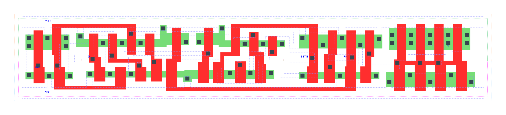

=======================================
gf180mcu_fd_sc_mcu7t5v0__dffrsnq_x4
=======================================

**gf180mcu_fd_sc_mcu7t5v0__dffrsnq_x4 symbol**

.. image:: sc7_sym/DFFRSNQ_X4_sym.png
    :height: 250px
    :width: 400 px
    :align: center
    :alt: gf180mcu_fd_sc_mcu7t5v0__dffrsnq_x4 symbol

**gf180mcu_fd_sc_mcu7t5v0__dffrsnq_x4 schematic**

.. image:: sc7_sch/DFFRSNQ_X4_sch.png
    :height: 300px
    :width: 500 px
    :align: center
    :alt: gf180mcu_fd_sc_mcu7t5v0__dffrsnq_x4 schematic

**gf180mcu_fd_sc_mcu7t5v0__dffrsnq_x4 layout**

.. include:: images.rst

DFFRSNQ_X4 is a positive edge triggered D-type flip flop, active low set/reset, 4X drive strength

|
| Attributes

============= ======================
**Attribute** **Value**
area          98.784000 µm\ :sup:`2`
============= ======================

|

TRUTH TABLE

===== ==== = === ======
Input            Output
RN    SETN D CLK Q
H     H    L ↑   L
H     H    H ↑   H
L     H    X X   L
H     L    X X   H
L     L    X X   L
===== ==== = === ======

|
| FUNCTIONAL SCHEMATIC
| |image254|
| CONSTRAINTS

================== =============== ============= ============
**Constraint Pin** **Related Pin** **setup(ns)** **hold(ns)**
D(HL)              CLK(LH)         0.2290        0.0740
D(LH)              CLK(LH)         0.1950        -0.0340
SETN(LH)           RN(LH)          -0.1370       0.2690
SETN(LH)           RN(LH)          -0.0740       0.2060
SETN(LH)           RN(LH)          -0.1370       0.2690
SETN(LH)           RN(LH)          -0.0740       0.2060
RN(LH)             SETN(LH)        0.2690        -0.1370
RN(LH)             SETN(LH)        0.2060        -0.0740
RN(LH)             SETN(LH)        0.2690        -0.1370
RN(LH)             SETN(LH)        0.2060        -0.0740
================== =============== ============= ============

|

================== =============== ================ ===============
**Constraint Pin** **Related Pin** **recovery(ns)** **removal(ns)**
SETN(LH)           CLK(LH)         -0.0860          0.3550
RN(LH)             CLK(LH)         -0.3090          0.4690
================== =============== ================ ===============

|

================== =============== ===========================
**Constraint Pin** **Related Pin** **Minimum Pulse Width(ns)**
CLK(HLH)           CLK(HL)         0.4430
CLK(HLH)           CLK(HL)         0.3570
CLK(LHL)           CLK(LH)         0.6030
CLK(LHL)           CLK(LH)         0.7590
SETN(HLH)          SETN(HL)        0.5730
SETN(HLH)          SETN(HL)        0.6900
SETN(HLH)          SETN(HL)        0.5730
SETN(HLH)          SETN(HL)        0.6900
RN(HLH)            RN(HL)          0.4850
RN(HLH)            RN(HL)          0.4560
RN(HLH)            RN(HL)          0.4850
RN(HLH)            RN(HL)          0.4560
================== =============== ===========================

|
| PIN CAPACITANCE (pf)

======= ======== ====================
**Pin** **Type** **Capacitance (pf)**
CLK     input    0.0034
D       input    0.0026
SETN    input    0.0064
RN      input    0.0073
======= ======== ====================

|
| DELAY AND OUTPUT TRANSITION TIME corresponding to min slew and load

+---------------+------------+--------------------+--------------+-------------------+----------------+---------------+
| **Input Pin** | **Output** | **When Condition** | **Tin (ns)** | **Out Load (pf)** | **Delay (ns)** | **Tout (ns)** |
+---------------+------------+--------------------+--------------+-------------------+----------------+---------------+
| CLK(LH)       | Q(HL)      | !D&RN&SETN         | 0.0100       | 0.0010            | 0.8434         | 0.0618        |
+---------------+------------+--------------------+--------------+-------------------+----------------+---------------+
| CLK(LH)       | Q(LH)      | D&RN&SETN          | 0.0100       | 0.0010            | 1.0647         | 0.0729        |
+---------------+------------+--------------------+--------------+-------------------+----------------+---------------+
| SETN(HL)      | Q(LH)      | !CLK&!D&RN         | 0.0100       | 0.0010            | 0.8354         | 0.0722        |
+---------------+------------+--------------------+--------------+-------------------+----------------+---------------+
| SETN(HL)      | Q(LH)      | CLK&!D&RN          | 0.0100       | 0.0010            | 1.1288         | 0.0727        |
+---------------+------------+--------------------+--------------+-------------------+----------------+---------------+
| SETN(HL)      | Q(LH)      | !CLK&D&RN          | 0.0100       | 0.0010            | 0.8354         | 0.0722        |
+---------------+------------+--------------------+--------------+-------------------+----------------+---------------+
| SETN(HL)      | Q(LH)      | CLK&D&RN           | 0.0100       | 0.0010            | 1.1288         | 0.0729        |
+---------------+------------+--------------------+--------------+-------------------+----------------+---------------+
| RN(HL)        | Q(HL)      | !CLK&!D&SETN       | 0.0100       | 0.0010            | 0.3533         | 0.0619        |
+---------------+------------+--------------------+--------------+-------------------+----------------+---------------+
| RN(HL)        | Q(HL)      | CLK&!D&SETN        | 0.0100       | 0.0010            | 0.3535         | 0.0620        |
+---------------+------------+--------------------+--------------+-------------------+----------------+---------------+
| RN(HL)        | Q(HL)      | !CLK&D&SETN        | 0.0100       | 0.0010            | 0.3533         | 0.0620        |
+---------------+------------+--------------------+--------------+-------------------+----------------+---------------+
| RN(HL)        | Q(HL)      | CLK&D&SETN         | 0.0100       | 0.0010            | 0.3535         | 0.0620        |
+---------------+------------+--------------------+--------------+-------------------+----------------+---------------+
| RN(HL)        | Q(HL)      | !CLK&!D&!SETN      | 0.0100       | 0.0010            | 0.3521         | 0.0614        |
+---------------+------------+--------------------+--------------+-------------------+----------------+---------------+
| RN(HL)        | Q(HL)      | !CLK&D&!SETN       | 0.0100       | 0.0010            | 0.3521         | 0.0614        |
+---------------+------------+--------------------+--------------+-------------------+----------------+---------------+
| RN(HL)        | Q(HL)      | CLK&!D&!SETN       | 0.0100       | 0.0010            | 0.3522         | 0.0609        |
+---------------+------------+--------------------+--------------+-------------------+----------------+---------------+
| RN(HL)        | Q(HL)      | CLK&D&!SETN        | 0.0100       | 0.0010            | 0.3522         | 0.0609        |
+---------------+------------+--------------------+--------------+-------------------+----------------+---------------+
| RN(LH)        | Q(LH)      | !CLK&!D&!SETN      | 0.0100       | 0.0010            | 0.5281         | 0.0710        |
+---------------+------------+--------------------+--------------+-------------------+----------------+---------------+
| RN(LH)        | Q(LH)      | !CLK&D&!SETN       | 0.0100       | 0.0010            | 0.5281         | 0.0710        |
+---------------+------------+--------------------+--------------+-------------------+----------------+---------------+
| RN(LH)        | Q(LH)      | CLK&!D&!SETN       | 0.0100       | 0.0010            | 0.5345         | 0.0716        |
+---------------+------------+--------------------+--------------+-------------------+----------------+---------------+
| RN(LH)        | Q(LH)      | CLK&D&!SETN        | 0.0100       | 0.0010            | 0.5345         | 0.0715        |
+---------------+------------+--------------------+--------------+-------------------+----------------+---------------+

|
| DYNAMIC ENERGY

+---------------+--------------------+--------------+------------+-------------------+---------------------+
| **Input Pin** | **When Condition** | **Tin (ns)** | **Output** | **Out Load (pf)** | **Energy (uW/MHz)** |
+---------------+--------------------+--------------+------------+-------------------+---------------------+
| CLK           | !D&RN&SETN         | 0.0100       | Q(HL)      | 0.0010            | 1.2392              |
+---------------+--------------------+--------------+------------+-------------------+---------------------+
| CLK           | D&RN&SETN          | 0.0100       | Q(LH)      | 0.0010            | 1.4751              |
+---------------+--------------------+--------------+------------+-------------------+---------------------+
| SETN          | !CLK&!D&RN         | 0.0100       | Q(LH)      | 0.0010            | 1.2824              |
+---------------+--------------------+--------------+------------+-------------------+---------------------+
| SETN          | CLK&!D&RN          | 0.0100       | Q(LH)      | 0.0010            | 1.4115              |
+---------------+--------------------+--------------+------------+-------------------+---------------------+
| SETN          | !CLK&D&RN          | 0.0100       | Q(LH)      | 0.0010            | 1.1611              |
+---------------+--------------------+--------------+------------+-------------------+---------------------+
| SETN          | CLK&D&RN           | 0.0100       | Q(LH)      | 0.0010            | 1.4114              |
+---------------+--------------------+--------------+------------+-------------------+---------------------+
| RN            | !CLK&!D&SETN       | 0.0100       | Q(HL)      | 0.0010            | 1.0162              |
+---------------+--------------------+--------------+------------+-------------------+---------------------+
| RN            | CLK&!D&SETN        | 0.0100       | Q(HL)      | 0.0010            | 1.2545              |
+---------------+--------------------+--------------+------------+-------------------+---------------------+
| RN            | !CLK&D&SETN        | 0.0100       | Q(HL)      | 0.0010            | 1.0163              |
+---------------+--------------------+--------------+------------+-------------------+---------------------+
| RN            | CLK&D&SETN         | 0.0100       | Q(HL)      | 0.0010            | 1.2536              |
+---------------+--------------------+--------------+------------+-------------------+---------------------+
| RN            | !CLK&!D&!SETN      | 0.0100       | Q(HL)      | 0.0010            | 0.8751              |
+---------------+--------------------+--------------+------------+-------------------+---------------------+
| RN            | !CLK&D&!SETN       | 0.0100       | Q(HL)      | 0.0010            | 0.8735              |
+---------------+--------------------+--------------+------------+-------------------+---------------------+
| RN            | CLK&!D&!SETN       | 0.0100       | Q(HL)      | 0.0010            | 1.0228              |
+---------------+--------------------+--------------+------------+-------------------+---------------------+
| RN            | CLK&D&!SETN        | 0.0100       | Q(HL)      | 0.0010            | 1.0228              |
+---------------+--------------------+--------------+------------+-------------------+---------------------+
| RN            | !CLK&!D&!SETN      | 0.0100       | Q(LH)      | 0.0010            | 0.8451              |
+---------------+--------------------+--------------+------------+-------------------+---------------------+
| RN            | !CLK&D&!SETN       | 0.0100       | Q(LH)      | 0.0010            | 0.8463              |
+---------------+--------------------+--------------+------------+-------------------+---------------------+
| RN            | CLK&!D&!SETN       | 0.0100       | Q(LH)      | 0.0010            | 0.9367              |
+---------------+--------------------+--------------+------------+-------------------+---------------------+
| RN            | CLK&D&!SETN        | 0.0100       | Q(LH)      | 0.0010            | 0.9367              |
+---------------+--------------------+--------------+------------+-------------------+---------------------+
| SETN(HL)      | !CLK&!D&!RN        | 0.0100       | n/a        | n/a               | 0.3527              |
+---------------+--------------------+--------------+------------+-------------------+---------------------+
| SETN(HL)      | !CLK&D&!RN         | 0.0100       | n/a        | n/a               | 0.2378              |
+---------------+--------------------+--------------+------------+-------------------+---------------------+
| SETN(HL)      | CLK&!D&!RN         | 0.0100       | n/a        | n/a               | 0.3528              |
+---------------+--------------------+--------------+------------+-------------------+---------------------+
| SETN(HL)      | CLK&D&!RN          | 0.0100       | n/a        | n/a               | 0.3528              |
+---------------+--------------------+--------------+------------+-------------------+---------------------+
| SETN(HL)      | !CLK&!D&RN         | 0.0100       | n/a        | n/a               | 0.1627              |
+---------------+--------------------+--------------+------------+-------------------+---------------------+
| SETN(HL)      | CLK&!D&RN          | 0.0100       | n/a        | n/a               | 0.0418              |
+---------------+--------------------+--------------+------------+-------------------+---------------------+
| SETN(HL)      | !CLK&D&RN          | 0.0100       | n/a        | n/a               | 0.0418              |
+---------------+--------------------+--------------+------------+-------------------+---------------------+
| SETN(HL)      | CLK&D&RN           | 0.0100       | n/a        | n/a               | 0.0418              |
+---------------+--------------------+--------------+------------+-------------------+---------------------+
| D(HL)         | !CLK&!RN&!SETN     | 0.0100       | n/a        | n/a               | 0.1650              |
+---------------+--------------------+--------------+------------+-------------------+---------------------+
| D(HL)         | !CLK&!RN&SETN      | 0.0100       | n/a        | n/a               | 0.2457              |
+---------------+--------------------+--------------+------------+-------------------+---------------------+
| D(HL)         | CLK&!RN&!SETN      | 0.0100       | n/a        | n/a               | 0.0557              |
+---------------+--------------------+--------------+------------+-------------------+---------------------+
| D(HL)         | CLK&!RN&SETN       | 0.0100       | n/a        | n/a               | 0.0557              |
+---------------+--------------------+--------------+------------+-------------------+---------------------+
| D(HL)         | !CLK&RN&!SETN      | 0.0100       | n/a        | n/a               | 0.1650              |
+---------------+--------------------+--------------+------------+-------------------+---------------------+
| D(HL)         | CLK&RN&!SETN       | 0.0100       | n/a        | n/a               | 0.0557              |
+---------------+--------------------+--------------+------------+-------------------+---------------------+
| D(HL)         | !CLK&RN&SETN       | 0.0100       | n/a        | n/a               | 0.2366              |
+---------------+--------------------+--------------+------------+-------------------+---------------------+
| D(HL)         | CLK&RN&SETN        | 0.0100       | n/a        | n/a               | 0.0557              |
+---------------+--------------------+--------------+------------+-------------------+---------------------+
| CLK(LH)       | !D&!RN&!SETN       | 0.0100       | n/a        | n/a               | 0.2531              |
+---------------+--------------------+--------------+------------+-------------------+---------------------+
| CLK(LH)       | !D&!RN&SETN        | 0.0100       | n/a        | n/a               | 0.2502              |
+---------------+--------------------+--------------+------------+-------------------+---------------------+
| CLK(LH)       | D&!RN&!SETN        | 0.0100       | n/a        | n/a               | 0.3598              |
+---------------+--------------------+--------------+------------+-------------------+---------------------+
| CLK(LH)       | D&!RN&SETN         | 0.0100       | n/a        | n/a               | 0.5055              |
+---------------+--------------------+--------------+------------+-------------------+---------------------+
| CLK(LH)       | !D&RN&!SETN        | 0.0100       | n/a        | n/a               | 0.3102              |
+---------------+--------------------+--------------+------------+-------------------+---------------------+
| CLK(LH)       | D&RN&!SETN         | 0.0100       | n/a        | n/a               | 0.2578              |
+---------------+--------------------+--------------+------------+-------------------+---------------------+
| CLK(LH)       | !D&RN&SETN         | 0.0100       | n/a        | n/a               | 0.2504              |
+---------------+--------------------+--------------+------------+-------------------+---------------------+
| CLK(LH)       | D&RN&SETN          | 0.0100       | n/a        | n/a               | 0.2578              |
+---------------+--------------------+--------------+------------+-------------------+---------------------+
| CLK(HL)       | !D&!RN&!SETN       | 0.0100       | n/a        | n/a               | 0.3076              |
+---------------+--------------------+--------------+------------+-------------------+---------------------+
| CLK(HL)       | !D&!RN&SETN        | 0.0100       | n/a        | n/a               | 0.3110              |
+---------------+--------------------+--------------+------------+-------------------+---------------------+
| CLK(HL)       | D&!RN&!SETN        | 0.0100       | n/a        | n/a               | 0.3568              |
+---------------+--------------------+--------------+------------+-------------------+---------------------+
| CLK(HL)       | D&!RN&SETN         | 0.0100       | n/a        | n/a               | 0.5154              |
+---------------+--------------------+--------------+------------+-------------------+---------------------+
| CLK(HL)       | !D&RN&!SETN        | 0.0100       | n/a        | n/a               | 0.4600              |
+---------------+--------------------+--------------+------------+-------------------+---------------------+
| CLK(HL)       | D&RN&!SETN         | 0.0100       | n/a        | n/a               | 0.3072              |
+---------------+--------------------+--------------+------------+-------------------+---------------------+
| CLK(HL)       | !D&RN&SETN         | 0.0100       | n/a        | n/a               | 0.3111              |
+---------------+--------------------+--------------+------------+-------------------+---------------------+
| CLK(HL)       | D&RN&SETN          | 0.0100       | n/a        | n/a               | 0.3072              |
+---------------+--------------------+--------------+------------+-------------------+---------------------+
| D(LH)         | !CLK&!RN&!SETN     | 0.0100       | n/a        | n/a               | 0.0537              |
+---------------+--------------------+--------------+------------+-------------------+---------------------+
| D(LH)         | !CLK&!RN&SETN      | 0.0100       | n/a        | n/a               | 0.1998              |
+---------------+--------------------+--------------+------------+-------------------+---------------------+
| D(LH)         | CLK&!RN&!SETN      | 0.0100       | n/a        | n/a               | 0.0049              |
+---------------+--------------------+--------------+------------+-------------------+---------------------+
| D(LH)         | CLK&!RN&SETN       | 0.0100       | n/a        | n/a               | 0.0049              |
+---------------+--------------------+--------------+------------+-------------------+---------------------+
| D(LH)         | !CLK&RN&!SETN      | 0.0100       | n/a        | n/a               | 0.0537              |
+---------------+--------------------+--------------+------------+-------------------+---------------------+
| D(LH)         | CLK&RN&!SETN       | 0.0100       | n/a        | n/a               | 0.0050              |
+---------------+--------------------+--------------+------------+-------------------+---------------------+
| D(LH)         | !CLK&RN&SETN       | 0.0100       | n/a        | n/a               | 0.2063              |
+---------------+--------------------+--------------+------------+-------------------+---------------------+
| D(LH)         | CLK&RN&SETN        | 0.0100       | n/a        | n/a               | 0.0049              |
+---------------+--------------------+--------------+------------+-------------------+---------------------+
| RN(HL)        | !CLK&!D&SETN       | 0.0100       | n/a        | n/a               | 0.0489              |
+---------------+--------------------+--------------+------------+-------------------+---------------------+
| RN(HL)        | CLK&!D&SETN        | 0.0100       | n/a        | n/a               | 0.0503              |
+---------------+--------------------+--------------+------------+-------------------+---------------------+
| RN(HL)        | !CLK&D&SETN        | 0.0100       | n/a        | n/a               | 0.0473              |
+---------------+--------------------+--------------+------------+-------------------+---------------------+
| RN(HL)        | CLK&D&SETN         | 0.0100       | n/a        | n/a               | 0.0502              |
+---------------+--------------------+--------------+------------+-------------------+---------------------+
| RN(LH)        | !CLK&!D&SETN       | 0.0100       | n/a        | n/a               | -0.0467             |
+---------------+--------------------+--------------+------------+-------------------+---------------------+
| RN(LH)        | !CLK&D&SETN        | 0.0100       | n/a        | n/a               | -0.0426             |
+---------------+--------------------+--------------+------------+-------------------+---------------------+
| RN(LH)        | CLK&!D&SETN        | 0.0100       | n/a        | n/a               | -0.0467             |
+---------------+--------------------+--------------+------------+-------------------+---------------------+
| RN(LH)        | CLK&D&SETN         | 0.0100       | n/a        | n/a               | -0.0467             |
+---------------+--------------------+--------------+------------+-------------------+---------------------+
| SETN(LH)      | !CLK&!D&!RN        | 0.0100       | n/a        | n/a               | 0.1153              |
+---------------+--------------------+--------------+------------+-------------------+---------------------+
| SETN(LH)      | !CLK&D&!RN         | 0.0100       | n/a        | n/a               | 0.0649              |
+---------------+--------------------+--------------+------------+-------------------+---------------------+
| SETN(LH)      | CLK&!D&!RN         | 0.0100       | n/a        | n/a               | 0.1089              |
+---------------+--------------------+--------------+------------+-------------------+---------------------+
| SETN(LH)      | CLK&D&!RN          | 0.0100       | n/a        | n/a               | 0.1089              |
+---------------+--------------------+--------------+------------+-------------------+---------------------+
| SETN(LH)      | !CLK&!D&RN         | 0.0100       | n/a        | n/a               | 0.0174              |
+---------------+--------------------+--------------+------------+-------------------+---------------------+
| SETN(LH)      | !CLK&D&RN          | 0.0100       | n/a        | n/a               | -0.0248             |
+---------------+--------------------+--------------+------------+-------------------+---------------------+
| SETN(LH)      | CLK&!D&RN          | 0.0100       | n/a        | n/a               | -0.0248             |
+---------------+--------------------+--------------+------------+-------------------+---------------------+
| SETN(LH)      | CLK&D&RN           | 0.0100       | n/a        | n/a               | -0.0248             |
+---------------+--------------------+--------------+------------+-------------------+---------------------+

|
| LEAKAGE POWER

================== ==============
**When Condition** **Power (nW)**
!CLK&!D&!RN&!SETN  0.5311
!CLK&!D&!RN&SETN   0.5433
!CLK&D&!RN&!SETN   0.5297
!CLK&D&!RN&SETN    0.5558
CLK&!D&!RN&!SETN   0.6128
CLK&!D&!RN&SETN    0.5841
CLK&D&!RN&!SETN    0.6149
CLK&D&!RN&SETN     0.5861
CLK&D&RN&SETN      0.7820
!CLK&!D&RN&!SETN   0.5126
!CLK&D&RN&!SETN    0.5096
CLK&!D&RN&!SETN    0.5693
CLK&D&RN&!SETN     0.5666
!CLK&!D&RN&SETN    0.6870
!CLK&D&RN&SETN     0.6780
CLK&!D&RN&SETN     0.6096
================== ==============

