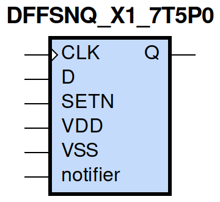
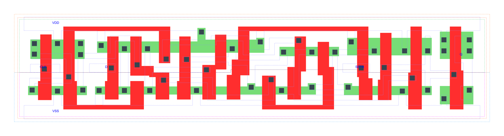

=======================================
gf180mcu_fd_sc_mcu7t5v0__dffsnq_x1
=======================================

**gf180mcu_fd_sc_mcu7t5v0__dffsnq_x1 symbol**

**gf180mcu_fd_sc_mcu7t5v0__dffsnq_x1 schematic**

.. image:: sc7_sch/DFFSNQ_X1_sch.png
    :height: 300px
    :width: 500 px
    :align: center
    :alt: gf180mcu_fd_sc_mcu7t5v0__dffsnq_x1 schematic

**gf180mcu_fd_sc_mcu7t5v0__dffsnq_x1 layout**

.. include:: images.rst

DFFSNQ_X1 is a positive edge triggered D-type flip flop, active low set, 1X drive strength

|
| Attributes

============= ======================
**Attribute** **Value**
area          79.027200 µm\ :sup:`2`
============= ======================

|

TRUTH TABLE

===== = === ======
Input       Output
SETN  D CLK Q
H     L ↑   L
H     H ↑   H
L     X X   H
===== = === ======

|
| FUNCTIONAL SCHEMATIC
| |image257|
| CONSTRAINTS

================== =============== ============= ============
**Constraint Pin** **Related Pin** **setup(ns)** **hold(ns)**
D(HL)              CLK(LH)         0.2400        0.0460
D(LH)              CLK(LH)         0.2290        -0.0230
================== =============== ============= ============

|

================== =============== ================ ===============
**Constraint Pin** **Related Pin** **recovery(ns)** **removal(ns)**
SETN(LH)           CLK(LH)         -0.0340          0.2400
================== =============== ================ ===============

|

================== =============== ===========================
**Constraint Pin** **Related Pin** **Minimum Pulse Width(ns)**
CLK(HLH)           CLK(HL)         0.4490
CLK(HLH)           CLK(HL)         0.3510
CLK(LHL)           CLK(LH)         0.4660
CLK(LHL)           CLK(LH)         0.4760
SETN(HLH)          SETN(HL)        0.3290
SETN(HLH)          SETN(HL)        0.3290
SETN(HLH)          SETN(HL)        0.3880
SETN(HLH)          SETN(HL)        0.3880
================== =============== ===========================

|
| PIN CAPACITANCE (pf)

======= ======== ====================
**Pin** **Type** **Capacitance (pf)**
CLK     input    0.0034
D       input    0.0026
SETN    input    0.0066
======= ======== ====================

|
| DELAY AND OUTPUT TRANSITION TIME corresponding to min slew and load

+---------------+------------+--------------------+--------------+-------------------+----------------+---------------+
| **Input Pin** | **Output** | **When Condition** | **Tin (ns)** | **Out Load (pf)** | **Delay (ns)** | **Tout (ns)** |
+---------------+------------+--------------------+--------------+-------------------+----------------+---------------+
| CLK(LH)       | Q(HL)      | !D&SETN            | 0.0100       | 0.0010            | 0.7090         | 0.0458        |
+---------------+------------+--------------------+--------------+-------------------+----------------+---------------+
| CLK(LH)       | Q(LH)      | D&SETN             | 0.0100       | 0.0010            | 0.6946         | 0.0484        |
+---------------+------------+--------------------+--------------+-------------------+----------------+---------------+
| SETN(HL)      | Q(LH)      | !CLK&!D            | 0.0100       | 0.0010            | 0.4838         | 0.0473        |
+---------------+------------+--------------------+--------------+-------------------+----------------+---------------+
| SETN(HL)      | Q(LH)      | !CLK&D             | 0.0100       | 0.0010            | 0.4841         | 0.0477        |
+---------------+------------+--------------------+--------------+-------------------+----------------+---------------+
| SETN(HL)      | Q(LH)      | CLK&!D             | 0.0100       | 0.0010            | 0.5831         | 0.0482        |
+---------------+------------+--------------------+--------------+-------------------+----------------+---------------+
| SETN(HL)      | Q(LH)      | CLK&D              | 0.0100       | 0.0010            | 0.5830         | 0.0481        |
+---------------+------------+--------------------+--------------+-------------------+----------------+---------------+

|
| DYNAMIC ENERGY

+---------------+--------------------+--------------+------------+-------------------+---------------------+
| **Input Pin** | **When Condition** | **Tin (ns)** | **Output** | **Out Load (pf)** | **Energy (uW/MHz)** |
+---------------+--------------------+--------------+------------+-------------------+---------------------+
| CLK           | !D&SETN            | 0.0100       | Q(HL)      | 0.0010            | 0.5962              |
+---------------+--------------------+--------------+------------+-------------------+---------------------+
| CLK           | D&SETN             | 0.0100       | Q(LH)      | 0.0010            | 0.6638              |
+---------------+--------------------+--------------+------------+-------------------+---------------------+
| SETN          | !CLK&!D            | 0.0100       | Q(LH)      | 0.0010            | 0.5363              |
+---------------+--------------------+--------------+------------+-------------------+---------------------+
| SETN          | !CLK&D             | 0.0100       | Q(LH)      | 0.0010            | 0.4330              |
+---------------+--------------------+--------------+------------+-------------------+---------------------+
| SETN          | CLK&!D             | 0.0100       | Q(LH)      | 0.0010            | 0.6246              |
+---------------+--------------------+--------------+------------+-------------------+---------------------+
| SETN          | CLK&D              | 0.0100       | Q(LH)      | 0.0010            | 0.6245              |
+---------------+--------------------+--------------+------------+-------------------+---------------------+
| SETN(HL)      | !CLK&!D            | 0.0100       | n/a        | n/a               | 0.1501              |
+---------------+--------------------+--------------+------------+-------------------+---------------------+
| SETN(HL)      | !CLK&D             | 0.0100       | n/a        | n/a               | 0.0480              |
+---------------+--------------------+--------------+------------+-------------------+---------------------+
| SETN(HL)      | CLK&!D             | 0.0100       | n/a        | n/a               | 0.0481              |
+---------------+--------------------+--------------+------------+-------------------+---------------------+
| SETN(HL)      | CLK&D              | 0.0100       | n/a        | n/a               | 0.0481              |
+---------------+--------------------+--------------+------------+-------------------+---------------------+
| D(HL)         | !CLK&!SETN         | 0.0100       | n/a        | n/a               | 0.1502              |
+---------------+--------------------+--------------+------------+-------------------+---------------------+
| D(HL)         | CLK&!SETN          | 0.0100       | n/a        | n/a               | 0.0569              |
+---------------+--------------------+--------------+------------+-------------------+---------------------+
| D(HL)         | !CLK&SETN          | 0.0100       | n/a        | n/a               | 0.2162              |
+---------------+--------------------+--------------+------------+-------------------+---------------------+
| D(HL)         | CLK&SETN           | 0.0100       | n/a        | n/a               | 0.0569              |
+---------------+--------------------+--------------+------------+-------------------+---------------------+
| CLK(LH)       | !D&!SETN           | 0.0100       | n/a        | n/a               | 0.2994              |
+---------------+--------------------+--------------+------------+-------------------+---------------------+
| CLK(LH)       | D&!SETN            | 0.0100       | n/a        | n/a               | 0.2430              |
+---------------+--------------------+--------------+------------+-------------------+---------------------+
| CLK(LH)       | !D&SETN            | 0.0100       | n/a        | n/a               | 0.2370              |
+---------------+--------------------+--------------+------------+-------------------+---------------------+
| CLK(LH)       | D&SETN             | 0.0100       | n/a        | n/a               | 0.2430              |
+---------------+--------------------+--------------+------------+-------------------+---------------------+
| CLK(HL)       | !D&!SETN           | 0.0100       | n/a        | n/a               | 0.4478              |
+---------------+--------------------+--------------+------------+-------------------+---------------------+
| CLK(HL)       | D&!SETN            | 0.0100       | n/a        | n/a               | 0.3008              |
+---------------+--------------------+--------------+------------+-------------------+---------------------+
| CLK(HL)       | !D&SETN            | 0.0100       | n/a        | n/a               | 0.3022              |
+---------------+--------------------+--------------+------------+-------------------+---------------------+
| CLK(HL)       | D&SETN             | 0.0100       | n/a        | n/a               | 0.3007              |
+---------------+--------------------+--------------+------------+-------------------+---------------------+
| D(LH)         | !CLK&!SETN         | 0.0100       | n/a        | n/a               | 0.0545              |
+---------------+--------------------+--------------+------------+-------------------+---------------------+
| D(LH)         | CLK&!SETN          | 0.0100       | n/a        | n/a               | 0.0050              |
+---------------+--------------------+--------------+------------+-------------------+---------------------+
| D(LH)         | !CLK&SETN          | 0.0100       | n/a        | n/a               | 0.1821              |
+---------------+--------------------+--------------+------------+-------------------+---------------------+
| D(LH)         | CLK&SETN           | 0.0100       | n/a        | n/a               | 0.0050              |
+---------------+--------------------+--------------+------------+-------------------+---------------------+
| SETN(LH)      | !CLK&!D            | 0.0100       | n/a        | n/a               | 0.0160              |
+---------------+--------------------+--------------+------------+-------------------+---------------------+
| SETN(LH)      | !CLK&D             | 0.0100       | n/a        | n/a               | -0.0313             |
+---------------+--------------------+--------------+------------+-------------------+---------------------+
| SETN(LH)      | CLK&!D             | 0.0100       | n/a        | n/a               | -0.0313             |
+---------------+--------------------+--------------+------------+-------------------+---------------------+
| SETN(LH)      | CLK&D              | 0.0100       | n/a        | n/a               | -0.0313             |
+---------------+--------------------+--------------+------------+-------------------+---------------------+

|
| LEAKAGE POWER

================== ==============
**When Condition** **Power (nW)**
!CLK&!D&!SETN      0.4124
!CLK&D&!SETN       0.4073
CLK&!D&!SETN       0.4486
CLK&D&!SETN        0.4455
!CLK&!D&SETN       0.5905
!CLK&D&SETN        0.5709
CLK&!D&SETN        0.5353
CLK&D&SETN         0.5996
================== ==============

