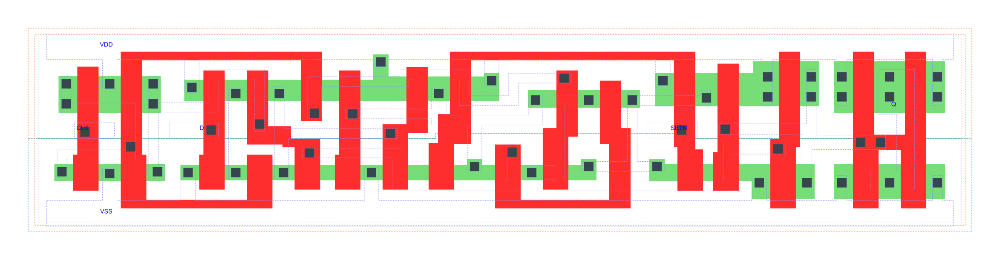

=======================================
gf180mcu_fd_sc_mcu7t5v0__dffsnq_x2
=======================================

**gf180mcu_fd_sc_mcu7t5v0__dffsnq_x2 symbol**

.. image:: sc7_sym/DFFSNQ_X2_sym.png
    :height: 250px
    :width: 400 px
    :align: center
    :alt: gf180mcu_fd_sc_mcu7t5v0__dffsnq_x2 symbol

**gf180mcu_fd_sc_mcu7t5v0__dffsnq_x2 schematic**

.. image:: sc7_sch/DFFSNQ_X2_sch.png
    :height: 300px
    :width: 500 px
    :align: center
    :alt: gf180mcu_fd_sc_mcu7t5v0__dffsnq_x2 schematic

**gf180mcu_fd_sc_mcu7t5v0__dffsnq_x2 layout**

.. include:: images.rst

DFFSNQ_X2 is a positive edge triggered D-type flip flop, active low set, 2X drive strength

|
| Attributes

============= ======================
**Attribute** **Value**
area          83.417600 µm\ :sup:`2`
============= ======================

|

TRUTH TABLE

===== = === ======
Input       Output
SETN  D CLK Q
H     L ↑   L
H     H ↑   H
L     X X   H
===== = === ======

|
| FUNCTIONAL SCHEMATIC
| |image260|
| CONSTRAINTS

================== =============== ============= ============
**Constraint Pin** **Related Pin** **setup(ns)** **hold(ns)**
D(HL)              CLK(LH)         0.2520        0.0460
D(LH)              CLK(LH)         0.2460        -0.0170
================== =============== ============= ============

|

================== =============== ================ ===============
**Constraint Pin** **Related Pin** **recovery(ns)** **removal(ns)**
SETN(LH)           CLK(LH)         -0.0230          0.2350
================== =============== ================ ===============

|

================== =============== ===========================
**Constraint Pin** **Related Pin** **Minimum Pulse Width(ns)**
CLK(HLH)           CLK(HL)         0.4550
CLK(HLH)           CLK(HL)         0.3570
CLK(LHL)           CLK(LH)         0.5150
CLK(LHL)           CLK(LH)         0.4760
SETN(HLH)          SETN(HL)        0.3290
SETN(HLH)          SETN(HL)        0.3290
SETN(HLH)          SETN(HL)        0.3980
SETN(HLH)          SETN(HL)        0.3980
================== =============== ===========================

|
| PIN CAPACITANCE (pf)

======= ======== ====================
**Pin** **Type** **Capacitance (pf)**
CLK     input    0.0033
D       input    0.0026
SETN    input    0.0066
======= ======== ====================

|
| DELAY AND OUTPUT TRANSITION TIME corresponding to min slew and load

+---------------+------------+--------------------+--------------+-------------------+----------------+---------------+
| **Input Pin** | **Output** | **When Condition** | **Tin (ns)** | **Out Load (pf)** | **Delay (ns)** | **Tout (ns)** |
+---------------+------------+--------------------+--------------+-------------------+----------------+---------------+
| CLK(LH)       | Q(HL)      | !D&SETN            | 0.0100       | 0.0010            | 0.7482         | 0.0413        |
+---------------+------------+--------------------+--------------+-------------------+----------------+---------------+
| CLK(LH)       | Q(LH)      | D&SETN             | 0.0100       | 0.0010            | 0.6701         | 0.0375        |
+---------------+------------+--------------------+--------------+-------------------+----------------+---------------+
| SETN(HL)      | Q(LH)      | !CLK&!D            | 0.0100       | 0.0010            | 0.4570         | 0.0361        |
+---------------+------------+--------------------+--------------+-------------------+----------------+---------------+
| SETN(HL)      | Q(LH)      | !CLK&D             | 0.0100       | 0.0010            | 0.4571         | 0.0366        |
+---------------+------------+--------------------+--------------+-------------------+----------------+---------------+
| SETN(HL)      | Q(LH)      | CLK&!D             | 0.0100       | 0.0010            | 0.5559         | 0.0377        |
+---------------+------------+--------------------+--------------+-------------------+----------------+---------------+
| SETN(HL)      | Q(LH)      | CLK&D              | 0.0100       | 0.0010            | 0.5559         | 0.0377        |
+---------------+------------+--------------------+--------------+-------------------+----------------+---------------+

|
| DYNAMIC ENERGY

+---------------+--------------------+--------------+------------+-------------------+---------------------+
| **Input Pin** | **When Condition** | **Tin (ns)** | **Output** | **Out Load (pf)** | **Energy (uW/MHz)** |
+---------------+--------------------+--------------+------------+-------------------+---------------------+
| CLK           | !D&SETN            | 0.0100       | Q(HL)      | 0.0010            | 0.7770              |
+---------------+--------------------+--------------+------------+-------------------+---------------------+
| CLK           | D&SETN             | 0.0100       | Q(LH)      | 0.0010            | 0.8076              |
+---------------+--------------------+--------------+------------+-------------------+---------------------+
| SETN          | !CLK&!D            | 0.0100       | Q(LH)      | 0.0010            | 0.6749              |
+---------------+--------------------+--------------+------------+-------------------+---------------------+
| SETN          | !CLK&D             | 0.0100       | Q(LH)      | 0.0010            | 0.5717              |
+---------------+--------------------+--------------+------------+-------------------+---------------------+
| SETN          | CLK&!D             | 0.0100       | Q(LH)      | 0.0010            | 0.7750              |
+---------------+--------------------+--------------+------------+-------------------+---------------------+
| SETN          | CLK&D              | 0.0100       | Q(LH)      | 0.0010            | 0.7751              |
+---------------+--------------------+--------------+------------+-------------------+---------------------+
| SETN(HL)      | !CLK&!D            | 0.0100       | n/a        | n/a               | 0.1501              |
+---------------+--------------------+--------------+------------+-------------------+---------------------+
| SETN(HL)      | !CLK&D             | 0.0100       | n/a        | n/a               | 0.0480              |
+---------------+--------------------+--------------+------------+-------------------+---------------------+
| SETN(HL)      | CLK&!D             | 0.0100       | n/a        | n/a               | 0.0481              |
+---------------+--------------------+--------------+------------+-------------------+---------------------+
| SETN(HL)      | CLK&D              | 0.0100       | n/a        | n/a               | 0.0481              |
+---------------+--------------------+--------------+------------+-------------------+---------------------+
| D(HL)         | !CLK&!SETN         | 0.0100       | n/a        | n/a               | 0.1503              |
+---------------+--------------------+--------------+------------+-------------------+---------------------+
| D(HL)         | CLK&!SETN          | 0.0100       | n/a        | n/a               | 0.0569              |
+---------------+--------------------+--------------+------------+-------------------+---------------------+
| D(HL)         | !CLK&SETN          | 0.0100       | n/a        | n/a               | 0.2161              |
+---------------+--------------------+--------------+------------+-------------------+---------------------+
| D(HL)         | CLK&SETN           | 0.0100       | n/a        | n/a               | 0.0569              |
+---------------+--------------------+--------------+------------+-------------------+---------------------+
| CLK(LH)       | !D&!SETN           | 0.0100       | n/a        | n/a               | 0.2994              |
+---------------+--------------------+--------------+------------+-------------------+---------------------+
| CLK(LH)       | D&!SETN            | 0.0100       | n/a        | n/a               | 0.2429              |
+---------------+--------------------+--------------+------------+-------------------+---------------------+
| CLK(LH)       | !D&SETN            | 0.0100       | n/a        | n/a               | 0.2367              |
+---------------+--------------------+--------------+------------+-------------------+---------------------+
| CLK(LH)       | D&SETN             | 0.0100       | n/a        | n/a               | 0.2428              |
+---------------+--------------------+--------------+------------+-------------------+---------------------+
| CLK(HL)       | !D&!SETN           | 0.0100       | n/a        | n/a               | 0.4454              |
+---------------+--------------------+--------------+------------+-------------------+---------------------+
| CLK(HL)       | D&!SETN            | 0.0100       | n/a        | n/a               | 0.2985              |
+---------------+--------------------+--------------+------------+-------------------+---------------------+
| CLK(HL)       | !D&SETN            | 0.0100       | n/a        | n/a               | 0.2999              |
+---------------+--------------------+--------------+------------+-------------------+---------------------+
| CLK(HL)       | D&SETN             | 0.0100       | n/a        | n/a               | 0.2985              |
+---------------+--------------------+--------------+------------+-------------------+---------------------+
| D(LH)         | !CLK&!SETN         | 0.0100       | n/a        | n/a               | 0.0545              |
+---------------+--------------------+--------------+------------+-------------------+---------------------+
| D(LH)         | CLK&!SETN          | 0.0100       | n/a        | n/a               | 0.0050              |
+---------------+--------------------+--------------+------------+-------------------+---------------------+
| D(LH)         | !CLK&SETN          | 0.0100       | n/a        | n/a               | 0.1821              |
+---------------+--------------------+--------------+------------+-------------------+---------------------+
| D(LH)         | CLK&SETN           | 0.0100       | n/a        | n/a               | 0.0050              |
+---------------+--------------------+--------------+------------+-------------------+---------------------+
| SETN(LH)      | !CLK&!D            | 0.0100       | n/a        | n/a               | 0.0160              |
+---------------+--------------------+--------------+------------+-------------------+---------------------+
| SETN(LH)      | !CLK&D             | 0.0100       | n/a        | n/a               | -0.0313             |
+---------------+--------------------+--------------+------------+-------------------+---------------------+
| SETN(LH)      | CLK&!D             | 0.0100       | n/a        | n/a               | -0.0313             |
+---------------+--------------------+--------------+------------+-------------------+---------------------+
| SETN(LH)      | CLK&D              | 0.0100       | n/a        | n/a               | -0.0313             |
+---------------+--------------------+--------------+------------+-------------------+---------------------+

|
| LEAKAGE POWER

================== ==============
**When Condition** **Power (nW)**
!CLK&!D&!SETN      0.4380
!CLK&D&!SETN       0.4330
CLK&!D&!SETN       0.4742
CLK&D&!SETN        0.4711
!CLK&!D&SETN       0.6160
!CLK&D&SETN        0.5964
CLK&!D&SETN        0.5609
CLK&D&SETN         0.6251
================== ==============

