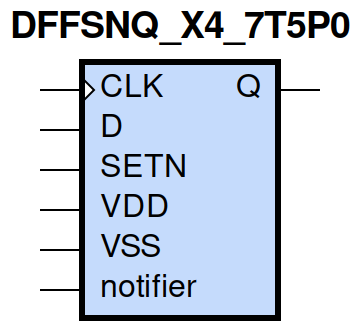
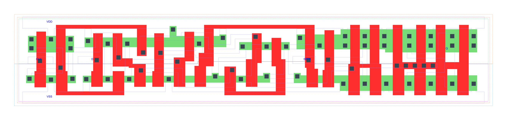

=======================================
gf180mcu_fd_sc_mcu7t5v0__dffsnq_x4
=======================================

**gf180mcu_fd_sc_mcu7t5v0__dffsnq_x4 symbol**

**gf180mcu_fd_sc_mcu7t5v0__dffsnq_x4 schematic**

.. image:: sc7_sch/DFFSNQ_X4_sch.png
    :height: 300px
    :width: 500 px
    :align: center
    :alt: gf180mcu_fd_sc_mcu7t5v0__dffsnq_x4 schematic

**gf180mcu_fd_sc_mcu7t5v0__dffsnq_x4 layout**

.. include:: images.rst

DFFSNQ_X4 is a positive edge triggered D-type flip flop, active low set, 4X drive strength

|
| Attributes

============= ======================
**Attribute** **Value**
area          94.393600 µm\ :sup:`2`
============= ======================

|

TRUTH TABLE

===== = === ======
Input       Output
SETN  D CLK Q
H     L ↑   L
H     H ↑   H
L     X X   H
===== = === ======

|
| FUNCTIONAL SCHEMATIC
| |image263|
| CONSTRAINTS

================== =============== ============= ============
**Constraint Pin** **Related Pin** **setup(ns)** **hold(ns)**
D(HL)              CLK(LH)         0.2520        0.0520
D(LH)              CLK(LH)         0.2460        -0.0060
================== =============== ============= ============

|

================== =============== ================ ===============
**Constraint Pin** **Related Pin** **recovery(ns)** **removal(ns)**
SETN(LH)           CLK(LH)         -0.0230          0.2180
================== =============== ================ ===============

|

================== =============== ===========================
**Constraint Pin** **Related Pin** **Minimum Pulse Width(ns)**
CLK(HLH)           CLK(HL)         0.4610
CLK(HLH)           CLK(HL)         0.3570
CLK(LHL)           CLK(LH)         0.5730
CLK(LHL)           CLK(LH)         0.5340
SETN(HLH)          SETN(HL)        0.3780
SETN(HLH)          SETN(HL)        0.3780
SETN(HLH)          SETN(HL)        0.4560
SETN(HLH)          SETN(HL)        0.4560
================== =============== ===========================

|
| PIN CAPACITANCE (pf)

======= ======== ====================
**Pin** **Type** **Capacitance (pf)**
CLK     input    0.0034
D       input    0.0026
SETN    input    0.0065
======= ======== ====================

|
| DELAY AND OUTPUT TRANSITION TIME corresponding to min slew and load

+---------------+------------+--------------------+--------------+-------------------+----------------+---------------+
| **Input Pin** | **Output** | **When Condition** | **Tin (ns)** | **Out Load (pf)** | **Delay (ns)** | **Tout (ns)** |
+---------------+------------+--------------------+--------------+-------------------+----------------+---------------+
| CLK(LH)       | Q(HL)      | !D&SETN            | 0.0100       | 0.0010            | 0.8247         | 0.0390        |
+---------------+------------+--------------------+--------------+-------------------+----------------+---------------+
| CLK(LH)       | Q(LH)      | D&SETN             | 0.0100       | 0.0010            | 0.7267         | 0.0368        |
+---------------+------------+--------------------+--------------+-------------------+----------------+---------------+
| SETN(HL)      | Q(LH)      | !CLK&!D            | 0.0100       | 0.0010            | 0.5039         | 0.0349        |
+---------------+------------+--------------------+--------------+-------------------+----------------+---------------+
| SETN(HL)      | Q(LH)      | !CLK&D             | 0.0100       | 0.0010            | 0.5044         | 0.0349        |
+---------------+------------+--------------------+--------------+-------------------+----------------+---------------+
| SETN(HL)      | Q(LH)      | CLK&!D             | 0.0100       | 0.0010            | 0.6120         | 0.0363        |
+---------------+------------+--------------------+--------------+-------------------+----------------+---------------+
| SETN(HL)      | Q(LH)      | CLK&D              | 0.0100       | 0.0010            | 0.6117         | 0.0362        |
+---------------+------------+--------------------+--------------+-------------------+----------------+---------------+

|
| DYNAMIC ENERGY

+---------------+--------------------+--------------+------------+-------------------+---------------------+
| **Input Pin** | **When Condition** | **Tin (ns)** | **Output** | **Out Load (pf)** | **Energy (uW/MHz)** |
+---------------+--------------------+--------------+------------+-------------------+---------------------+
| CLK           | !D&SETN            | 0.0100       | Q(HL)      | 0.0010            | 1.1992              |
+---------------+--------------------+--------------+------------+-------------------+---------------------+
| CLK           | D&SETN             | 0.0100       | Q(LH)      | 0.0010            | 1.2253              |
+---------------+--------------------+--------------+------------+-------------------+---------------------+
| SETN          | !CLK&!D            | 0.0100       | Q(LH)      | 0.0010            | 1.0598              |
+---------------+--------------------+--------------+------------+-------------------+---------------------+
| SETN          | !CLK&D             | 0.0100       | Q(LH)      | 0.0010            | 0.9574              |
+---------------+--------------------+--------------+------------+-------------------+---------------------+
| SETN          | CLK&!D             | 0.0100       | Q(LH)      | 0.0010            | 1.1938              |
+---------------+--------------------+--------------+------------+-------------------+---------------------+
| SETN          | CLK&D              | 0.0100       | Q(LH)      | 0.0010            | 1.1931              |
+---------------+--------------------+--------------+------------+-------------------+---------------------+
| SETN(HL)      | !CLK&!D            | 0.0100       | n/a        | n/a               | 0.1502              |
+---------------+--------------------+--------------+------------+-------------------+---------------------+
| SETN(HL)      | !CLK&D             | 0.0100       | n/a        | n/a               | 0.0480              |
+---------------+--------------------+--------------+------------+-------------------+---------------------+
| SETN(HL)      | CLK&!D             | 0.0100       | n/a        | n/a               | 0.0481              |
+---------------+--------------------+--------------+------------+-------------------+---------------------+
| SETN(HL)      | CLK&D              | 0.0100       | n/a        | n/a               | 0.0481              |
+---------------+--------------------+--------------+------------+-------------------+---------------------+
| D(HL)         | !CLK&!SETN         | 0.0100       | n/a        | n/a               | 0.1503              |
+---------------+--------------------+--------------+------------+-------------------+---------------------+
| D(HL)         | CLK&!SETN          | 0.0100       | n/a        | n/a               | 0.0569              |
+---------------+--------------------+--------------+------------+-------------------+---------------------+
| D(HL)         | !CLK&SETN          | 0.0100       | n/a        | n/a               | 0.2162              |
+---------------+--------------------+--------------+------------+-------------------+---------------------+
| D(HL)         | CLK&SETN           | 0.0100       | n/a        | n/a               | 0.0569              |
+---------------+--------------------+--------------+------------+-------------------+---------------------+
| CLK(LH)       | !D&!SETN           | 0.0100       | n/a        | n/a               | 0.2994              |
+---------------+--------------------+--------------+------------+-------------------+---------------------+
| CLK(LH)       | D&!SETN            | 0.0100       | n/a        | n/a               | 0.2431              |
+---------------+--------------------+--------------+------------+-------------------+---------------------+
| CLK(LH)       | !D&SETN            | 0.0100       | n/a        | n/a               | 0.2370              |
+---------------+--------------------+--------------+------------+-------------------+---------------------+
| CLK(LH)       | D&SETN             | 0.0100       | n/a        | n/a               | 0.2431              |
+---------------+--------------------+--------------+------------+-------------------+---------------------+
| CLK(HL)       | !D&!SETN           | 0.0100       | n/a        | n/a               | 0.4478              |
+---------------+--------------------+--------------+------------+-------------------+---------------------+
| CLK(HL)       | D&!SETN            | 0.0100       | n/a        | n/a               | 0.3007              |
+---------------+--------------------+--------------+------------+-------------------+---------------------+
| CLK(HL)       | !D&SETN            | 0.0100       | n/a        | n/a               | 0.3021              |
+---------------+--------------------+--------------+------------+-------------------+---------------------+
| CLK(HL)       | D&SETN             | 0.0100       | n/a        | n/a               | 0.3007              |
+---------------+--------------------+--------------+------------+-------------------+---------------------+
| D(LH)         | !CLK&!SETN         | 0.0100       | n/a        | n/a               | 0.0545              |
+---------------+--------------------+--------------+------------+-------------------+---------------------+
| D(LH)         | CLK&!SETN          | 0.0100       | n/a        | n/a               | 0.0050              |
+---------------+--------------------+--------------+------------+-------------------+---------------------+
| D(LH)         | !CLK&SETN          | 0.0100       | n/a        | n/a               | 0.1822              |
+---------------+--------------------+--------------+------------+-------------------+---------------------+
| D(LH)         | CLK&SETN           | 0.0100       | n/a        | n/a               | 0.0050              |
+---------------+--------------------+--------------+------------+-------------------+---------------------+
| SETN(LH)      | !CLK&!D            | 0.0100       | n/a        | n/a               | 0.0160              |
+---------------+--------------------+--------------+------------+-------------------+---------------------+
| SETN(LH)      | !CLK&D             | 0.0100       | n/a        | n/a               | -0.0313             |
+---------------+--------------------+--------------+------------+-------------------+---------------------+
| SETN(LH)      | CLK&!D             | 0.0100       | n/a        | n/a               | -0.0313             |
+---------------+--------------------+--------------+------------+-------------------+---------------------+
| SETN(LH)      | CLK&D              | 0.0100       | n/a        | n/a               | -0.0313             |
+---------------+--------------------+--------------+------------+-------------------+---------------------+

|
| LEAKAGE POWER

================== ==============
**When Condition** **Power (nW)**
!CLK&!D&!SETN      0.5153
!CLK&D&!SETN       0.5102
CLK&!D&!SETN       0.5515
CLK&D&!SETN        0.5484
!CLK&!D&SETN       0.6933
!CLK&D&SETN        0.6736
CLK&!D&SETN        0.6394
CLK&D&SETN         0.7028
================== ==============

