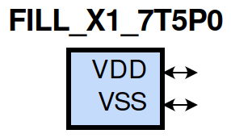

=======================================
gf180mcu_fd_sc_mcu7t5v0__fill_x1
=======================================

**gf180mcu_fd_sc_mcu7t5v0__fill_x1 symbol**

**gf180mcu_fd_sc_mcu7t5v0__fill_x1 schematic**

.. image:: sc7_sch/FILL_X1_sch.png
    :height: 300px
    :width: 500 px
    :align: center
    :alt: gf180mcu_fd_sc_mcu7t5v0__fill_x1 schematic

**gf180mcu_fd_sc_mcu7t5v0__fill_x1 layout**

.. image:: sc7_lay/FILL_X1_lay.png
    :height: 400px
    :width: 700 px
    :align: center
    :alt: gf180mcu_fd_sc_mcu7t5v0__fill_x1 layout

.. include:: images.rst

| FILL_X1 is a filler whose cell width is 0.56um

|
| Attributes

============= =====================
**Attribute** **Value**
area          2.195200 µm\ :sup:`2`
============= =====================

|
| FUNCTIONAL SCHEMATIC
| |image326|
| LEAKAGE POWER

================== ==============
**When Condition** **Power (nW)**
default            0.0500
================== ==============

