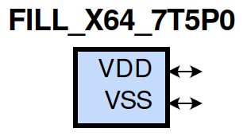

=======================================
gf180mcu_fd_sc_mcu7t5v0__fill_x64
=======================================

**gf180mcu_fd_sc_mcu7t5v0__fill_x64 symbol**

**gf180mcu_fd_sc_mcu7t5v0__fill_x64 schematic**

.. image:: sc7_sch/FILL_X64_sch.png
    :height: 300px
    :width: 500 px
    :align: center
    :alt: gf180mcu_fd_sc_mcu7t5v0__fill_x64 schematic

**gf180mcu_fd_sc_mcu7t5v0__fill_x64 layout**

.. include:: images.rst

| FILL_X64 is a filler whose cell width is 35.84um

|
| Attributes

============= =======================
**Attribute** **Value**
area          140.492800 µm\ :sup:`2`
============= =======================

|
| FUNCTIONAL SCHEMATIC
| |image338|
| LEAKAGE POWER

================== ==============
**When Condition** **Power (nW)**
default            0.0500
================== ==============

