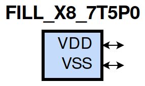
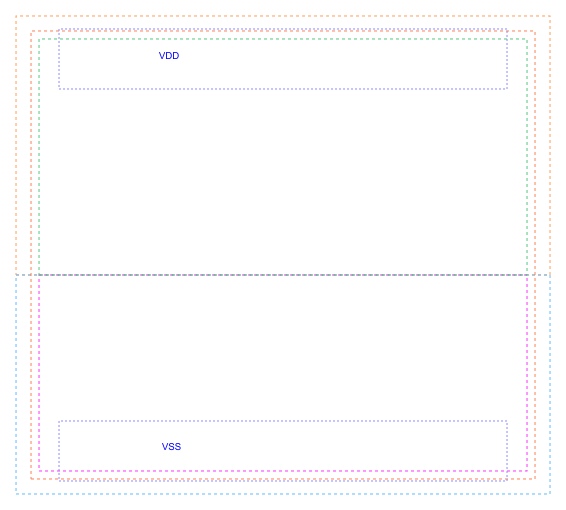

=======================================
gf180mcu_fd_sc_mcu7t5v0__fill_x8
=======================================

**gf180mcu_fd_sc_mcu7t5v0__fill_x8 symbol**

**gf180mcu_fd_sc_mcu7t5v0__fill_x8 schematic**

.. image:: sc7_sch/FILL_X8_sch.png
    :height: 300px
    :width: 500 px
    :align: center
    :alt: gf180mcu_fd_sc_mcu7t5v0__fill_x8 schematic

**gf180mcu_fd_sc_mcu7t5v0__fill_x8 layout**

.. include:: images.rst

| FILL_X8 is a filler whose cell width is 4.48um

|
| Attributes

============= ======================
**Attribute** **Value**
area          17.561600 µm\ :sup:`2`
============= ======================

|
| FUNCTIONAL SCHEMATIC
| |image341|
| LEAKAGE POWER

================== ==============
**When Condition** **Power (nW)**
default            0.0500
================== ==============

