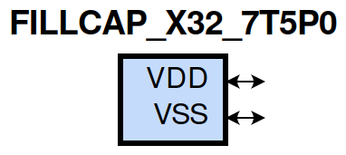
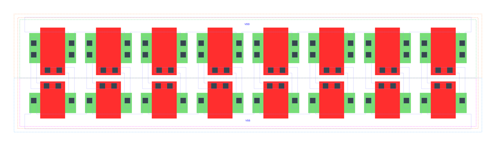

=======================================
gf180mcu_fd_sc_mcu7t5v0__fillcap_x32
=======================================

**gf180mcu_fd_sc_mcu7t5v0__fillcap_x32 symbol**

**gf180mcu_fd_sc_mcu7t5v0__fillcap_x32 schematic**

.. image:: sc7_sch/FILLCAP_X32_sch.png
    :height: 300px
    :width: 500 px
    :align: center
    :alt: gf180mcu_fd_sc_mcu7t5v0__fillcap_x32 schematic

**gf180mcu_fd_sc_mcu7t5v0__fillcap_x32 layout**

.. include:: images.rst

| FILLCAP_X32 is a filler whose cell width is 17.92um with decoupling cap between VDD and VSS

|
| Attributes

============= ======================
**Attribute** **Value**
area          70.246400 µm\ :sup:`2`
============= ======================

|
| FUNCTIONAL SCHEMATIC
| |image308|
| LEAKAGE POWER

================== ==============
**When Condition** **Power (nW)**
default            0.0500
================== ==============

