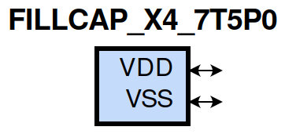
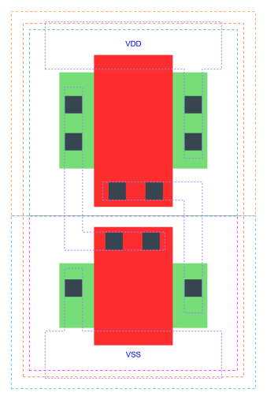

=======================================
gf180mcu_fd_sc_mcu7t5v0__fillcap_x4
=======================================

**gf180mcu_fd_sc_mcu7t5v0__fillcap_x4 symbol**

**gf180mcu_fd_sc_mcu7t5v0__fillcap_x4 schematic**

.. image:: sc7_sch/FILLCAP_X4_sch.png
    :height: 300px
    :width: 500 px
    :align: center
    :alt: gf180mcu_fd_sc_mcu7t5v0__fillcap_x4 schematic

**gf180mcu_fd_sc_mcu7t5v0__fillcap_x4 layout**

.. include:: images.rst

| FILLCAP_X4 is a filler whose cell width is 2.24um with decoupling cap between VDD and VSS

|
| Attributes

============= =====================
**Attribute** **Value**
area          8.780800 µm\ :sup:`2`
============= =====================

|
| FUNCTIONAL SCHEMATIC
| |image311|
| LEAKAGE POWER

================== ==============
**When Condition** **Power (nW)**
default            0.0500
================== ==============

