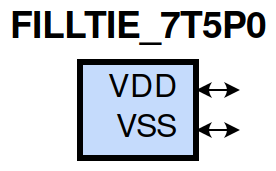
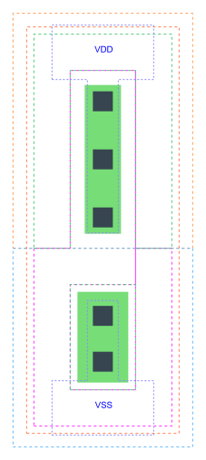

=======================================
gf180mcu_fd_sc_mcu7t5v0__filltie
=======================================

**gf180mcu_fd_sc_mcu7t5v0__filltie symbol**

**gf180mcu_fd_sc_mcu7t5v0__filltie schematic**

.. image:: sc7_sch/FILLTIE_sch.png
    :height: 300px
    :width: 500 px
    :align: center
    :alt: gf180mcu_fd_sc_mcu7t5v0__filltie schematic

**gf180mcu_fd_sc_mcu7t5v0__filltie layout**

.. include:: images.rst

| FILLTIE is a filler with well and substrate tap

|
| Attributes

============= =====================
**Attribute** **Value**
area          4.390400 µm\ :sup:`2`
============= =====================

|
| FUNCTIONAL SCHEMATIC
| |image320|
| LEAKAGE POWER

================== ==============
**When Condition** **Power (nW)**
default            0.0500
================== ==============

