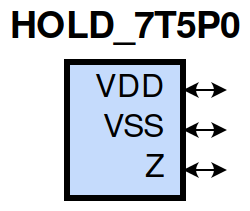
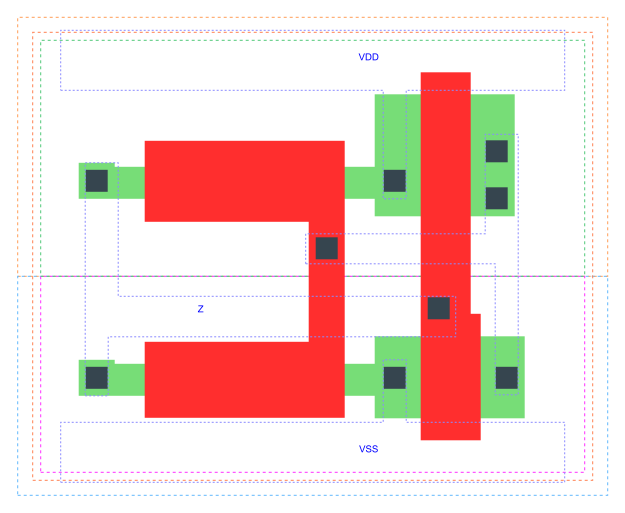

=======================================
gf180mcu_fd_sc_mcu7t5v0__hold
=======================================

**gf180mcu_fd_sc_mcu7t5v0__hold symbol**

**gf180mcu_fd_sc_mcu7t5v0__hold schematic**

.. image:: sc7_sch/HOLD_sch.png
    :height: 300px
    :width: 500 px
    :align: center
    :alt: gf180mcu_fd_sc_mcu7t5v0__hold schematic

**gf180mcu_fd_sc_mcu7t5v0__hold layout**

.. include:: images.rst

HOLD is a state holder cell

|
| Attributes

============= ======================
**Attribute** **Value**
area          bus_hold µm\ :sup:`2`
area          19.756800 µm\ :sup:`2`
============= ======================

|
| OUTPUT FUNCTIONS

============== ============
**Output Pin** **Function**
Z              Z
============== ============

|
| TRUTH TABLE FOR Z

+-------+
| **Z** |
+-------+

|
| FUNCTIONAL SCHEMATIC
| |image344|
| PIN CAPACITANCE (pf)

======= ======== ====================
**Pin** **Type** **Capacitance (pf)**
Z       inout    0.0177
======= ======== ====================

|
| DYNAMIC ENERGY

============= ================== ============ ===================
**Input Pin** **When Condition** **Tin (ns)** **Energy (uW/MHz)**
Z(HL)         default            0.0100       0.1988
Z(LH)         default            0.0100       0.0034
============= ================== ============ ===================

|
| LEAKAGE POWER

================== ==============
**When Condition** **Power (nW)**
!Z                 0.1008
Z                  0.1008
================== ==============

