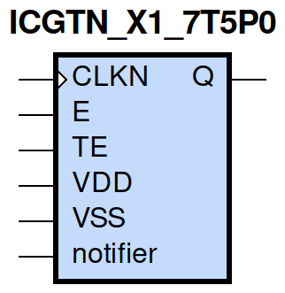
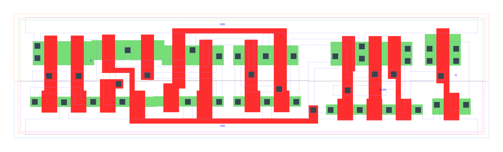

=======================================
gf180mcu_fd_sc_mcu7t5v0__icgtn_x1
=======================================

**gf180mcu_fd_sc_mcu7t5v0__icgtn_x1 symbol**

**gf180mcu_fd_sc_mcu7t5v0__icgtn_x1 schematic**

.. image:: sc7_sch/ICGTN_X1_sch.png
    :height: 300px
    :width: 500 px
    :align: center
    :alt: gf180mcu_fd_sc_mcu7t5v0__icgtn_x1 schematic

**gf180mcu_fd_sc_mcu7t5v0__icgtn_x1 layout**

.. include:: images.rst

ICGTN_X1 is a negative-edge triggered clock-gating latch, 1X drive strength

|
| Attributes

============= =====================================
**Attribute** **Value**
area          true µm\ :sup:`2`
area          true µm\ :sup:`2`
area          68.051200 µm\ :sup:`2`
area          true µm\ :sup:`2`
area          latch_negedge_precontrol µm\ :sup:`2`
area          true µm\ :sup:`2`
============= =====================================

|

TRUTH TABLE

== = ==== ======== ======
TE E CLKN QDN(n+1) Q(n+1)
L  L H    H        H
L  H H    L        H
H  L H    L        H
H  H H    L        H
X  X L    QDN(n)   QDN(n)
== = ==== ======== ======

|
| FUNCTIONAL SCHEMATIC
| |image347|
| CONSTRAINTS

================== =============== ============= ============
**Constraint Pin** **Related Pin** **setup(ns)** **hold(ns)**
TE(LH)             CLKN(HL)        0.5670        -0.0860
TE(HL)             CLKN(HL)        0.4690        -0.4520
E(LH)              CLKN(HL)        0.5380        -0.0800
E(HL)              CLKN(HL)        0.4410        -0.4240
================== =============== ============= ============

|

================== =============== ===========================
**Constraint Pin** **Related Pin** **Minimum Pulse Width(ns)**
CLKN(LHL)          CLKN(LH)        0.4760
CLKN(LHL)          CLKN(LH)        0.7910
CLKN(LHL)          CLKN(LH)        0.7480
CLKN(LHL)          CLKN(LH)        0.7110
================== =============== ===========================

|
| PIN CAPACITANCE (pf)

======= ======== ====================
**Pin** **Type** **Capacitance (pf)**
TE      input    0.0032
E       input    0.0034
CLKN    input    0.0069
======= ======== ====================

|
| DELAY AND OUTPUT TRANSITION TIME corresponding to min slew and load

+---------------+------------+--------------------+--------------+-------------------+----------------+---------------+
| **Input Pin** | **Output** | **When Condition** | **Tin (ns)** | **Out Load (pf)** | **Delay (ns)** | **Tout (ns)** |
+---------------+------------+--------------------+--------------+-------------------+----------------+---------------+
| CLKN(HL)      | Q(HL)      | !E&TE              | 0.0100       | 0.0010            | 0.2281         | 0.0486        |
+---------------+------------+--------------------+--------------+-------------------+----------------+---------------+
| CLKN(HL)      | Q(HL)      | E&!TE              | 0.0100       | 0.0010            | 0.2281         | 0.0486        |
+---------------+------------+--------------------+--------------+-------------------+----------------+---------------+
| CLKN(HL)      | Q(HL)      | E&TE               | 0.0100       | 0.0010            | 0.2281         | 0.0486        |
+---------------+------------+--------------------+--------------+-------------------+----------------+---------------+
| CLKN(LH)      | Q(LH)      | !E&!TE             | 0.0100       | 0.0010            | 0.1562         | 0.0391        |
+---------------+------------+--------------------+--------------+-------------------+----------------+---------------+
| CLKN(LH)      | Q(LH)      | !E&TE              | 0.0100       | 0.0010            | 0.1564         | 0.0392        |
+---------------+------------+--------------------+--------------+-------------------+----------------+---------------+
| CLKN(LH)      | Q(LH)      | E&!TE              | 0.0100       | 0.0010            | 0.1564         | 0.0392        |
+---------------+------------+--------------------+--------------+-------------------+----------------+---------------+
| CLKN(LH)      | Q(LH)      | E&TE               | 0.0100       | 0.0010            | 0.1564         | 0.0392        |
+---------------+------------+--------------------+--------------+-------------------+----------------+---------------+

|
| DYNAMIC ENERGY

+---------------+--------------------+--------------+------------+-------------------+---------------------+
| **Input Pin** | **When Condition** | **Tin (ns)** | **Output** | **Out Load (pf)** | **Energy (uW/MHz)** |
+---------------+--------------------+--------------+------------+-------------------+---------------------+
| CLKN          | !E&TE              | 0.0100       | Q(HL)      | 0.0010            | 0.4250              |
+---------------+--------------------+--------------+------------+-------------------+---------------------+
| CLKN          | E&!TE              | 0.0100       | Q(HL)      | 0.0010            | 0.4247              |
+---------------+--------------------+--------------+------------+-------------------+---------------------+
| CLKN          | E&TE               | 0.0100       | Q(HL)      | 0.0010            | 0.4247              |
+---------------+--------------------+--------------+------------+-------------------+---------------------+
| CLKN          | !E&!TE             | 0.0100       | Q(LH)      | 0.0010            | 0.6172              |
+---------------+--------------------+--------------+------------+-------------------+---------------------+
| CLKN          | !E&TE              | 0.0100       | Q(LH)      | 0.0010            | 0.2358              |
+---------------+--------------------+--------------+------------+-------------------+---------------------+
| CLKN          | E&!TE              | 0.0100       | Q(LH)      | 0.0010            | 0.2360              |
+---------------+--------------------+--------------+------------+-------------------+---------------------+
| CLKN          | E&TE               | 0.0100       | Q(LH)      | 0.0010            | 0.2359              |
+---------------+--------------------+--------------+------------+-------------------+---------------------+
| E(LH)         | !CLKN&!TE          | 0.0100       | n/a        | n/a               | -0.0291             |
+---------------+--------------------+--------------+------------+-------------------+---------------------+
| E(LH)         | !CLKN&TE           | 0.0100       | n/a        | n/a               | -0.0117             |
+---------------+--------------------+--------------+------------+-------------------+---------------------+
| E(LH)         | CLKN&!TE           | 0.0100       | n/a        | n/a               | 0.2707              |
+---------------+--------------------+--------------+------------+-------------------+---------------------+
| E(LH)         | CLKN&TE            | 0.0100       | n/a        | n/a               | -0.0090             |
+---------------+--------------------+--------------+------------+-------------------+---------------------+
| CLKN(LH)      | !E&!TE             | 0.0100       | n/a        | n/a               | 0.1318              |
+---------------+--------------------+--------------+------------+-------------------+---------------------+
| CLKN(LH)      | !E&TE              | 0.0100       | n/a        | n/a               | 0.4486              |
+---------------+--------------------+--------------+------------+-------------------+---------------------+
| CLKN(LH)      | E&!TE              | 0.0100       | n/a        | n/a               | 0.4256              |
+---------------+--------------------+--------------+------------+-------------------+---------------------+
| CLKN(LH)      | E&TE               | 0.0100       | n/a        | n/a               | 0.4212              |
+---------------+--------------------+--------------+------------+-------------------+---------------------+
| TE(HL)        | !CLKN&!E           | 0.0100       | n/a        | n/a               | 0.0546              |
+---------------+--------------------+--------------+------------+-------------------+---------------------+
| TE(HL)        | CLKN&!E            | 0.0100       | n/a        | n/a               | 0.4458              |
+---------------+--------------------+--------------+------------+-------------------+---------------------+
| TE(HL)        | CLKN&E             | 0.0100       | n/a        | n/a               | 0.0296              |
+---------------+--------------------+--------------+------------+-------------------+---------------------+
| TE(HL)        | !CLKN&E            | 0.0100       | n/a        | n/a               | 0.0296              |
+---------------+--------------------+--------------+------------+-------------------+---------------------+
| CLKN(HL)      | !E&!TE             | 0.0100       | n/a        | n/a               | 0.2504              |
+---------------+--------------------+--------------+------------+-------------------+---------------------+
| E(HL)         | !CLKN&!TE          | 0.0100       | n/a        | n/a               | 0.0327              |
+---------------+--------------------+--------------+------------+-------------------+---------------------+
| E(HL)         | !CLKN&TE           | 0.0100       | n/a        | n/a               | 0.0135              |
+---------------+--------------------+--------------+------------+-------------------+---------------------+
| E(HL)         | CLKN&!TE           | 0.0100       | n/a        | n/a               | 0.4236              |
+---------------+--------------------+--------------+------------+-------------------+---------------------+
| E(HL)         | CLKN&TE            | 0.0100       | n/a        | n/a               | 0.0194              |
+---------------+--------------------+--------------+------------+-------------------+---------------------+
| TE(LH)        | !CLKN&!E           | 0.0100       | n/a        | n/a               | -0.0259             |
+---------------+--------------------+--------------+------------+-------------------+---------------------+
| TE(LH)        | CLKN&!E            | 0.0100       | n/a        | n/a               | 0.2921              |
+---------------+--------------------+--------------+------------+-------------------+---------------------+
| TE(LH)        | CLKN&E             | 0.0100       | n/a        | n/a               | -0.0258             |
+---------------+--------------------+--------------+------------+-------------------+---------------------+
| TE(LH)        | !CLKN&E            | 0.0100       | n/a        | n/a               | -0.0281             |
+---------------+--------------------+--------------+------------+-------------------+---------------------+

|
| LEAKAGE POWER

================== ==============
**When Condition** **Power (nW)**
!CLKN&!E&!TE       0.4361
!CLKN&!E&TE        0.4276
!CLKN&E&!TE        0.4091
!CLKN&E&TE         0.4091
CLKN&!E&!TE        0.3206
CLKN&!E&TE         0.3310
CLKN&E&!TE         0.2956
CLKN&E&TE          0.2956
================== ==============

