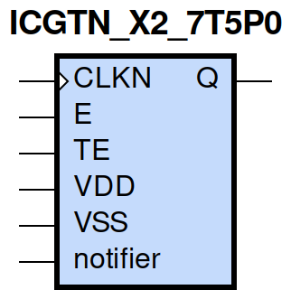
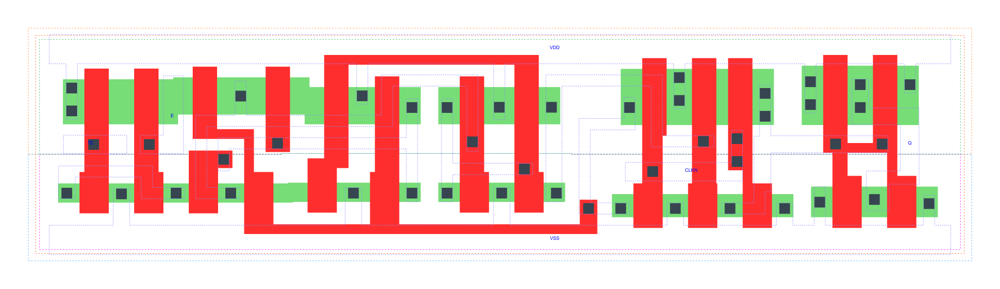

=======================================
gf180mcu_fd_sc_mcu7t5v0__icgtn_x2
=======================================

**gf180mcu_fd_sc_mcu7t5v0__icgtn_x2 symbol**

**gf180mcu_fd_sc_mcu7t5v0__icgtn_x2 schematic**

.. image:: sc7_sch/ICGTN_X2_sch.png
    :height: 300px
    :width: 500 px
    :align: center
    :alt: gf180mcu_fd_sc_mcu7t5v0__icgtn_x2 schematic

**gf180mcu_fd_sc_mcu7t5v0__icgtn_x2 layout**

.. include:: images.rst

ICGTN_X2 is a negative-edge triggered clock-gating latch, 2X drive strength

|
| Attributes

============= =====================================
**Attribute** **Value**
area          72.441600 µm\ :sup:`2`
area          true µm\ :sup:`2`
area          true µm\ :sup:`2`
area          true µm\ :sup:`2`
area          latch_negedge_precontrol µm\ :sup:`2`
area          true µm\ :sup:`2`
============= =====================================

|

TRUTH TABLE

== = ==== ======== ======
TE E CLKN QDN(n+1) Q(n+1)
L  L H    H        H
L  H H    L        H
H  L H    L        H
H  H H    L        H
X  X L    QDN(n)   QDN(n)
== = ==== ======== ======

|
| FUNCTIONAL SCHEMATIC
| |image350|
| CONSTRAINTS

================== =============== ============= ============
**Constraint Pin** **Related Pin** **setup(ns)** **hold(ns)**
TE(LH)             CLKN(HL)        0.5900        -0.1140
TE(HL)             CLKN(HL)        0.4870        -0.4640
E(LH)              CLKN(HL)        0.5610        -0.1030
E(HL)              CLKN(HL)        0.4640        -0.4410
================== =============== ============= ============

|

================== =============== ===========================
**Constraint Pin** **Related Pin** **Minimum Pulse Width(ns)**
CLKN(LHL)          CLKN(LH)        0.4760
CLKN(LHL)          CLKN(LH)        0.7970
CLKN(LHL)          CLKN(LH)        0.7600
CLKN(LHL)          CLKN(LH)        0.7170
================== =============== ===========================

|
| PIN CAPACITANCE (pf)

======= ======== ====================
**Pin** **Type** **Capacitance (pf)**
TE      input    0.0032
E       input    0.0034
CLKN    input    0.0081
======= ======== ====================

|
| DELAY AND OUTPUT TRANSITION TIME corresponding to min slew and load

+---------------+------------+--------------------+--------------+-------------------+----------------+---------------+
| **Input Pin** | **Output** | **When Condition** | **Tin (ns)** | **Out Load (pf)** | **Delay (ns)** | **Tout (ns)** |
+---------------+------------+--------------------+--------------+-------------------+----------------+---------------+
| CLKN(HL)      | Q(HL)      | !E&TE              | 0.0100       | 0.0010            | 0.2496         | 0.0452        |
+---------------+------------+--------------------+--------------+-------------------+----------------+---------------+
| CLKN(HL)      | Q(HL)      | E&!TE              | 0.0100       | 0.0010            | 0.2495         | 0.0454        |
+---------------+------------+--------------------+--------------+-------------------+----------------+---------------+
| CLKN(HL)      | Q(HL)      | E&TE               | 0.0100       | 0.0010            | 0.2495         | 0.0452        |
+---------------+------------+--------------------+--------------+-------------------+----------------+---------------+
| CLKN(LH)      | Q(LH)      | !E&!TE             | 0.0100       | 0.0010            | 0.1770         | 0.0333        |
+---------------+------------+--------------------+--------------+-------------------+----------------+---------------+
| CLKN(LH)      | Q(LH)      | !E&TE              | 0.0100       | 0.0010            | 0.1770         | 0.0332        |
+---------------+------------+--------------------+--------------+-------------------+----------------+---------------+
| CLKN(LH)      | Q(LH)      | E&!TE              | 0.0100       | 0.0010            | 0.1770         | 0.0332        |
+---------------+------------+--------------------+--------------+-------------------+----------------+---------------+
| CLKN(LH)      | Q(LH)      | E&TE               | 0.0100       | 0.0010            | 0.1770         | 0.0332        |
+---------------+------------+--------------------+--------------+-------------------+----------------+---------------+

|
| DYNAMIC ENERGY

+---------------+--------------------+--------------+------------+-------------------+---------------------+
| **Input Pin** | **When Condition** | **Tin (ns)** | **Output** | **Out Load (pf)** | **Energy (uW/MHz)** |
+---------------+--------------------+--------------+------------+-------------------+---------------------+
| CLKN          | !E&TE              | 0.0100       | Q(HL)      | 0.0010            | 0.5759              |
+---------------+--------------------+--------------+------------+-------------------+---------------------+
| CLKN          | E&!TE              | 0.0100       | Q(HL)      | 0.0010            | 0.5756              |
+---------------+--------------------+--------------+------------+-------------------+---------------------+
| CLKN          | E&TE               | 0.0100       | Q(HL)      | 0.0010            | 0.5755              |
+---------------+--------------------+--------------+------------+-------------------+---------------------+
| CLKN          | !E&!TE             | 0.0100       | Q(LH)      | 0.0010            | 0.7065              |
+---------------+--------------------+--------------+------------+-------------------+---------------------+
| CLKN          | !E&TE              | 0.0100       | Q(LH)      | 0.0010            | 0.3223              |
+---------------+--------------------+--------------+------------+-------------------+---------------------+
| CLKN          | E&!TE              | 0.0100       | Q(LH)      | 0.0010            | 0.3222              |
+---------------+--------------------+--------------+------------+-------------------+---------------------+
| CLKN          | E&TE               | 0.0100       | Q(LH)      | 0.0010            | 0.3224              |
+---------------+--------------------+--------------+------------+-------------------+---------------------+
| E(LH)         | !CLKN&!TE          | 0.0100       | n/a        | n/a               | -0.0291             |
+---------------+--------------------+--------------+------------+-------------------+---------------------+
| E(LH)         | !CLKN&TE           | 0.0100       | n/a        | n/a               | -0.0117             |
+---------------+--------------------+--------------+------------+-------------------+---------------------+
| E(LH)         | CLKN&!TE           | 0.0100       | n/a        | n/a               | 0.2782              |
+---------------+--------------------+--------------+------------+-------------------+---------------------+
| E(LH)         | CLKN&TE            | 0.0100       | n/a        | n/a               | -0.0090             |
+---------------+--------------------+--------------+------------+-------------------+---------------------+
| CLKN(LH)      | !E&!TE             | 0.0100       | n/a        | n/a               | 0.1275              |
+---------------+--------------------+--------------+------------+-------------------+---------------------+
| CLKN(LH)      | !E&TE              | 0.0100       | n/a        | n/a               | 0.4528              |
+---------------+--------------------+--------------+------------+-------------------+---------------------+
| CLKN(LH)      | E&!TE              | 0.0100       | n/a        | n/a               | 0.4298              |
+---------------+--------------------+--------------+------------+-------------------+---------------------+
| CLKN(LH)      | E&TE               | 0.0100       | n/a        | n/a               | 0.4252              |
+---------------+--------------------+--------------+------------+-------------------+---------------------+
| TE(HL)        | !CLKN&!E           | 0.0100       | n/a        | n/a               | 0.0547              |
+---------------+--------------------+--------------+------------+-------------------+---------------------+
| TE(HL)        | CLKN&!E            | 0.0100       | n/a        | n/a               | 0.4490              |
+---------------+--------------------+--------------+------------+-------------------+---------------------+
| TE(HL)        | CLKN&E             | 0.0100       | n/a        | n/a               | 0.0296              |
+---------------+--------------------+--------------+------------+-------------------+---------------------+
| TE(HL)        | !CLKN&E            | 0.0100       | n/a        | n/a               | 0.0296              |
+---------------+--------------------+--------------+------------+-------------------+---------------------+
| CLKN(HL)      | !E&!TE             | 0.0100       | n/a        | n/a               | 0.2645              |
+---------------+--------------------+--------------+------------+-------------------+---------------------+
| E(HL)         | !CLKN&!TE          | 0.0100       | n/a        | n/a               | 0.0327              |
+---------------+--------------------+--------------+------------+-------------------+---------------------+
| E(HL)         | !CLKN&TE           | 0.0100       | n/a        | n/a               | 0.0135              |
+---------------+--------------------+--------------+------------+-------------------+---------------------+
| E(HL)         | CLKN&!TE           | 0.0100       | n/a        | n/a               | 0.4269              |
+---------------+--------------------+--------------+------------+-------------------+---------------------+
| E(HL)         | CLKN&TE            | 0.0100       | n/a        | n/a               | 0.0194              |
+---------------+--------------------+--------------+------------+-------------------+---------------------+
| TE(LH)        | !CLKN&!E           | 0.0100       | n/a        | n/a               | -0.0260             |
+---------------+--------------------+--------------+------------+-------------------+---------------------+
| TE(LH)        | CLKN&!E            | 0.0100       | n/a        | n/a               | 0.2996              |
+---------------+--------------------+--------------+------------+-------------------+---------------------+
| TE(LH)        | CLKN&E             | 0.0100       | n/a        | n/a               | -0.0258             |
+---------------+--------------------+--------------+------------+-------------------+---------------------+
| TE(LH)        | !CLKN&E            | 0.0100       | n/a        | n/a               | -0.0281             |
+---------------+--------------------+--------------+------------+-------------------+---------------------+

|
| LEAKAGE POWER

================== ==============
**When Condition** **Power (nW)**
!CLKN&!E&!TE       0.4758
!CLKN&!E&TE        0.4518
!CLKN&E&!TE        0.4333
!CLKN&E&TE         0.4333
CLKN&!E&!TE        0.3464
CLKN&!E&TE         0.3567
CLKN&E&!TE         0.3213
CLKN&E&TE          0.3213
================== ==============

