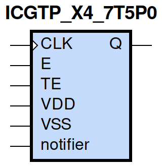
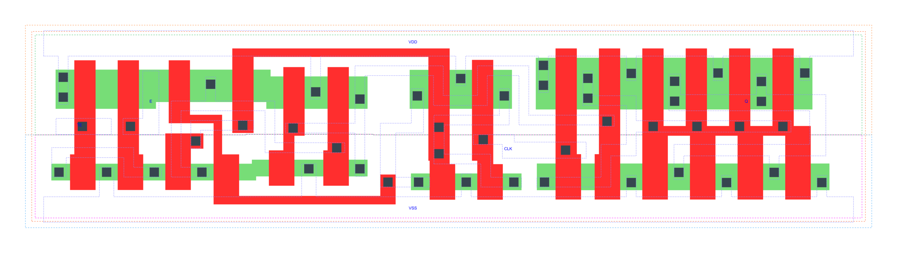

=======================================
gf180mcu_fd_sc_mcu7t5v0__icgtp_x4
=======================================

**gf180mcu_fd_sc_mcu7t5v0__icgtp_x4 symbol**

**gf180mcu_fd_sc_mcu7t5v0__icgtp_x4 schematic**

.. image:: sc7_sch/ICGTP_X4_sch.png
    :height: 300px
    :width: 500 px
    :align: center
    :alt: gf180mcu_fd_sc_mcu7t5v0__icgtp_x4 schematic

**gf180mcu_fd_sc_mcu7t5v0__icgtp_x4 layout**

.. include:: images.rst

ICGTP_X4 is a positive-edge triggered clock-gating latch, 4X drive strength

|
| Attributes

============= =====================================
**Attribute** **Value**
area          latch_posedge_precontrol µm\ :sup:`2`
area          true µm\ :sup:`2`
area          true µm\ :sup:`2`
area          true µm\ :sup:`2`
area          74.636800 µm\ :sup:`2`
area          true µm\ :sup:`2`
============= =====================================

|

TRUTH TABLE

== = === ======= ======
TE E CLK QD(n+1) Q(n+1)
L  L L   L       L
L  H L   H       L
H  L L   H       L
H  H L   H       L
X  X H   QD(n)   QD(n)
== = === ======= ======

|
| FUNCTIONAL SCHEMATIC
| |image362|
| CONSTRAINTS

================== =============== ============= ============
**Constraint Pin** **Related Pin** **setup(ns)** **hold(ns)**
TE(HL)             CLK(LH)         0.3030        -0.2000
TE(LH)             CLK(LH)         0.5840        -0.2230
E(HL)              CLK(LH)         0.2810        -0.1720
E(LH)              CLK(LH)         0.5500        -0.1890
================== =============== ============= ============

|

================== =============== ===========================
**Constraint Pin** **Related Pin** **Minimum Pulse Width(ns)**
CLK(HLH)           CLK(HL)         0.4760
CLK(HLH)           CLK(HL)         0.6990
CLK(HLH)           CLK(HL)         0.6620
CLK(HLH)           CLK(HL)         0.6140
================== =============== ===========================

|
| PIN CAPACITANCE (pf)

======= ======== ====================
**Pin** **Type** **Capacitance (pf)**
TE      input    0.0032
E       input    0.0033
CLK     input    0.0080
======= ======== ====================

|
| DELAY AND OUTPUT TRANSITION TIME corresponding to min slew and load

+---------------+------------+--------------------+--------------+-------------------+----------------+---------------+
| **Input Pin** | **Output** | **When Condition** | **Tin (ns)** | **Out Load (pf)** | **Delay (ns)** | **Tout (ns)** |
+---------------+------------+--------------------+--------------+-------------------+----------------+---------------+
| CLK(LH)       | Q(LH)      | !E&TE              | 0.0100       | 0.0010            | 0.3052         | 0.0492        |
+---------------+------------+--------------------+--------------+-------------------+----------------+---------------+
| CLK(LH)       | Q(LH)      | E&!TE              | 0.0100       | 0.0010            | 0.3052         | 0.0492        |
+---------------+------------+--------------------+--------------+-------------------+----------------+---------------+
| CLK(LH)       | Q(LH)      | E&TE               | 0.0100       | 0.0010            | 0.3052         | 0.0492        |
+---------------+------------+--------------------+--------------+-------------------+----------------+---------------+
| CLK(HL)       | Q(HL)      | !E&!TE             | 0.0100       | 0.0010            | 0.2303         | 0.0406        |
+---------------+------------+--------------------+--------------+-------------------+----------------+---------------+
| CLK(HL)       | Q(HL)      | !E&TE              | 0.0100       | 0.0010            | 0.2303         | 0.0405        |
+---------------+------------+--------------------+--------------+-------------------+----------------+---------------+
| CLK(HL)       | Q(HL)      | E&!TE              | 0.0100       | 0.0010            | 0.2303         | 0.0404        |
+---------------+------------+--------------------+--------------+-------------------+----------------+---------------+
| CLK(HL)       | Q(HL)      | E&TE               | 0.0100       | 0.0010            | 0.2303         | 0.0405        |
+---------------+------------+--------------------+--------------+-------------------+----------------+---------------+

|
| DYNAMIC ENERGY

+---------------+--------------------+--------------+------------+-------------------+---------------------+
| **Input Pin** | **When Condition** | **Tin (ns)** | **Output** | **Out Load (pf)** | **Energy (uW/MHz)** |
+---------------+--------------------+--------------+------------+-------------------+---------------------+
| CLK           | !E&TE              | 0.0100       | Q(LH)      | 0.0010            | 0.6942              |
+---------------+--------------------+--------------+------------+-------------------+---------------------+
| CLK           | E&!TE              | 0.0100       | Q(LH)      | 0.0010            | 0.6938              |
+---------------+--------------------+--------------+------------+-------------------+---------------------+
| CLK           | E&TE               | 0.0100       | Q(LH)      | 0.0010            | 0.6939              |
+---------------+--------------------+--------------+------------+-------------------+---------------------+
| CLK           | !E&!TE             | 0.0100       | Q(HL)      | 0.0010            | 1.0826              |
+---------------+--------------------+--------------+------------+-------------------+---------------------+
| CLK           | !E&TE              | 0.0100       | Q(HL)      | 0.0010            | 0.8094              |
+---------------+--------------------+--------------+------------+-------------------+---------------------+
| CLK           | E&!TE              | 0.0100       | Q(HL)      | 0.0010            | 0.8092              |
+---------------+--------------------+--------------+------------+-------------------+---------------------+
| CLK           | E&TE               | 0.0100       | Q(HL)      | 0.0010            | 0.8095              |
+---------------+--------------------+--------------+------------+-------------------+---------------------+
| E(LH)         | !CLK&!TE           | 0.0100       | n/a        | n/a               | 0.2427              |
+---------------+--------------------+--------------+------------+-------------------+---------------------+
| E(LH)         | !CLK&TE            | 0.0100       | n/a        | n/a               | -0.0090             |
+---------------+--------------------+--------------+------------+-------------------+---------------------+
| E(LH)         | CLK&!TE            | 0.0100       | n/a        | n/a               | -0.0291             |
+---------------+--------------------+--------------+------------+-------------------+---------------------+
| E(LH)         | CLK&TE             | 0.0100       | n/a        | n/a               | -0.0117             |
+---------------+--------------------+--------------+------------+-------------------+---------------------+
| CLK(LH)       | !E&!TE             | 0.0100       | n/a        | n/a               | 0.1290              |
+---------------+--------------------+--------------+------------+-------------------+---------------------+
| TE(HL)        | !CLK&!E            | 0.0100       | n/a        | n/a               | 0.3295              |
+---------------+--------------------+--------------+------------+-------------------+---------------------+
| TE(HL)        | !CLK&E             | 0.0100       | n/a        | n/a               | 0.0296              |
+---------------+--------------------+--------------+------------+-------------------+---------------------+
| TE(HL)        | CLK&!E             | 0.0100       | n/a        | n/a               | 0.0546              |
+---------------+--------------------+--------------+------------+-------------------+---------------------+
| TE(HL)        | CLK&E              | 0.0100       | n/a        | n/a               | 0.0296              |
+---------------+--------------------+--------------+------------+-------------------+---------------------+
| TE(LH)        | !CLK&!E            | 0.0100       | n/a        | n/a               | 0.2629              |
+---------------+--------------------+--------------+------------+-------------------+---------------------+
| TE(LH)        | !CLK&E             | 0.0100       | n/a        | n/a               | -0.0258             |
+---------------+--------------------+--------------+------------+-------------------+---------------------+
| TE(LH)        | CLK&!E             | 0.0100       | n/a        | n/a               | -0.0259             |
+---------------+--------------------+--------------+------------+-------------------+---------------------+
| TE(LH)        | CLK&E              | 0.0100       | n/a        | n/a               | -0.0281             |
+---------------+--------------------+--------------+------------+-------------------+---------------------+
| E(HL)         | !CLK&!TE           | 0.0100       | n/a        | n/a               | 0.3071              |
+---------------+--------------------+--------------+------------+-------------------+---------------------+
| E(HL)         | !CLK&TE            | 0.0100       | n/a        | n/a               | 0.0194              |
+---------------+--------------------+--------------+------------+-------------------+---------------------+
| E(HL)         | CLK&!TE            | 0.0100       | n/a        | n/a               | 0.0327              |
+---------------+--------------------+--------------+------------+-------------------+---------------------+
| E(HL)         | CLK&TE             | 0.0100       | n/a        | n/a               | 0.0135              |
+---------------+--------------------+--------------+------------+-------------------+---------------------+
| CLK(HL)       | !E&!TE             | 0.0100       | n/a        | n/a               | 0.2831              |
+---------------+--------------------+--------------+------------+-------------------+---------------------+
| CLK(HL)       | !E&TE              | 0.0100       | n/a        | n/a               | 0.5675              |
+---------------+--------------------+--------------+------------+-------------------+---------------------+
| CLK(HL)       | E&!TE              | 0.0100       | n/a        | n/a               | 0.5403              |
+---------------+--------------------+--------------+------------+-------------------+---------------------+
| CLK(HL)       | E&TE               | 0.0100       | n/a        | n/a               | 0.5383              |
+---------------+--------------------+--------------+------------+-------------------+---------------------+

|
| LEAKAGE POWER

================== ==============
**When Condition** **Power (nW)**
!CLK&!E&!TE        0.3741
!CLK&!E&TE         0.3845
!CLK&E&!TE         0.3490
!CLK&E&TE          0.3490
CLK&!E&!TE         0.5149
CLK&!E&TE          0.4758
CLK&E&!TE          0.4571
CLK&E&TE           0.4571
================== ==============

