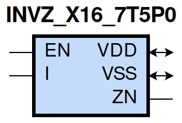
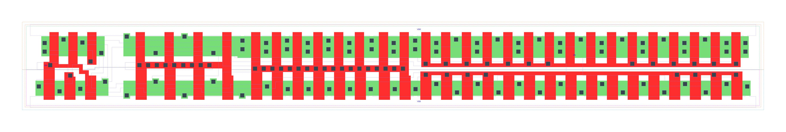

=======================================
gf180mcu_fd_sc_mcu7t5v0__invz_x16
=======================================

**gf180mcu_fd_sc_mcu7t5v0__invz_x16 symbol**

**gf180mcu_fd_sc_mcu7t5v0__invz_x16 schematic**

.. image:: sc7_sch/INVZ_X16_sch.png
    :height: 300px
    :width: 500 px
    :align: center
    :alt: gf180mcu_fd_sc_mcu7t5v0__invz_x16 schematic

**gf180mcu_fd_sc_mcu7t5v0__invz_x16 layout**

.. include:: images.rst

INVZ_X16 is a tri-state inverter, 16X drive strength

|
| Attributes

============= =======================
**Attribute** **Value**
area          153.664000 µm\ :sup:`2`
============= =======================

|
| OUTPUT FUNCTIONS

============== ============
**Output Pin** **Function**
ZN             (!I)
============== ============

|
| TRUTH TABLE FOR ZN

====== ===== ======
**EN** **I** **ZN**
1      0     1
1      1     0
0      ?     z
====== ===== ======

|
| FUNCTIONAL SCHEMATIC
| |image368|
| PIN CAPACITANCE (pf)

======= ======== ====================
**Pin** **Type** **Capacitance (pf)**
EN      input    0.0090
I       input    0.0181
======= ======== ====================

|
| DELAY AND OUTPUT TRANSITION TIME corresponding to min slew and load

+---------------+------------+--------------------+--------------+-------------------+----------------+---------------+
| **Input Pin** | **Output** | **When Condition** | **Tin (ns)** | **Out Load (pf)** | **Delay (ns)** | **Tout (ns)** |
+---------------+------------+--------------------+--------------+-------------------+----------------+---------------+
| EN(LH)        | ZN(ZL)     | I                  | 0.0100       | 0.0010            | 0.2097         | 0.0527        |
+---------------+------------+--------------------+--------------+-------------------+----------------+---------------+
| EN(LH)        | ZN(ZH)     | !I                 | 0.0100       | 0.0010            | 0.2621         | 0.0648        |
+---------------+------------+--------------------+--------------+-------------------+----------------+---------------+
| EN(HL)        | ZN(HZ)     | !I                 | 0.0100       |                   | 0.6750         | 0.0000        |
+---------------+------------+--------------------+--------------+-------------------+----------------+---------------+
| EN(HL)        | ZN(LZ)     | I                  | 0.0100       |                   | 0.4670         | 0.0000        |
+---------------+------------+--------------------+--------------+-------------------+----------------+---------------+
| I(LH)         | ZN(HL)     | EN                 | 0.0100       | 0.0010            | 0.3480         | 0.0505        |
+---------------+------------+--------------------+--------------+-------------------+----------------+---------------+
| I(HL)         | ZN(LH)     | EN                 | 0.0100       | 0.0010            | 0.4443         | 0.0616        |
+---------------+------------+--------------------+--------------+-------------------+----------------+---------------+

|
| DYNAMIC ENERGY

+---------------+--------------------+--------------+------------+-------------------+---------------------+
| **Input Pin** | **When Condition** | **Tin (ns)** | **Output** | **Out Load (pf)** | **Energy (uW/MHz)** |
+---------------+--------------------+--------------+------------+-------------------+---------------------+
| I             | EN                 | 0.0100       | ZN(HL)     | 0.0010            | 2.3424              |
+---------------+--------------------+--------------+------------+-------------------+---------------------+
| I             | EN                 | 0.0100       | ZN(LH)     | 0.0010            | 2.3656              |
+---------------+--------------------+--------------+------------+-------------------+---------------------+
| EN            | I                  | 0.0100       | ZN(HL)     | 0.0010            | 1.4016              |
+---------------+--------------------+--------------+------------+-------------------+---------------------+
| EN(HL)        | I                  | 0.0100       | n/a        | n/a               | 0.2490              |
+---------------+--------------------+--------------+------------+-------------------+---------------------+
| EN(HL)        | !I                 | 0.0100       | n/a        | n/a               | 0.6917              |
+---------------+--------------------+--------------+------------+-------------------+---------------------+
| EN            | !I                 | 0.0100       | ZN(LH)     | 0.0010            | 1.3432              |
+---------------+--------------------+--------------+------------+-------------------+---------------------+
| I(LH)         | !EN                | 0.0100       | n/a        | n/a               | 0.2972              |
+---------------+--------------------+--------------+------------+-------------------+---------------------+
| I(HL)         | !EN                | 0.0100       | n/a        | n/a               | 0.8016              |
+---------------+--------------------+--------------+------------+-------------------+---------------------+

|
| LEAKAGE POWER

================== ==============
**When Condition** **Power (nW)**
!EN&!I             0.4362
!EN&I              0.4401
EN&!I              0.8735
EN&I               0.8846
================== ==============

