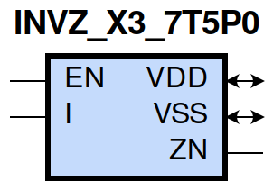

=======================================
gf180mcu_fd_sc_mcu7t5v0__invz_x3
=======================================

**gf180mcu_fd_sc_mcu7t5v0__invz_x3 symbol**

**gf180mcu_fd_sc_mcu7t5v0__invz_x3 schematic**

.. image:: sc7_sch/INVZ_X3_sch.png
    :height: 300px
    :width: 500 px
    :align: center
    :alt: gf180mcu_fd_sc_mcu7t5v0__invz_x3 schematic

**gf180mcu_fd_sc_mcu7t5v0__invz_x3 layout**

.. image:: sc7_lay/INVZ_X3_lay.png
    :height: 400px
    :width: 700 px
    :align: center
    :alt: gf180mcu_fd_sc_mcu7t5v0__invz_x3 layout

.. include:: images.rst

INVZ_X3 is a tri-state inverter, 3X drive strength
|
| Attributes

============= ======================
**Attribute** **Value**
area          50.489600 µm\ :sup:`2`
============= ======================

|
| OUTPUT FUNCTIONS

============== ============
**Output Pin** **Function**
ZN             (!I)
============== ============

|
| TRUTH TABLE FOR ZN

====== ===== ======
**EN** **I** **ZN**
1      0     1
1      1     0
0      ?     z
====== ===== ======

|
| FUNCTIONAL SCHEMATIC
| |image377|
| PIN CAPACITANCE (pf)

======= ======== ====================
**Pin** **Type** **Capacitance (pf)**
EN      input    0.0090
I       input    0.0047
======= ======== ====================

|
| DELAY AND OUTPUT TRANSITION TIME corresponding to min slew and load

+---------------+------------+--------------------+--------------+-------------------+----------------+---------------+
| **Input Pin** | **Output** | **When Condition** | **Tin (ns)** | **Out Load (pf)** | **Delay (ns)** | **Tout (ns)** |
+---------------+------------+--------------------+--------------+-------------------+----------------+---------------+
| EN(LH)        | ZN(ZL)     | I                  | 0.0100       | 0.0010            | 0.1444         | 0.0370        |
+---------------+------------+--------------------+--------------+-------------------+----------------+---------------+
| EN(LH)        | ZN(ZH)     | !I                 | 0.0100       | 0.0010            | 0.1411         | 0.0403        |
+---------------+------------+--------------------+--------------+-------------------+----------------+---------------+
| EN(HL)        | ZN(HZ)     | !I                 | 0.0100       |                   | 0.1860         | 0.0000        |
+---------------+------------+--------------------+--------------+-------------------+----------------+---------------+
| EN(HL)        | ZN(LZ)     | I                  | 0.0100       |                   | 0.2230         | 0.0000        |
+---------------+------------+--------------------+--------------+-------------------+----------------+---------------+
| I(LH)         | ZN(HL)     | EN                 | 0.0100       | 0.0010            | 0.2996         | 0.0393        |
+---------------+------------+--------------------+--------------+-------------------+----------------+---------------+
| I(HL)         | ZN(LH)     | EN                 | 0.0100       | 0.0010            | 0.3711         | 0.0412        |
+---------------+------------+--------------------+--------------+-------------------+----------------+---------------+

|
| DYNAMIC ENERGY

+---------------+--------------------+--------------+------------+-------------------+---------------------+
| **Input Pin** | **When Condition** | **Tin (ns)** | **Output** | **Out Load (pf)** | **Energy (uW/MHz)** |
+---------------+--------------------+--------------+------------+-------------------+---------------------+
| I             | EN                 | 0.0100       | ZN(HL)     | 0.0010            | 0.6696              |
+---------------+--------------------+--------------+------------+-------------------+---------------------+
| I             | EN                 | 0.0100       | ZN(LH)     | 0.0010            | 0.5615              |
+---------------+--------------------+--------------+------------+-------------------+---------------------+
| EN            | I                  | 0.0100       | ZN(HL)     | 0.0010            | 0.3879              |
+---------------+--------------------+--------------+------------+-------------------+---------------------+
| EN(HL)        | I                  | 0.0100       | n/a        | n/a               | 0.2451              |
+---------------+--------------------+--------------+------------+-------------------+---------------------+
| EN(HL)        | !I                 | 0.0100       | n/a        | n/a               | 0.3791              |
+---------------+--------------------+--------------+------------+-------------------+---------------------+
| EN            | !I                 | 0.0100       | ZN(LH)     | 0.0010            | 0.2705              |
+---------------+--------------------+--------------+------------+-------------------+---------------------+
| I(LH)         | !EN                | 0.0100       | n/a        | n/a               | 0.0642              |
+---------------+--------------------+--------------+------------+-------------------+---------------------+
| I(HL)         | !EN                | 0.0100       | n/a        | n/a               | 0.1948              |
+---------------+--------------------+--------------+------------+-------------------+---------------------+

|
| LEAKAGE POWER

================== ==============
**When Condition** **Power (nW)**
!EN&!I             0.1902
!EN&I              0.1912
EN&!I              0.3074
EN&I               0.3088
================== ==============

