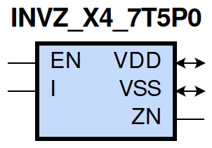
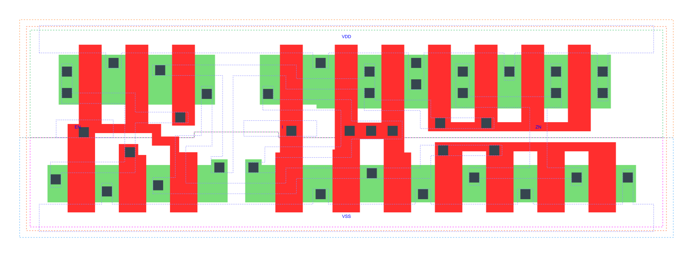

=======================================
gf180mcu_fd_sc_mcu7t5v0__invz_x4
=======================================

**gf180mcu_fd_sc_mcu7t5v0__invz_x4 symbol**

**gf180mcu_fd_sc_mcu7t5v0__invz_x4 schematic**

.. image:: sc7_sch/INVZ_X4_sch.png
    :height: 300px
    :width: 500 px
    :align: center
    :alt: gf180mcu_fd_sc_mcu7t5v0__invz_x4 schematic

**gf180mcu_fd_sc_mcu7t5v0__invz_x4 layout**

.. include:: images.rst

INVZ_X4 is a tri-state inverter, 4X drive strength
|
| Attributes

============= ======================
**Attribute** **Value**
area          52.684800 µm\ :sup:`2`
============= ======================

|
| OUTPUT FUNCTIONS

============== ============
**Output Pin** **Function**
ZN             (!I)
============== ============

|
| TRUTH TABLE FOR ZN

====== ===== ======
**EN** **I** **ZN**
1      0     1
1      1     0
0      ?     z
====== ===== ======

|
| FUNCTIONAL SCHEMATIC
| |image380|
| PIN CAPACITANCE (pf)

======= ======== ====================
**Pin** **Type** **Capacitance (pf)**
EN      input    0.0090
I       input    0.0047
======= ======== ====================

|
| DELAY AND OUTPUT TRANSITION TIME corresponding to min slew and load

+---------------+------------+--------------------+--------------+-------------------+----------------+---------------+
| **Input Pin** | **Output** | **When Condition** | **Tin (ns)** | **Out Load (pf)** | **Delay (ns)** | **Tout (ns)** |
+---------------+------------+--------------------+--------------+-------------------+----------------+---------------+
| EN(LH)        | ZN(ZL)     | I                  | 0.0100       | 0.0010            | 0.1389         | 0.0339        |
+---------------+------------+--------------------+--------------+-------------------+----------------+---------------+
| EN(LH)        | ZN(ZH)     | !I                 | 0.0100       | 0.0010            | 0.1394         | 0.0366        |
+---------------+------------+--------------------+--------------+-------------------+----------------+---------------+
| EN(HL)        | ZN(HZ)     | !I                 | 0.0100       |                   | 0.2140         | 0.0000        |
+---------------+------------+--------------------+--------------+-------------------+----------------+---------------+
| EN(HL)        | ZN(LZ)     | I                  | 0.0100       |                   | 0.2350         | 0.0000        |
+---------------+------------+--------------------+--------------+-------------------+----------------+---------------+
| I(LH)         | ZN(HL)     | EN                 | 0.0100       | 0.0010            | 0.3050         | 0.0359        |
+---------------+------------+--------------------+--------------+-------------------+----------------+---------------+
| I(HL)         | ZN(LH)     | EN                 | 0.0100       | 0.0010            | 0.3537         | 0.0370        |
+---------------+------------+--------------------+--------------+-------------------+----------------+---------------+

|
| DYNAMIC ENERGY

+---------------+--------------------+--------------+------------+-------------------+---------------------+
| **Input Pin** | **When Condition** | **Tin (ns)** | **Output** | **Out Load (pf)** | **Energy (uW/MHz)** |
+---------------+--------------------+--------------+------------+-------------------+---------------------+
| I             | EN                 | 0.0100       | ZN(HL)     | 0.0010            | 0.7707              |
+---------------+--------------------+--------------+------------+-------------------+---------------------+
| I             | EN                 | 0.0100       | ZN(LH)     | 0.0010            | 0.6400              |
+---------------+--------------------+--------------+------------+-------------------+---------------------+
| EN            | I                  | 0.0100       | ZN(HL)     | 0.0010            | 0.4374              |
+---------------+--------------------+--------------+------------+-------------------+---------------------+
| EN(HL)        | I                  | 0.0100       | n/a        | n/a               | 0.2428              |
+---------------+--------------------+--------------+------------+-------------------+---------------------+
| EN(HL)        | !I                 | 0.0100       | n/a        | n/a               | 0.3906              |
+---------------+--------------------+--------------+------------+-------------------+---------------------+
| EN            | !I                 | 0.0100       | ZN(LH)     | 0.0010            | 0.3221              |
+---------------+--------------------+--------------+------------+-------------------+---------------------+
| I(LH)         | !EN                | 0.0100       | n/a        | n/a               | 0.0760              |
+---------------+--------------------+--------------+------------+-------------------+---------------------+
| I(HL)         | !EN                | 0.0100       | n/a        | n/a               | 0.2188              |
+---------------+--------------------+--------------+------------+-------------------+---------------------+

|
| LEAKAGE POWER

================== ==============
**When Condition** **Power (nW)**
!EN&!I             0.2047
!EN&I              0.2056
EN&!I              0.3330
EN&I               0.3351
================== ==============

