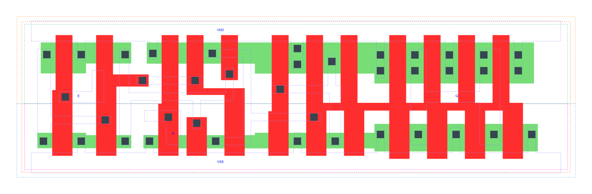

=======================================
gf180mcu_fd_sc_mcu7t5v0__latq_x4
=======================================

**gf180mcu_fd_sc_mcu7t5v0__latq_x4 symbol**

.. image:: sc7_sym/LATQ_X4_sym.png
    :height: 250px
    :width: 400 px
    :align: center
    :alt: gf180mcu_fd_sc_mcu7t5v0__latq_x4 symbol

**gf180mcu_fd_sc_mcu7t5v0__latq_x4 schematic**

.. image:: sc7_sch/LATQ_X4_sch.png
    :height: 300px
    :width: 500 px
    :align: center
    :alt: gf180mcu_fd_sc_mcu7t5v0__latq_x4 schematic

**gf180mcu_fd_sc_mcu7t5v0__latq_x4 layout**

.. include:: images.rst

LATQ_X4 is a positive D-latch, 4X drive strength

|
| Attributes

============= ======================
**Attribute** **Value**
area          61.465600 µm\ :sup:`2`
============= ======================

|

TRUTH TABLE

===== = ======
Input   Output
D     E Q
L     H L
H     H H
X     L Q
===== = ======

|
| FUNCTIONAL SCHEMATIC
| |image416|
| CONSTRAINTS

================== =============== ============= ============
**Constraint Pin** **Related Pin** **setup(ns)** **hold(ns)**
D(LH)              E(HL)           0.4060        -0.3260
D(HL)              E(HL)           0.8530        -0.7390
================== =============== ============= ============

|

================== =============== ===========================
**Constraint Pin** **Related Pin** **Minimum Pulse Width(ns)**
E(LHL)             E(LH)           0.9150
E(LHL)             E(LH)           0.6420
================== =============== ===========================

|
| PIN CAPACITANCE (pf)

======= ======== ====================
**Pin** **Type** **Capacitance (pf)**
E       input    0.0037
D       input    0.0030
======= ======== ====================

|
| DELAY AND OUTPUT TRANSITION TIME corresponding to min slew and load

+---------------+------------+--------------------+--------------+-------------------+----------------+---------------+
| **Input Pin** | **Output** | **When Condition** | **Tin (ns)** | **Out Load (pf)** | **Delay (ns)** | **Tout (ns)** |
+---------------+------------+--------------------+--------------+-------------------+----------------+---------------+
| E(LH)         | Q(LH)      | D                  | 0.0100       | 0.0010            | 0.8139         | 0.0769        |
+---------------+------------+--------------------+--------------+-------------------+----------------+---------------+
| E(LH)         | Q(HL)      | !D                 | 0.0100       | 0.0010            | 0.8816         | 0.1236        |
+---------------+------------+--------------------+--------------+-------------------+----------------+---------------+
| D(LH)         | Q(LH)      | E                  | 0.0100       | 0.0010            | 0.5924         | 0.0772        |
+---------------+------------+--------------------+--------------+-------------------+----------------+---------------+
| D(HL)         | Q(HL)      | E                  | 0.0100       | 0.0010            | 0.8242         | 0.1238        |
+---------------+------------+--------------------+--------------+-------------------+----------------+---------------+

|
| DYNAMIC ENERGY

+---------------+--------------------+--------------+------------+-------------------+---------------------+
| **Input Pin** | **When Condition** | **Tin (ns)** | **Output** | **Out Load (pf)** | **Energy (uW/MHz)** |
+---------------+--------------------+--------------+------------+-------------------+---------------------+
| D             | E                  | 0.0100       | Q(LH)      | 0.0010            | 1.2894              |
+---------------+--------------------+--------------+------------+-------------------+---------------------+
| D             | E                  | 0.0100       | Q(HL)      | 0.0010            | 2.1612              |
+---------------+--------------------+--------------+------------+-------------------+---------------------+
| E             | D                  | 0.0100       | Q(LH)      | 0.0010            | 1.4282              |
+---------------+--------------------+--------------+------------+-------------------+---------------------+
| E             | !D                 | 0.0100       | Q(HL)      | 0.0010            | 2.2519              |
+---------------+--------------------+--------------+------------+-------------------+---------------------+
| E(LH)         | !D                 | 0.0100       | n/a        | n/a               | 0.1272              |
+---------------+--------------------+--------------+------------+-------------------+---------------------+
| E(LH)         | D                  | 0.0100       | n/a        | n/a               | 0.1244              |
+---------------+--------------------+--------------+------------+-------------------+---------------------+
| D(LH)         | !E                 | 0.0100       | n/a        | n/a               | -0.0198             |
+---------------+--------------------+--------------+------------+-------------------+---------------------+
| E(HL)         | !D                 | 0.0100       | n/a        | n/a               | 0.2244              |
+---------------+--------------------+--------------+------------+-------------------+---------------------+
| E(HL)         | D                  | 0.0100       | n/a        | n/a               | 0.2297              |
+---------------+--------------------+--------------+------------+-------------------+---------------------+
| D(HL)         | !E                 | 0.0100       | n/a        | n/a               | 0.0217              |
+---------------+--------------------+--------------+------------+-------------------+---------------------+

|
| LEAKAGE POWER

================== ==============
**When Condition** **Power (nW)**
!D&!E              0.4100
D&!E               0.4521
!D&E               0.3536
D&E                0.3444
================== ==============

