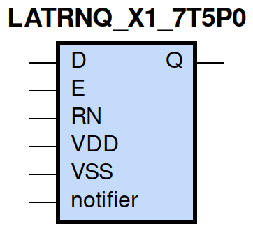
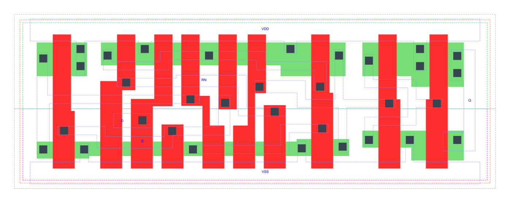

=======================================
gf180mcu_fd_sc_mcu7t5v0__latrnq_x1
=======================================

**gf180mcu_fd_sc_mcu7t5v0__latrnq_x1 symbol**

**gf180mcu_fd_sc_mcu7t5v0__latrnq_x1 schematic**

.. image:: sc7_sch/LATRNQ_X1_sch.png
    :height: 300px
    :width: 500 px
    :align: center
    :alt: gf180mcu_fd_sc_mcu7t5v0__latrnq_x1 schematic

**gf180mcu_fd_sc_mcu7t5v0__latrnq_x1 layout**

.. include:: images.rst

LATRNQ_X1 is a positive D-latch, active low reset, 1X drive strength

|
| Attributes

============= ======================
**Attribute** **Value**
area          48.294400 µm\ :sup:`2`
============= ======================

|

TRUTH TABLE

===== = = ======
Input     Output
RN    D E Q
H     L H L
H     H H H
H     X L Q
L     X X L
===== = = ======

|
| FUNCTIONAL SCHEMATIC
| |image419|
| CONSTRAINTS

================== =============== ============= ============
**Constraint Pin** **Related Pin** **setup(ns)** **hold(ns)**
D(HL)              E(HL)           0.4290        -0.3720
D(LH)              E(HL)           0.4010        -0.3490
================== =============== ============= ============

|

================== =============== ================ ===============
**Constraint Pin** **Related Pin** **recovery(ns)** **removal(ns)**
RN(LH)             E(HL)           0.4120           -0.3610
================== =============== ================ ===============

|

================== =============== ===========================
**Constraint Pin** **Related Pin** **Minimum Pulse Width(ns)**
E(LHL)             E(LH)           0.4950
E(LHL)             E(LH)           0.3580
RN(HLH)            RN(HL)          0.3100
RN(HLH)            RN(HL)          0.3100
================== =============== ===========================

|
| PIN CAPACITANCE (pf)

======= ======== ====================
**Pin** **Type** **Capacitance (pf)**
E       input    0.0074
D       input    0.0031
RN      input    0.0052
======= ======== ====================

|
| DELAY AND OUTPUT TRANSITION TIME corresponding to min slew and load

+---------------+------------+--------------------+--------------+-------------------+----------------+---------------+
| **Input Pin** | **Output** | **When Condition** | **Tin (ns)** | **Out Load (pf)** | **Delay (ns)** | **Tout (ns)** |
+---------------+------------+--------------------+--------------+-------------------+----------------+---------------+
| E(LH)         | Q(LH)      | D&RN               | 0.0100       | 0.0010            | 0.5865         | 0.0402        |
+---------------+------------+--------------------+--------------+-------------------+----------------+---------------+
| E(LH)         | Q(HL)      | !D&RN              | 0.0100       | 0.0010            | 0.7359         | 0.0334        |
+---------------+------------+--------------------+--------------+-------------------+----------------+---------------+
| D(LH)         | Q(LH)      | E&RN               | 0.0100       | 0.0010            | 0.6376         | 0.0401        |
+---------------+------------+--------------------+--------------+-------------------+----------------+---------------+
| D(HL)         | Q(HL)      | E&RN               | 0.0100       | 0.0010            | 0.6930         | 0.0334        |
+---------------+------------+--------------------+--------------+-------------------+----------------+---------------+
| RN(HL)        | Q(HL)      | !D&!E              | 0.0100       | 0.0010            | 0.5283         | 0.0330        |
+---------------+------------+--------------------+--------------+-------------------+----------------+---------------+
| RN(HL)        | Q(HL)      | D&!E               | 0.0100       | 0.0010            | 0.5285         | 0.0330        |
+---------------+------------+--------------------+--------------+-------------------+----------------+---------------+
| RN(HL)        | Q(HL)      | D&E                | 0.0100       | 0.0010            | 0.5300         | 0.0331        |
+---------------+------------+--------------------+--------------+-------------------+----------------+---------------+
| RN(LH)        | Q(LH)      | D&E                | 0.0100       | 0.0010            | 0.6492         | 0.0401        |
+---------------+------------+--------------------+--------------+-------------------+----------------+---------------+

|
| DYNAMIC ENERGY

+---------------+--------------------+--------------+------------+-------------------+---------------------+
| **Input Pin** | **When Condition** | **Tin (ns)** | **Output** | **Out Load (pf)** | **Energy (uW/MHz)** |
+---------------+--------------------+--------------+------------+-------------------+---------------------+
| E             | D&RN               | 0.0100       | Q(LH)      | 0.0010            | 0.3758              |
+---------------+--------------------+--------------+------------+-------------------+---------------------+
| RN            | !D&!E              | 0.0100       | Q(HL)      | 0.0010            | 0.4653              |
+---------------+--------------------+--------------+------------+-------------------+---------------------+
| RN            | D&!E               | 0.0100       | Q(HL)      | 0.0010            | 0.4663              |
+---------------+--------------------+--------------+------------+-------------------+---------------------+
| RN            | D&E                | 0.0100       | Q(HL)      | 0.0010            | 0.4996              |
+---------------+--------------------+--------------+------------+-------------------+---------------------+
| E             | !D&RN              | 0.0100       | Q(HL)      | 0.0010            | 0.4647              |
+---------------+--------------------+--------------+------------+-------------------+---------------------+
| RN            | D&E                | 0.0100       | Q(LH)      | 0.0010            | 0.3731              |
+---------------+--------------------+--------------+------------+-------------------+---------------------+
| D             | E&RN               | 0.0100       | Q(LH)      | 0.0010            | 0.3723              |
+---------------+--------------------+--------------+------------+-------------------+---------------------+
| D             | E&RN               | 0.0100       | Q(HL)      | 0.0010            | 0.4898              |
+---------------+--------------------+--------------+------------+-------------------+---------------------+
| D(HL)         | !E&!RN             | 0.0100       | n/a        | n/a               | 0.0264              |
+---------------+--------------------+--------------+------------+-------------------+---------------------+
| D(HL)         | E&!RN              | 0.0100       | n/a        | n/a               | 0.0222              |
+---------------+--------------------+--------------+------------+-------------------+---------------------+
| D(HL)         | !E&RN              | 0.0100       | n/a        | n/a               | 0.0217              |
+---------------+--------------------+--------------+------------+-------------------+---------------------+
| E(LH)         | !D&!RN             | 0.0100       | n/a        | n/a               | 0.0072              |
+---------------+--------------------+--------------+------------+-------------------+---------------------+
| E(LH)         | D&!RN              | 0.0100       | n/a        | n/a               | 0.0269              |
+---------------+--------------------+--------------+------------+-------------------+---------------------+
| E(LH)         | !D&RN              | 0.0100       | n/a        | n/a               | 0.0000              |
+---------------+--------------------+--------------+------------+-------------------+---------------------+
| E(LH)         | D&RN               | 0.0100       | n/a        | n/a               | -0.0005             |
+---------------+--------------------+--------------+------------+-------------------+---------------------+
| D(LH)         | !E&!RN             | 0.0100       | n/a        | n/a               | -0.0198             |
+---------------+--------------------+--------------+------------+-------------------+---------------------+
| D(LH)         | E&!RN              | 0.0100       | n/a        | n/a               | -0.0159             |
+---------------+--------------------+--------------+------------+-------------------+---------------------+
| D(LH)         | !E&RN              | 0.0100       | n/a        | n/a               | -0.0198             |
+---------------+--------------------+--------------+------------+-------------------+---------------------+
| RN(HL)        | !D&!E              | 0.0100       | n/a        | n/a               | 0.0218              |
+---------------+--------------------+--------------+------------+-------------------+---------------------+
| RN(HL)        | D&!E               | 0.0100       | n/a        | n/a               | 0.0238              |
+---------------+--------------------+--------------+------------+-------------------+---------------------+
| RN(HL)        | !D&E               | 0.0100       | n/a        | n/a               | 0.0218              |
+---------------+--------------------+--------------+------------+-------------------+---------------------+
| RN(LH)        | !D&!E              | 0.0100       | n/a        | n/a               | -0.0201             |
+---------------+--------------------+--------------+------------+-------------------+---------------------+
| RN(LH)        | !D&E               | 0.0100       | n/a        | n/a               | -0.0201             |
+---------------+--------------------+--------------+------------+-------------------+---------------------+
| RN(LH)        | D&!E               | 0.0100       | n/a        | n/a               | -0.0202             |
+---------------+--------------------+--------------+------------+-------------------+---------------------+
| E(HL)         | !D&!RN             | 0.0100       | n/a        | n/a               | 0.1494              |
+---------------+--------------------+--------------+------------+-------------------+---------------------+
| E(HL)         | !D&RN              | 0.0100       | n/a        | n/a               | 0.1494              |
+---------------+--------------------+--------------+------------+-------------------+---------------------+
| E(HL)         | D&!RN              | 0.0100       | n/a        | n/a               | 0.1498              |
+---------------+--------------------+--------------+------------+-------------------+---------------------+
| E(HL)         | D&RN               | 0.0100       | n/a        | n/a               | 0.1493              |
+---------------+--------------------+--------------+------------+-------------------+---------------------+

|
| LEAKAGE POWER

================== ==============
**When Condition** **Power (nW)**
!D&!E&!RN          0.2457
!D&E&!RN           0.2463
!D&E&RN            0.2470
D&!E&!RN           0.2459
D&E&!RN            0.2868
!D&!E&RN           0.2721
D&!E&RN            0.3106
D&E&RN             0.2682
================== ==============

