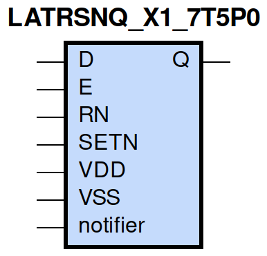
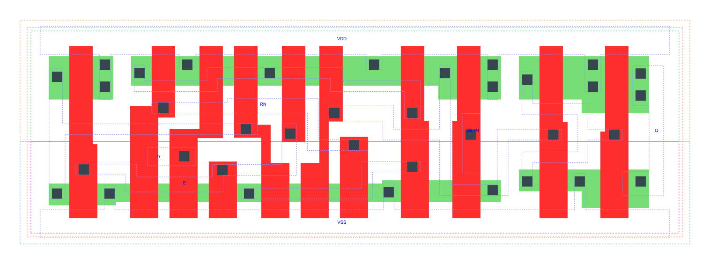

=======================================
gf180mcu_fd_sc_mcu7t5v0__latrsnq_x1
=======================================

**gf180mcu_fd_sc_mcu7t5v0__latrsnq_x1 symbol**

**gf180mcu_fd_sc_mcu7t5v0__latrsnq_x1 schematic**

.. image:: sc7_sch/LATRSNQ_X1_sch.png
    :height: 300px
    :width: 500 px
    :align: center
    :alt: gf180mcu_fd_sc_mcu7t5v0__latrsnq_x1 schematic

**gf180mcu_fd_sc_mcu7t5v0__latrsnq_x1 layout**

.. include:: images.rst

LATRSNQ_X1 is a positive D-latch, active low set/reset, 1X drive strength

|
| Attributes

============= ======================
**Attribute** **Value**
area          52.684800 µm\ :sup:`2`
============= ======================

|

TRUTH TABLE

===== ==== = = ======
Input          Output
RN    SETN D E Q
H     H    L H L
H     H    H H H
H     H    X L Q
L     H    X X L
H     L    X X H
L     L    X X H
===== ==== = = ======

|
| FUNCTIONAL SCHEMATIC
| |image428|
| CONSTRAINTS

================== =============== ============= ============
**Constraint Pin** **Related Pin** **setup(ns)** **hold(ns)**
D(HL)              E(HL)           0.4240        -0.3610
D(LH)              E(HL)           0.4580        -0.3950
RN(LH)             SETN(LH)        0.0970        -0.0170
RN(LH)             SETN(LH)        0.0970        -0.0170
SETN(LH)           RN(LH)          -0.0170       0.0970
SETN(LH)           RN(LH)          -0.0170       0.0970
================== =============== ============= ============

|

================== =============== ================ ===============
**Constraint Pin** **Related Pin** **recovery(ns)** **removal(ns)**
RN(LH)             E(HL)           0.4690           -0.4060
SETN(LH)           E(HL)           -0.0170          0.1370
================== =============== ================ ===============

|

================== =============== ===========================
**Constraint Pin** **Related Pin** **Minimum Pulse Width(ns)**
E(LHL)             E(LH)           0.4850
E(LHL)             E(LH)           0.4170
RN(HLH)            RN(HL)          0.3100
RN(HLH)            RN(HL)          0.3100
SETN(HLH)          SETN(HL)        0.2800
SETN(HLH)          SETN(HL)        0.2800
================== =============== ===========================

|
| PIN CAPACITANCE (pf)

======= ======== ====================
**Pin** **Type** **Capacitance (pf)**
E       input    0.0074
D       input    0.0031
RN      input    0.0052
SETN    input    0.0037
======= ======== ====================

|
| DELAY AND OUTPUT TRANSITION TIME corresponding to min slew and load

+---------------+------------+--------------------+--------------+-------------------+----------------+---------------+
| **Input Pin** | **Output** | **When Condition** | **Tin (ns)** | **Out Load (pf)** | **Delay (ns)** | **Tout (ns)** |
+---------------+------------+--------------------+--------------+-------------------+----------------+---------------+
| E(LH)         | Q(LH)      | D&RN&SETN          | 0.0100       | 0.0010            | 0.6919         | 0.0413        |
+---------------+------------+--------------------+--------------+-------------------+----------------+---------------+
| E(LH)         | Q(HL)      | !D&RN&SETN         | 0.0100       | 0.0010            | 0.7694         | 0.0352        |
+---------------+------------+--------------------+--------------+-------------------+----------------+---------------+
| D(LH)         | Q(LH)      | E&RN&SETN          | 0.0100       | 0.0010            | 0.7419         | 0.0414        |
+---------------+------------+--------------------+--------------+-------------------+----------------+---------------+
| D(HL)         | Q(HL)      | E&RN&SETN          | 0.0100       | 0.0010            | 0.7267         | 0.0353        |
+---------------+------------+--------------------+--------------+-------------------+----------------+---------------+
| RN(HL)        | Q(HL)      | !D&!E&SETN         | 0.0100       | 0.0010            | 0.5803         | 0.0348        |
+---------------+------------+--------------------+--------------+-------------------+----------------+---------------+
| RN(HL)        | Q(HL)      | D&!E&SETN          | 0.0100       | 0.0010            | 0.5807         | 0.0349        |
+---------------+------------+--------------------+--------------+-------------------+----------------+---------------+
| RN(HL)        | Q(HL)      | D&E&SETN           | 0.0100       | 0.0010            | 0.5788         | 0.0350        |
+---------------+------------+--------------------+--------------+-------------------+----------------+---------------+
| RN(LH)        | Q(LH)      | D&E&SETN           | 0.0100       | 0.0010            | 0.7539         | 0.0415        |
+---------------+------------+--------------------+--------------+-------------------+----------------+---------------+
| SETN(LH)      | Q(HL)      | !D&!E&!RN          | 0.0100       | 0.0010            | 0.3451         | 0.0347        |
+---------------+------------+--------------------+--------------+-------------------+----------------+---------------+
| SETN(LH)      | Q(HL)      | !D&E&!RN           | 0.0100       | 0.0010            | 0.3509         | 0.0348        |
+---------------+------------+--------------------+--------------+-------------------+----------------+---------------+
| SETN(LH)      | Q(HL)      | !D&E&RN            | 0.0100       | 0.0010            | 0.3527         | 0.0349        |
+---------------+------------+--------------------+--------------+-------------------+----------------+---------------+
| SETN(LH)      | Q(HL)      | D&!E&!RN           | 0.0100       | 0.0010            | 0.3451         | 0.0347        |
+---------------+------------+--------------------+--------------+-------------------+----------------+---------------+
| SETN(LH)      | Q(HL)      | D&E&!RN            | 0.0100       | 0.0010            | 0.3509         | 0.0348        |
+---------------+------------+--------------------+--------------+-------------------+----------------+---------------+
| SETN(HL)      | Q(LH)      | !D&!E&RN           | 0.0100       | 0.0010            | 0.3125         | 0.0401        |
+---------------+------------+--------------------+--------------+-------------------+----------------+---------------+
| SETN(HL)      | Q(LH)      | D&!E&RN            | 0.0100       | 0.0010            | 0.3125         | 0.0400        |
+---------------+------------+--------------------+--------------+-------------------+----------------+---------------+
| SETN(HL)      | Q(LH)      | !D&!E&!RN          | 0.0100       | 0.0010            | 0.3083         | 0.0400        |
+---------------+------------+--------------------+--------------+-------------------+----------------+---------------+
| SETN(HL)      | Q(LH)      | !D&E&!RN           | 0.0100       | 0.0010            | 0.3099         | 0.0401        |
+---------------+------------+--------------------+--------------+-------------------+----------------+---------------+
| SETN(HL)      | Q(LH)      | !D&E&RN            | 0.0100       | 0.0010            | 0.3127         | 0.0401        |
+---------------+------------+--------------------+--------------+-------------------+----------------+---------------+
| SETN(HL)      | Q(LH)      | D&!E&!RN           | 0.0100       | 0.0010            | 0.3083         | 0.0400        |
+---------------+------------+--------------------+--------------+-------------------+----------------+---------------+
| SETN(HL)      | Q(LH)      | D&E&!RN            | 0.0100       | 0.0010            | 0.3099         | 0.0401        |
+---------------+------------+--------------------+--------------+-------------------+----------------+---------------+

|
| DYNAMIC ENERGY

+---------------+--------------------+--------------+------------+-------------------+---------------------+
| **Input Pin** | **When Condition** | **Tin (ns)** | **Output** | **Out Load (pf)** | **Energy (uW/MHz)** |
+---------------+--------------------+--------------+------------+-------------------+---------------------+
| SETN          | !D&!E&!RN          | 0.0100       | Q(HL)      | 0.0010            | 0.2338              |
+---------------+--------------------+--------------+------------+-------------------+---------------------+
| SETN          | !D&E&!RN           | 0.0100       | Q(HL)      | 0.0010            | 0.2427              |
+---------------+--------------------+--------------+------------+-------------------+---------------------+
| SETN          | !D&E&RN            | 0.0100       | Q(HL)      | 0.0010            | 0.2330              |
+---------------+--------------------+--------------+------------+-------------------+---------------------+
| SETN          | D&!E&!RN           | 0.0100       | Q(HL)      | 0.0010            | 0.2338              |
+---------------+--------------------+--------------+------------+-------------------+---------------------+
| SETN          | D&E&!RN            | 0.0100       | Q(HL)      | 0.0010            | 0.2427              |
+---------------+--------------------+--------------+------------+-------------------+---------------------+
| SETN          | !D&!E&RN           | 0.0100       | Q(LH)      | 0.0010            | 0.4210              |
+---------------+--------------------+--------------+------------+-------------------+---------------------+
| SETN          | D&!E&RN            | 0.0100       | Q(LH)      | 0.0010            | 0.4210              |
+---------------+--------------------+--------------+------------+-------------------+---------------------+
| SETN          | !D&!E&!RN          | 0.0100       | Q(LH)      | 0.0010            | 0.3280              |
+---------------+--------------------+--------------+------------+-------------------+---------------------+
| SETN          | !D&E&!RN           | 0.0100       | Q(LH)      | 0.0010            | 0.3285              |
+---------------+--------------------+--------------+------------+-------------------+---------------------+
| SETN          | !D&E&RN            | 0.0100       | Q(LH)      | 0.0010            | 0.3346              |
+---------------+--------------------+--------------+------------+-------------------+---------------------+
| SETN          | D&!E&!RN           | 0.0100       | Q(LH)      | 0.0010            | 0.3280              |
+---------------+--------------------+--------------+------------+-------------------+---------------------+
| SETN          | D&E&!RN            | 0.0100       | Q(LH)      | 0.0010            | 0.3285              |
+---------------+--------------------+--------------+------------+-------------------+---------------------+
| E             | D&RN&SETN          | 0.0100       | Q(LH)      | 0.0010            | 0.4122              |
+---------------+--------------------+--------------+------------+-------------------+---------------------+
| RN            | !D&!E&SETN         | 0.0100       | Q(HL)      | 0.0010            | 0.4646              |
+---------------+--------------------+--------------+------------+-------------------+---------------------+
| RN            | D&!E&SETN          | 0.0100       | Q(HL)      | 0.0010            | 0.4663              |
+---------------+--------------------+--------------+------------+-------------------+---------------------+
| RN            | D&E&SETN           | 0.0100       | Q(HL)      | 0.0010            | 0.4985              |
+---------------+--------------------+--------------+------------+-------------------+---------------------+
| E             | !D&RN&SETN         | 0.0100       | Q(HL)      | 0.0010            | 0.4547              |
+---------------+--------------------+--------------+------------+-------------------+---------------------+
| RN            | D&E&SETN           | 0.0100       | Q(LH)      | 0.0010            | 0.4093              |
+---------------+--------------------+--------------+------------+-------------------+---------------------+
| D             | E&RN&SETN          | 0.0100       | Q(LH)      | 0.0010            | 0.4082              |
+---------------+--------------------+--------------+------------+-------------------+---------------------+
| D             | E&RN&SETN          | 0.0100       | Q(HL)      | 0.0010            | 0.4795              |
+---------------+--------------------+--------------+------------+-------------------+---------------------+
| SETN(HL)      | !D&!E&RN           | 0.0100       | n/a        | n/a               | 0.0322              |
+---------------+--------------------+--------------+------------+-------------------+---------------------+
| SETN(HL)      | D&!E&RN            | 0.0100       | n/a        | n/a               | 0.0322              |
+---------------+--------------------+--------------+------------+-------------------+---------------------+
| SETN(HL)      | D&E&RN             | 0.0100       | n/a        | n/a               | 0.0322              |
+---------------+--------------------+--------------+------------+-------------------+---------------------+
| D(HL)         | !E&!RN&!SETN       | 0.0100       | n/a        | n/a               | 0.0264              |
+---------------+--------------------+--------------+------------+-------------------+---------------------+
| D(HL)         | !E&RN&!SETN        | 0.0100       | n/a        | n/a               | 0.0201              |
+---------------+--------------------+--------------+------------+-------------------+---------------------+
| D(HL)         | E&!RN&!SETN        | 0.0100       | n/a        | n/a               | 0.0222              |
+---------------+--------------------+--------------+------------+-------------------+---------------------+
| D(HL)         | E&RN&!SETN         | 0.0100       | n/a        | n/a               | 0.1964              |
+---------------+--------------------+--------------+------------+-------------------+---------------------+
| D(HL)         | !E&!RN&SETN        | 0.0100       | n/a        | n/a               | 0.0264              |
+---------------+--------------------+--------------+------------+-------------------+---------------------+
| D(HL)         | E&!RN&SETN         | 0.0100       | n/a        | n/a               | 0.0222              |
+---------------+--------------------+--------------+------------+-------------------+---------------------+
| D(HL)         | !E&RN&SETN         | 0.0100       | n/a        | n/a               | 0.0217              |
+---------------+--------------------+--------------+------------+-------------------+---------------------+
| E(LH)         | !D&!RN&!SETN       | 0.0100       | n/a        | n/a               | 0.0081              |
+---------------+--------------------+--------------+------------+-------------------+---------------------+
| E(LH)         | !D&RN&!SETN        | 0.0100       | n/a        | n/a               | 0.1682              |
+---------------+--------------------+--------------+------------+-------------------+---------------------+
| E(LH)         | D&!RN&!SETN        | 0.0100       | n/a        | n/a               | 0.0280              |
+---------------+--------------------+--------------+------------+-------------------+---------------------+
| E(LH)         | D&RN&!SETN         | 0.0100       | n/a        | n/a               | 0.0055              |
+---------------+--------------------+--------------+------------+-------------------+---------------------+
| E(LH)         | !D&!RN&SETN        | 0.0100       | n/a        | n/a               | 0.0072              |
+---------------+--------------------+--------------+------------+-------------------+---------------------+
| E(LH)         | D&!RN&SETN         | 0.0100       | n/a        | n/a               | 0.0269              |
+---------------+--------------------+--------------+------------+-------------------+---------------------+
| E(LH)         | !D&RN&SETN         | 0.0100       | n/a        | n/a               | 0.0000              |
+---------------+--------------------+--------------+------------+-------------------+---------------------+
| E(LH)         | D&RN&SETN          | 0.0100       | n/a        | n/a               | -0.0005             |
+---------------+--------------------+--------------+------------+-------------------+---------------------+
| D(LH)         | !E&!RN&!SETN       | 0.0100       | n/a        | n/a               | -0.0198             |
+---------------+--------------------+--------------+------------+-------------------+---------------------+
| D(LH)         | !E&RN&!SETN        | 0.0100       | n/a        | n/a               | -0.0173             |
+---------------+--------------------+--------------+------------+-------------------+---------------------+
| D(LH)         | E&!RN&!SETN        | 0.0100       | n/a        | n/a               | -0.0159             |
+---------------+--------------------+--------------+------------+-------------------+---------------------+
| D(LH)         | E&RN&!SETN         | 0.0100       | n/a        | n/a               | 0.0459              |
+---------------+--------------------+--------------+------------+-------------------+---------------------+
| D(LH)         | !E&!RN&SETN        | 0.0100       | n/a        | n/a               | -0.0198             |
+---------------+--------------------+--------------+------------+-------------------+---------------------+
| D(LH)         | E&!RN&SETN         | 0.0100       | n/a        | n/a               | -0.0159             |
+---------------+--------------------+--------------+------------+-------------------+---------------------+
| D(LH)         | !E&RN&SETN         | 0.0100       | n/a        | n/a               | -0.0198             |
+---------------+--------------------+--------------+------------+-------------------+---------------------+
| RN(HL)        | !D&!E&!SETN        | 0.0100       | n/a        | n/a               | 0.1860              |
+---------------+--------------------+--------------+------------+-------------------+---------------------+
| RN(HL)        | !D&E&!SETN         | 0.0100       | n/a        | n/a               | 0.0245              |
+---------------+--------------------+--------------+------------+-------------------+---------------------+
| RN(HL)        | D&!E&!SETN         | 0.0100       | n/a        | n/a               | 0.1877              |
+---------------+--------------------+--------------+------------+-------------------+---------------------+
| RN(HL)        | D&E&!SETN          | 0.0100       | n/a        | n/a               | 0.2166              |
+---------------+--------------------+--------------+------------+-------------------+---------------------+
| RN(HL)        | !D&!E&SETN         | 0.0100       | n/a        | n/a               | 0.0219              |
+---------------+--------------------+--------------+------------+-------------------+---------------------+
| RN(HL)        | D&!E&SETN          | 0.0100       | n/a        | n/a               | 0.0238              |
+---------------+--------------------+--------------+------------+-------------------+---------------------+
| RN(HL)        | !D&E&SETN          | 0.0100       | n/a        | n/a               | 0.0218              |
+---------------+--------------------+--------------+------------+-------------------+---------------------+
| RN(LH)        | !D&!E&!SETN        | 0.0100       | n/a        | n/a               | 0.0760              |
+---------------+--------------------+--------------+------------+-------------------+---------------------+
| RN(LH)        | !D&E&!SETN         | 0.0100       | n/a        | n/a               | -0.0201             |
+---------------+--------------------+--------------+------------+-------------------+---------------------+
| RN(LH)        | D&!E&!SETN         | 0.0100       | n/a        | n/a               | 0.0760              |
+---------------+--------------------+--------------+------------+-------------------+---------------------+
| RN(LH)        | D&E&!SETN          | 0.0100       | n/a        | n/a               | 0.0469              |
+---------------+--------------------+--------------+------------+-------------------+---------------------+
| RN(LH)        | !D&!E&SETN         | 0.0100       | n/a        | n/a               | -0.0202             |
+---------------+--------------------+--------------+------------+-------------------+---------------------+
| RN(LH)        | !D&E&SETN          | 0.0100       | n/a        | n/a               | -0.0201             |
+---------------+--------------------+--------------+------------+-------------------+---------------------+
| RN(LH)        | D&!E&SETN          | 0.0100       | n/a        | n/a               | -0.0202             |
+---------------+--------------------+--------------+------------+-------------------+---------------------+
| SETN(LH)      | !D&!E&RN           | 0.0100       | n/a        | n/a               | -0.0206             |
+---------------+--------------------+--------------+------------+-------------------+---------------------+
| SETN(LH)      | D&!E&RN            | 0.0100       | n/a        | n/a               | -0.0206             |
+---------------+--------------------+--------------+------------+-------------------+---------------------+
| SETN(LH)      | D&E&RN             | 0.0100       | n/a        | n/a               | -0.0206             |
+---------------+--------------------+--------------+------------+-------------------+---------------------+
| E(HL)         | !D&!RN&!SETN       | 0.0100       | n/a        | n/a               | 0.1574              |
+---------------+--------------------+--------------+------------+-------------------+---------------------+
| E(HL)         | !D&RN&!SETN        | 0.0100       | n/a        | n/a               | 0.2160              |
+---------------+--------------------+--------------+------------+-------------------+---------------------+
| E(HL)         | D&!RN&!SETN        | 0.0100       | n/a        | n/a               | 0.1578              |
+---------------+--------------------+--------------+------------+-------------------+---------------------+
| E(HL)         | D&RN&!SETN         | 0.0100       | n/a        | n/a               | 0.1493              |
+---------------+--------------------+--------------+------------+-------------------+---------------------+
| E(HL)         | D&RN&SETN          | 0.0100       | n/a        | n/a               | 0.1493              |
+---------------+--------------------+--------------+------------+-------------------+---------------------+
| E(HL)         | !D&!RN&SETN        | 0.0100       | n/a        | n/a               | 0.1494              |
+---------------+--------------------+--------------+------------+-------------------+---------------------+
| E(HL)         | !D&RN&SETN         | 0.0100       | n/a        | n/a               | 0.1494              |
+---------------+--------------------+--------------+------------+-------------------+---------------------+
| E(HL)         | D&!RN&SETN         | 0.0100       | n/a        | n/a               | 0.1498              |
+---------------+--------------------+--------------+------------+-------------------+---------------------+

|
| LEAKAGE POWER

================== ==============
**When Condition** **Power (nW)**
!D&!E&!RN&!SETN    0.2852
!D&!E&RN&!SETN     0.2672
!D&E&!RN&!SETN     0.2454
!D&E&RN&!SETN      0.2470
D&!E&!RN&!SETN     0.2853
D&!E&RN&!SETN      0.2672
D&E&!RN&!SETN      0.2859
D&E&RN&!SETN       0.2677
D&E&RN&SETN        0.3084
!D&!E&!RN&SETN     0.2718
!D&E&!RN&SETN      0.2724
!D&E&RN&SETN       0.2732
D&!E&!RN&SETN      0.2720
D&E&!RN&SETN       0.3129
!D&!E&RN&SETN      0.2982
D&!E&RN&SETN       0.3508
================== ==============

