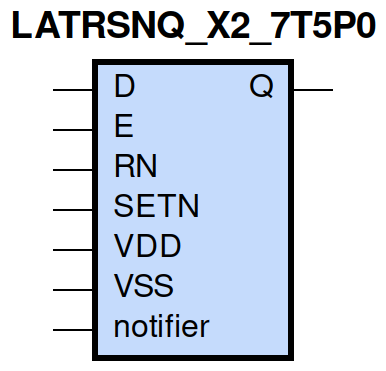
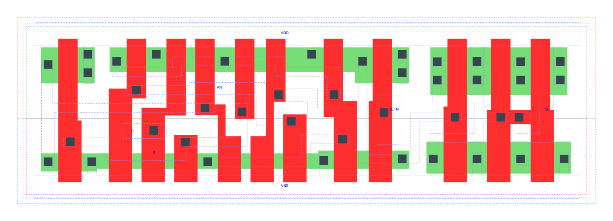

=======================================
gf180mcu_fd_sc_mcu7t5v0__latrsnq_x2
=======================================

**gf180mcu_fd_sc_mcu7t5v0__latrsnq_x2 symbol**

**gf180mcu_fd_sc_mcu7t5v0__latrsnq_x2 schematic**

.. image:: sc7_sch/LATRSNQ_X2_sch.png
    :height: 300px
    :width: 500 px
    :align: center
    :alt: gf180mcu_fd_sc_mcu7t5v0__latrsnq_x2 schematic

**gf180mcu_fd_sc_mcu7t5v0__latrsnq_x2 layout**

.. include:: images.rst

LATRSNQ_X2 is a positive D-latch, active low set/reset, 2X drive strength

|
| Attributes

============= ======================
**Attribute** **Value**
area          54.880000 µm\ :sup:`2`
============= ======================

|

TRUTH TABLE

===== ==== = = ======
Input          Output
RN    SETN D E Q
H     H    L H L
H     H    H H H
H     H    X L Q
L     H    X X L
H     L    X X H
L     L    X X H
===== ==== = = ======

|
| FUNCTIONAL SCHEMATIC
| |image431|
| CONSTRAINTS

================== =============== ============= ============
**Constraint Pin** **Related Pin** **setup(ns)** **hold(ns)**
D(HL)              E(HL)           0.4410        -0.3720
D(LH)              E(HL)           0.4750        -0.4010
RN(LH)             SETN(LH)        0.0860        -0.0000
RN(LH)             SETN(LH)        0.0860        -0.0000
SETN(LH)           RN(LH)          0.0000        0.0860
SETN(LH)           RN(LH)          0.0000        0.0860
================== =============== ============= ============

|

================== =============== ================ ===============
**Constraint Pin** **Related Pin** **recovery(ns)** **removal(ns)**
RN(LH)             E(HL)           0.4870           -0.4180
SETN(LH)           E(HL)           0.0110           0.1260
================== =============== ================ ===============

|

================== =============== ===========================
**Constraint Pin** **Related Pin** **Minimum Pulse Width(ns)**
E(LHL)             E(LH)           0.5050
E(LHL)             E(LH)           0.4370
RN(HLH)            RN(HL)          0.3290
RN(HLH)            RN(HL)          0.3290
SETN(HLH)          SETN(HL)        0.2800
SETN(HLH)          SETN(HL)        0.2800
================== =============== ===========================

|
| PIN CAPACITANCE (pf)

======= ======== ====================
**Pin** **Type** **Capacitance (pf)**
E       input    0.0074
D       input    0.0031
RN      input    0.0051
SETN    input    0.0037
======= ======== ====================

|
| DELAY AND OUTPUT TRANSITION TIME corresponding to min slew and load

+---------------+------------+--------------------+--------------+-------------------+----------------+---------------+
| **Input Pin** | **Output** | **When Condition** | **Tin (ns)** | **Out Load (pf)** | **Delay (ns)** | **Tout (ns)** |
+---------------+------------+--------------------+--------------+-------------------+----------------+---------------+
| E(LH)         | Q(LH)      | D&RN&SETN          | 0.0100       | 0.0010            | 0.6932         | 0.0316        |
+---------------+------------+--------------------+--------------+-------------------+----------------+---------------+
| E(LH)         | Q(HL)      | !D&RN&SETN         | 0.0100       | 0.0010            | 0.8052         | 0.0315        |
+---------------+------------+--------------------+--------------+-------------------+----------------+---------------+
| D(LH)         | Q(LH)      | E&RN&SETN          | 0.0100       | 0.0010            | 0.7430         | 0.0314        |
+---------------+------------+--------------------+--------------+-------------------+----------------+---------------+
| D(HL)         | Q(HL)      | E&RN&SETN          | 0.0100       | 0.0010            | 0.7625         | 0.0315        |
+---------------+------------+--------------------+--------------+-------------------+----------------+---------------+
| RN(HL)        | Q(HL)      | !D&!E&SETN         | 0.0100       | 0.0010            | 0.6141         | 0.0312        |
+---------------+------------+--------------------+--------------+-------------------+----------------+---------------+
| RN(HL)        | Q(HL)      | D&!E&SETN          | 0.0100       | 0.0010            | 0.6143         | 0.0312        |
+---------------+------------+--------------------+--------------+-------------------+----------------+---------------+
| RN(HL)        | Q(HL)      | D&E&SETN           | 0.0100       | 0.0010            | 0.6126         | 0.0313        |
+---------------+------------+--------------------+--------------+-------------------+----------------+---------------+
| RN(LH)        | Q(LH)      | D&E&SETN           | 0.0100       | 0.0010            | 0.7547         | 0.0316        |
+---------------+------------+--------------------+--------------+-------------------+----------------+---------------+
| SETN(LH)      | Q(HL)      | !D&!E&!RN          | 0.0100       | 0.0010            | 0.3781         | 0.0310        |
+---------------+------------+--------------------+--------------+-------------------+----------------+---------------+
| SETN(LH)      | Q(HL)      | !D&E&!RN           | 0.0100       | 0.0010            | 0.3843         | 0.0312        |
+---------------+------------+--------------------+--------------+-------------------+----------------+---------------+
| SETN(LH)      | Q(HL)      | !D&E&RN            | 0.0100       | 0.0010            | 0.3860         | 0.0312        |
+---------------+------------+--------------------+--------------+-------------------+----------------+---------------+
| SETN(LH)      | Q(HL)      | D&!E&!RN           | 0.0100       | 0.0010            | 0.3781         | 0.0310        |
+---------------+------------+--------------------+--------------+-------------------+----------------+---------------+
| SETN(LH)      | Q(HL)      | D&E&!RN            | 0.0100       | 0.0010            | 0.3842         | 0.0312        |
+---------------+------------+--------------------+--------------+-------------------+----------------+---------------+
| SETN(HL)      | Q(LH)      | !D&!E&RN           | 0.0100       | 0.0010            | 0.3101         | 0.0297        |
+---------------+------------+--------------------+--------------+-------------------+----------------+---------------+
| SETN(HL)      | Q(LH)      | D&!E&RN            | 0.0100       | 0.0010            | 0.3102         | 0.0297        |
+---------------+------------+--------------------+--------------+-------------------+----------------+---------------+
| SETN(HL)      | Q(LH)      | !D&!E&!RN          | 0.0100       | 0.0010            | 0.3060         | 0.0294        |
+---------------+------------+--------------------+--------------+-------------------+----------------+---------------+
| SETN(HL)      | Q(LH)      | !D&E&!RN           | 0.0100       | 0.0010            | 0.3076         | 0.0296        |
+---------------+------------+--------------------+--------------+-------------------+----------------+---------------+
| SETN(HL)      | Q(LH)      | !D&E&RN            | 0.0100       | 0.0010            | 0.3105         | 0.0298        |
+---------------+------------+--------------------+--------------+-------------------+----------------+---------------+
| SETN(HL)      | Q(LH)      | D&!E&!RN           | 0.0100       | 0.0010            | 0.3060         | 0.0294        |
+---------------+------------+--------------------+--------------+-------------------+----------------+---------------+
| SETN(HL)      | Q(LH)      | D&E&!RN            | 0.0100       | 0.0010            | 0.3075         | 0.0296        |
+---------------+------------+--------------------+--------------+-------------------+----------------+---------------+

|
| DYNAMIC ENERGY

+---------------+--------------------+--------------+------------+-------------------+---------------------+
| **Input Pin** | **When Condition** | **Tin (ns)** | **Output** | **Out Load (pf)** | **Energy (uW/MHz)** |
+---------------+--------------------+--------------+------------+-------------------+---------------------+
| SETN          | !D&!E&!RN          | 0.0100       | Q(HL)      | 0.0010            | 0.3797              |
+---------------+--------------------+--------------+------------+-------------------+---------------------+
| SETN          | !D&E&!RN           | 0.0100       | Q(HL)      | 0.0010            | 0.3895              |
+---------------+--------------------+--------------+------------+-------------------+---------------------+
| SETN          | !D&E&RN            | 0.0100       | Q(HL)      | 0.0010            | 0.3796              |
+---------------+--------------------+--------------+------------+-------------------+---------------------+
| SETN          | D&!E&!RN           | 0.0100       | Q(HL)      | 0.0010            | 0.3796              |
+---------------+--------------------+--------------+------------+-------------------+---------------------+
| SETN          | D&E&!RN            | 0.0100       | Q(HL)      | 0.0010            | 0.3896              |
+---------------+--------------------+--------------+------------+-------------------+---------------------+
| SETN          | !D&!E&RN           | 0.0100       | Q(LH)      | 0.0010            | 0.5330              |
+---------------+--------------------+--------------+------------+-------------------+---------------------+
| SETN          | D&!E&RN            | 0.0100       | Q(LH)      | 0.0010            | 0.5331              |
+---------------+--------------------+--------------+------------+-------------------+---------------------+
| SETN          | !D&!E&!RN          | 0.0100       | Q(LH)      | 0.0010            | 0.4388              |
+---------------+--------------------+--------------+------------+-------------------+---------------------+
| SETN          | !D&E&!RN           | 0.0100       | Q(LH)      | 0.0010            | 0.4395              |
+---------------+--------------------+--------------+------------+-------------------+---------------------+
| SETN          | !D&E&RN            | 0.0100       | Q(LH)      | 0.0010            | 0.4464              |
+---------------+--------------------+--------------+------------+-------------------+---------------------+
| SETN          | D&!E&!RN           | 0.0100       | Q(LH)      | 0.0010            | 0.4388              |
+---------------+--------------------+--------------+------------+-------------------+---------------------+
| SETN          | D&E&!RN            | 0.0100       | Q(LH)      | 0.0010            | 0.4395              |
+---------------+--------------------+--------------+------------+-------------------+---------------------+
| E             | D&RN&SETN          | 0.0100       | Q(LH)      | 0.0010            | 0.5359              |
+---------------+--------------------+--------------+------------+-------------------+---------------------+
| RN            | !D&!E&SETN         | 0.0100       | Q(HL)      | 0.0010            | 0.6135              |
+---------------+--------------------+--------------+------------+-------------------+---------------------+
| RN            | D&!E&SETN          | 0.0100       | Q(HL)      | 0.0010            | 0.6151              |
+---------------+--------------------+--------------+------------+-------------------+---------------------+
| RN            | D&E&SETN           | 0.0100       | Q(HL)      | 0.0010            | 0.6484              |
+---------------+--------------------+--------------+------------+-------------------+---------------------+
| E             | !D&RN&SETN         | 0.0100       | Q(HL)      | 0.0010            | 0.6060              |
+---------------+--------------------+--------------+------------+-------------------+---------------------+
| RN            | D&E&SETN           | 0.0100       | Q(LH)      | 0.0010            | 0.5326              |
+---------------+--------------------+--------------+------------+-------------------+---------------------+
| D             | E&RN&SETN          | 0.0100       | Q(LH)      | 0.0010            | 0.5316              |
+---------------+--------------------+--------------+------------+-------------------+---------------------+
| D             | E&RN&SETN          | 0.0100       | Q(HL)      | 0.0010            | 0.6306              |
+---------------+--------------------+--------------+------------+-------------------+---------------------+
| SETN(HL)      | !D&!E&RN           | 0.0100       | n/a        | n/a               | 0.0322              |
+---------------+--------------------+--------------+------------+-------------------+---------------------+
| SETN(HL)      | D&!E&RN            | 0.0100       | n/a        | n/a               | 0.0322              |
+---------------+--------------------+--------------+------------+-------------------+---------------------+
| SETN(HL)      | D&E&RN             | 0.0100       | n/a        | n/a               | 0.0322              |
+---------------+--------------------+--------------+------------+-------------------+---------------------+
| D(HL)         | !E&!RN&!SETN       | 0.0100       | n/a        | n/a               | 0.0264              |
+---------------+--------------------+--------------+------------+-------------------+---------------------+
| D(HL)         | !E&RN&!SETN        | 0.0100       | n/a        | n/a               | 0.0201              |
+---------------+--------------------+--------------+------------+-------------------+---------------------+
| D(HL)         | E&!RN&!SETN        | 0.0100       | n/a        | n/a               | 0.0222              |
+---------------+--------------------+--------------+------------+-------------------+---------------------+
| D(HL)         | E&RN&!SETN         | 0.0100       | n/a        | n/a               | 0.1977              |
+---------------+--------------------+--------------+------------+-------------------+---------------------+
| D(HL)         | !E&!RN&SETN        | 0.0100       | n/a        | n/a               | 0.0264              |
+---------------+--------------------+--------------+------------+-------------------+---------------------+
| D(HL)         | E&!RN&SETN         | 0.0100       | n/a        | n/a               | 0.0222              |
+---------------+--------------------+--------------+------------+-------------------+---------------------+
| D(HL)         | !E&RN&SETN         | 0.0100       | n/a        | n/a               | 0.0217              |
+---------------+--------------------+--------------+------------+-------------------+---------------------+
| E(LH)         | !D&!RN&!SETN       | 0.0100       | n/a        | n/a               | 0.0082              |
+---------------+--------------------+--------------+------------+-------------------+---------------------+
| E(LH)         | !D&RN&!SETN        | 0.0100       | n/a        | n/a               | 0.1695              |
+---------------+--------------------+--------------+------------+-------------------+---------------------+
| E(LH)         | D&!RN&!SETN        | 0.0100       | n/a        | n/a               | 0.0280              |
+---------------+--------------------+--------------+------------+-------------------+---------------------+
| E(LH)         | D&RN&!SETN         | 0.0100       | n/a        | n/a               | 0.0055              |
+---------------+--------------------+--------------+------------+-------------------+---------------------+
| E(LH)         | !D&!RN&SETN        | 0.0100       | n/a        | n/a               | 0.0072              |
+---------------+--------------------+--------------+------------+-------------------+---------------------+
| E(LH)         | D&!RN&SETN         | 0.0100       | n/a        | n/a               | 0.0269              |
+---------------+--------------------+--------------+------------+-------------------+---------------------+
| E(LH)         | !D&RN&SETN         | 0.0100       | n/a        | n/a               | 0.0000              |
+---------------+--------------------+--------------+------------+-------------------+---------------------+
| E(LH)         | D&RN&SETN          | 0.0100       | n/a        | n/a               | -0.0004             |
+---------------+--------------------+--------------+------------+-------------------+---------------------+
| D(LH)         | !E&!RN&!SETN       | 0.0100       | n/a        | n/a               | -0.0198             |
+---------------+--------------------+--------------+------------+-------------------+---------------------+
| D(LH)         | !E&RN&!SETN        | 0.0100       | n/a        | n/a               | -0.0173             |
+---------------+--------------------+--------------+------------+-------------------+---------------------+
| D(LH)         | E&!RN&!SETN        | 0.0100       | n/a        | n/a               | -0.0159             |
+---------------+--------------------+--------------+------------+-------------------+---------------------+
| D(LH)         | E&RN&!SETN         | 0.0100       | n/a        | n/a               | 0.0459              |
+---------------+--------------------+--------------+------------+-------------------+---------------------+
| D(LH)         | !E&!RN&SETN        | 0.0100       | n/a        | n/a               | -0.0198             |
+---------------+--------------------+--------------+------------+-------------------+---------------------+
| D(LH)         | E&!RN&SETN         | 0.0100       | n/a        | n/a               | -0.0159             |
+---------------+--------------------+--------------+------------+-------------------+---------------------+
| D(LH)         | !E&RN&SETN         | 0.0100       | n/a        | n/a               | -0.0198             |
+---------------+--------------------+--------------+------------+-------------------+---------------------+
| RN(HL)        | !D&!E&!SETN        | 0.0100       | n/a        | n/a               | 0.1873              |
+---------------+--------------------+--------------+------------+-------------------+---------------------+
| RN(HL)        | !D&E&!SETN         | 0.0100       | n/a        | n/a               | 0.0245              |
+---------------+--------------------+--------------+------------+-------------------+---------------------+
| RN(HL)        | D&!E&!SETN         | 0.0100       | n/a        | n/a               | 0.1890              |
+---------------+--------------------+--------------+------------+-------------------+---------------------+
| RN(HL)        | D&E&!SETN          | 0.0100       | n/a        | n/a               | 0.2180              |
+---------------+--------------------+--------------+------------+-------------------+---------------------+
| RN(HL)        | !D&!E&SETN         | 0.0100       | n/a        | n/a               | 0.0219              |
+---------------+--------------------+--------------+------------+-------------------+---------------------+
| RN(HL)        | D&!E&SETN          | 0.0100       | n/a        | n/a               | 0.0238              |
+---------------+--------------------+--------------+------------+-------------------+---------------------+
| RN(HL)        | !D&E&SETN          | 0.0100       | n/a        | n/a               | 0.0218              |
+---------------+--------------------+--------------+------------+-------------------+---------------------+
| RN(LH)        | !D&!E&!SETN        | 0.0100       | n/a        | n/a               | 0.0760              |
+---------------+--------------------+--------------+------------+-------------------+---------------------+
| RN(LH)        | !D&E&!SETN         | 0.0100       | n/a        | n/a               | -0.0201             |
+---------------+--------------------+--------------+------------+-------------------+---------------------+
| RN(LH)        | D&!E&!SETN         | 0.0100       | n/a        | n/a               | 0.0760              |
+---------------+--------------------+--------------+------------+-------------------+---------------------+
| RN(LH)        | D&E&!SETN          | 0.0100       | n/a        | n/a               | 0.0469              |
+---------------+--------------------+--------------+------------+-------------------+---------------------+
| RN(LH)        | !D&!E&SETN         | 0.0100       | n/a        | n/a               | -0.0202             |
+---------------+--------------------+--------------+------------+-------------------+---------------------+
| RN(LH)        | !D&E&SETN          | 0.0100       | n/a        | n/a               | -0.0202             |
+---------------+--------------------+--------------+------------+-------------------+---------------------+
| RN(LH)        | D&!E&SETN          | 0.0100       | n/a        | n/a               | -0.0202             |
+---------------+--------------------+--------------+------------+-------------------+---------------------+
| SETN(LH)      | !D&!E&RN           | 0.0100       | n/a        | n/a               | -0.0230             |
+---------------+--------------------+--------------+------------+-------------------+---------------------+
| SETN(LH)      | D&!E&RN            | 0.0100       | n/a        | n/a               | -0.0231             |
+---------------+--------------------+--------------+------------+-------------------+---------------------+
| SETN(LH)      | D&E&RN             | 0.0100       | n/a        | n/a               | -0.0231             |
+---------------+--------------------+--------------+------------+-------------------+---------------------+
| E(HL)         | !D&!RN&!SETN       | 0.0100       | n/a        | n/a               | 0.1574              |
+---------------+--------------------+--------------+------------+-------------------+---------------------+
| E(HL)         | !D&RN&!SETN        | 0.0100       | n/a        | n/a               | 0.2160              |
+---------------+--------------------+--------------+------------+-------------------+---------------------+
| E(HL)         | D&!RN&!SETN        | 0.0100       | n/a        | n/a               | 0.1578              |
+---------------+--------------------+--------------+------------+-------------------+---------------------+
| E(HL)         | D&RN&!SETN         | 0.0100       | n/a        | n/a               | 0.1493              |
+---------------+--------------------+--------------+------------+-------------------+---------------------+
| E(HL)         | D&RN&SETN          | 0.0100       | n/a        | n/a               | 0.1492              |
+---------------+--------------------+--------------+------------+-------------------+---------------------+
| E(HL)         | !D&!RN&SETN        | 0.0100       | n/a        | n/a               | 0.1494              |
+---------------+--------------------+--------------+------------+-------------------+---------------------+
| E(HL)         | !D&RN&SETN         | 0.0100       | n/a        | n/a               | 0.1493              |
+---------------+--------------------+--------------+------------+-------------------+---------------------+
| E(HL)         | D&!RN&SETN         | 0.0100       | n/a        | n/a               | 0.1498              |
+---------------+--------------------+--------------+------------+-------------------+---------------------+

|
| LEAKAGE POWER

================== ==============
**When Condition** **Power (nW)**
!D&!E&!RN&!SETN    0.3108
!D&!E&RN&!SETN     0.2928
!D&E&!RN&!SETN     0.2710
!D&E&RN&!SETN      0.2726
D&!E&!RN&!SETN     0.3110
D&!E&RN&!SETN      0.2928
D&E&!RN&!SETN      0.3115
D&E&RN&!SETN       0.2934
D&E&RN&SETN        0.3340
!D&!E&!RN&SETN     0.2980
!D&E&!RN&SETN      0.2986
!D&E&RN&SETN       0.2994
D&!E&!RN&SETN      0.2982
D&E&!RN&SETN       0.3391
!D&!E&RN&SETN      0.3244
D&!E&RN&SETN       0.3765
================== ==============

