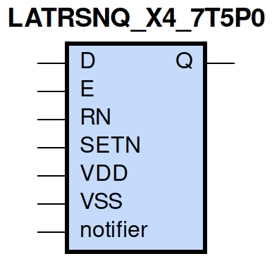
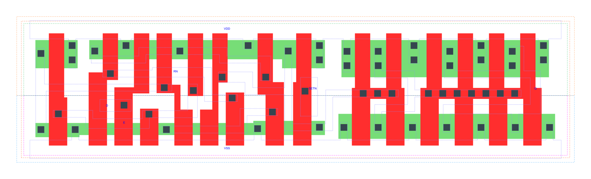

=======================================
gf180mcu_fd_sc_mcu7t5v0__latrsnq_x4
=======================================

**gf180mcu_fd_sc_mcu7t5v0__latrsnq_x4 symbol**

**gf180mcu_fd_sc_mcu7t5v0__latrsnq_x4 schematic**

.. image:: sc7_sch/LATRSNQ_X4_sch.png
    :height: 300px
    :width: 500 px
    :align: center
    :alt: gf180mcu_fd_sc_mcu7t5v0__latrsnq_x4 schematic

**gf180mcu_fd_sc_mcu7t5v0__latrsnq_x4 layout**

.. include:: images.rst

LATRSNQ_X4 is a positive D-latch, active low set/reset, 4X drive strength

|
| Attributes

============= ======================
**Attribute** **Value**
area          68.051200 µm\ :sup:`2`
============= ======================

|

TRUTH TABLE

===== ==== = = ======
Input          Output
RN    SETN D E Q
H     H    L H L
H     H    H H H
H     H    X L Q
L     H    X X L
H     L    X X H
L     L    X X H
===== ==== = = ======

|
| FUNCTIONAL SCHEMATIC
| |image434|
| CONSTRAINTS

================== =============== ============= ============
**Constraint Pin** **Related Pin** **setup(ns)** **hold(ns)**
D(HL)              E(HL)           0.4870        -0.4060
D(LH)              E(HL)           0.5320        -0.4350
RN(LH)             SETN(LH)        0.0520        0.0460
RN(LH)             SETN(LH)        0.0520        0.0460
SETN(LH)           RN(LH)          0.0460        0.0520
SETN(LH)           RN(LH)          0.0460        0.0520
================== =============== ============= ============

|

================== =============== ================ ===============
**Constraint Pin** **Related Pin** **recovery(ns)** **removal(ns)**
RN(LH)             E(HL)           0.5440           -0.4470
SETN(LH)           E(HL)           0.0630           0.0860
================== =============== ================ ===============

|

================== =============== ===========================
**Constraint Pin** **Related Pin** **Minimum Pulse Width(ns)**
E(LHL)             E(LH)           0.5440
E(LHL)             E(LH)           0.4850
RN(HLH)            RN(HL)          0.3580
RN(HLH)            RN(HL)          0.3580
SETN(HLH)          SETN(HL)        0.3290
SETN(HLH)          SETN(HL)        0.3290
================== =============== ===========================

|
| PIN CAPACITANCE (pf)

======= ======== ====================
**Pin** **Type** **Capacitance (pf)**
E       input    0.0074
D       input    0.0031
RN      input    0.0051
SETN    input    0.0037
======= ======== ====================

|
| DELAY AND OUTPUT TRANSITION TIME corresponding to min slew and load

+---------------+------------+--------------------+--------------+-------------------+----------------+---------------+
| **Input Pin** | **Output** | **When Condition** | **Tin (ns)** | **Out Load (pf)** | **Delay (ns)** | **Tout (ns)** |
+---------------+------------+--------------------+--------------+-------------------+----------------+---------------+
| E(LH)         | Q(LH)      | D&RN&SETN          | 0.0100       | 0.0010            | 0.7580         | 0.0314        |
+---------------+------------+--------------------+--------------+-------------------+----------------+---------------+
| E(LH)         | Q(HL)      | !D&RN&SETN         | 0.0100       | 0.0010            | 0.8704         | 0.0309        |
+---------------+------------+--------------------+--------------+-------------------+----------------+---------------+
| D(LH)         | Q(LH)      | E&RN&SETN          | 0.0100       | 0.0010            | 0.8077         | 0.0314        |
+---------------+------------+--------------------+--------------+-------------------+----------------+---------------+
| D(HL)         | Q(HL)      | E&RN&SETN          | 0.0100       | 0.0010            | 0.8277         | 0.0309        |
+---------------+------------+--------------------+--------------+-------------------+----------------+---------------+
| RN(HL)        | Q(HL)      | !D&!E&SETN         | 0.0100       | 0.0010            | 0.6780         | 0.0305        |
+---------------+------------+--------------------+--------------+-------------------+----------------+---------------+
| RN(HL)        | Q(HL)      | D&!E&SETN          | 0.0100       | 0.0010            | 0.6782         | 0.0305        |
+---------------+------------+--------------------+--------------+-------------------+----------------+---------------+
| RN(HL)        | Q(HL)      | D&E&SETN           | 0.0100       | 0.0010            | 0.6757         | 0.0307        |
+---------------+------------+--------------------+--------------+-------------------+----------------+---------------+
| RN(LH)        | Q(LH)      | D&E&SETN           | 0.0100       | 0.0010            | 0.8195         | 0.0313        |
+---------------+------------+--------------------+--------------+-------------------+----------------+---------------+
| SETN(LH)      | Q(HL)      | !D&!E&!RN          | 0.0100       | 0.0010            | 0.4406         | 0.0303        |
+---------------+------------+--------------------+--------------+-------------------+----------------+---------------+
| SETN(LH)      | Q(HL)      | !D&E&!RN           | 0.0100       | 0.0010            | 0.4468         | 0.0306        |
+---------------+------------+--------------------+--------------+-------------------+----------------+---------------+
| SETN(LH)      | Q(HL)      | !D&E&RN            | 0.0100       | 0.0010            | 0.4485         | 0.0305        |
+---------------+------------+--------------------+--------------+-------------------+----------------+---------------+
| SETN(LH)      | Q(HL)      | D&!E&!RN           | 0.0100       | 0.0010            | 0.4408         | 0.0304        |
+---------------+------------+--------------------+--------------+-------------------+----------------+---------------+
| SETN(LH)      | Q(HL)      | D&E&!RN            | 0.0100       | 0.0010            | 0.4469         | 0.0305        |
+---------------+------------+--------------------+--------------+-------------------+----------------+---------------+
| SETN(HL)      | Q(LH)      | !D&!E&RN           | 0.0100       | 0.0010            | 0.3524         | 0.0288        |
+---------------+------------+--------------------+--------------+-------------------+----------------+---------------+
| SETN(HL)      | Q(LH)      | D&!E&RN            | 0.0100       | 0.0010            | 0.3525         | 0.0288        |
+---------------+------------+--------------------+--------------+-------------------+----------------+---------------+
| SETN(HL)      | Q(LH)      | !D&!E&!RN          | 0.0100       | 0.0010            | 0.3482         | 0.0288        |
+---------------+------------+--------------------+--------------+-------------------+----------------+---------------+
| SETN(HL)      | Q(LH)      | !D&E&!RN           | 0.0100       | 0.0010            | 0.3498         | 0.0289        |
+---------------+------------+--------------------+--------------+-------------------+----------------+---------------+
| SETN(HL)      | Q(LH)      | !D&E&RN            | 0.0100       | 0.0010            | 0.3527         | 0.0289        |
+---------------+------------+--------------------+--------------+-------------------+----------------+---------------+
| SETN(HL)      | Q(LH)      | D&!E&!RN           | 0.0100       | 0.0010            | 0.3484         | 0.0289        |
+---------------+------------+--------------------+--------------+-------------------+----------------+---------------+
| SETN(HL)      | Q(LH)      | D&E&!RN            | 0.0100       | 0.0010            | 0.3498         | 0.0289        |
+---------------+------------+--------------------+--------------+-------------------+----------------+---------------+

|
| DYNAMIC ENERGY

+---------------+--------------------+--------------+------------+-------------------+---------------------+
| **Input Pin** | **When Condition** | **Tin (ns)** | **Output** | **Out Load (pf)** | **Energy (uW/MHz)** |
+---------------+--------------------+--------------+------------+-------------------+---------------------+
| SETN          | !D&!E&!RN          | 0.0100       | Q(HL)      | 0.0010            | 0.7314              |
+---------------+--------------------+--------------+------------+-------------------+---------------------+
| SETN          | !D&E&!RN           | 0.0100       | Q(HL)      | 0.0010            | 0.7439              |
+---------------+--------------------+--------------+------------+-------------------+---------------------+
| SETN          | !D&E&RN            | 0.0100       | Q(HL)      | 0.0010            | 0.7335              |
+---------------+--------------------+--------------+------------+-------------------+---------------------+
| SETN          | D&!E&!RN           | 0.0100       | Q(HL)      | 0.0010            | 0.7312              |
+---------------+--------------------+--------------+------------+-------------------+---------------------+
| SETN          | D&E&!RN            | 0.0100       | Q(HL)      | 0.0010            | 0.7445              |
+---------------+--------------------+--------------+------------+-------------------+---------------------+
| SETN          | !D&!E&RN           | 0.0100       | Q(LH)      | 0.0010            | 0.8556              |
+---------------+--------------------+--------------+------------+-------------------+---------------------+
| SETN          | D&!E&RN            | 0.0100       | Q(LH)      | 0.0010            | 0.8556              |
+---------------+--------------------+--------------+------------+-------------------+---------------------+
| SETN          | !D&!E&!RN          | 0.0100       | Q(LH)      | 0.0010            | 0.7567              |
+---------------+--------------------+--------------+------------+-------------------+---------------------+
| SETN          | !D&E&!RN           | 0.0100       | Q(LH)      | 0.0010            | 0.7581              |
+---------------+--------------------+--------------+------------+-------------------+---------------------+
| SETN          | !D&E&RN            | 0.0100       | Q(LH)      | 0.0010            | 0.7662              |
+---------------+--------------------+--------------+------------+-------------------+---------------------+
| SETN          | D&!E&!RN           | 0.0100       | Q(LH)      | 0.0010            | 0.7575              |
+---------------+--------------------+--------------+------------+-------------------+---------------------+
| SETN          | D&E&!RN            | 0.0100       | Q(LH)      | 0.0010            | 0.7581              |
+---------------+--------------------+--------------+------------+-------------------+---------------------+
| E             | D&RN&SETN          | 0.0100       | Q(LH)      | 0.0010            | 0.9147              |
+---------------+--------------------+--------------+------------+-------------------+---------------------+
| RN            | !D&!E&SETN         | 0.0100       | Q(HL)      | 0.0010            | 0.9669              |
+---------------+--------------------+--------------+------------+-------------------+---------------------+
| RN            | D&!E&SETN          | 0.0100       | Q(HL)      | 0.0010            | 0.9686              |
+---------------+--------------------+--------------+------------+-------------------+---------------------+
| RN            | D&E&SETN           | 0.0100       | Q(HL)      | 0.0010            | 1.0050              |
+---------------+--------------------+--------------+------------+-------------------+---------------------+
| E             | !D&RN&SETN         | 0.0100       | Q(HL)      | 0.0010            | 0.9660              |
+---------------+--------------------+--------------+------------+-------------------+---------------------+
| RN            | D&E&SETN           | 0.0100       | Q(LH)      | 0.0010            | 0.9109              |
+---------------+--------------------+--------------+------------+-------------------+---------------------+
| D             | E&RN&SETN          | 0.0100       | Q(LH)      | 0.0010            | 0.9102              |
+---------------+--------------------+--------------+------------+-------------------+---------------------+
| D             | E&RN&SETN          | 0.0100       | Q(HL)      | 0.0010            | 0.9899              |
+---------------+--------------------+--------------+------------+-------------------+---------------------+
| SETN(HL)      | !D&!E&RN           | 0.0100       | n/a        | n/a               | 0.0322              |
+---------------+--------------------+--------------+------------+-------------------+---------------------+
| SETN(HL)      | D&!E&RN            | 0.0100       | n/a        | n/a               | 0.0322              |
+---------------+--------------------+--------------+------------+-------------------+---------------------+
| SETN(HL)      | D&E&RN             | 0.0100       | n/a        | n/a               | 0.0322              |
+---------------+--------------------+--------------+------------+-------------------+---------------------+
| D(HL)         | !E&!RN&!SETN       | 0.0100       | n/a        | n/a               | 0.0264              |
+---------------+--------------------+--------------+------------+-------------------+---------------------+
| D(HL)         | !E&RN&!SETN        | 0.0100       | n/a        | n/a               | 0.0201              |
+---------------+--------------------+--------------+------------+-------------------+---------------------+
| D(HL)         | E&!RN&!SETN        | 0.0100       | n/a        | n/a               | 0.0222              |
+---------------+--------------------+--------------+------------+-------------------+---------------------+
| D(HL)         | E&RN&!SETN         | 0.0100       | n/a        | n/a               | 0.1977              |
+---------------+--------------------+--------------+------------+-------------------+---------------------+
| D(HL)         | !E&!RN&SETN        | 0.0100       | n/a        | n/a               | 0.0264              |
+---------------+--------------------+--------------+------------+-------------------+---------------------+
| D(HL)         | E&!RN&SETN         | 0.0100       | n/a        | n/a               | 0.0222              |
+---------------+--------------------+--------------+------------+-------------------+---------------------+
| D(HL)         | !E&RN&SETN         | 0.0100       | n/a        | n/a               | 0.0217              |
+---------------+--------------------+--------------+------------+-------------------+---------------------+
| E(LH)         | !D&!RN&!SETN       | 0.0100       | n/a        | n/a               | 0.0082              |
+---------------+--------------------+--------------+------------+-------------------+---------------------+
| E(LH)         | !D&RN&!SETN        | 0.0100       | n/a        | n/a               | 0.1695              |
+---------------+--------------------+--------------+------------+-------------------+---------------------+
| E(LH)         | D&!RN&!SETN        | 0.0100       | n/a        | n/a               | 0.0279              |
+---------------+--------------------+--------------+------------+-------------------+---------------------+
| E(LH)         | D&RN&!SETN         | 0.0100       | n/a        | n/a               | 0.0055              |
+---------------+--------------------+--------------+------------+-------------------+---------------------+
| E(LH)         | !D&!RN&SETN        | 0.0100       | n/a        | n/a               | 0.0072              |
+---------------+--------------------+--------------+------------+-------------------+---------------------+
| E(LH)         | D&!RN&SETN         | 0.0100       | n/a        | n/a               | 0.0269              |
+---------------+--------------------+--------------+------------+-------------------+---------------------+
| E(LH)         | !D&RN&SETN         | 0.0100       | n/a        | n/a               | 0.0000              |
+---------------+--------------------+--------------+------------+-------------------+---------------------+
| E(LH)         | D&RN&SETN          | 0.0100       | n/a        | n/a               | -0.0005             |
+---------------+--------------------+--------------+------------+-------------------+---------------------+
| D(LH)         | !E&!RN&!SETN       | 0.0100       | n/a        | n/a               | -0.0198             |
+---------------+--------------------+--------------+------------+-------------------+---------------------+
| D(LH)         | !E&RN&!SETN        | 0.0100       | n/a        | n/a               | -0.0173             |
+---------------+--------------------+--------------+------------+-------------------+---------------------+
| D(LH)         | E&!RN&!SETN        | 0.0100       | n/a        | n/a               | -0.0159             |
+---------------+--------------------+--------------+------------+-------------------+---------------------+
| D(LH)         | E&RN&!SETN         | 0.0100       | n/a        | n/a               | 0.0459              |
+---------------+--------------------+--------------+------------+-------------------+---------------------+
| D(LH)         | !E&!RN&SETN        | 0.0100       | n/a        | n/a               | -0.0198             |
+---------------+--------------------+--------------+------------+-------------------+---------------------+
| D(LH)         | E&!RN&SETN         | 0.0100       | n/a        | n/a               | -0.0159             |
+---------------+--------------------+--------------+------------+-------------------+---------------------+
| D(LH)         | !E&RN&SETN         | 0.0100       | n/a        | n/a               | -0.0198             |
+---------------+--------------------+--------------+------------+-------------------+---------------------+
| RN(HL)        | !D&!E&!SETN        | 0.0100       | n/a        | n/a               | 0.1872              |
+---------------+--------------------+--------------+------------+-------------------+---------------------+
| RN(HL)        | !D&E&!SETN         | 0.0100       | n/a        | n/a               | 0.0245              |
+---------------+--------------------+--------------+------------+-------------------+---------------------+
| RN(HL)        | D&!E&!SETN         | 0.0100       | n/a        | n/a               | 0.1890              |
+---------------+--------------------+--------------+------------+-------------------+---------------------+
| RN(HL)        | D&E&!SETN          | 0.0100       | n/a        | n/a               | 0.2180              |
+---------------+--------------------+--------------+------------+-------------------+---------------------+
| RN(HL)        | !D&!E&SETN         | 0.0100       | n/a        | n/a               | 0.0219              |
+---------------+--------------------+--------------+------------+-------------------+---------------------+
| RN(HL)        | D&!E&SETN          | 0.0100       | n/a        | n/a               | 0.0238              |
+---------------+--------------------+--------------+------------+-------------------+---------------------+
| RN(HL)        | !D&E&SETN          | 0.0100       | n/a        | n/a               | 0.0219              |
+---------------+--------------------+--------------+------------+-------------------+---------------------+
| RN(LH)        | !D&!E&!SETN        | 0.0100       | n/a        | n/a               | 0.0760              |
+---------------+--------------------+--------------+------------+-------------------+---------------------+
| RN(LH)        | !D&E&!SETN         | 0.0100       | n/a        | n/a               | -0.0201             |
+---------------+--------------------+--------------+------------+-------------------+---------------------+
| RN(LH)        | D&!E&!SETN         | 0.0100       | n/a        | n/a               | 0.0760              |
+---------------+--------------------+--------------+------------+-------------------+---------------------+
| RN(LH)        | D&E&!SETN          | 0.0100       | n/a        | n/a               | 0.0469              |
+---------------+--------------------+--------------+------------+-------------------+---------------------+
| RN(LH)        | !D&!E&SETN         | 0.0100       | n/a        | n/a               | -0.0202             |
+---------------+--------------------+--------------+------------+-------------------+---------------------+
| RN(LH)        | !D&E&SETN          | 0.0100       | n/a        | n/a               | -0.0202             |
+---------------+--------------------+--------------+------------+-------------------+---------------------+
| RN(LH)        | D&!E&SETN          | 0.0100       | n/a        | n/a               | -0.0202             |
+---------------+--------------------+--------------+------------+-------------------+---------------------+
| SETN(LH)      | !D&!E&RN           | 0.0100       | n/a        | n/a               | -0.0231             |
+---------------+--------------------+--------------+------------+-------------------+---------------------+
| SETN(LH)      | D&!E&RN            | 0.0100       | n/a        | n/a               | -0.0230             |
+---------------+--------------------+--------------+------------+-------------------+---------------------+
| SETN(LH)      | D&E&RN             | 0.0100       | n/a        | n/a               | -0.0231             |
+---------------+--------------------+--------------+------------+-------------------+---------------------+
| E(HL)         | !D&!RN&!SETN       | 0.0100       | n/a        | n/a               | 0.1574              |
+---------------+--------------------+--------------+------------+-------------------+---------------------+
| E(HL)         | !D&RN&!SETN        | 0.0100       | n/a        | n/a               | 0.2159              |
+---------------+--------------------+--------------+------------+-------------------+---------------------+
| E(HL)         | D&!RN&!SETN        | 0.0100       | n/a        | n/a               | 0.1577              |
+---------------+--------------------+--------------+------------+-------------------+---------------------+
| E(HL)         | D&RN&!SETN         | 0.0100       | n/a        | n/a               | 0.1493              |
+---------------+--------------------+--------------+------------+-------------------+---------------------+
| E(HL)         | D&RN&SETN          | 0.0100       | n/a        | n/a               | 0.1493              |
+---------------+--------------------+--------------+------------+-------------------+---------------------+
| E(HL)         | !D&!RN&SETN        | 0.0100       | n/a        | n/a               | 0.1494              |
+---------------+--------------------+--------------+------------+-------------------+---------------------+
| E(HL)         | !D&RN&SETN         | 0.0100       | n/a        | n/a               | 0.1494              |
+---------------+--------------------+--------------+------------+-------------------+---------------------+
| E(HL)         | D&!RN&SETN         | 0.0100       | n/a        | n/a               | 0.1498              |
+---------------+--------------------+--------------+------------+-------------------+---------------------+

|
| LEAKAGE POWER

================== ==============
**When Condition** **Power (nW)**
!D&!E&!RN&!SETN    0.3882
!D&!E&RN&!SETN     0.3702
!D&E&!RN&!SETN     0.3484
!D&E&RN&!SETN      0.3500
D&!E&!RN&!SETN     0.3884
D&!E&RN&!SETN      0.3702
D&E&!RN&!SETN      0.3889
D&E&RN&!SETN       0.3708
D&E&RN&SETN        0.4114
!D&!E&!RN&SETN     0.3765
!D&E&!RN&SETN      0.3771
!D&E&RN&SETN       0.3778
D&!E&!RN&SETN      0.3767
D&E&!RN&SETN       0.4176
!D&!E&RN&SETN      0.4029
D&!E&RN&SETN       0.4539
================== ==============

