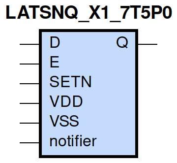
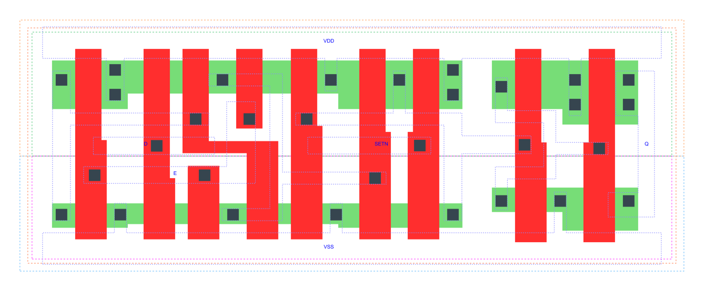

=======================================
gf180mcu_fd_sc_mcu7t5v0__latsnq_x1
=======================================

**gf180mcu_fd_sc_mcu7t5v0__latsnq_x1 symbol**

**gf180mcu_fd_sc_mcu7t5v0__latsnq_x1 schematic**

.. image:: sc7_sch/LATSNQ_X1_sch.png
    :height: 300px
    :width: 500 px
    :align: center
    :alt: gf180mcu_fd_sc_mcu7t5v0__latsnq_x1 schematic

**gf180mcu_fd_sc_mcu7t5v0__latsnq_x1 layout**

.. include:: images.rst

LATSNQ_X1 is a positive D-latch, active low set, 1X drive strength

|
| Attributes

============= ======================
**Attribute** **Value**
area          46.099200 µm\ :sup:`2`
============= ======================

|

TRUTH TABLE

===== = = ======
Input     Output
SETN  D E Q
H     L H L
H     H H H
H     X L Q
L     X X H
===== = = ======

|
| FUNCTIONAL SCHEMATIC
| |image437|
| CONSTRAINTS

================== =============== ============= ============
**Constraint Pin** **Related Pin** **setup(ns)** **hold(ns)**
D(HL)              E(HL)           0.3780        -0.3320
D(LH)              E(HL)           0.2750        -0.2230
================== =============== ============= ============

|

================== =============== ================ ===============
**Constraint Pin** **Related Pin** **recovery(ns)** **removal(ns)**
SETN(LH)           E(HL)           0.0060           0.0630
================== =============== ================ ===============

|

================== =============== ===========================
**Constraint Pin** **Related Pin** **Minimum Pulse Width(ns)**
E(LHL)             E(LH)           0.4560
E(LHL)             E(LH)           0.2410
SETN(HLH)          SETN(HL)        0.2220
SETN(HLH)          SETN(HL)        0.2220
================== =============== ===========================

|
| PIN CAPACITANCE (pf)

======= ======== ====================
**Pin** **Type** **Capacitance (pf)**
E       input    0.0071
D       input    0.0033
SETN    input    0.0040
======= ======== ====================

|
| DELAY AND OUTPUT TRANSITION TIME corresponding to min slew and load

+---------------+------------+--------------------+--------------+-------------------+----------------+---------------+
| **Input Pin** | **Output** | **When Condition** | **Tin (ns)** | **Out Load (pf)** | **Delay (ns)** | **Tout (ns)** |
+---------------+------------+--------------------+--------------+-------------------+----------------+---------------+
| E(LH)         | Q(LH)      | D&SETN             | 0.0100       | 0.0010            | 0.4876         | 0.0403        |
+---------------+------------+--------------------+--------------+-------------------+----------------+---------------+
| E(LH)         | Q(HL)      | !D&SETN            | 0.0100       | 0.0010            | 0.7183         | 0.0347        |
+---------------+------------+--------------------+--------------+-------------------+----------------+---------------+
| D(LH)         | Q(LH)      | E&SETN             | 0.0100       | 0.0010            | 0.5189         | 0.0401        |
+---------------+------------+--------------------+--------------+-------------------+----------------+---------------+
| D(HL)         | Q(HL)      | E&SETN             | 0.0100       | 0.0010            | 0.6673         | 0.0347        |
+---------------+------------+--------------------+--------------+-------------------+----------------+---------------+
| SETN(LH)      | Q(HL)      | !D&E               | 0.0100       | 0.0010            | 0.3427         | 0.0344        |
+---------------+------------+--------------------+--------------+-------------------+----------------+---------------+
| SETN(HL)      | Q(LH)      | !D&!E              | 0.0100       | 0.0010            | 0.3056         | 0.0400        |
+---------------+------------+--------------------+--------------+-------------------+----------------+---------------+
| SETN(HL)      | Q(LH)      | D&!E               | 0.0100       | 0.0010            | 0.3056         | 0.0400        |
+---------------+------------+--------------------+--------------+-------------------+----------------+---------------+
| SETN(HL)      | Q(LH)      | !D&E               | 0.0100       | 0.0010            | 0.3046         | 0.0400        |
+---------------+------------+--------------------+--------------+-------------------+----------------+---------------+

|
| DYNAMIC ENERGY

+---------------+--------------------+--------------+------------+-------------------+---------------------+
| **Input Pin** | **When Condition** | **Tin (ns)** | **Output** | **Out Load (pf)** | **Energy (uW/MHz)** |
+---------------+--------------------+--------------+------------+-------------------+---------------------+
| SETN          | !D&E               | 0.0100       | Q(HL)      | 0.0010            | 0.2277              |
+---------------+--------------------+--------------+------------+-------------------+---------------------+
| SETN          | !D&!E              | 0.0100       | Q(LH)      | 0.0010            | 0.4126              |
+---------------+--------------------+--------------+------------+-------------------+---------------------+
| SETN          | D&!E               | 0.0100       | Q(LH)      | 0.0010            | 0.4127              |
+---------------+--------------------+--------------+------------+-------------------+---------------------+
| SETN          | !D&E               | 0.0100       | Q(LH)      | 0.0010            | 0.3241              |
+---------------+--------------------+--------------+------------+-------------------+---------------------+
| E             | D&SETN             | 0.0100       | Q(LH)      | 0.0010            | 0.3772              |
+---------------+--------------------+--------------+------------+-------------------+---------------------+
| E             | !D&SETN            | 0.0100       | Q(HL)      | 0.0010            | 0.4183              |
+---------------+--------------------+--------------+------------+-------------------+---------------------+
| D             | E&SETN             | 0.0100       | Q(LH)      | 0.0010            | 0.3721              |
+---------------+--------------------+--------------+------------+-------------------+---------------------+
| D             | E&SETN             | 0.0100       | Q(HL)      | 0.0010            | 0.4388              |
+---------------+--------------------+--------------+------------+-------------------+---------------------+
| SETN(HL)      | !D&!E              | 0.0100       | n/a        | n/a               | 0.0322              |
+---------------+--------------------+--------------+------------+-------------------+---------------------+
| SETN(HL)      | D&!E               | 0.0100       | n/a        | n/a               | 0.0323              |
+---------------+--------------------+--------------+------------+-------------------+---------------------+
| SETN(HL)      | D&E                | 0.0100       | n/a        | n/a               | 0.0322              |
+---------------+--------------------+--------------+------------+-------------------+---------------------+
| D(HL)         | !E&!SETN           | 0.0100       | n/a        | n/a               | 0.0201              |
+---------------+--------------------+--------------+------------+-------------------+---------------------+
| D(HL)         | E&!SETN            | 0.0100       | n/a        | n/a               | 0.1592              |
+---------------+--------------------+--------------+------------+-------------------+---------------------+
| D(HL)         | !E&SETN            | 0.0100       | n/a        | n/a               | 0.0217              |
+---------------+--------------------+--------------+------------+-------------------+---------------------+
| E(LH)         | !D&!SETN           | 0.0100       | n/a        | n/a               | 0.1347              |
+---------------+--------------------+--------------+------------+-------------------+---------------------+
| E(LH)         | D&!SETN            | 0.0100       | n/a        | n/a               | 0.0054              |
+---------------+--------------------+--------------+------------+-------------------+---------------------+
| E(LH)         | !D&SETN            | 0.0100       | n/a        | n/a               | 0.0000              |
+---------------+--------------------+--------------+------------+-------------------+---------------------+
| E(LH)         | D&SETN             | 0.0100       | n/a        | n/a               | -0.0005             |
+---------------+--------------------+--------------+------------+-------------------+---------------------+
| D(LH)         | !E&!SETN           | 0.0100       | n/a        | n/a               | -0.0173             |
+---------------+--------------------+--------------+------------+-------------------+---------------------+
| D(LH)         | E&!SETN            | 0.0100       | n/a        | n/a               | 0.0431              |
+---------------+--------------------+--------------+------------+-------------------+---------------------+
| D(LH)         | !E&SETN            | 0.0100       | n/a        | n/a               | -0.0198             |
+---------------+--------------------+--------------+------------+-------------------+---------------------+
| SETN(LH)      | !D&!E              | 0.0100       | n/a        | n/a               | -0.0230             |
+---------------+--------------------+--------------+------------+-------------------+---------------------+
| SETN(LH)      | D&!E               | 0.0100       | n/a        | n/a               | -0.0229             |
+---------------+--------------------+--------------+------------+-------------------+---------------------+
| SETN(LH)      | D&E                | 0.0100       | n/a        | n/a               | -0.0229             |
+---------------+--------------------+--------------+------------+-------------------+---------------------+
| E(HL)         | !D&!SETN           | 0.0100       | n/a        | n/a               | 0.2145              |
+---------------+--------------------+--------------+------------+-------------------+---------------------+
| E(HL)         | D&!SETN            | 0.0100       | n/a        | n/a               | 0.1497              |
+---------------+--------------------+--------------+------------+-------------------+---------------------+
| E(HL)         | D&SETN             | 0.0100       | n/a        | n/a               | 0.1497              |
+---------------+--------------------+--------------+------------+-------------------+---------------------+
| E(HL)         | !D&SETN            | 0.0100       | n/a        | n/a               | 0.1473              |
+---------------+--------------------+--------------+------------+-------------------+---------------------+

|
| LEAKAGE POWER

================== ==============
**When Condition** **Power (nW)**
!D&!E&!SETN        0.2410
!D&E&!SETN         0.2470
D&!E&!SETN         0.2410
D&E&!SETN          0.2416
D&E&SETN           0.2823
!D&!E&SETN         0.2992
D&!E&SETN          0.3393
!D&E&SETN          0.2734
================== ==============

