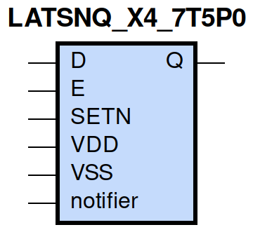
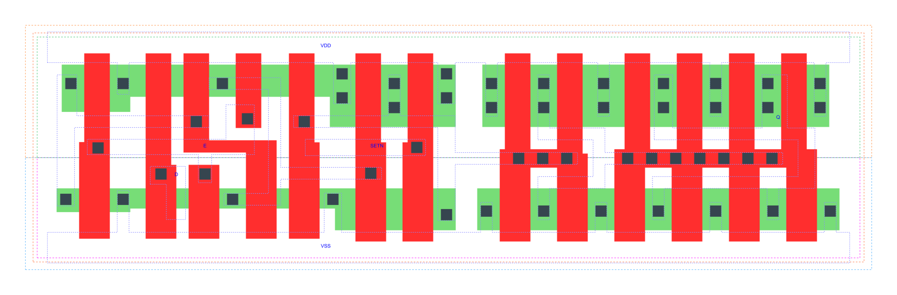

=======================================
gf180mcu_fd_sc_mcu7t5v0__latsnq_x4
=======================================

**gf180mcu_fd_sc_mcu7t5v0__latsnq_x4 symbol**

**gf180mcu_fd_sc_mcu7t5v0__latsnq_x4 schematic**

.. image:: sc7_sch/LATSNQ_X4_sch.png
    :height: 300px
    :width: 500 px
    :align: center
    :alt: gf180mcu_fd_sc_mcu7t5v0__latsnq_x4 schematic

**gf180mcu_fd_sc_mcu7t5v0__latsnq_x4 layout**

.. include:: images.rst

LATSNQ_X4 is a positive D-latch, active low set, 4X drive strength

|
| Attributes

============= ======================
**Attribute** **Value**
area          61.465600 µm\ :sup:`2`
============= ======================

|

TRUTH TABLE

===== = = ======
Input     Output
SETN  D E Q
H     L H L
H     H H H
H     X L Q
L     X X H
===== = = ======

|
| FUNCTIONAL SCHEMATIC
| |image443|
| CONSTRAINTS

================== =============== ============= ============
**Constraint Pin** **Related Pin** **setup(ns)** **hold(ns)**
D(HL)              E(HL)           0.4060        -0.3550
D(LH)              E(HL)           0.3260        -0.2580
================== =============== ============= ============

|

================== =============== ================ ===============
**Constraint Pin** **Related Pin** **recovery(ns)** **removal(ns)**
SETN(LH)           E(HL)           0.0110           0.0860
================== =============== ================ ===============

|

================== =============== ===========================
**Constraint Pin** **Related Pin** **Minimum Pulse Width(ns)**
E(LHL)             E(LH)           0.4760
E(LHL)             E(LH)           0.3000
SETN(HLH)          SETN(HL)        0.2610
SETN(HLH)          SETN(HL)        0.2610
================== =============== ===========================

|
| PIN CAPACITANCE (pf)

======= ======== ====================
**Pin** **Type** **Capacitance (pf)**
E       input    0.0071
D       input    0.0029
SETN    input    0.0053
======= ======== ====================

|
| DELAY AND OUTPUT TRANSITION TIME corresponding to min slew and load

+---------------+------------+--------------------+--------------+-------------------+----------------+---------------+
| **Input Pin** | **Output** | **When Condition** | **Tin (ns)** | **Out Load (pf)** | **Delay (ns)** | **Tout (ns)** |
+---------------+------------+--------------------+--------------+-------------------+----------------+---------------+
| E(LH)         | Q(LH)      | D&SETN             | 0.0100       | 0.0010            | 0.5196         | 0.0287        |
+---------------+------------+--------------------+--------------+-------------------+----------------+---------------+
| E(LH)         | Q(HL)      | !D&SETN            | 0.0100       | 0.0010            | 0.7396         | 0.0288        |
+---------------+------------+--------------------+--------------+-------------------+----------------+---------------+
| D(LH)         | Q(LH)      | E&SETN             | 0.0100       | 0.0010            | 0.5514         | 0.0287        |
+---------------+------------+--------------------+--------------+-------------------+----------------+---------------+
| D(HL)         | Q(HL)      | E&SETN             | 0.0100       | 0.0010            | 0.6919         | 0.0288        |
+---------------+------------+--------------------+--------------+-------------------+----------------+---------------+
| SETN(LH)      | Q(HL)      | !D&E               | 0.0100       | 0.0010            | 0.3359         | 0.0285        |
+---------------+------------+--------------------+--------------+-------------------+----------------+---------------+
| SETN(HL)      | Q(LH)      | !D&!E              | 0.0100       | 0.0010            | 0.3116         | 0.0280        |
+---------------+------------+--------------------+--------------+-------------------+----------------+---------------+
| SETN(HL)      | Q(LH)      | D&!E               | 0.0100       | 0.0010            | 0.3117         | 0.0280        |
+---------------+------------+--------------------+--------------+-------------------+----------------+---------------+
| SETN(HL)      | Q(LH)      | !D&E               | 0.0100       | 0.0010            | 0.3110         | 0.0283        |
+---------------+------------+--------------------+--------------+-------------------+----------------+---------------+

|
| DYNAMIC ENERGY

+---------------+--------------------+--------------+------------+-------------------+---------------------+
| **Input Pin** | **When Condition** | **Tin (ns)** | **Output** | **Out Load (pf)** | **Energy (uW/MHz)** |
+---------------+--------------------+--------------+------------+-------------------+---------------------+
| SETN          | !D&E               | 0.0100       | Q(HL)      | 0.0010            | 0.6727              |
+---------------+--------------------+--------------+------------+-------------------+---------------------+
| SETN          | !D&!E              | 0.0100       | Q(LH)      | 0.0010            | 0.8611              |
+---------------+--------------------+--------------+------------+-------------------+---------------------+
| SETN          | D&!E               | 0.0100       | Q(LH)      | 0.0010            | 0.8612              |
+---------------+--------------------+--------------+------------+-------------------+---------------------+
| SETN          | !D&E               | 0.0100       | Q(LH)      | 0.0010            | 0.7607              |
+---------------+--------------------+--------------+------------+-------------------+---------------------+
| E             | D&SETN             | 0.0100       | Q(LH)      | 0.0010            | 0.8479              |
+---------------+--------------------+--------------+------------+-------------------+---------------------+
| E             | !D&SETN            | 0.0100       | Q(HL)      | 0.0010            | 0.9129              |
+---------------+--------------------+--------------+------------+-------------------+---------------------+
| D             | E&SETN             | 0.0100       | Q(LH)      | 0.0010            | 0.8427              |
+---------------+--------------------+--------------+------------+-------------------+---------------------+
| D             | E&SETN             | 0.0100       | Q(HL)      | 0.0010            | 0.9327              |
+---------------+--------------------+--------------+------------+-------------------+---------------------+
| SETN(HL)      | !D&!E              | 0.0100       | n/a        | n/a               | 0.0439              |
+---------------+--------------------+--------------+------------+-------------------+---------------------+
| SETN(HL)      | D&!E               | 0.0100       | n/a        | n/a               | 0.0439              |
+---------------+--------------------+--------------+------------+-------------------+---------------------+
| SETN(HL)      | D&E                | 0.0100       | n/a        | n/a               | 0.0439              |
+---------------+--------------------+--------------+------------+-------------------+---------------------+
| D(HL)         | !E&!SETN           | 0.0100       | n/a        | n/a               | 0.0201              |
+---------------+--------------------+--------------+------------+-------------------+---------------------+
| D(HL)         | E&!SETN            | 0.0100       | n/a        | n/a               | 0.1700              |
+---------------+--------------------+--------------+------------+-------------------+---------------------+
| D(HL)         | !E&SETN            | 0.0100       | n/a        | n/a               | 0.0217              |
+---------------+--------------------+--------------+------------+-------------------+---------------------+
| E(LH)         | !D&!SETN           | 0.0100       | n/a        | n/a               | 0.1450              |
+---------------+--------------------+--------------+------------+-------------------+---------------------+
| E(LH)         | D&!SETN            | 0.0100       | n/a        | n/a               | 0.0054              |
+---------------+--------------------+--------------+------------+-------------------+---------------------+
| E(LH)         | !D&SETN            | 0.0100       | n/a        | n/a               | -0.0001             |
+---------------+--------------------+--------------+------------+-------------------+---------------------+
| E(LH)         | D&SETN             | 0.0100       | n/a        | n/a               | -0.0006             |
+---------------+--------------------+--------------+------------+-------------------+---------------------+
| D(LH)         | !E&!SETN           | 0.0100       | n/a        | n/a               | -0.0173             |
+---------------+--------------------+--------------+------------+-------------------+---------------------+
| D(LH)         | E&!SETN            | 0.0100       | n/a        | n/a               | 0.0527              |
+---------------+--------------------+--------------+------------+-------------------+---------------------+
| D(LH)         | !E&SETN            | 0.0100       | n/a        | n/a               | -0.0198             |
+---------------+--------------------+--------------+------------+-------------------+---------------------+
| SETN(LH)      | !D&!E              | 0.0100       | n/a        | n/a               | -0.0291             |
+---------------+--------------------+--------------+------------+-------------------+---------------------+
| SETN(LH)      | D&!E               | 0.0100       | n/a        | n/a               | -0.0291             |
+---------------+--------------------+--------------+------------+-------------------+---------------------+
| SETN(LH)      | D&E                | 0.0100       | n/a        | n/a               | -0.0291             |
+---------------+--------------------+--------------+------------+-------------------+---------------------+
| E(HL)         | !D&!SETN           | 0.0100       | n/a        | n/a               | 0.2207              |
+---------------+--------------------+--------------+------------+-------------------+---------------------+
| E(HL)         | D&!SETN            | 0.0100       | n/a        | n/a               | 0.1467              |
+---------------+--------------------+--------------+------------+-------------------+---------------------+
| E(HL)         | D&SETN             | 0.0100       | n/a        | n/a               | 0.1466              |
+---------------+--------------------+--------------+------------+-------------------+---------------------+
| E(HL)         | !D&SETN            | 0.0100       | n/a        | n/a               | 0.1442              |
+---------------+--------------------+--------------+------------+-------------------+---------------------+

|
| LEAKAGE POWER

================== ==============
**When Condition** **Power (nW)**
!D&!E&!SETN        0.3440
!D&E&!SETN         0.3497
D&!E&!SETN         0.3440
D&E&!SETN          0.3445
D&E&SETN           0.3847
!D&!E&SETN         0.4039
D&!E&SETN          0.4417
!D&E&SETN          0.3784
================== ==============

