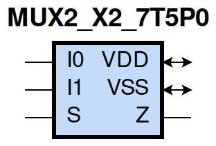
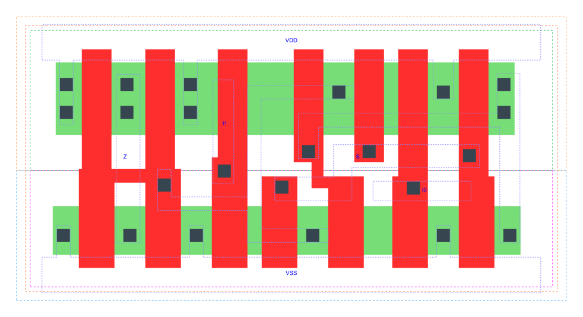

=======================================
gf180mcu_fd_sc_mcu7t5v0__mux2_x2
=======================================

**gf180mcu_fd_sc_mcu7t5v0__mux2_x2 symbol**

**gf180mcu_fd_sc_mcu7t5v0__mux2_x2 schematic**

.. image:: sc7_sch/MUX2_X2_sch.png
    :height: 300px
    :width: 500 px
    :align: center
    :alt: gf180mcu_fd_sc_mcu7t5v0__mux2_x2 schematic

**gf180mcu_fd_sc_mcu7t5v0__mux2_x2 layout**

.. include:: images.rst

MUX2_X2 is a 2-to-1 multiplexer, 2X drive strength
|
| Attributes

============= ======================
**Attribute** **Value**
area          32.928000 µm\ :sup:`2`
============= ======================

|
| OUTPUT FUNCTIONS

============== ==================
**Output Pin** **Function**
Z              ((I0&(!S))|(I1&S))
============== ==================

|
| TRUTH TABLE FOR Z

====== ====== ===== =====
**I0** **I1** **S** **Z**
1      ?      0     1
?      1      1     1
0      ?      0     0
?      0      1     0
====== ====== ===== =====

|
| FUNCTIONAL SCHEMATIC
| |image449|
| PIN CAPACITANCE (pf)

======= ======== ====================
**Pin** **Type** **Capacitance (pf)**
I1      input    0.0047
S       input    0.0101
I0      input    0.0047
======= ======== ====================

|
| DELAY AND OUTPUT TRANSITION TIME corresponding to min slew and load

+---------------+------------+--------------------+--------------+-------------------+----------------+---------------+
| **Input Pin** | **Output** | **When Condition** | **Tin (ns)** | **Out Load (pf)** | **Delay (ns)** | **Tout (ns)** |
+---------------+------------+--------------------+--------------+-------------------+----------------+---------------+
| I1(HL)        | Z(HL)      | !I0&S              | 0.0100       | 0.0010            | 0.3162         | 0.0491        |
+---------------+------------+--------------------+--------------+-------------------+----------------+---------------+
| I1(HL)        | Z(HL)      | I0&S               | 0.0100       | 0.0010            | 0.3161         | 0.0491        |
+---------------+------------+--------------------+--------------+-------------------+----------------+---------------+
| I1(LH)        | Z(LH)      | !I0&S              | 0.0100       | 0.0010            | 0.2377         | 0.0376        |
+---------------+------------+--------------------+--------------+-------------------+----------------+---------------+
| I1(LH)        | Z(LH)      | I0&S               | 0.0100       | 0.0010            | 0.2377         | 0.0376        |
+---------------+------------+--------------------+--------------+-------------------+----------------+---------------+
| S(LH)         | Z(HL)      | I0&!I1             | 0.0100       | 0.0010            | 0.3410         | 0.0491        |
+---------------+------------+--------------------+--------------+-------------------+----------------+---------------+
| S(HL)         | Z(HL)      | !I0&I1             | 0.0100       | 0.0010            | 0.2544         | 0.0482        |
+---------------+------------+--------------------+--------------+-------------------+----------------+---------------+
| S(LH)         | Z(LH)      | !I0&I1             | 0.0100       | 0.0010            | 0.2008         | 0.0372        |
+---------------+------------+--------------------+--------------+-------------------+----------------+---------------+
| S(HL)         | Z(LH)      | I0&!I1             | 0.0100       | 0.0010            | 0.3120         | 0.0373        |
+---------------+------------+--------------------+--------------+-------------------+----------------+---------------+
| I0(HL)        | Z(HL)      | !I1&!S             | 0.0100       | 0.0010            | 0.3118         | 0.0494        |
+---------------+------------+--------------------+--------------+-------------------+----------------+---------------+
| I0(HL)        | Z(HL)      | I1&!S              | 0.0100       | 0.0010            | 0.3118         | 0.0494        |
+---------------+------------+--------------------+--------------+-------------------+----------------+---------------+
| I0(LH)        | Z(LH)      | !I1&!S             | 0.0100       | 0.0010            | 0.2378         | 0.0372        |
+---------------+------------+--------------------+--------------+-------------------+----------------+---------------+
| I0(LH)        | Z(LH)      | I1&!S              | 0.0100       | 0.0010            | 0.2378         | 0.0370        |
+---------------+------------+--------------------+--------------+-------------------+----------------+---------------+

|
| DYNAMIC ENERGY

+---------------+--------------------+--------------+------------+-------------------+---------------------+
| **Input Pin** | **When Condition** | **Tin (ns)** | **Output** | **Out Load (pf)** | **Energy (uW/MHz)** |
+---------------+--------------------+--------------+------------+-------------------+---------------------+
| I0            | !I1&!S             | 0.0100       | Z(HL)      | 0.0010            | 0.4735              |
+---------------+--------------------+--------------+------------+-------------------+---------------------+
| I0            | I1&!S              | 0.0100       | Z(HL)      | 0.0010            | 0.4734              |
+---------------+--------------------+--------------+------------+-------------------+---------------------+
| S             | I0&!I1             | 0.0100       | Z(HL)      | 0.0010            | 0.4470              |
+---------------+--------------------+--------------+------------+-------------------+---------------------+
| S             | !I0&I1             | 0.0100       | Z(HL)      | 0.0010            | 0.5776              |
+---------------+--------------------+--------------+------------+-------------------+---------------------+
| I1            | !I0&S              | 0.0100       | Z(HL)      | 0.0010            | 0.4988              |
+---------------+--------------------+--------------+------------+-------------------+---------------------+
| I1            | I0&S               | 0.0100       | Z(HL)      | 0.0010            | 0.4988              |
+---------------+--------------------+--------------+------------+-------------------+---------------------+
| I0            | !I1&!S             | 0.0100       | Z(LH)      | 0.0010            | 0.2665              |
+---------------+--------------------+--------------+------------+-------------------+---------------------+
| I0            | I1&!S              | 0.0100       | Z(LH)      | 0.0010            | 0.2665              |
+---------------+--------------------+--------------+------------+-------------------+---------------------+
| S             | !I0&I1             | 0.0100       | Z(LH)      | 0.0010            | 0.2478              |
+---------------+--------------------+--------------+------------+-------------------+---------------------+
| S             | I0&!I1             | 0.0100       | Z(LH)      | 0.0010            | 0.4777              |
+---------------+--------------------+--------------+------------+-------------------+---------------------+
| I1            | !I0&S              | 0.0100       | Z(LH)      | 0.0010            | 0.2475              |
+---------------+--------------------+--------------+------------+-------------------+---------------------+
| I1            | I0&S               | 0.0100       | Z(LH)      | 0.0010            | 0.2475              |
+---------------+--------------------+--------------+------------+-------------------+---------------------+
| I0(HL)        | !I1&S              | 0.0100       | n/a        | n/a               | 0.0437              |
+---------------+--------------------+--------------+------------+-------------------+---------------------+
| I0(HL)        | I1&S               | 0.0100       | n/a        | n/a               | 0.0394              |
+---------------+--------------------+--------------+------------+-------------------+---------------------+
| S(HL)         | !I0&!I1            | 0.0100       | n/a        | n/a               | 0.2025              |
+---------------+--------------------+--------------+------------+-------------------+---------------------+
| S(HL)         | I0&I1              | 0.0100       | n/a        | n/a               | 0.1936              |
+---------------+--------------------+--------------+------------+-------------------+---------------------+
| I0(LH)        | !I1&S              | 0.0100       | n/a        | n/a               | -0.0381             |
+---------------+--------------------+--------------+------------+-------------------+---------------------+
| I0(LH)        | I1&S               | 0.0100       | n/a        | n/a               | -0.0331             |
+---------------+--------------------+--------------+------------+-------------------+---------------------+
| S(LH)         | !I0&!I1            | 0.0100       | n/a        | n/a               | 0.0122              |
+---------------+--------------------+--------------+------------+-------------------+---------------------+
| S(LH)         | I0&I1              | 0.0100       | n/a        | n/a               | 0.0190              |
+---------------+--------------------+--------------+------------+-------------------+---------------------+
| I1(LH)        | !I0&!S             | 0.0100       | n/a        | n/a               | -0.0385             |
+---------------+--------------------+--------------+------------+-------------------+---------------------+
| I1(LH)        | I0&!S              | 0.0100       | n/a        | n/a               | -0.0333             |
+---------------+--------------------+--------------+------------+-------------------+---------------------+
| I1(HL)        | !I0&!S             | 0.0100       | n/a        | n/a               | 0.0436              |
+---------------+--------------------+--------------+------------+-------------------+---------------------+
| I1(HL)        | I0&!S              | 0.0100       | n/a        | n/a               | 0.0394              |
+---------------+--------------------+--------------+------------+-------------------+---------------------+

|
| LEAKAGE POWER

================== ==============
**When Condition** **Power (nW)**
!I0&!I1&!S         0.2190
!I0&!I1&S          0.2201
!I0&I1&!S          0.2192
I0&!I1&S           0.2203
!I0&I1&S           0.2160
I0&!I1&!S          0.2150
I0&I1&!S           0.2150
I0&I1&S            0.2160
================== ==============

