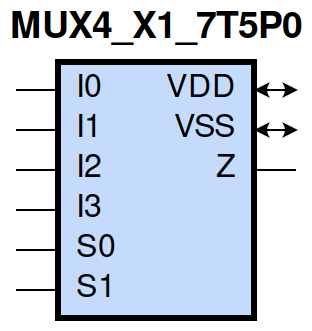
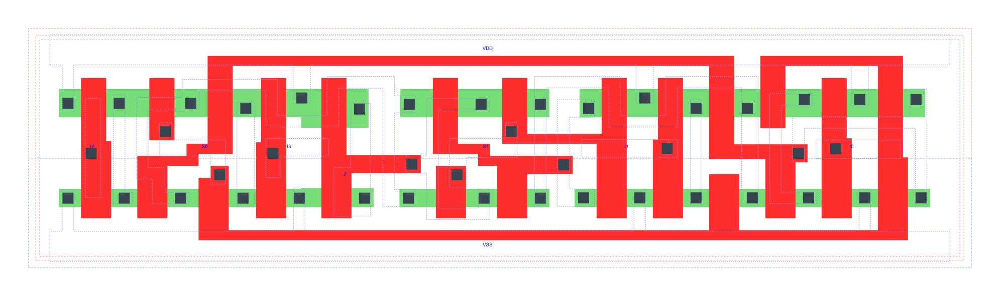

=======================================
gf180mcu_fd_sc_mcu7t5v0__mux4_x1
=======================================

**gf180mcu_fd_sc_mcu7t5v0__mux4_x1 symbol**

**gf180mcu_fd_sc_mcu7t5v0__mux4_x1 schematic**

.. image:: sc7_sch/MUX4_X1_sch.png
    :height: 300px
    :width: 500 px
    :align: center
    :alt: gf180mcu_fd_sc_mcu7t5v0__mux4_x1 schematic

**gf180mcu_fd_sc_mcu7t5v0__mux4_x1 layout**

.. include:: images.rst

MUX4_X1 is a 4-to-1 multiplexer, 1X drive strength
|
| Attributes

============= ======================
**Attribute** **Value**
area          70.246400 µm\ :sup:`2`
============= ======================

|
| OUTPUT FUNCTIONS

============== =========================================================
**Output Pin** **Function**
Z              ((I0&(!S0)&(!S1))|(I1&S0&(!S1))|(I2&(!S0)&S1)|(I3&S0&S1))
============== =========================================================

|
| TRUTH TABLE FOR Z

====== ====== ====== ====== ====== ====== =====
**I0** **I1** **I2** **I3** **S0** **S1** **Z**
1      ?      ?      ?      0      0      1
?      1      ?      ?      1      0      1
?      ?      1      ?      0      1      1
?      ?      ?      1      1      1      1
0      ?      ?      ?      0      0      0
?      0      ?      ?      1      0      0
?      ?      0      ?      0      1      0
?      ?      ?      0      1      1      0
====== ====== ====== ====== ====== ====== =====

|
| FUNCTIONAL SCHEMATIC
| |image455|
| PIN CAPACITANCE (pf)

======= ======== ====================
**Pin** **Type** **Capacitance (pf)**
I2      input    0.0028
S0      input    0.0100
I3      input    0.0028
S1      input    0.0055
I1      input    0.0029
I0      input    0.0028
======= ======== ====================

|
| DELAY AND OUTPUT TRANSITION TIME corresponding to min slew and load

+---------------+------------+---------------------+--------------+-------------------+----------------+---------------+
| **Input Pin** | **Output** | **When Condition**  | **Tin (ns)** | **Out Load (pf)** | **Delay (ns)** | **Tout (ns)** |
+---------------+------------+---------------------+--------------+-------------------+----------------+---------------+
| I2(HL)        | Z(HL)      | !I0&!I1&!I3&!S0&S1  | 0.0100       | 0.0010            | 0.4932         | 0.1021        |
+---------------+------------+---------------------+--------------+-------------------+----------------+---------------+
| I2(HL)        | Z(HL)      | !I0&!I1&I3&!S0&S1   | 0.0100       | 0.0010            | 0.4931         | 0.1025        |
+---------------+------------+---------------------+--------------+-------------------+----------------+---------------+
| I2(HL)        | Z(HL)      | !I0&I1&!I3&!S0&S1   | 0.0100       | 0.0010            | 0.4931         | 0.1020        |
+---------------+------------+---------------------+--------------+-------------------+----------------+---------------+
| I2(HL)        | Z(HL)      | !I0&I1&I3&!S0&S1    | 0.0100       | 0.0010            | 0.4931         | 0.1021        |
+---------------+------------+---------------------+--------------+-------------------+----------------+---------------+
| I2(HL)        | Z(HL)      | I0&!I1&!I3&!S0&S1   | 0.0100       | 0.0010            | 0.4931         | 0.1021        |
+---------------+------------+---------------------+--------------+-------------------+----------------+---------------+
| I2(HL)        | Z(HL)      | I0&!I1&I3&!S0&S1    | 0.0100       | 0.0010            | 0.4932         | 0.1021        |
+---------------+------------+---------------------+--------------+-------------------+----------------+---------------+
| I2(HL)        | Z(HL)      | I0&I1&!I3&!S0&S1    | 0.0100       | 0.0010            | 0.4931         | 0.1025        |
+---------------+------------+---------------------+--------------+-------------------+----------------+---------------+
| I2(HL)        | Z(HL)      | I0&I1&I3&!S0&S1     | 0.0100       | 0.0010            | 0.4932         | 0.1021        |
+---------------+------------+---------------------+--------------+-------------------+----------------+---------------+
| I2(LH)        | Z(LH)      | !I0&!I1&!I3&!S0&S1  | 0.0100       | 0.0010            | 0.4426         | 0.0755        |
+---------------+------------+---------------------+--------------+-------------------+----------------+---------------+
| I2(LH)        | Z(LH)      | !I0&!I1&I3&!S0&S1   | 0.0100       | 0.0010            | 0.4428         | 0.0757        |
+---------------+------------+---------------------+--------------+-------------------+----------------+---------------+
| I2(LH)        | Z(LH)      | !I0&I1&!I3&!S0&S1   | 0.0100       | 0.0010            | 0.4426         | 0.0756        |
+---------------+------------+---------------------+--------------+-------------------+----------------+---------------+
| I2(LH)        | Z(LH)      | !I0&I1&I3&!S0&S1    | 0.0100       | 0.0010            | 0.4428         | 0.0756        |
+---------------+------------+---------------------+--------------+-------------------+----------------+---------------+
| I2(LH)        | Z(LH)      | I0&!I1&!I3&!S0&S1   | 0.0100       | 0.0010            | 0.4427         | 0.0757        |
+---------------+------------+---------------------+--------------+-------------------+----------------+---------------+
| I2(LH)        | Z(LH)      | I0&!I1&I3&!S0&S1    | 0.0100       | 0.0010            | 0.4428         | 0.0756        |
+---------------+------------+---------------------+--------------+-------------------+----------------+---------------+
| I2(LH)        | Z(LH)      | I0&I1&!I3&!S0&S1    | 0.0100       | 0.0010            | 0.4423         | 0.0758        |
+---------------+------------+---------------------+--------------+-------------------+----------------+---------------+
| I2(LH)        | Z(LH)      | I0&I1&I3&!S0&S1     | 0.0100       | 0.0010            | 0.4423         | 0.0758        |
+---------------+------------+---------------------+--------------+-------------------+----------------+---------------+
| S0(HL)        | Z(LH)      | !I0&!I1&I2&!I3&S1   | 0.0100       | 0.0010            | 0.5514         | 0.0773        |
+---------------+------------+---------------------+--------------+-------------------+----------------+---------------+
| S0(HL)        | Z(LH)      | !I0&I1&I2&!I3&S1    | 0.0100       | 0.0010            | 0.5398         | 0.0770        |
+---------------+------------+---------------------+--------------+-------------------+----------------+---------------+
| S0(HL)        | Z(LH)      | I0&!I1&!I2&!I3&!S1  | 0.0100       | 0.0010            | 0.5409         | 0.0757        |
+---------------+------------+---------------------+--------------+-------------------+----------------+---------------+
| S0(HL)        | Z(LH)      | I0&!I1&!I2&I3&!S1   | 0.0100       | 0.0010            | 0.5296         | 0.0757        |
+---------------+------------+---------------------+--------------+-------------------+----------------+---------------+
| S0(HL)        | Z(LH)      | I0&!I1&I2&!I3&!S1   | 0.0100       | 0.0010            | 0.5488         | 0.0761        |
+---------------+------------+---------------------+--------------+-------------------+----------------+---------------+
| S0(HL)        | Z(LH)      | I0&!I1&I2&!I3&S1    | 0.0100       | 0.0010            | 0.5590         | 0.0777        |
+---------------+------------+---------------------+--------------+-------------------+----------------+---------------+
| S0(HL)        | Z(LH)      | I0&!I1&I2&I3&!S1    | 0.0100       | 0.0010            | 0.5373         | 0.0761        |
+---------------+------------+---------------------+--------------+-------------------+----------------+---------------+
| S0(HL)        | Z(LH)      | I0&I1&I2&!I3&S1     | 0.0100       | 0.0010            | 0.5480         | 0.0772        |
+---------------+------------+---------------------+--------------+-------------------+----------------+---------------+
| S0(HL)        | Z(HL)      | !I0&!I1&!I2&I3&S1   | 0.0100       | 0.0010            | 0.5153         | 0.1017        |
+---------------+------------+---------------------+--------------+-------------------+----------------+---------------+
| S0(HL)        | Z(HL)      | !I0&I1&!I2&!I3&!S1  | 0.0100       | 0.0010            | 0.5019         | 0.0998        |
+---------------+------------+---------------------+--------------+-------------------+----------------+---------------+
| S0(HL)        | Z(HL)      | !I0&I1&!I2&I3&!S1   | 0.0100       | 0.0010            | 0.4940         | 0.0993        |
+---------------+------------+---------------------+--------------+-------------------+----------------+---------------+
| S0(HL)        | Z(HL)      | !I0&I1&!I2&I3&S1    | 0.0100       | 0.0010            | 0.5073         | 0.1014        |
+---------------+------------+---------------------+--------------+-------------------+----------------+---------------+
| S0(HL)        | Z(HL)      | !I0&I1&I2&!I3&!S1   | 0.0100       | 0.0010            | 0.5073         | 0.1003        |
+---------------+------------+---------------------+--------------+-------------------+----------------+---------------+
| S0(HL)        | Z(HL)      | !I0&I1&I2&I3&!S1    | 0.0100       | 0.0010            | 0.4998         | 0.0998        |
+---------------+------------+---------------------+--------------+-------------------+----------------+---------------+
| S0(HL)        | Z(HL)      | I0&!I1&!I2&I3&S1    | 0.0100       | 0.0010            | 0.5206         | 0.1026        |
+---------------+------------+---------------------+--------------+-------------------+----------------+---------------+
| S0(HL)        | Z(HL)      | I0&I1&!I2&I3&S1     | 0.0100       | 0.0010            | 0.5131         | 0.1022        |
+---------------+------------+---------------------+--------------+-------------------+----------------+---------------+
| S0(LH)        | Z(LH)      | !I0&!I1&!I2&I3&S1   | 0.0100       | 0.0010            | 0.4069         | 0.0749        |
+---------------+------------+---------------------+--------------+-------------------+----------------+---------------+
| S0(LH)        | Z(LH)      | !I0&I1&!I2&!I3&!S1  | 0.0100       | 0.0010            | 0.3973         | 0.0735        |
+---------------+------------+---------------------+--------------+-------------------+----------------+---------------+
| S0(LH)        | Z(LH)      | !I0&I1&!I2&I3&!S1   | 0.0100       | 0.0010            | 0.3971         | 0.0735        |
+---------------+------------+---------------------+--------------+-------------------+----------------+---------------+
| S0(LH)        | Z(LH)      | !I0&I1&!I2&I3&S1    | 0.0100       | 0.0010            | 0.4064         | 0.0751        |
+---------------+------------+---------------------+--------------+-------------------+----------------+---------------+
| S0(LH)        | Z(LH)      | !I0&I1&I2&!I3&!S1   | 0.0100       | 0.0010            | 0.3973         | 0.0735        |
+---------------+------------+---------------------+--------------+-------------------+----------------+---------------+
| S0(LH)        | Z(LH)      | !I0&I1&I2&I3&!S1    | 0.0100       | 0.0010            | 0.3973         | 0.0735        |
+---------------+------------+---------------------+--------------+-------------------+----------------+---------------+
| S0(LH)        | Z(LH)      | I0&!I1&!I2&I3&S1    | 0.0100       | 0.0010            | 0.4073         | 0.0750        |
+---------------+------------+---------------------+--------------+-------------------+----------------+---------------+
| S0(LH)        | Z(LH)      | I0&I1&!I2&I3&S1     | 0.0100       | 0.0010            | 0.4069         | 0.0749        |
+---------------+------------+---------------------+--------------+-------------------+----------------+---------------+
| S0(LH)        | Z(HL)      | !I0&!I1&I2&!I3&S1   | 0.0100       | 0.0010            | 0.4738         | 0.1028        |
+---------------+------------+---------------------+--------------+-------------------+----------------+---------------+
| S0(LH)        | Z(HL)      | !I0&I1&I2&!I3&S1    | 0.0100       | 0.0010            | 0.4693         | 0.1022        |
+---------------+------------+---------------------+--------------+-------------------+----------------+---------------+
| S0(LH)        | Z(HL)      | I0&!I1&!I2&!I3&!S1  | 0.0100       | 0.0010            | 0.4621         | 0.0999        |
+---------------+------------+---------------------+--------------+-------------------+----------------+---------------+
| S0(LH)        | Z(HL)      | I0&!I1&!I2&I3&!S1   | 0.0100       | 0.0010            | 0.4575         | 0.1001        |
+---------------+------------+---------------------+--------------+-------------------+----------------+---------------+
| S0(LH)        | Z(HL)      | I0&!I1&I2&!I3&!S1   | 0.0100       | 0.0010            | 0.4633         | 0.1000        |
+---------------+------------+---------------------+--------------+-------------------+----------------+---------------+
| S0(LH)        | Z(HL)      | I0&!I1&I2&!I3&S1    | 0.0100       | 0.0010            | 0.4756         | 0.1029        |
+---------------+------------+---------------------+--------------+-------------------+----------------+---------------+
| S0(LH)        | Z(HL)      | I0&!I1&I2&I3&!S1    | 0.0100       | 0.0010            | 0.4616         | 0.0998        |
+---------------+------------+---------------------+--------------+-------------------+----------------+---------------+
| S0(LH)        | Z(HL)      | I0&I1&I2&!I3&S1     | 0.0100       | 0.0010            | 0.4738         | 0.1022        |
+---------------+------------+---------------------+--------------+-------------------+----------------+---------------+
| I3(LH)        | Z(LH)      | !I0&!I1&!I2&S0&S1   | 0.0100       | 0.0010            | 0.4361         | 0.0755        |
+---------------+------------+---------------------+--------------+-------------------+----------------+---------------+
| I3(LH)        | Z(LH)      | !I0&!I1&I2&S0&S1    | 0.0100       | 0.0010            | 0.4364         | 0.0754        |
+---------------+------------+---------------------+--------------+-------------------+----------------+---------------+
| I3(LH)        | Z(LH)      | !I0&I1&!I2&S0&S1    | 0.0100       | 0.0010            | 0.4364         | 0.0755        |
+---------------+------------+---------------------+--------------+-------------------+----------------+---------------+
| I3(LH)        | Z(LH)      | !I0&I1&I2&S0&S1     | 0.0100       | 0.0010            | 0.4361         | 0.0754        |
+---------------+------------+---------------------+--------------+-------------------+----------------+---------------+
| I3(LH)        | Z(LH)      | I0&!I1&!I2&S0&S1    | 0.0100       | 0.0010            | 0.4361         | 0.0756        |
+---------------+------------+---------------------+--------------+-------------------+----------------+---------------+
| I3(LH)        | Z(LH)      | I0&!I1&I2&S0&S1     | 0.0100       | 0.0010            | 0.4361         | 0.0755        |
+---------------+------------+---------------------+--------------+-------------------+----------------+---------------+
| I3(LH)        | Z(LH)      | I0&I1&!I2&S0&S1     | 0.0100       | 0.0010            | 0.4361         | 0.0756        |
+---------------+------------+---------------------+--------------+-------------------+----------------+---------------+
| I3(LH)        | Z(LH)      | I0&I1&I2&S0&S1      | 0.0100       | 0.0010            | 0.4361         | 0.0753        |
+---------------+------------+---------------------+--------------+-------------------+----------------+---------------+
| I3(HL)        | Z(HL)      | !I0&!I1&!I2&S0&S1   | 0.0100       | 0.0010            | 0.4914         | 0.1026        |
+---------------+------------+---------------------+--------------+-------------------+----------------+---------------+
| I3(HL)        | Z(HL)      | !I0&!I1&I2&S0&S1    | 0.0100       | 0.0010            | 0.4914         | 0.1026        |
+---------------+------------+---------------------+--------------+-------------------+----------------+---------------+
| I3(HL)        | Z(HL)      | !I0&I1&!I2&S0&S1    | 0.0100       | 0.0010            | 0.4914         | 0.1026        |
+---------------+------------+---------------------+--------------+-------------------+----------------+---------------+
| I3(HL)        | Z(HL)      | !I0&I1&I2&S0&S1     | 0.0100       | 0.0010            | 0.4914         | 0.1025        |
+---------------+------------+---------------------+--------------+-------------------+----------------+---------------+
| I3(HL)        | Z(HL)      | I0&!I1&!I2&S0&S1    | 0.0100       | 0.0010            | 0.4914         | 0.1026        |
+---------------+------------+---------------------+--------------+-------------------+----------------+---------------+
| I3(HL)        | Z(HL)      | I0&!I1&I2&S0&S1     | 0.0100       | 0.0010            | 0.4914         | 0.1026        |
+---------------+------------+---------------------+--------------+-------------------+----------------+---------------+
| I3(HL)        | Z(HL)      | I0&I1&!I2&S0&S1     | 0.0100       | 0.0010            | 0.4914         | 0.1026        |
+---------------+------------+---------------------+--------------+-------------------+----------------+---------------+
| I3(HL)        | Z(HL)      | I0&I1&I2&S0&S1      | 0.0100       | 0.0010            | 0.4914         | 0.1025        |
+---------------+------------+---------------------+--------------+-------------------+----------------+---------------+
| S1(LH)        | Z(HL)      | !I0&I1&!I2&!I3&S0   | 0.0100       | 0.0010            | 0.2595         | 0.0809        |
+---------------+------------+---------------------+--------------+-------------------+----------------+---------------+
| S1(LH)        | Z(HL)      | !I0&I1&I2&!I3&S0    | 0.0100       | 0.0010            | 0.2595         | 0.0810        |
+---------------+------------+---------------------+--------------+-------------------+----------------+---------------+
| S1(LH)        | Z(HL)      | I0&!I1&!I2&!I3&!S0  | 0.0100       | 0.0010            | 0.2597         | 0.0810        |
+---------------+------------+---------------------+--------------+-------------------+----------------+---------------+
| S1(LH)        | Z(HL)      | I0&!I1&!I2&I3&!S0   | 0.0100       | 0.0010            | 0.2597         | 0.0811        |
+---------------+------------+---------------------+--------------+-------------------+----------------+---------------+
| S1(LH)        | Z(HL)      | I0&I1&!I2&!I3&!S0   | 0.0100       | 0.0010            | 0.2597         | 0.0811        |
+---------------+------------+---------------------+--------------+-------------------+----------------+---------------+
| S1(LH)        | Z(HL)      | I0&I1&!I2&!I3&S0    | 0.0100       | 0.0010            | 0.2595         | 0.0810        |
+---------------+------------+---------------------+--------------+-------------------+----------------+---------------+
| S1(LH)        | Z(HL)      | I0&I1&!I2&I3&!S0    | 0.0100       | 0.0010            | 0.2596         | 0.0811        |
+---------------+------------+---------------------+--------------+-------------------+----------------+---------------+
| S1(LH)        | Z(HL)      | I0&I1&I2&!I3&S0     | 0.0100       | 0.0010            | 0.2595         | 0.0810        |
+---------------+------------+---------------------+--------------+-------------------+----------------+---------------+
| S1(LH)        | Z(LH)      | !I0&!I1&!I2&I3&S0   | 0.0100       | 0.0010            | 0.2269         | 0.0692        |
+---------------+------------+---------------------+--------------+-------------------+----------------+---------------+
| S1(LH)        | Z(LH)      | !I0&!I1&I2&!I3&!S0  | 0.0100       | 0.0010            | 0.2265         | 0.0690        |
+---------------+------------+---------------------+--------------+-------------------+----------------+---------------+
| S1(LH)        | Z(LH)      | !I0&!I1&I2&I3&!S0   | 0.0100       | 0.0010            | 0.2265         | 0.0690        |
+---------------+------------+---------------------+--------------+-------------------+----------------+---------------+
| S1(LH)        | Z(LH)      | !I0&!I1&I2&I3&S0    | 0.0100       | 0.0010            | 0.2269         | 0.0691        |
+---------------+------------+---------------------+--------------+-------------------+----------------+---------------+
| S1(LH)        | Z(LH)      | !I0&I1&I2&!I3&!S0   | 0.0100       | 0.0010            | 0.2265         | 0.0690        |
+---------------+------------+---------------------+--------------+-------------------+----------------+---------------+
| S1(LH)        | Z(LH)      | !I0&I1&I2&I3&!S0    | 0.0100       | 0.0010            | 0.2265         | 0.0690        |
+---------------+------------+---------------------+--------------+-------------------+----------------+---------------+
| S1(LH)        | Z(LH)      | I0&!I1&!I2&I3&S0    | 0.0100       | 0.0010            | 0.2269         | 0.0692        |
+---------------+------------+---------------------+--------------+-------------------+----------------+---------------+
| S1(LH)        | Z(LH)      | I0&!I1&I2&I3&S0     | 0.0100       | 0.0010            | 0.2269         | 0.0691        |
+---------------+------------+---------------------+--------------+-------------------+----------------+---------------+
| S1(HL)        | Z(HL)      | !I0&!I1&!I2&I3&S0   | 0.0100       | 0.0010            | 0.2761         | 0.0746        |
+---------------+------------+---------------------+--------------+-------------------+----------------+---------------+
| S1(HL)        | Z(HL)      | !I0&!I1&I2&!I3&!S0  | 0.0100       | 0.0010            | 0.2756         | 0.0744        |
+---------------+------------+---------------------+--------------+-------------------+----------------+---------------+
| S1(HL)        | Z(HL)      | !I0&!I1&I2&I3&!S0   | 0.0100       | 0.0010            | 0.2756         | 0.0744        |
+---------------+------------+---------------------+--------------+-------------------+----------------+---------------+
| S1(HL)        | Z(HL)      | !I0&!I1&I2&I3&S0    | 0.0100       | 0.0010            | 0.2761         | 0.0746        |
+---------------+------------+---------------------+--------------+-------------------+----------------+---------------+
| S1(HL)        | Z(HL)      | !I0&I1&I2&!I3&!S0   | 0.0100       | 0.0010            | 0.2756         | 0.0744        |
+---------------+------------+---------------------+--------------+-------------------+----------------+---------------+
| S1(HL)        | Z(HL)      | !I0&I1&I2&I3&!S0    | 0.0100       | 0.0010            | 0.2756         | 0.0744        |
+---------------+------------+---------------------+--------------+-------------------+----------------+---------------+
| S1(HL)        | Z(HL)      | I0&!I1&!I2&I3&S0    | 0.0100       | 0.0010            | 0.2761         | 0.0746        |
+---------------+------------+---------------------+--------------+-------------------+----------------+---------------+
| S1(HL)        | Z(HL)      | I0&!I1&I2&I3&S0     | 0.0100       | 0.0010            | 0.2761         | 0.0746        |
+---------------+------------+---------------------+--------------+-------------------+----------------+---------------+
| S1(HL)        | Z(LH)      | !I0&I1&!I2&!I3&S0   | 0.0100       | 0.0010            | 0.3226         | 0.0697        |
+---------------+------------+---------------------+--------------+-------------------+----------------+---------------+
| S1(HL)        | Z(LH)      | !I0&I1&I2&!I3&S0    | 0.0100       | 0.0010            | 0.3226         | 0.0697        |
+---------------+------------+---------------------+--------------+-------------------+----------------+---------------+
| S1(HL)        | Z(LH)      | I0&!I1&!I2&!I3&!S0  | 0.0100       | 0.0010            | 0.3222         | 0.0693        |
+---------------+------------+---------------------+--------------+-------------------+----------------+---------------+
| S1(HL)        | Z(LH)      | I0&!I1&!I2&I3&!S0   | 0.0100       | 0.0010            | 0.3222         | 0.0696        |
+---------------+------------+---------------------+--------------+-------------------+----------------+---------------+
| S1(HL)        | Z(LH)      | I0&I1&!I2&!I3&!S0   | 0.0100       | 0.0010            | 0.3222         | 0.0696        |
+---------------+------------+---------------------+--------------+-------------------+----------------+---------------+
| S1(HL)        | Z(LH)      | I0&I1&!I2&!I3&S0    | 0.0100       | 0.0010            | 0.3226         | 0.0697        |
+---------------+------------+---------------------+--------------+-------------------+----------------+---------------+
| S1(HL)        | Z(LH)      | I0&I1&!I2&I3&!S0    | 0.0100       | 0.0010            | 0.3223         | 0.0696        |
+---------------+------------+---------------------+--------------+-------------------+----------------+---------------+
| S1(HL)        | Z(LH)      | I0&I1&I2&!I3&S0     | 0.0100       | 0.0010            | 0.3226         | 0.0697        |
+---------------+------------+---------------------+--------------+-------------------+----------------+---------------+
| I1(LH)        | Z(LH)      | !I0&!I2&!I3&S0&!S1  | 0.0100       | 0.0010            | 0.4235         | 0.0739        |
+---------------+------------+---------------------+--------------+-------------------+----------------+---------------+
| I1(LH)        | Z(LH)      | !I0&!I2&I3&S0&!S1   | 0.0100       | 0.0010            | 0.4235         | 0.0739        |
+---------------+------------+---------------------+--------------+-------------------+----------------+---------------+
| I1(LH)        | Z(LH)      | !I0&I2&!I3&S0&!S1   | 0.0100       | 0.0010            | 0.4232         | 0.0741        |
+---------------+------------+---------------------+--------------+-------------------+----------------+---------------+
| I1(LH)        | Z(LH)      | !I0&I2&I3&S0&!S1    | 0.0100       | 0.0010            | 0.4232         | 0.0741        |
+---------------+------------+---------------------+--------------+-------------------+----------------+---------------+
| I1(LH)        | Z(LH)      | I0&!I2&!I3&S0&!S1   | 0.0100       | 0.0010            | 0.4235         | 0.0739        |
+---------------+------------+---------------------+--------------+-------------------+----------------+---------------+
| I1(LH)        | Z(LH)      | I0&!I2&I3&S0&!S1    | 0.0100       | 0.0010            | 0.4232         | 0.0741        |
+---------------+------------+---------------------+--------------+-------------------+----------------+---------------+
| I1(LH)        | Z(LH)      | I0&I2&!I3&S0&!S1    | 0.0100       | 0.0010            | 0.4232         | 0.0741        |
+---------------+------------+---------------------+--------------+-------------------+----------------+---------------+
| I1(LH)        | Z(LH)      | I0&I2&I3&S0&!S1     | 0.0100       | 0.0010            | 0.4233         | 0.0741        |
+---------------+------------+---------------------+--------------+-------------------+----------------+---------------+
| I1(HL)        | Z(HL)      | !I0&!I2&!I3&S0&!S1  | 0.0100       | 0.0010            | 0.4735         | 0.0997        |
+---------------+------------+---------------------+--------------+-------------------+----------------+---------------+
| I1(HL)        | Z(HL)      | !I0&!I2&I3&S0&!S1   | 0.0100       | 0.0010            | 0.4735         | 0.0997        |
+---------------+------------+---------------------+--------------+-------------------+----------------+---------------+
| I1(HL)        | Z(HL)      | !I0&I2&!I3&S0&!S1   | 0.0100       | 0.0010            | 0.4735         | 0.0997        |
+---------------+------------+---------------------+--------------+-------------------+----------------+---------------+
| I1(HL)        | Z(HL)      | !I0&I2&I3&S0&!S1    | 0.0100       | 0.0010            | 0.4735         | 0.0997        |
+---------------+------------+---------------------+--------------+-------------------+----------------+---------------+
| I1(HL)        | Z(HL)      | I0&!I2&!I3&S0&!S1   | 0.0100       | 0.0010            | 0.4735         | 0.0997        |
+---------------+------------+---------------------+--------------+-------------------+----------------+---------------+
| I1(HL)        | Z(HL)      | I0&!I2&I3&S0&!S1    | 0.0100       | 0.0010            | 0.4735         | 0.0997        |
+---------------+------------+---------------------+--------------+-------------------+----------------+---------------+
| I1(HL)        | Z(HL)      | I0&I2&!I3&S0&!S1    | 0.0100       | 0.0010            | 0.4735         | 0.0997        |
+---------------+------------+---------------------+--------------+-------------------+----------------+---------------+
| I1(HL)        | Z(HL)      | I0&I2&I3&S0&!S1     | 0.0100       | 0.0010            | 0.4735         | 0.0997        |
+---------------+------------+---------------------+--------------+-------------------+----------------+---------------+
| I0(LH)        | Z(LH)      | !I1&!I2&!I3&!S0&!S1 | 0.0100       | 0.0010            | 0.4328         | 0.0741        |
+---------------+------------+---------------------+--------------+-------------------+----------------+---------------+
| I0(LH)        | Z(LH)      | !I1&!I2&I3&!S0&!S1  | 0.0100       | 0.0010            | 0.4328         | 0.0741        |
+---------------+------------+---------------------+--------------+-------------------+----------------+---------------+
| I0(LH)        | Z(LH)      | !I1&I2&!I3&!S0&!S1  | 0.0100       | 0.0010            | 0.4328         | 0.0742        |
+---------------+------------+---------------------+--------------+-------------------+----------------+---------------+
| I0(LH)        | Z(LH)      | !I1&I2&I3&!S0&!S1   | 0.0100       | 0.0010            | 0.4325         | 0.0743        |
+---------------+------------+---------------------+--------------+-------------------+----------------+---------------+
| I0(LH)        | Z(LH)      | I1&!I2&!I3&!S0&!S1  | 0.0100       | 0.0010            | 0.4328         | 0.0741        |
+---------------+------------+---------------------+--------------+-------------------+----------------+---------------+
| I0(LH)        | Z(LH)      | I1&!I2&I3&!S0&!S1   | 0.0100       | 0.0010            | 0.4325         | 0.0744        |
+---------------+------------+---------------------+--------------+-------------------+----------------+---------------+
| I0(LH)        | Z(LH)      | I1&I2&!I3&!S0&!S1   | 0.0100       | 0.0010            | 0.4325         | 0.0744        |
+---------------+------------+---------------------+--------------+-------------------+----------------+---------------+
| I0(LH)        | Z(LH)      | I1&I2&I3&!S0&!S1    | 0.0100       | 0.0010            | 0.4326         | 0.0745        |
+---------------+------------+---------------------+--------------+-------------------+----------------+---------------+
| I0(HL)        | Z(HL)      | !I1&!I2&!I3&!S0&!S1 | 0.0100       | 0.0010            | 0.4804         | 0.1001        |
+---------------+------------+---------------------+--------------+-------------------+----------------+---------------+
| I0(HL)        | Z(HL)      | !I1&!I2&I3&!S0&!S1  | 0.0100       | 0.0010            | 0.4804         | 0.1001        |
+---------------+------------+---------------------+--------------+-------------------+----------------+---------------+
| I0(HL)        | Z(HL)      | !I1&I2&!I3&!S0&!S1  | 0.0100       | 0.0010            | 0.4804         | 0.1000        |
+---------------+------------+---------------------+--------------+-------------------+----------------+---------------+
| I0(HL)        | Z(HL)      | !I1&I2&I3&!S0&!S1   | 0.0100       | 0.0010            | 0.4804         | 0.1001        |
+---------------+------------+---------------------+--------------+-------------------+----------------+---------------+
| I0(HL)        | Z(HL)      | I1&!I2&!I3&!S0&!S1  | 0.0100       | 0.0010            | 0.4804         | 0.1001        |
+---------------+------------+---------------------+--------------+-------------------+----------------+---------------+
| I0(HL)        | Z(HL)      | I1&!I2&I3&!S0&!S1   | 0.0100       | 0.0010            | 0.4804         | 0.1001        |
+---------------+------------+---------------------+--------------+-------------------+----------------+---------------+
| I0(HL)        | Z(HL)      | I1&I2&!I3&!S0&!S1   | 0.0100       | 0.0010            | 0.4804         | 0.1001        |
+---------------+------------+---------------------+--------------+-------------------+----------------+---------------+
| I0(HL)        | Z(HL)      | I1&I2&I3&!S0&!S1    | 0.0100       | 0.0010            | 0.4804         | 0.1001        |
+---------------+------------+---------------------+--------------+-------------------+----------------+---------------+

|
| DYNAMIC ENERGY

+---------------+---------------------+--------------+------------+-------------------+---------------------+
| **Input Pin** | **When Condition**  | **Tin (ns)** | **Output** | **Out Load (pf)** | **Energy (uW/MHz)** |
+---------------+---------------------+--------------+------------+-------------------+---------------------+
| S1            | !I0&I1&!I2&!I3&S0   | 0.0100       | Z(HL)      | 0.0010            | 0.1964              |
+---------------+---------------------+--------------+------------+-------------------+---------------------+
| S1            | !I0&I1&I2&!I3&S0    | 0.0100       | Z(HL)      | 0.0010            | 0.1964              |
+---------------+---------------------+--------------+------------+-------------------+---------------------+
| S1            | I0&!I1&!I2&!I3&!S0  | 0.0100       | Z(HL)      | 0.0010            | 0.1966              |
+---------------+---------------------+--------------+------------+-------------------+---------------------+
| S1            | I0&!I1&!I2&I3&!S0   | 0.0100       | Z(HL)      | 0.0010            | 0.1966              |
+---------------+---------------------+--------------+------------+-------------------+---------------------+
| S1            | I0&I1&!I2&!I3&!S0   | 0.0100       | Z(HL)      | 0.0010            | 0.1966              |
+---------------+---------------------+--------------+------------+-------------------+---------------------+
| S1            | I0&I1&!I2&!I3&S0    | 0.0100       | Z(HL)      | 0.0010            | 0.1964              |
+---------------+---------------------+--------------+------------+-------------------+---------------------+
| S1            | I0&I1&!I2&I3&!S0    | 0.0100       | Z(HL)      | 0.0010            | 0.1966              |
+---------------+---------------------+--------------+------------+-------------------+---------------------+
| S1            | I0&I1&I2&!I3&S0     | 0.0100       | Z(HL)      | 0.0010            | 0.1964              |
+---------------+---------------------+--------------+------------+-------------------+---------------------+
| S1            | !I0&!I1&!I2&I3&S0   | 0.0100       | Z(HL)      | 0.0010            | 0.2628              |
+---------------+---------------------+--------------+------------+-------------------+---------------------+
| S1            | !I0&!I1&I2&!I3&!S0  | 0.0100       | Z(HL)      | 0.0010            | 0.2627              |
+---------------+---------------------+--------------+------------+-------------------+---------------------+
| S1            | !I0&!I1&I2&I3&!S0   | 0.0100       | Z(HL)      | 0.0010            | 0.2627              |
+---------------+---------------------+--------------+------------+-------------------+---------------------+
| S1            | !I0&!I1&I2&I3&S0    | 0.0100       | Z(HL)      | 0.0010            | 0.2628              |
+---------------+---------------------+--------------+------------+-------------------+---------------------+
| S1            | !I0&I1&I2&!I3&!S0   | 0.0100       | Z(HL)      | 0.0010            | 0.2626              |
+---------------+---------------------+--------------+------------+-------------------+---------------------+
| S1            | !I0&I1&I2&I3&!S0    | 0.0100       | Z(HL)      | 0.0010            | 0.2626              |
+---------------+---------------------+--------------+------------+-------------------+---------------------+
| S1            | I0&!I1&!I2&I3&S0    | 0.0100       | Z(HL)      | 0.0010            | 0.2628              |
+---------------+---------------------+--------------+------------+-------------------+---------------------+
| S1            | I0&!I1&I2&I3&S0     | 0.0100       | Z(HL)      | 0.0010            | 0.2628              |
+---------------+---------------------+--------------+------------+-------------------+---------------------+
| S1            | !I0&!I1&!I2&I3&S0   | 0.0100       | Z(LH)      | 0.0010            | 0.1003              |
+---------------+---------------------+--------------+------------+-------------------+---------------------+
| S1            | !I0&!I1&I2&!I3&!S0  | 0.0100       | Z(LH)      | 0.0010            | 0.1002              |
+---------------+---------------------+--------------+------------+-------------------+---------------------+
| S1            | !I0&!I1&I2&I3&!S0   | 0.0100       | Z(LH)      | 0.0010            | 0.1002              |
+---------------+---------------------+--------------+------------+-------------------+---------------------+
| S1            | !I0&!I1&I2&I3&S0    | 0.0100       | Z(LH)      | 0.0010            | 0.1002              |
+---------------+---------------------+--------------+------------+-------------------+---------------------+
| S1            | !I0&I1&I2&!I3&!S0   | 0.0100       | Z(LH)      | 0.0010            | 0.1002              |
+---------------+---------------------+--------------+------------+-------------------+---------------------+
| S1            | !I0&I1&I2&I3&!S0    | 0.0100       | Z(LH)      | 0.0010            | 0.1002              |
+---------------+---------------------+--------------+------------+-------------------+---------------------+
| S1            | I0&!I1&!I2&I3&S0    | 0.0100       | Z(LH)      | 0.0010            | 0.1002              |
+---------------+---------------------+--------------+------------+-------------------+---------------------+
| S1            | I0&!I1&I2&I3&S0     | 0.0100       | Z(LH)      | 0.0010            | 0.1002              |
+---------------+---------------------+--------------+------------+-------------------+---------------------+
| S1            | !I0&I1&!I2&!I3&S0   | 0.0100       | Z(LH)      | 0.0010            | 0.2442              |
+---------------+---------------------+--------------+------------+-------------------+---------------------+
| S1            | !I0&I1&I2&!I3&S0    | 0.0100       | Z(LH)      | 0.0010            | 0.2442              |
+---------------+---------------------+--------------+------------+-------------------+---------------------+
| S1            | I0&!I1&!I2&!I3&!S0  | 0.0100       | Z(LH)      | 0.0010            | 0.2444              |
+---------------+---------------------+--------------+------------+-------------------+---------------------+
| S1            | I0&!I1&!I2&I3&!S0   | 0.0100       | Z(LH)      | 0.0010            | 0.2442              |
+---------------+---------------------+--------------+------------+-------------------+---------------------+
| S1            | I0&I1&!I2&!I3&!S0   | 0.0100       | Z(LH)      | 0.0010            | 0.2442              |
+---------------+---------------------+--------------+------------+-------------------+---------------------+
| S1            | I0&I1&!I2&!I3&S0    | 0.0100       | Z(LH)      | 0.0010            | 0.2442              |
+---------------+---------------------+--------------+------------+-------------------+---------------------+
| S1            | I0&I1&!I2&I3&!S0    | 0.0100       | Z(LH)      | 0.0010            | 0.2444              |
+---------------+---------------------+--------------+------------+-------------------+---------------------+
| S1            | I0&I1&I2&!I3&S0     | 0.0100       | Z(LH)      | 0.0010            | 0.2442              |
+---------------+---------------------+--------------+------------+-------------------+---------------------+
| I0            | !I1&!I2&!I3&!S0&!S1 | 0.0100       | Z(LH)      | 0.0010            | 0.1798              |
+---------------+---------------------+--------------+------------+-------------------+---------------------+
| I0            | !I1&!I2&I3&!S0&!S1  | 0.0100       | Z(LH)      | 0.0010            | 0.1798              |
+---------------+---------------------+--------------+------------+-------------------+---------------------+
| I0            | !I1&I2&!I3&!S0&!S1  | 0.0100       | Z(LH)      | 0.0010            | 0.1798              |
+---------------+---------------------+--------------+------------+-------------------+---------------------+
| I0            | !I1&I2&I3&!S0&!S1   | 0.0100       | Z(LH)      | 0.0010            | 0.1795              |
+---------------+---------------------+--------------+------------+-------------------+---------------------+
| I0            | I1&!I2&!I3&!S0&!S1  | 0.0100       | Z(LH)      | 0.0010            | 0.1798              |
+---------------+---------------------+--------------+------------+-------------------+---------------------+
| I0            | I1&!I2&I3&!S0&!S1   | 0.0100       | Z(LH)      | 0.0010            | 0.1795              |
+---------------+---------------------+--------------+------------+-------------------+---------------------+
| I0            | I1&I2&!I3&!S0&!S1   | 0.0100       | Z(LH)      | 0.0010            | 0.1795              |
+---------------+---------------------+--------------+------------+-------------------+---------------------+
| I0            | I1&I2&I3&!S0&!S1    | 0.0100       | Z(LH)      | 0.0010            | 0.1795              |
+---------------+---------------------+--------------+------------+-------------------+---------------------+
| I3            | !I0&!I1&!I2&S0&S1   | 0.0100       | Z(LH)      | 0.0010            | 0.1551              |
+---------------+---------------------+--------------+------------+-------------------+---------------------+
| I3            | !I0&!I1&I2&S0&S1    | 0.0100       | Z(LH)      | 0.0010            | 0.1553              |
+---------------+---------------------+--------------+------------+-------------------+---------------------+
| I3            | !I0&I1&!I2&S0&S1    | 0.0100       | Z(LH)      | 0.0010            | 0.1553              |
+---------------+---------------------+--------------+------------+-------------------+---------------------+
| I3            | !I0&I1&I2&S0&S1     | 0.0100       | Z(LH)      | 0.0010            | 0.1551              |
+---------------+---------------------+--------------+------------+-------------------+---------------------+
| I3            | I0&!I1&!I2&S0&S1    | 0.0100       | Z(LH)      | 0.0010            | 0.1551              |
+---------------+---------------------+--------------+------------+-------------------+---------------------+
| I3            | I0&!I1&I2&S0&S1     | 0.0100       | Z(LH)      | 0.0010            | 0.1551              |
+---------------+---------------------+--------------+------------+-------------------+---------------------+
| I3            | I0&I1&!I2&S0&S1     | 0.0100       | Z(LH)      | 0.0010            | 0.1551              |
+---------------+---------------------+--------------+------------+-------------------+---------------------+
| I3            | I0&I1&I2&S0&S1      | 0.0100       | Z(LH)      | 0.0010            | 0.1551              |
+---------------+---------------------+--------------+------------+-------------------+---------------------+
| I2            | !I0&!I1&!I3&!S0&S1  | 0.0100       | Z(HL)      | 0.0010            | 0.3846              |
+---------------+---------------------+--------------+------------+-------------------+---------------------+
| I2            | !I0&!I1&I3&!S0&S1   | 0.0100       | Z(HL)      | 0.0010            | 0.3847              |
+---------------+---------------------+--------------+------------+-------------------+---------------------+
| I2            | !I0&I1&!I3&!S0&S1   | 0.0100       | Z(HL)      | 0.0010            | 0.3846              |
+---------------+---------------------+--------------+------------+-------------------+---------------------+
| I2            | !I0&I1&I3&!S0&S1    | 0.0100       | Z(HL)      | 0.0010            | 0.3846              |
+---------------+---------------------+--------------+------------+-------------------+---------------------+
| I2            | I0&!I1&!I3&!S0&S1   | 0.0100       | Z(HL)      | 0.0010            | 0.3846              |
+---------------+---------------------+--------------+------------+-------------------+---------------------+
| I2            | I0&!I1&I3&!S0&S1    | 0.0100       | Z(HL)      | 0.0010            | 0.3846              |
+---------------+---------------------+--------------+------------+-------------------+---------------------+
| I2            | I0&I1&!I3&!S0&S1    | 0.0100       | Z(HL)      | 0.0010            | 0.3847              |
+---------------+---------------------+--------------+------------+-------------------+---------------------+
| I2            | I0&I1&I3&!S0&S1     | 0.0100       | Z(HL)      | 0.0010            | 0.3846              |
+---------------+---------------------+--------------+------------+-------------------+---------------------+
| I1            | !I0&!I2&!I3&S0&!S1  | 0.0100       | Z(LH)      | 0.0010            | 0.1618              |
+---------------+---------------------+--------------+------------+-------------------+---------------------+
| I1            | !I0&!I2&I3&S0&!S1   | 0.0100       | Z(LH)      | 0.0010            | 0.1618              |
+---------------+---------------------+--------------+------------+-------------------+---------------------+
| I1            | !I0&I2&!I3&S0&!S1   | 0.0100       | Z(LH)      | 0.0010            | 0.1618              |
+---------------+---------------------+--------------+------------+-------------------+---------------------+
| I1            | !I0&I2&I3&S0&!S1    | 0.0100       | Z(LH)      | 0.0010            | 0.1617              |
+---------------+---------------------+--------------+------------+-------------------+---------------------+
| I1            | I0&!I2&!I3&S0&!S1   | 0.0100       | Z(LH)      | 0.0010            | 0.1619              |
+---------------+---------------------+--------------+------------+-------------------+---------------------+
| I1            | I0&!I2&I3&S0&!S1    | 0.0100       | Z(LH)      | 0.0010            | 0.1618              |
+---------------+---------------------+--------------+------------+-------------------+---------------------+
| I1            | I0&I2&!I3&S0&!S1    | 0.0100       | Z(LH)      | 0.0010            | 0.1618              |
+---------------+---------------------+--------------+------------+-------------------+---------------------+
| I1            | I0&I2&I3&S0&!S1     | 0.0100       | Z(LH)      | 0.0010            | 0.1617              |
+---------------+---------------------+--------------+------------+-------------------+---------------------+
| I3            | !I0&!I1&!I2&S0&S1   | 0.0100       | Z(HL)      | 0.0010            | 0.3990              |
+---------------+---------------------+--------------+------------+-------------------+---------------------+
| I3            | !I0&!I1&I2&S0&S1    | 0.0100       | Z(HL)      | 0.0010            | 0.3990              |
+---------------+---------------------+--------------+------------+-------------------+---------------------+
| I3            | !I0&I1&!I2&S0&S1    | 0.0100       | Z(HL)      | 0.0010            | 0.3990              |
+---------------+---------------------+--------------+------------+-------------------+---------------------+
| I3            | !I0&I1&I2&S0&S1     | 0.0100       | Z(HL)      | 0.0010            | 0.3990              |
+---------------+---------------------+--------------+------------+-------------------+---------------------+
| I3            | I0&!I1&!I2&S0&S1    | 0.0100       | Z(HL)      | 0.0010            | 0.3990              |
+---------------+---------------------+--------------+------------+-------------------+---------------------+
| I3            | I0&!I1&I2&S0&S1     | 0.0100       | Z(HL)      | 0.0010            | 0.3990              |
+---------------+---------------------+--------------+------------+-------------------+---------------------+
| I3            | I0&I1&!I2&S0&S1     | 0.0100       | Z(HL)      | 0.0010            | 0.3990              |
+---------------+---------------------+--------------+------------+-------------------+---------------------+
| I3            | I0&I1&I2&S0&S1      | 0.0100       | Z(HL)      | 0.0010            | 0.3990              |
+---------------+---------------------+--------------+------------+-------------------+---------------------+
| I0            | !I1&!I2&!I3&!S0&!S1 | 0.0100       | Z(HL)      | 0.0010            | 0.3622              |
+---------------+---------------------+--------------+------------+-------------------+---------------------+
| I0            | !I1&!I2&I3&!S0&!S1  | 0.0100       | Z(HL)      | 0.0010            | 0.3622              |
+---------------+---------------------+--------------+------------+-------------------+---------------------+
| I0            | !I1&I2&!I3&!S0&!S1  | 0.0100       | Z(HL)      | 0.0010            | 0.3622              |
+---------------+---------------------+--------------+------------+-------------------+---------------------+
| I0            | !I1&I2&I3&!S0&!S1   | 0.0100       | Z(HL)      | 0.0010            | 0.3622              |
+---------------+---------------------+--------------+------------+-------------------+---------------------+
| I0            | I1&!I2&!I3&!S0&!S1  | 0.0100       | Z(HL)      | 0.0010            | 0.3622              |
+---------------+---------------------+--------------+------------+-------------------+---------------------+
| I0            | I1&!I2&I3&!S0&!S1   | 0.0100       | Z(HL)      | 0.0010            | 0.3622              |
+---------------+---------------------+--------------+------------+-------------------+---------------------+
| I0            | I1&I2&!I3&!S0&!S1   | 0.0100       | Z(HL)      | 0.0010            | 0.3622              |
+---------------+---------------------+--------------+------------+-------------------+---------------------+
| I0            | I1&I2&I3&!S0&!S1    | 0.0100       | Z(HL)      | 0.0010            | 0.3622              |
+---------------+---------------------+--------------+------------+-------------------+---------------------+
| S0            | !I0&!I1&I2&!I3&S1   | 0.0100       | Z(LH)      | 0.0010            | 0.3957              |
+---------------+---------------------+--------------+------------+-------------------+---------------------+
| S0            | !I0&I1&I2&!I3&S1    | 0.0100       | Z(LH)      | 0.0010            | 0.4967              |
+---------------+---------------------+--------------+------------+-------------------+---------------------+
| S0            | I0&!I1&!I2&!I3&!S1  | 0.0100       | Z(LH)      | 0.0010            | 0.4031              |
+---------------+---------------------+--------------+------------+-------------------+---------------------+
| S0            | I0&!I1&!I2&I3&!S1   | 0.0100       | Z(LH)      | 0.0010            | 0.5115              |
+---------------+---------------------+--------------+------------+-------------------+---------------------+
| S0            | I0&!I1&I2&!I3&!S1   | 0.0100       | Z(LH)      | 0.0010            | 0.4793              |
+---------------+---------------------+--------------+------------+-------------------+---------------------+
| S0            | I0&!I1&I2&!I3&S1    | 0.0100       | Z(LH)      | 0.0010            | 0.4647              |
+---------------+---------------------+--------------+------------+-------------------+---------------------+
| S0            | I0&!I1&I2&I3&!S1    | 0.0100       | Z(LH)      | 0.0010            | 0.4000              |
+---------------+---------------------+--------------+------------+-------------------+---------------------+
| S0            | I0&I1&I2&!I3&S1     | 0.0100       | Z(LH)      | 0.0010            | 0.3927              |
+---------------+---------------------+--------------+------------+-------------------+---------------------+
| S0            | !I0&!I1&!I2&I3&S1   | 0.0100       | Z(LH)      | 0.0010            | 0.1456              |
+---------------+---------------------+--------------+------------+-------------------+---------------------+
| S0            | !I0&I1&!I2&!I3&!S1  | 0.0100       | Z(LH)      | 0.0010            | 0.1528              |
+---------------+---------------------+--------------+------------+-------------------+---------------------+
| S0            | !I0&I1&!I2&I3&!S1   | 0.0100       | Z(LH)      | 0.0010            | 0.1814              |
+---------------+---------------------+--------------+------------+-------------------+---------------------+
| S0            | !I0&I1&!I2&I3&S1    | 0.0100       | Z(LH)      | 0.0010            | 0.1668              |
+---------------+---------------------+--------------+------------+-------------------+---------------------+
| S0            | !I0&I1&I2&!I3&!S1   | 0.0100       | Z(LH)      | 0.0010            | 0.3205              |
+---------------+---------------------+--------------+------------+-------------------+---------------------+
| S0            | !I0&I1&I2&I3&!S1    | 0.0100       | Z(LH)      | 0.0010            | 0.1529              |
+---------------+---------------------+--------------+------------+-------------------+---------------------+
| S0            | I0&!I1&!I2&I3&S1    | 0.0100       | Z(LH)      | 0.0010            | 0.3057              |
+---------------+---------------------+--------------+------------+-------------------+---------------------+
| S0            | I0&I1&!I2&I3&S1     | 0.0100       | Z(LH)      | 0.0010            | 0.1457              |
+---------------+---------------------+--------------+------------+-------------------+---------------------+
| I2            | !I0&!I1&!I3&!S0&S1  | 0.0100       | Z(LH)      | 0.0010            | 0.1744              |
+---------------+---------------------+--------------+------------+-------------------+---------------------+
| I2            | !I0&!I1&I3&!S0&S1   | 0.0100       | Z(LH)      | 0.0010            | 0.1745              |
+---------------+---------------------+--------------+------------+-------------------+---------------------+
| I2            | !I0&I1&!I3&!S0&S1   | 0.0100       | Z(LH)      | 0.0010            | 0.1745              |
+---------------+---------------------+--------------+------------+-------------------+---------------------+
| I2            | !I0&I1&I3&!S0&S1    | 0.0100       | Z(LH)      | 0.0010            | 0.1745              |
+---------------+---------------------+--------------+------------+-------------------+---------------------+
| I2            | I0&!I1&!I3&!S0&S1   | 0.0100       | Z(LH)      | 0.0010            | 0.1744              |
+---------------+---------------------+--------------+------------+-------------------+---------------------+
| I2            | I0&!I1&I3&!S0&S1    | 0.0100       | Z(LH)      | 0.0010            | 0.1745              |
+---------------+---------------------+--------------+------------+-------------------+---------------------+
| I2            | I0&I1&!I3&!S0&S1    | 0.0100       | Z(LH)      | 0.0010            | 0.1743              |
+---------------+---------------------+--------------+------------+-------------------+---------------------+
| I2            | I0&I1&I3&!S0&S1     | 0.0100       | Z(LH)      | 0.0010            | 0.1742              |
+---------------+---------------------+--------------+------------+-------------------+---------------------+
| S0            | !I0&!I1&!I2&I3&S1   | 0.0100       | Z(HL)      | 0.0010            | 0.5232              |
+---------------+---------------------+--------------+------------+-------------------+---------------------+
| S0            | !I0&I1&!I2&!I3&!S1  | 0.0100       | Z(HL)      | 0.0010            | 0.4969              |
+---------------+---------------------+--------------+------------+-------------------+---------------------+
| S0            | !I0&I1&!I2&I3&!S1   | 0.0100       | Z(HL)      | 0.0010            | 0.6071              |
+---------------+---------------------+--------------+------------+-------------------+---------------------+
| S0            | !I0&I1&!I2&I3&S1    | 0.0100       | Z(HL)      | 0.0010            | 0.6263              |
+---------------+---------------------+--------------+------------+-------------------+---------------------+
| S0            | !I0&I1&I2&!I3&!S1   | 0.0100       | Z(HL)      | 0.0010            | 0.5687              |
+---------------+---------------------+--------------+------------+-------------------+---------------------+
| S0            | !I0&I1&I2&I3&!S1    | 0.0100       | Z(HL)      | 0.0010            | 0.4945              |
+---------------+---------------------+--------------+------------+-------------------+---------------------+
| S0            | I0&!I1&!I2&I3&S1    | 0.0100       | Z(HL)      | 0.0010            | 0.5879              |
+---------------+---------------------+--------------+------------+-------------------+---------------------+
| S0            | I0&I1&!I2&I3&S1     | 0.0100       | Z(HL)      | 0.0010            | 0.5210              |
+---------------+---------------------+--------------+------------+-------------------+---------------------+
| S0            | !I0&!I1&I2&!I3&S1   | 0.0100       | Z(HL)      | 0.0010            | 0.3729              |
+---------------+---------------------+--------------+------------+-------------------+---------------------+
| S0            | !I0&I1&I2&!I3&S1    | 0.0100       | Z(HL)      | 0.0010            | 0.3912              |
+---------------+---------------------+--------------+------------+-------------------+---------------------+
| S0            | I0&!I1&!I2&!I3&!S1  | 0.0100       | Z(HL)      | 0.0010            | 0.3458              |
+---------------+---------------------+--------------+------------+-------------------+---------------------+
| S0            | I0&!I1&!I2&I3&!S1   | 0.0100       | Z(HL)      | 0.0010            | 0.3715              |
+---------------+---------------------+--------------+------------+-------------------+---------------------+
| S0            | I0&!I1&I2&!I3&!S1   | 0.0100       | Z(HL)      | 0.0010            | 0.5172              |
+---------------+---------------------+--------------+------------+-------------------+---------------------+
| S0            | I0&!I1&I2&!I3&S1    | 0.0100       | Z(HL)      | 0.0010            | 0.5370              |
+---------------+---------------------+--------------+------------+-------------------+---------------------+
| S0            | I0&!I1&I2&I3&!S1    | 0.0100       | Z(HL)      | 0.0010            | 0.3456              |
+---------------+---------------------+--------------+------------+-------------------+---------------------+
| S0            | I0&I1&I2&!I3&S1     | 0.0100       | Z(HL)      | 0.0010            | 0.3730              |
+---------------+---------------------+--------------+------------+-------------------+---------------------+
| I1            | !I0&!I2&!I3&S0&!S1  | 0.0100       | Z(HL)      | 0.0010            | 0.3692              |
+---------------+---------------------+--------------+------------+-------------------+---------------------+
| I1            | !I0&!I2&I3&S0&!S1   | 0.0100       | Z(HL)      | 0.0010            | 0.3692              |
+---------------+---------------------+--------------+------------+-------------------+---------------------+
| I1            | !I0&I2&!I3&S0&!S1   | 0.0100       | Z(HL)      | 0.0010            | 0.3692              |
+---------------+---------------------+--------------+------------+-------------------+---------------------+
| I1            | !I0&I2&I3&S0&!S1    | 0.0100       | Z(HL)      | 0.0010            | 0.3693              |
+---------------+---------------------+--------------+------------+-------------------+---------------------+
| I1            | I0&!I2&!I3&S0&!S1   | 0.0100       | Z(HL)      | 0.0010            | 0.3692              |
+---------------+---------------------+--------------+------------+-------------------+---------------------+
| I1            | I0&!I2&I3&S0&!S1    | 0.0100       | Z(HL)      | 0.0010            | 0.3692              |
+---------------+---------------------+--------------+------------+-------------------+---------------------+
| I1            | I0&I2&!I3&S0&!S1    | 0.0100       | Z(HL)      | 0.0010            | 0.3692              |
+---------------+---------------------+--------------+------------+-------------------+---------------------+
| I1            | I0&I2&I3&S0&!S1     | 0.0100       | Z(HL)      | 0.0010            | 0.3693              |
+---------------+---------------------+--------------+------------+-------------------+---------------------+
| I3(HL)        | !I0&!I1&!I2&!S0&!S1 | 0.0100       | n/a        | n/a               | 0.0597              |
+---------------+---------------------+--------------+------------+-------------------+---------------------+
| I3(HL)        | !I0&!I1&!I2&!S0&S1  | 0.0100       | n/a        | n/a               | 0.0597              |
+---------------+---------------------+--------------+------------+-------------------+---------------------+
| I3(HL)        | !I0&!I1&!I2&S0&!S1  | 0.0100       | n/a        | n/a               | 0.1928              |
+---------------+---------------------+--------------+------------+-------------------+---------------------+
| I3(HL)        | !I0&!I1&I2&!S0&!S1  | 0.0100       | n/a        | n/a               | 0.0596              |
+---------------+---------------------+--------------+------------+-------------------+---------------------+
| I3(HL)        | !I0&!I1&I2&S0&!S1   | 0.0100       | n/a        | n/a               | 0.1928              |
+---------------+---------------------+--------------+------------+-------------------+---------------------+
| I3(HL)        | !I0&I1&!I2&!S0&!S1  | 0.0100       | n/a        | n/a               | 0.0596              |
+---------------+---------------------+--------------+------------+-------------------+---------------------+
| I3(HL)        | !I0&I1&!I2&!S0&S1   | 0.0100       | n/a        | n/a               | 0.0597              |
+---------------+---------------------+--------------+------------+-------------------+---------------------+
| I3(HL)        | !I0&I1&I2&!S0&!S1   | 0.0100       | n/a        | n/a               | 0.0597              |
+---------------+---------------------+--------------+------------+-------------------+---------------------+
| I3(HL)        | I0&!I1&!I2&!S0&S1   | 0.0100       | n/a        | n/a               | 0.0597              |
+---------------+---------------------+--------------+------------+-------------------+---------------------+
| I3(HL)        | I0&!I1&!I2&S0&!S1   | 0.0100       | n/a        | n/a               | 0.1928              |
+---------------+---------------------+--------------+------------+-------------------+---------------------+
| I3(HL)        | I0&!I1&I2&S0&!S1    | 0.0100       | n/a        | n/a               | 0.1928              |
+---------------+---------------------+--------------+------------+-------------------+---------------------+
| I3(HL)        | I0&I1&!I2&!S0&S1    | 0.0100       | n/a        | n/a               | 0.0597              |
+---------------+---------------------+--------------+------------+-------------------+---------------------+
| I3(HL)        | !I0&!I1&I2&!S0&S1   | 0.0100       | n/a        | n/a               | 0.0597              |
+---------------+---------------------+--------------+------------+-------------------+---------------------+
| I3(HL)        | !I0&I1&!I2&S0&!S1   | 0.0100       | n/a        | n/a               | 0.1929              |
+---------------+---------------------+--------------+------------+-------------------+---------------------+
| I3(HL)        | !I0&I1&I2&!S0&S1    | 0.0100       | n/a        | n/a               | 0.0597              |
+---------------+---------------------+--------------+------------+-------------------+---------------------+
| I3(HL)        | !I0&I1&I2&S0&!S1    | 0.0100       | n/a        | n/a               | 0.1928              |
+---------------+---------------------+--------------+------------+-------------------+---------------------+
| I3(HL)        | I0&!I1&!I2&!S0&!S1  | 0.0100       | n/a        | n/a               | 0.0596              |
+---------------+---------------------+--------------+------------+-------------------+---------------------+
| I3(HL)        | I0&!I1&I2&!S0&!S1   | 0.0100       | n/a        | n/a               | 0.0597              |
+---------------+---------------------+--------------+------------+-------------------+---------------------+
| I3(HL)        | I0&!I1&I2&!S0&S1    | 0.0100       | n/a        | n/a               | 0.0597              |
+---------------+---------------------+--------------+------------+-------------------+---------------------+
| I3(HL)        | I0&I1&!I2&!S0&!S1   | 0.0100       | n/a        | n/a               | 0.0596              |
+---------------+---------------------+--------------+------------+-------------------+---------------------+
| I3(HL)        | I0&I1&!I2&S0&!S1    | 0.0100       | n/a        | n/a               | 0.1929              |
+---------------+---------------------+--------------+------------+-------------------+---------------------+
| I3(HL)        | I0&I1&I2&!S0&!S1    | 0.0100       | n/a        | n/a               | 0.0597              |
+---------------+---------------------+--------------+------------+-------------------+---------------------+
| I3(HL)        | I0&I1&I2&!S0&S1     | 0.0100       | n/a        | n/a               | 0.0597              |
+---------------+---------------------+--------------+------------+-------------------+---------------------+
| I3(HL)        | I0&I1&I2&S0&!S1     | 0.0100       | n/a        | n/a               | 0.1928              |
+---------------+---------------------+--------------+------------+-------------------+---------------------+
| I2(LH)        | !I0&!I1&!I3&!S0&!S1 | 0.0100       | n/a        | n/a               | 0.0579              |
+---------------+---------------------+--------------+------------+-------------------+---------------------+
| I2(LH)        | !I0&!I1&!I3&S0&!S1  | 0.0100       | n/a        | n/a               | 0.0083              |
+---------------+---------------------+--------------+------------+-------------------+---------------------+
| I2(LH)        | !I0&!I1&!I3&S0&S1   | 0.0100       | n/a        | n/a               | 0.0083              |
+---------------+---------------------+--------------+------------+-------------------+---------------------+
| I2(LH)        | !I0&!I1&I3&!S0&!S1  | 0.0100       | n/a        | n/a               | 0.0579              |
+---------------+---------------------+--------------+------------+-------------------+---------------------+
| I2(LH)        | !I0&!I1&I3&S0&!S1   | 0.0100       | n/a        | n/a               | 0.0083              |
+---------------+---------------------+--------------+------------+-------------------+---------------------+
| I2(LH)        | !I0&I1&!I3&!S0&!S1  | 0.0100       | n/a        | n/a               | 0.0579              |
+---------------+---------------------+--------------+------------+-------------------+---------------------+
| I2(LH)        | !I0&I1&!I3&S0&S1    | 0.0100       | n/a        | n/a               | 0.0082              |
+---------------+---------------------+--------------+------------+-------------------+---------------------+
| I2(LH)        | !I0&I1&I3&!S0&!S1   | 0.0100       | n/a        | n/a               | 0.0579              |
+---------------+---------------------+--------------+------------+-------------------+---------------------+
| I2(LH)        | I0&!I1&!I3&S0&!S1   | 0.0100       | n/a        | n/a               | 0.0083              |
+---------------+---------------------+--------------+------------+-------------------+---------------------+
| I2(LH)        | I0&!I1&!I3&S0&S1    | 0.0100       | n/a        | n/a               | 0.0083              |
+---------------+---------------------+--------------+------------+-------------------+---------------------+
| I2(LH)        | I0&!I1&I3&S0&!S1    | 0.0100       | n/a        | n/a               | 0.0083              |
+---------------+---------------------+--------------+------------+-------------------+---------------------+
| I2(LH)        | I0&I1&!I3&S0&S1     | 0.0100       | n/a        | n/a               | 0.0083              |
+---------------+---------------------+--------------+------------+-------------------+---------------------+
| I2(LH)        | !I0&!I1&I3&S0&S1    | 0.0100       | n/a        | n/a               | 0.0083              |
+---------------+---------------------+--------------+------------+-------------------+---------------------+
| I2(LH)        | !I0&I1&!I3&S0&!S1   | 0.0100       | n/a        | n/a               | 0.0083              |
+---------------+---------------------+--------------+------------+-------------------+---------------------+
| I2(LH)        | !I0&I1&I3&S0&!S1    | 0.0100       | n/a        | n/a               | 0.0083              |
+---------------+---------------------+--------------+------------+-------------------+---------------------+
| I2(LH)        | !I0&I1&I3&S0&S1     | 0.0100       | n/a        | n/a               | 0.0083              |
+---------------+---------------------+--------------+------------+-------------------+---------------------+
| I2(LH)        | I0&!I1&!I3&!S0&!S1  | 0.0100       | n/a        | n/a               | 0.0579              |
+---------------+---------------------+--------------+------------+-------------------+---------------------+
| I2(LH)        | I0&!I1&I3&!S0&!S1   | 0.0100       | n/a        | n/a               | 0.0579              |
+---------------+---------------------+--------------+------------+-------------------+---------------------+
| I2(LH)        | I0&!I1&I3&S0&S1     | 0.0100       | n/a        | n/a               | 0.0083              |
+---------------+---------------------+--------------+------------+-------------------+---------------------+
| I2(LH)        | I0&I1&!I3&!S0&!S1   | 0.0100       | n/a        | n/a               | 0.0579              |
+---------------+---------------------+--------------+------------+-------------------+---------------------+
| I2(LH)        | I0&I1&!I3&S0&!S1    | 0.0100       | n/a        | n/a               | 0.0084              |
+---------------+---------------------+--------------+------------+-------------------+---------------------+
| I2(LH)        | I0&I1&I3&!S0&!S1    | 0.0100       | n/a        | n/a               | 0.0579              |
+---------------+---------------------+--------------+------------+-------------------+---------------------+
| I2(LH)        | I0&I1&I3&S0&!S1     | 0.0100       | n/a        | n/a               | 0.0083              |
+---------------+---------------------+--------------+------------+-------------------+---------------------+
| I2(LH)        | I0&I1&I3&S0&S1      | 0.0100       | n/a        | n/a               | 0.0084              |
+---------------+---------------------+--------------+------------+-------------------+---------------------+
| I1(LH)        | !I0&!I2&!I3&!S0&!S1 | 0.0100       | n/a        | n/a               | 0.0052              |
+---------------+---------------------+--------------+------------+-------------------+---------------------+
| I1(LH)        | !I0&!I2&!I3&!S0&S1  | 0.0100       | n/a        | n/a               | 0.0052              |
+---------------+---------------------+--------------+------------+-------------------+---------------------+
| I1(LH)        | !I0&!I2&!I3&S0&S1   | 0.0100       | n/a        | n/a               | 0.0310              |
+---------------+---------------------+--------------+------------+-------------------+---------------------+
| I1(LH)        | !I0&!I2&I3&!S0&!S1  | 0.0100       | n/a        | n/a               | 0.0052              |
+---------------+---------------------+--------------+------------+-------------------+---------------------+
| I1(LH)        | !I0&!I2&I3&!S0&S1   | 0.0100       | n/a        | n/a               | 0.0052              |
+---------------+---------------------+--------------+------------+-------------------+---------------------+
| I1(LH)        | !I0&I2&!I3&!S0&!S1  | 0.0100       | n/a        | n/a               | 0.0052              |
+---------------+---------------------+--------------+------------+-------------------+---------------------+
| I1(LH)        | !I0&I2&!I3&S0&S1    | 0.0100       | n/a        | n/a               | 0.0310              |
+---------------+---------------------+--------------+------------+-------------------+---------------------+
| I1(LH)        | !I0&I2&I3&!S0&!S1   | 0.0100       | n/a        | n/a               | 0.0052              |
+---------------+---------------------+--------------+------------+-------------------+---------------------+
| I1(LH)        | I0&!I2&!I3&!S0&S1   | 0.0100       | n/a        | n/a               | 0.0052              |
+---------------+---------------------+--------------+------------+-------------------+---------------------+
| I1(LH)        | I0&!I2&!I3&S0&S1    | 0.0100       | n/a        | n/a               | 0.0310              |
+---------------+---------------------+--------------+------------+-------------------+---------------------+
| I1(LH)        | I0&!I2&I3&!S0&S1    | 0.0100       | n/a        | n/a               | 0.0052              |
+---------------+---------------------+--------------+------------+-------------------+---------------------+
| I1(LH)        | I0&I2&!I3&S0&S1     | 0.0100       | n/a        | n/a               | 0.0310              |
+---------------+---------------------+--------------+------------+-------------------+---------------------+
| I1(LH)        | !I0&!I2&I3&S0&S1    | 0.0100       | n/a        | n/a               | 0.0310              |
+---------------+---------------------+--------------+------------+-------------------+---------------------+
| I1(LH)        | !I0&I2&!I3&!S0&S1   | 0.0100       | n/a        | n/a               | 0.0052              |
+---------------+---------------------+--------------+------------+-------------------+---------------------+
| I1(LH)        | !I0&I2&I3&!S0&S1    | 0.0100       | n/a        | n/a               | 0.0052              |
+---------------+---------------------+--------------+------------+-------------------+---------------------+
| I1(LH)        | !I0&I2&I3&S0&S1     | 0.0100       | n/a        | n/a               | 0.0310              |
+---------------+---------------------+--------------+------------+-------------------+---------------------+
| I1(LH)        | I0&!I2&!I3&!S0&!S1  | 0.0100       | n/a        | n/a               | 0.0052              |
+---------------+---------------------+--------------+------------+-------------------+---------------------+
| I1(LH)        | I0&!I2&I3&!S0&!S1   | 0.0100       | n/a        | n/a               | 0.0052              |
+---------------+---------------------+--------------+------------+-------------------+---------------------+
| I1(LH)        | I0&!I2&I3&S0&S1     | 0.0100       | n/a        | n/a               | 0.0310              |
+---------------+---------------------+--------------+------------+-------------------+---------------------+
| I1(LH)        | I0&I2&!I3&!S0&!S1   | 0.0100       | n/a        | n/a               | 0.0052              |
+---------------+---------------------+--------------+------------+-------------------+---------------------+
| I1(LH)        | I0&I2&!I3&!S0&S1    | 0.0100       | n/a        | n/a               | 0.0052              |
+---------------+---------------------+--------------+------------+-------------------+---------------------+
| I1(LH)        | I0&I2&I3&!S0&!S1    | 0.0100       | n/a        | n/a               | 0.0051              |
+---------------+---------------------+--------------+------------+-------------------+---------------------+
| I1(LH)        | I0&I2&I3&!S0&S1     | 0.0100       | n/a        | n/a               | 0.0052              |
+---------------+---------------------+--------------+------------+-------------------+---------------------+
| I1(LH)        | I0&I2&I3&S0&S1      | 0.0100       | n/a        | n/a               | 0.0310              |
+---------------+---------------------+--------------+------------+-------------------+---------------------+
| S0(HL)        | !I0&!I1&!I2&!I3&!S1 | 0.0100       | n/a        | n/a               | 0.2052              |
+---------------+---------------------+--------------+------------+-------------------+---------------------+
| S0(HL)        | !I0&!I1&!I2&!I3&S1  | 0.0100       | n/a        | n/a               | 0.2052              |
+---------------+---------------------+--------------+------------+-------------------+---------------------+
| S0(HL)        | !I0&!I1&!I2&I3&!S1  | 0.0100       | n/a        | n/a               | 0.3166              |
+---------------+---------------------+--------------+------------+-------------------+---------------------+
| S0(HL)        | !I0&!I1&I2&!I3&!S1  | 0.0100       | n/a        | n/a               | 0.2782              |
+---------------+---------------------+--------------+------------+-------------------+---------------------+
| S0(HL)        | !I0&!I1&I2&I3&!S1   | 0.0100       | n/a        | n/a               | 0.2030              |
+---------------+---------------------+--------------+------------+-------------------+---------------------+
| S0(HL)        | !I0&I1&!I2&!I3&S1   | 0.0100       | n/a        | n/a               | 0.3092              |
+---------------+---------------------+--------------+------------+-------------------+---------------------+
| S0(HL)        | I0&!I1&!I2&!I3&S1   | 0.0100       | n/a        | n/a               | 0.2709              |
+---------------+---------------------+--------------+------------+-------------------+---------------------+
| S0(HL)        | I0&I1&!I2&!I3&S1    | 0.0100       | n/a        | n/a               | 0.2030              |
+---------------+---------------------+--------------+------------+-------------------+---------------------+
| S0(HL)        | !I0&!I1&I2&I3&S1    | 0.0100       | n/a        | n/a               | 0.2030              |
+---------------+---------------------+--------------+------------+-------------------+---------------------+
| S0(HL)        | !I0&I1&I2&I3&S1     | 0.0100       | n/a        | n/a               | 0.3072              |
+---------------+---------------------+--------------+------------+-------------------+---------------------+
| S0(HL)        | I0&!I1&I2&I3&S1     | 0.0100       | n/a        | n/a               | 0.2680              |
+---------------+---------------------+--------------+------------+-------------------+---------------------+
| S0(HL)        | I0&I1&!I2&!I3&!S1   | 0.0100       | n/a        | n/a               | 0.2030              |
+---------------+---------------------+--------------+------------+-------------------+---------------------+
| S0(HL)        | I0&I1&!I2&I3&!S1    | 0.0100       | n/a        | n/a               | 0.3145              |
+---------------+---------------------+--------------+------------+-------------------+---------------------+
| S0(HL)        | I0&I1&I2&!I3&!S1    | 0.0100       | n/a        | n/a               | 0.2753              |
+---------------+---------------------+--------------+------------+-------------------+---------------------+
| S0(HL)        | I0&I1&I2&I3&!S1     | 0.0100       | n/a        | n/a               | 0.2010              |
+---------------+---------------------+--------------+------------+-------------------+---------------------+
| S0(HL)        | I0&I1&I2&I3&S1      | 0.0100       | n/a        | n/a               | 0.2010              |
+---------------+---------------------+--------------+------------+-------------------+---------------------+
| I1(HL)        | !I0&!I2&!I3&!S0&!S1 | 0.0100       | n/a        | n/a               | 0.0568              |
+---------------+---------------------+--------------+------------+-------------------+---------------------+
| I1(HL)        | !I0&!I2&!I3&!S0&S1  | 0.0100       | n/a        | n/a               | 0.0568              |
+---------------+---------------------+--------------+------------+-------------------+---------------------+
| I1(HL)        | !I0&!I2&!I3&S0&S1   | 0.0100       | n/a        | n/a               | 0.1828              |
+---------------+---------------------+--------------+------------+-------------------+---------------------+
| I1(HL)        | !I0&!I2&I3&!S0&!S1  | 0.0100       | n/a        | n/a               | 0.0567              |
+---------------+---------------------+--------------+------------+-------------------+---------------------+
| I1(HL)        | !I0&!I2&I3&!S0&S1   | 0.0100       | n/a        | n/a               | 0.0568              |
+---------------+---------------------+--------------+------------+-------------------+---------------------+
| I1(HL)        | !I0&I2&!I3&!S0&!S1  | 0.0100       | n/a        | n/a               | 0.0568              |
+---------------+---------------------+--------------+------------+-------------------+---------------------+
| I1(HL)        | !I0&I2&!I3&S0&S1    | 0.0100       | n/a        | n/a               | 0.1828              |
+---------------+---------------------+--------------+------------+-------------------+---------------------+
| I1(HL)        | !I0&I2&I3&!S0&!S1   | 0.0100       | n/a        | n/a               | 0.0568              |
+---------------+---------------------+--------------+------------+-------------------+---------------------+
| I1(HL)        | I0&!I2&!I3&!S0&S1   | 0.0100       | n/a        | n/a               | 0.0568              |
+---------------+---------------------+--------------+------------+-------------------+---------------------+
| I1(HL)        | I0&!I2&!I3&S0&S1    | 0.0100       | n/a        | n/a               | 0.1828              |
+---------------+---------------------+--------------+------------+-------------------+---------------------+
| I1(HL)        | I0&!I2&I3&!S0&S1    | 0.0100       | n/a        | n/a               | 0.0568              |
+---------------+---------------------+--------------+------------+-------------------+---------------------+
| I1(HL)        | I0&I2&!I3&S0&S1     | 0.0100       | n/a        | n/a               | 0.1828              |
+---------------+---------------------+--------------+------------+-------------------+---------------------+
| I1(HL)        | !I0&!I2&I3&S0&S1    | 0.0100       | n/a        | n/a               | 0.1828              |
+---------------+---------------------+--------------+------------+-------------------+---------------------+
| I1(HL)        | !I0&I2&!I3&!S0&S1   | 0.0100       | n/a        | n/a               | 0.0568              |
+---------------+---------------------+--------------+------------+-------------------+---------------------+
| I1(HL)        | !I0&I2&I3&!S0&S1    | 0.0100       | n/a        | n/a               | 0.0568              |
+---------------+---------------------+--------------+------------+-------------------+---------------------+
| I1(HL)        | !I0&I2&I3&S0&S1     | 0.0100       | n/a        | n/a               | 0.1828              |
+---------------+---------------------+--------------+------------+-------------------+---------------------+
| I1(HL)        | I0&!I2&!I3&!S0&!S1  | 0.0100       | n/a        | n/a               | 0.0568              |
+---------------+---------------------+--------------+------------+-------------------+---------------------+
| I1(HL)        | I0&!I2&I3&!S0&!S1   | 0.0100       | n/a        | n/a               | 0.0568              |
+---------------+---------------------+--------------+------------+-------------------+---------------------+
| I1(HL)        | I0&!I2&I3&S0&S1     | 0.0100       | n/a        | n/a               | 0.1828              |
+---------------+---------------------+--------------+------------+-------------------+---------------------+
| I1(HL)        | I0&I2&!I3&!S0&!S1   | 0.0100       | n/a        | n/a               | 0.0568              |
+---------------+---------------------+--------------+------------+-------------------+---------------------+
| I1(HL)        | I0&I2&!I3&!S0&S1    | 0.0100       | n/a        | n/a               | 0.0568              |
+---------------+---------------------+--------------+------------+-------------------+---------------------+
| I1(HL)        | I0&I2&I3&!S0&!S1    | 0.0100       | n/a        | n/a               | 0.0567              |
+---------------+---------------------+--------------+------------+-------------------+---------------------+
| I1(HL)        | I0&I2&I3&!S0&S1     | 0.0100       | n/a        | n/a               | 0.0568              |
+---------------+---------------------+--------------+------------+-------------------+---------------------+
| I1(HL)        | I0&I2&I3&S0&S1      | 0.0100       | n/a        | n/a               | 0.1828              |
+---------------+---------------------+--------------+------------+-------------------+---------------------+
| I3(LH)        | !I0&!I1&!I2&!S0&!S1 | 0.0100       | n/a        | n/a               | 0.0059              |
+---------------+---------------------+--------------+------------+-------------------+---------------------+
| I3(LH)        | !I0&!I1&!I2&!S0&S1  | 0.0100       | n/a        | n/a               | 0.0059              |
+---------------+---------------------+--------------+------------+-------------------+---------------------+
| I3(LH)        | !I0&!I1&!I2&S0&!S1  | 0.0100       | n/a        | n/a               | 0.0391              |
+---------------+---------------------+--------------+------------+-------------------+---------------------+
| I3(LH)        | !I0&!I1&I2&!S0&!S1  | 0.0100       | n/a        | n/a               | 0.0059              |
+---------------+---------------------+--------------+------------+-------------------+---------------------+
| I3(LH)        | !I0&!I1&I2&S0&!S1   | 0.0100       | n/a        | n/a               | 0.0391              |
+---------------+---------------------+--------------+------------+-------------------+---------------------+
| I3(LH)        | !I0&I1&!I2&!S0&!S1  | 0.0100       | n/a        | n/a               | 0.0059              |
+---------------+---------------------+--------------+------------+-------------------+---------------------+
| I3(LH)        | !I0&I1&!I2&!S0&S1   | 0.0100       | n/a        | n/a               | 0.0059              |
+---------------+---------------------+--------------+------------+-------------------+---------------------+
| I3(LH)        | !I0&I1&I2&!S0&!S1   | 0.0100       | n/a        | n/a               | 0.0059              |
+---------------+---------------------+--------------+------------+-------------------+---------------------+
| I3(LH)        | I0&!I1&!I2&!S0&S1   | 0.0100       | n/a        | n/a               | 0.0059              |
+---------------+---------------------+--------------+------------+-------------------+---------------------+
| I3(LH)        | I0&!I1&!I2&S0&!S1   | 0.0100       | n/a        | n/a               | 0.0391              |
+---------------+---------------------+--------------+------------+-------------------+---------------------+
| I3(LH)        | I0&!I1&I2&S0&!S1    | 0.0100       | n/a        | n/a               | 0.0391              |
+---------------+---------------------+--------------+------------+-------------------+---------------------+
| I3(LH)        | I0&I1&!I2&!S0&S1    | 0.0100       | n/a        | n/a               | 0.0059              |
+---------------+---------------------+--------------+------------+-------------------+---------------------+
| I3(LH)        | !I0&!I1&I2&!S0&S1   | 0.0100       | n/a        | n/a               | 0.0059              |
+---------------+---------------------+--------------+------------+-------------------+---------------------+
| I3(LH)        | !I0&I1&!I2&S0&!S1   | 0.0100       | n/a        | n/a               | 0.0391              |
+---------------+---------------------+--------------+------------+-------------------+---------------------+
| I3(LH)        | !I0&I1&I2&!S0&S1    | 0.0100       | n/a        | n/a               | 0.0059              |
+---------------+---------------------+--------------+------------+-------------------+---------------------+
| I3(LH)        | !I0&I1&I2&S0&!S1    | 0.0100       | n/a        | n/a               | 0.0391              |
+---------------+---------------------+--------------+------------+-------------------+---------------------+
| I3(LH)        | I0&!I1&!I2&!S0&!S1  | 0.0100       | n/a        | n/a               | 0.0059              |
+---------------+---------------------+--------------+------------+-------------------+---------------------+
| I3(LH)        | I0&!I1&I2&!S0&!S1   | 0.0100       | n/a        | n/a               | 0.0059              |
+---------------+---------------------+--------------+------------+-------------------+---------------------+
| I3(LH)        | I0&!I1&I2&!S0&S1    | 0.0100       | n/a        | n/a               | 0.0059              |
+---------------+---------------------+--------------+------------+-------------------+---------------------+
| I3(LH)        | I0&I1&!I2&!S0&!S1   | 0.0100       | n/a        | n/a               | 0.0059              |
+---------------+---------------------+--------------+------------+-------------------+---------------------+
| I3(LH)        | I0&I1&!I2&S0&!S1    | 0.0100       | n/a        | n/a               | 0.0391              |
+---------------+---------------------+--------------+------------+-------------------+---------------------+
| I3(LH)        | I0&I1&I2&!S0&!S1    | 0.0100       | n/a        | n/a               | 0.0059              |
+---------------+---------------------+--------------+------------+-------------------+---------------------+
| I3(LH)        | I0&I1&I2&!S0&S1     | 0.0100       | n/a        | n/a               | 0.0059              |
+---------------+---------------------+--------------+------------+-------------------+---------------------+
| I3(LH)        | I0&I1&I2&S0&!S1     | 0.0100       | n/a        | n/a               | 0.0391              |
+---------------+---------------------+--------------+------------+-------------------+---------------------+
| I0(HL)        | !I1&!I2&!I3&!S0&S1  | 0.0100       | n/a        | n/a               | 0.1750              |
+---------------+---------------------+--------------+------------+-------------------+---------------------+
| I0(HL)        | !I1&!I2&!I3&S0&!S1  | 0.0100       | n/a        | n/a               | 0.0655              |
+---------------+---------------------+--------------+------------+-------------------+---------------------+
| I0(HL)        | !I1&!I2&!I3&S0&S1   | 0.0100       | n/a        | n/a               | 0.0655              |
+---------------+---------------------+--------------+------------+-------------------+---------------------+
| I0(HL)        | !I1&!I2&I3&!S0&S1   | 0.0100       | n/a        | n/a               | 0.1750              |
+---------------+---------------------+--------------+------------+-------------------+---------------------+
| I0(HL)        | !I1&!I2&I3&S0&!S1   | 0.0100       | n/a        | n/a               | 0.0655              |
+---------------+---------------------+--------------+------------+-------------------+---------------------+
| I0(HL)        | !I1&I2&!I3&S0&!S1   | 0.0100       | n/a        | n/a               | 0.0655              |
+---------------+---------------------+--------------+------------+-------------------+---------------------+
| I0(HL)        | !I1&I2&!I3&S0&S1    | 0.0100       | n/a        | n/a               | 0.0655              |
+---------------+---------------------+--------------+------------+-------------------+---------------------+
| I0(HL)        | !I1&I2&I3&S0&!S1    | 0.0100       | n/a        | n/a               | 0.0655              |
+---------------+---------------------+--------------+------------+-------------------+---------------------+
| I0(HL)        | I1&!I2&!I3&!S0&S1   | 0.0100       | n/a        | n/a               | 0.1750              |
+---------------+---------------------+--------------+------------+-------------------+---------------------+
| I0(HL)        | I1&!I2&!I3&S0&S1    | 0.0100       | n/a        | n/a               | 0.0655              |
+---------------+---------------------+--------------+------------+-------------------+---------------------+
| I0(HL)        | I1&!I2&I3&!S0&S1    | 0.0100       | n/a        | n/a               | 0.1750              |
+---------------+---------------------+--------------+------------+-------------------+---------------------+
| I0(HL)        | I1&I2&!I3&S0&S1     | 0.0100       | n/a        | n/a               | 0.0655              |
+---------------+---------------------+--------------+------------+-------------------+---------------------+
| I0(HL)        | !I1&!I2&I3&S0&S1    | 0.0100       | n/a        | n/a               | 0.0655              |
+---------------+---------------------+--------------+------------+-------------------+---------------------+
| I0(HL)        | !I1&I2&!I3&!S0&S1   | 0.0100       | n/a        | n/a               | 0.1750              |
+---------------+---------------------+--------------+------------+-------------------+---------------------+
| I0(HL)        | !I1&I2&I3&!S0&S1    | 0.0100       | n/a        | n/a               | 0.1749              |
+---------------+---------------------+--------------+------------+-------------------+---------------------+
| I0(HL)        | !I1&I2&I3&S0&S1     | 0.0100       | n/a        | n/a               | 0.0655              |
+---------------+---------------------+--------------+------------+-------------------+---------------------+
| I0(HL)        | I1&!I2&!I3&S0&!S1   | 0.0100       | n/a        | n/a               | 0.0655              |
+---------------+---------------------+--------------+------------+-------------------+---------------------+
| I0(HL)        | I1&!I2&I3&S0&!S1    | 0.0100       | n/a        | n/a               | 0.0655              |
+---------------+---------------------+--------------+------------+-------------------+---------------------+
| I0(HL)        | I1&!I2&I3&S0&S1     | 0.0100       | n/a        | n/a               | 0.0655              |
+---------------+---------------------+--------------+------------+-------------------+---------------------+
| I0(HL)        | I1&I2&!I3&!S0&S1    | 0.0100       | n/a        | n/a               | 0.1749              |
+---------------+---------------------+--------------+------------+-------------------+---------------------+
| I0(HL)        | I1&I2&!I3&S0&!S1    | 0.0100       | n/a        | n/a               | 0.0655              |
+---------------+---------------------+--------------+------------+-------------------+---------------------+
| I0(HL)        | I1&I2&I3&!S0&S1     | 0.0100       | n/a        | n/a               | 0.1749              |
+---------------+---------------------+--------------+------------+-------------------+---------------------+
| I0(HL)        | I1&I2&I3&S0&!S1     | 0.0100       | n/a        | n/a               | 0.0655              |
+---------------+---------------------+--------------+------------+-------------------+---------------------+
| I0(HL)        | I1&I2&I3&S0&S1      | 0.0100       | n/a        | n/a               | 0.0655              |
+---------------+---------------------+--------------+------------+-------------------+---------------------+
| S1(HL)        | !I0&!I1&!I2&!I3&!S0 | 0.0100       | n/a        | n/a               | 0.1110              |
+---------------+---------------------+--------------+------------+-------------------+---------------------+
| S1(HL)        | !I0&!I1&!I2&!I3&S0  | 0.0100       | n/a        | n/a               | 0.1110              |
+---------------+---------------------+--------------+------------+-------------------+---------------------+
| S1(HL)        | !I0&!I1&!I2&I3&!S0  | 0.0100       | n/a        | n/a               | 0.1110              |
+---------------+---------------------+--------------+------------+-------------------+---------------------+
| S1(HL)        | !I0&!I1&I2&!I3&S0   | 0.0100       | n/a        | n/a               | 0.1110              |
+---------------+---------------------+--------------+------------+-------------------+---------------------+
| S1(HL)        | !I0&I1&!I2&!I3&!S0  | 0.0100       | n/a        | n/a               | 0.1110              |
+---------------+---------------------+--------------+------------+-------------------+---------------------+
| S1(HL)        | !I0&I1&!I2&I3&!S0   | 0.0100       | n/a        | n/a               | 0.1110              |
+---------------+---------------------+--------------+------------+-------------------+---------------------+
| S1(HL)        | I0&!I1&!I2&!I3&S0   | 0.0100       | n/a        | n/a               | 0.1110              |
+---------------+---------------------+--------------+------------+-------------------+---------------------+
| S1(HL)        | I0&!I1&I2&!I3&S0    | 0.0100       | n/a        | n/a               | 0.1110              |
+---------------+---------------------+--------------+------------+-------------------+---------------------+
| S1(HL)        | !I0&I1&!I2&I3&S0    | 0.0100       | n/a        | n/a               | 0.1091              |
+---------------+---------------------+--------------+------------+-------------------+---------------------+
| S1(HL)        | !I0&I1&I2&I3&S0     | 0.0100       | n/a        | n/a               | 0.1091              |
+---------------+---------------------+--------------+------------+-------------------+---------------------+
| S1(HL)        | I0&!I1&I2&!I3&!S0   | 0.0100       | n/a        | n/a               | 0.1091              |
+---------------+---------------------+--------------+------------+-------------------+---------------------+
| S1(HL)        | I0&!I1&I2&I3&!S0    | 0.0100       | n/a        | n/a               | 0.1091              |
+---------------+---------------------+--------------+------------+-------------------+---------------------+
| S1(HL)        | I0&I1&!I2&I3&S0     | 0.0100       | n/a        | n/a               | 0.1091              |
+---------------+---------------------+--------------+------------+-------------------+---------------------+
| S1(HL)        | I0&I1&I2&!I3&!S0    | 0.0100       | n/a        | n/a               | 0.1091              |
+---------------+---------------------+--------------+------------+-------------------+---------------------+
| S1(HL)        | I0&I1&I2&I3&!S0     | 0.0100       | n/a        | n/a               | 0.1091              |
+---------------+---------------------+--------------+------------+-------------------+---------------------+
| S1(HL)        | I0&I1&I2&I3&S0      | 0.0100       | n/a        | n/a               | 0.1091              |
+---------------+---------------------+--------------+------------+-------------------+---------------------+
| I0(LH)        | !I1&!I2&!I3&!S0&S1  | 0.0100       | n/a        | n/a               | 0.0484              |
+---------------+---------------------+--------------+------------+-------------------+---------------------+
| I0(LH)        | !I1&!I2&!I3&S0&!S1  | 0.0100       | n/a        | n/a               | 0.0062              |
+---------------+---------------------+--------------+------------+-------------------+---------------------+
| I0(LH)        | !I1&!I2&!I3&S0&S1   | 0.0100       | n/a        | n/a               | 0.0062              |
+---------------+---------------------+--------------+------------+-------------------+---------------------+
| I0(LH)        | !I1&!I2&I3&!S0&S1   | 0.0100       | n/a        | n/a               | 0.0484              |
+---------------+---------------------+--------------+------------+-------------------+---------------------+
| I0(LH)        | !I1&!I2&I3&S0&!S1   | 0.0100       | n/a        | n/a               | 0.0062              |
+---------------+---------------------+--------------+------------+-------------------+---------------------+
| I0(LH)        | !I1&I2&!I3&S0&!S1   | 0.0100       | n/a        | n/a               | 0.0062              |
+---------------+---------------------+--------------+------------+-------------------+---------------------+
| I0(LH)        | !I1&I2&!I3&S0&S1    | 0.0100       | n/a        | n/a               | 0.0062              |
+---------------+---------------------+--------------+------------+-------------------+---------------------+
| I0(LH)        | !I1&I2&I3&S0&!S1    | 0.0100       | n/a        | n/a               | 0.0062              |
+---------------+---------------------+--------------+------------+-------------------+---------------------+
| I0(LH)        | I1&!I2&!I3&!S0&S1   | 0.0100       | n/a        | n/a               | 0.0484              |
+---------------+---------------------+--------------+------------+-------------------+---------------------+
| I0(LH)        | I1&!I2&!I3&S0&S1    | 0.0100       | n/a        | n/a               | 0.0062              |
+---------------+---------------------+--------------+------------+-------------------+---------------------+
| I0(LH)        | I1&!I2&I3&!S0&S1    | 0.0100       | n/a        | n/a               | 0.0484              |
+---------------+---------------------+--------------+------------+-------------------+---------------------+
| I0(LH)        | I1&I2&!I3&S0&S1     | 0.0100       | n/a        | n/a               | 0.0062              |
+---------------+---------------------+--------------+------------+-------------------+---------------------+
| I0(LH)        | !I1&!I2&I3&S0&S1    | 0.0100       | n/a        | n/a               | 0.0062              |
+---------------+---------------------+--------------+------------+-------------------+---------------------+
| I0(LH)        | !I1&I2&!I3&!S0&S1   | 0.0100       | n/a        | n/a               | 0.0484              |
+---------------+---------------------+--------------+------------+-------------------+---------------------+
| I0(LH)        | !I1&I2&I3&!S0&S1    | 0.0100       | n/a        | n/a               | 0.0484              |
+---------------+---------------------+--------------+------------+-------------------+---------------------+
| I0(LH)        | !I1&I2&I3&S0&S1     | 0.0100       | n/a        | n/a               | 0.0062              |
+---------------+---------------------+--------------+------------+-------------------+---------------------+
| I0(LH)        | I1&!I2&!I3&S0&!S1   | 0.0100       | n/a        | n/a               | 0.0062              |
+---------------+---------------------+--------------+------------+-------------------+---------------------+
| I0(LH)        | I1&!I2&I3&S0&!S1    | 0.0100       | n/a        | n/a               | 0.0062              |
+---------------+---------------------+--------------+------------+-------------------+---------------------+
| I0(LH)        | I1&!I2&I3&S0&S1     | 0.0100       | n/a        | n/a               | 0.0062              |
+---------------+---------------------+--------------+------------+-------------------+---------------------+
| I0(LH)        | I1&I2&!I3&!S0&S1    | 0.0100       | n/a        | n/a               | 0.0484              |
+---------------+---------------------+--------------+------------+-------------------+---------------------+
| I0(LH)        | I1&I2&!I3&S0&!S1    | 0.0100       | n/a        | n/a               | 0.0062              |
+---------------+---------------------+--------------+------------+-------------------+---------------------+
| I0(LH)        | I1&I2&I3&!S0&S1     | 0.0100       | n/a        | n/a               | 0.0484              |
+---------------+---------------------+--------------+------------+-------------------+---------------------+
| I0(LH)        | I1&I2&I3&S0&!S1     | 0.0100       | n/a        | n/a               | 0.0062              |
+---------------+---------------------+--------------+------------+-------------------+---------------------+
| I0(LH)        | I1&I2&I3&S0&S1      | 0.0100       | n/a        | n/a               | 0.0062              |
+---------------+---------------------+--------------+------------+-------------------+---------------------+
| S0(LH)        | !I0&!I1&!I2&!I3&!S1 | 0.0100       | n/a        | n/a               | 0.0015              |
+---------------+---------------------+--------------+------------+-------------------+---------------------+
| S0(LH)        | !I0&!I1&!I2&!I3&S1  | 0.0100       | n/a        | n/a               | 0.0015              |
+---------------+---------------------+--------------+------------+-------------------+---------------------+
| S0(LH)        | !I0&!I1&!I2&I3&!S1  | 0.0100       | n/a        | n/a               | 0.0300              |
+---------------+---------------------+--------------+------------+-------------------+---------------------+
| S0(LH)        | !I0&!I1&I2&!I3&!S1  | 0.0100       | n/a        | n/a               | 0.1716              |
+---------------+---------------------+--------------+------------+-------------------+---------------------+
| S0(LH)        | !I0&!I1&I2&I3&!S1   | 0.0100       | n/a        | n/a               | 0.0015              |
+---------------+---------------------+--------------+------------+-------------------+---------------------+
| S0(LH)        | !I0&I1&!I2&!I3&S1   | 0.0100       | n/a        | n/a               | 0.0225              |
+---------------+---------------------+--------------+------------+-------------------+---------------------+
| S0(LH)        | I0&!I1&!I2&!I3&S1   | 0.0100       | n/a        | n/a               | 0.1641              |
+---------------+---------------------+--------------+------------+-------------------+---------------------+
| S0(LH)        | I0&I1&!I2&!I3&S1    | 0.0100       | n/a        | n/a               | 0.0015              |
+---------------+---------------------+--------------+------------+-------------------+---------------------+
| S0(LH)        | !I0&!I1&I2&I3&S1    | 0.0100       | n/a        | n/a               | 0.0015              |
+---------------+---------------------+--------------+------------+-------------------+---------------------+
| S0(LH)        | !I0&I1&I2&I3&S1     | 0.0100       | n/a        | n/a               | 0.0225              |
+---------------+---------------------+--------------+------------+-------------------+---------------------+
| S0(LH)        | I0&!I1&I2&I3&S1     | 0.0100       | n/a        | n/a               | 0.1642              |
+---------------+---------------------+--------------+------------+-------------------+---------------------+
| S0(LH)        | I0&I1&!I2&!I3&!S1   | 0.0100       | n/a        | n/a               | 0.0015              |
+---------------+---------------------+--------------+------------+-------------------+---------------------+
| S0(LH)        | I0&I1&!I2&I3&!S1    | 0.0100       | n/a        | n/a               | 0.0301              |
+---------------+---------------------+--------------+------------+-------------------+---------------------+
| S0(LH)        | I0&I1&I2&!I3&!S1    | 0.0100       | n/a        | n/a               | 0.1717              |
+---------------+---------------------+--------------+------------+-------------------+---------------------+
| S0(LH)        | I0&I1&I2&I3&!S1     | 0.0100       | n/a        | n/a               | 0.0015              |
+---------------+---------------------+--------------+------------+-------------------+---------------------+
| S0(LH)        | I0&I1&I2&I3&S1      | 0.0100       | n/a        | n/a               | 0.0015              |
+---------------+---------------------+--------------+------------+-------------------+---------------------+
| I2(HL)        | !I0&!I1&!I3&!S0&!S1 | 0.0100       | n/a        | n/a               | 0.1784              |
+---------------+---------------------+--------------+------------+-------------------+---------------------+
| I2(HL)        | !I0&!I1&!I3&S0&!S1  | 0.0100       | n/a        | n/a               | 0.0617              |
+---------------+---------------------+--------------+------------+-------------------+---------------------+
| I2(HL)        | !I0&!I1&!I3&S0&S1   | 0.0100       | n/a        | n/a               | 0.0617              |
+---------------+---------------------+--------------+------------+-------------------+---------------------+
| I2(HL)        | !I0&!I1&I3&!S0&!S1  | 0.0100       | n/a        | n/a               | 0.1783              |
+---------------+---------------------+--------------+------------+-------------------+---------------------+
| I2(HL)        | !I0&!I1&I3&S0&!S1   | 0.0100       | n/a        | n/a               | 0.0617              |
+---------------+---------------------+--------------+------------+-------------------+---------------------+
| I2(HL)        | !I0&I1&!I3&!S0&!S1  | 0.0100       | n/a        | n/a               | 0.1783              |
+---------------+---------------------+--------------+------------+-------------------+---------------------+
| I2(HL)        | !I0&I1&!I3&S0&S1    | 0.0100       | n/a        | n/a               | 0.0617              |
+---------------+---------------------+--------------+------------+-------------------+---------------------+
| I2(HL)        | !I0&I1&I3&!S0&!S1   | 0.0100       | n/a        | n/a               | 0.1783              |
+---------------+---------------------+--------------+------------+-------------------+---------------------+
| I2(HL)        | I0&!I1&!I3&S0&!S1   | 0.0100       | n/a        | n/a               | 0.0616              |
+---------------+---------------------+--------------+------------+-------------------+---------------------+
| I2(HL)        | I0&!I1&!I3&S0&S1    | 0.0100       | n/a        | n/a               | 0.0617              |
+---------------+---------------------+--------------+------------+-------------------+---------------------+
| I2(HL)        | I0&!I1&I3&S0&!S1    | 0.0100       | n/a        | n/a               | 0.0617              |
+---------------+---------------------+--------------+------------+-------------------+---------------------+
| I2(HL)        | I0&I1&!I3&S0&S1     | 0.0100       | n/a        | n/a               | 0.0617              |
+---------------+---------------------+--------------+------------+-------------------+---------------------+
| I2(HL)        | !I0&!I1&I3&S0&S1    | 0.0100       | n/a        | n/a               | 0.0617              |
+---------------+---------------------+--------------+------------+-------------------+---------------------+
| I2(HL)        | !I0&I1&!I3&S0&!S1   | 0.0100       | n/a        | n/a               | 0.0617              |
+---------------+---------------------+--------------+------------+-------------------+---------------------+
| I2(HL)        | !I0&I1&I3&S0&!S1    | 0.0100       | n/a        | n/a               | 0.0617              |
+---------------+---------------------+--------------+------------+-------------------+---------------------+
| I2(HL)        | !I0&I1&I3&S0&S1     | 0.0100       | n/a        | n/a               | 0.0617              |
+---------------+---------------------+--------------+------------+-------------------+---------------------+
| I2(HL)        | I0&!I1&!I3&!S0&!S1  | 0.0100       | n/a        | n/a               | 0.1783              |
+---------------+---------------------+--------------+------------+-------------------+---------------------+
| I2(HL)        | I0&!I1&I3&!S0&!S1   | 0.0100       | n/a        | n/a               | 0.1783              |
+---------------+---------------------+--------------+------------+-------------------+---------------------+
| I2(HL)        | I0&!I1&I3&S0&S1     | 0.0100       | n/a        | n/a               | 0.0617              |
+---------------+---------------------+--------------+------------+-------------------+---------------------+
| I2(HL)        | I0&I1&!I3&!S0&!S1   | 0.0100       | n/a        | n/a               | 0.1783              |
+---------------+---------------------+--------------+------------+-------------------+---------------------+
| I2(HL)        | I0&I1&!I3&S0&!S1    | 0.0100       | n/a        | n/a               | 0.0617              |
+---------------+---------------------+--------------+------------+-------------------+---------------------+
| I2(HL)        | I0&I1&I3&!S0&!S1    | 0.0100       | n/a        | n/a               | 0.1783              |
+---------------+---------------------+--------------+------------+-------------------+---------------------+
| I2(HL)        | I0&I1&I3&S0&!S1     | 0.0100       | n/a        | n/a               | 0.0617              |
+---------------+---------------------+--------------+------------+-------------------+---------------------+
| I2(HL)        | I0&I1&I3&S0&S1      | 0.0100       | n/a        | n/a               | 0.0617              |
+---------------+---------------------+--------------+------------+-------------------+---------------------+
| S1(LH)        | !I0&!I1&!I2&!I3&!S0 | 0.0100       | n/a        | n/a               | 0.0013              |
+---------------+---------------------+--------------+------------+-------------------+---------------------+
| S1(LH)        | !I0&!I1&!I2&!I3&S0  | 0.0100       | n/a        | n/a               | 0.0013              |
+---------------+---------------------+--------------+------------+-------------------+---------------------+
| S1(LH)        | !I0&!I1&!I2&I3&!S0  | 0.0100       | n/a        | n/a               | 0.0013              |
+---------------+---------------------+--------------+------------+-------------------+---------------------+
| S1(LH)        | !I0&!I1&I2&!I3&S0   | 0.0100       | n/a        | n/a               | 0.0013              |
+---------------+---------------------+--------------+------------+-------------------+---------------------+
| S1(LH)        | !I0&I1&!I2&!I3&!S0  | 0.0100       | n/a        | n/a               | 0.0013              |
+---------------+---------------------+--------------+------------+-------------------+---------------------+
| S1(LH)        | !I0&I1&!I2&I3&!S0   | 0.0100       | n/a        | n/a               | 0.0013              |
+---------------+---------------------+--------------+------------+-------------------+---------------------+
| S1(LH)        | I0&!I1&!I2&!I3&S0   | 0.0100       | n/a        | n/a               | 0.0013              |
+---------------+---------------------+--------------+------------+-------------------+---------------------+
| S1(LH)        | I0&!I1&I2&!I3&S0    | 0.0100       | n/a        | n/a               | 0.0013              |
+---------------+---------------------+--------------+------------+-------------------+---------------------+
| S1(LH)        | !I0&I1&!I2&I3&S0    | 0.0100       | n/a        | n/a               | 0.0013              |
+---------------+---------------------+--------------+------------+-------------------+---------------------+
| S1(LH)        | !I0&I1&I2&I3&S0     | 0.0100       | n/a        | n/a               | 0.0013              |
+---------------+---------------------+--------------+------------+-------------------+---------------------+
| S1(LH)        | I0&!I1&I2&!I3&!S0   | 0.0100       | n/a        | n/a               | 0.0013              |
+---------------+---------------------+--------------+------------+-------------------+---------------------+
| S1(LH)        | I0&!I1&I2&I3&!S0    | 0.0100       | n/a        | n/a               | 0.0013              |
+---------------+---------------------+--------------+------------+-------------------+---------------------+
| S1(LH)        | I0&I1&!I2&I3&S0     | 0.0100       | n/a        | n/a               | 0.0013              |
+---------------+---------------------+--------------+------------+-------------------+---------------------+
| S1(LH)        | I0&I1&I2&!I3&!S0    | 0.0100       | n/a        | n/a               | 0.0013              |
+---------------+---------------------+--------------+------------+-------------------+---------------------+
| S1(LH)        | I0&I1&I2&I3&!S0     | 0.0100       | n/a        | n/a               | 0.0013              |
+---------------+---------------------+--------------+------------+-------------------+---------------------+
| S1(LH)        | I0&I1&I2&I3&S0      | 0.0100       | n/a        | n/a               | 0.0013              |
+---------------+---------------------+--------------+------------+-------------------+---------------------+

|
| LEAKAGE POWER

======================= ==============
**When Condition**      **Power (nW)**
!I0&!I1&!I2&!I3&!S0&!S1 0.5403
!I0&!I1&!I2&!I3&!S0&S1  0.5390
!I0&!I1&!I2&!I3&S0&!S1  0.5390
!I0&!I1&!I2&!I3&S0&S1   0.5378
!I0&!I1&!I2&I3&!S0&!S1  0.5425
!I0&!I1&!I2&I3&!S0&S1   0.5412
!I0&!I1&!I2&I3&S0&!S1   0.5447
!I0&!I1&I2&!I3&!S0&!S1  0.5459
!I0&!I1&I2&!I3&S0&!S1   0.5412
!I0&!I1&I2&!I3&S0&S1    0.5400
!I0&!I1&I2&I3&!S0&!S1   0.5434
!I0&!I1&I2&I3&S0&!S1    0.5421
!I0&I1&!I2&!I3&!S0&!S1  0.5425
!I0&I1&!I2&!I3&!S0&S1   0.5412
!I0&I1&!I2&!I3&S0&S1    0.5434
!I0&I1&!I2&I3&!S0&!S1   0.5447
!I0&I1&!I2&I3&!S0&S1    0.5434
!I0&I1&I2&!I3&!S0&!S1   0.5481
!I0&I1&I2&!I3&S0&S1     0.5456
!I0&I1&I2&I3&!S0&!S1    0.5456
I0&!I1&!I2&!I3&!S0&S1   0.5447
I0&!I1&!I2&!I3&S0&!S1   0.5412
I0&!I1&!I2&!I3&S0&S1    0.5400
I0&!I1&!I2&I3&!S0&S1    0.5468
I0&!I1&!I2&I3&S0&!S1    0.5468
I0&!I1&I2&!I3&S0&!S1    0.5434
I0&!I1&I2&!I3&S0&S1     0.5421
I0&!I1&I2&I3&S0&!S1     0.5443
I0&I1&!I2&!I3&!S0&S1    0.5421
I0&I1&!I2&!I3&S0&S1     0.5409
I0&I1&!I2&I3&!S0&S1     0.5443
I0&I1&I2&!I3&S0&S1      0.5431
!I0&!I1&!I2&I3&S0&S1    0.5440
!I0&!I1&I2&!I3&!S0&S1   0.5452
!I0&!I1&I2&I3&!S0&S1    0.5427
!I0&!I1&I2&I3&S0&S1     0.5415
!I0&I1&!I2&!I3&S0&!S1   0.5452
!I0&I1&!I2&I3&S0&!S1    0.5462
!I0&I1&!I2&I3&S0&S1     0.5450
!I0&I1&I2&!I3&!S0&S1    0.5474
!I0&I1&I2&!I3&S0&!S1    0.5474
!I0&I1&I2&I3&!S0&S1     0.5450
!I0&I1&I2&I3&S0&!S1     0.5436
!I0&I1&I2&I3&S0&S1      0.5424
I0&!I1&!I2&!I3&!S0&!S1  0.5465
I0&!I1&!I2&I3&!S0&!S1   0.5487
I0&!I1&!I2&I3&S0&S1     0.5462
I0&!I1&I2&!I3&!S0&!S1   0.5474
I0&!I1&I2&!I3&!S0&S1    0.5462
I0&!I1&I2&I3&!S0&!S1    0.5450
I0&!I1&I2&I3&!S0&S1     0.5436
I0&!I1&I2&I3&S0&S1      0.5436
I0&I1&!I2&!I3&!S0&!S1   0.5440
I0&I1&!I2&!I3&S0&!S1    0.5427
I0&I1&!I2&I3&!S0&!S1    0.5462
I0&I1&!I2&I3&S0&!S1     0.5436
I0&I1&!I2&I3&S0&S1      0.5424
I0&I1&I2&!I3&!S0&!S1    0.5450
I0&I1&I2&!I3&!S0&S1     0.5436
I0&I1&I2&!I3&S0&!S1     0.5450
I0&I1&I2&I3&!S0&!S1     0.5424
I0&I1&I2&I3&!S0&S1      0.5411
I0&I1&I2&I3&S0&!S1      0.5411
I0&I1&I2&I3&S0&S1       0.5399
======================= ==============

