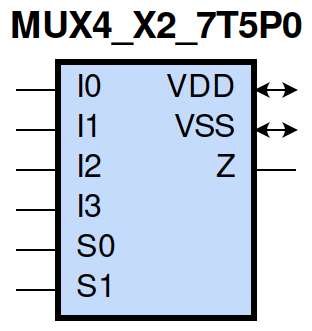
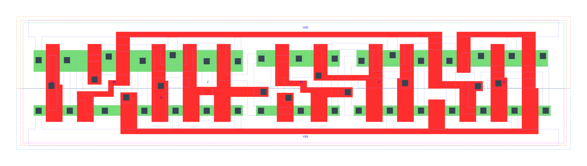

=======================================
gf180mcu_fd_sc_mcu7t5v0__mux4_x2
=======================================

**gf180mcu_fd_sc_mcu7t5v0__mux4_x2 symbol**

**gf180mcu_fd_sc_mcu7t5v0__mux4_x2 schematic**

.. image:: sc7_sch/MUX4_X2_sch.png
    :height: 300px
    :width: 500 px
    :align: center
    :alt: gf180mcu_fd_sc_mcu7t5v0__mux4_x2 schematic

**gf180mcu_fd_sc_mcu7t5v0__mux4_x2 layout**

.. include:: images.rst

MUX4_X2 is a 4-to-1 multiplexer, 2X drive strength
|
| Attributes

============= ======================
**Attribute** **Value**
area          74.636800 µm\ :sup:`2`
============= ======================

|
| OUTPUT FUNCTIONS

============== =========================================================
**Output Pin** **Function**
Z              ((I0&(!S0)&(!S1))|(I1&S0&(!S1))|(I2&(!S0)&S1)|(I3&S0&S1))
============== =========================================================

|
| TRUTH TABLE FOR Z

====== ====== ====== ====== ====== ====== =====
**I0** **I1** **I2** **I3** **S0** **S1** **Z**
1      ?      ?      ?      0      0      1
?      1      ?      ?      1      0      1
?      ?      1      ?      0      1      1
?      ?      ?      1      1      1      1
0      ?      ?      ?      0      0      0
?      0      ?      ?      1      0      0
?      ?      0      ?      0      1      0
?      ?      ?      0      1      1      0
====== ====== ====== ====== ====== ====== =====

|
| FUNCTIONAL SCHEMATIC
| |image458|
| PIN CAPACITANCE (pf)

======= ======== ====================
**Pin** **Type** **Capacitance (pf)**
I2      input    0.0032
S0      input    0.0106
I3      input    0.0034
S1      input    0.0057
I1      input    0.0029
I0      input    0.0029
======= ======== ====================

|
| DELAY AND OUTPUT TRANSITION TIME corresponding to min slew and load

+---------------+------------+---------------------+--------------+-------------------+----------------+---------------+
| **Input Pin** | **Output** | **When Condition**  | **Tin (ns)** | **Out Load (pf)** | **Delay (ns)** | **Tout (ns)** |
+---------------+------------+---------------------+--------------+-------------------+----------------+---------------+
| I2(HL)        | Z(HL)      | !I0&!I1&!I3&!S0&S1  | 0.0100       | 0.0010            | 0.4457         | 0.0798        |
+---------------+------------+---------------------+--------------+-------------------+----------------+---------------+
| I2(HL)        | Z(HL)      | !I0&!I1&I3&!S0&S1   | 0.0100       | 0.0010            | 0.4457         | 0.0798        |
+---------------+------------+---------------------+--------------+-------------------+----------------+---------------+
| I2(HL)        | Z(HL)      | !I0&I1&!I3&!S0&S1   | 0.0100       | 0.0010            | 0.4457         | 0.0798        |
+---------------+------------+---------------------+--------------+-------------------+----------------+---------------+
| I2(HL)        | Z(HL)      | !I0&I1&I3&!S0&S1    | 0.0100       | 0.0010            | 0.4457         | 0.0798        |
+---------------+------------+---------------------+--------------+-------------------+----------------+---------------+
| I2(HL)        | Z(HL)      | I0&!I1&!I3&!S0&S1   | 0.0100       | 0.0010            | 0.4457         | 0.0798        |
+---------------+------------+---------------------+--------------+-------------------+----------------+---------------+
| I2(HL)        | Z(HL)      | I0&!I1&I3&!S0&S1    | 0.0100       | 0.0010            | 0.4457         | 0.0799        |
+---------------+------------+---------------------+--------------+-------------------+----------------+---------------+
| I2(HL)        | Z(HL)      | I0&I1&!I3&!S0&S1    | 0.0100       | 0.0010            | 0.4457         | 0.0798        |
+---------------+------------+---------------------+--------------+-------------------+----------------+---------------+
| I2(HL)        | Z(HL)      | I0&I1&I3&!S0&S1     | 0.0100       | 0.0010            | 0.4457         | 0.0799        |
+---------------+------------+---------------------+--------------+-------------------+----------------+---------------+
| I2(LH)        | Z(LH)      | !I0&!I1&!I3&!S0&S1  | 0.0100       | 0.0010            | 0.4759         | 0.0652        |
+---------------+------------+---------------------+--------------+-------------------+----------------+---------------+
| I2(LH)        | Z(LH)      | !I0&!I1&I3&!S0&S1   | 0.0100       | 0.0010            | 0.4759         | 0.0652        |
+---------------+------------+---------------------+--------------+-------------------+----------------+---------------+
| I2(LH)        | Z(LH)      | !I0&I1&!I3&!S0&S1   | 0.0100       | 0.0010            | 0.4759         | 0.0652        |
+---------------+------------+---------------------+--------------+-------------------+----------------+---------------+
| I2(LH)        | Z(LH)      | !I0&I1&I3&!S0&S1    | 0.0100       | 0.0010            | 0.4759         | 0.0652        |
+---------------+------------+---------------------+--------------+-------------------+----------------+---------------+
| I2(LH)        | Z(LH)      | I0&!I1&!I3&!S0&S1   | 0.0100       | 0.0010            | 0.4759         | 0.0652        |
+---------------+------------+---------------------+--------------+-------------------+----------------+---------------+
| I2(LH)        | Z(LH)      | I0&!I1&I3&!S0&S1    | 0.0100       | 0.0010            | 0.4759         | 0.0652        |
+---------------+------------+---------------------+--------------+-------------------+----------------+---------------+
| I2(LH)        | Z(LH)      | I0&I1&!I3&!S0&S1    | 0.0100       | 0.0010            | 0.4759         | 0.0652        |
+---------------+------------+---------------------+--------------+-------------------+----------------+---------------+
| I2(LH)        | Z(LH)      | I0&I1&I3&!S0&S1     | 0.0100       | 0.0010            | 0.4759         | 0.0652        |
+---------------+------------+---------------------+--------------+-------------------+----------------+---------------+
| S0(HL)        | Z(LH)      | !I0&!I1&I2&!I3&S1   | 0.0100       | 0.0010            | 0.5695         | 0.0670        |
+---------------+------------+---------------------+--------------+-------------------+----------------+---------------+
| S0(HL)        | Z(LH)      | !I0&I1&I2&!I3&S1    | 0.0100       | 0.0010            | 0.5578         | 0.0668        |
+---------------+------------+---------------------+--------------+-------------------+----------------+---------------+
| S0(HL)        | Z(LH)      | I0&!I1&!I2&!I3&!S1  | 0.0100       | 0.0010            | 0.5640         | 0.0655        |
+---------------+------------+---------------------+--------------+-------------------+----------------+---------------+
| S0(HL)        | Z(LH)      | I0&!I1&!I2&I3&!S1   | 0.0100       | 0.0010            | 0.5488         | 0.0651        |
+---------------+------------+---------------------+--------------+-------------------+----------------+---------------+
| S0(HL)        | Z(LH)      | I0&!I1&I2&!I3&!S1   | 0.0100       | 0.0010            | 0.5728         | 0.0656        |
+---------------+------------+---------------------+--------------+-------------------+----------------+---------------+
| S0(HL)        | Z(LH)      | I0&!I1&I2&!I3&S1    | 0.0100       | 0.0010            | 0.5772         | 0.0671        |
+---------------+------------+---------------------+--------------+-------------------+----------------+---------------+
| S0(HL)        | Z(LH)      | I0&!I1&I2&I3&!S1    | 0.0100       | 0.0010            | 0.5582         | 0.0655        |
+---------------+------------+---------------------+--------------+-------------------+----------------+---------------+
| S0(HL)        | Z(LH)      | I0&I1&I2&!I3&S1     | 0.0100       | 0.0010            | 0.5659         | 0.0669        |
+---------------+------------+---------------------+--------------+-------------------+----------------+---------------+
| S0(HL)        | Z(HL)      | !I0&!I1&!I2&I3&S1   | 0.0100       | 0.0010            | 0.4697         | 0.0805        |
+---------------+------------+---------------------+--------------+-------------------+----------------+---------------+
| S0(HL)        | Z(HL)      | !I0&I1&!I2&!I3&!S1  | 0.0100       | 0.0010            | 0.5134         | 0.0867        |
+---------------+------------+---------------------+--------------+-------------------+----------------+---------------+
| S0(HL)        | Z(HL)      | !I0&I1&!I2&I3&!S1   | 0.0100       | 0.0010            | 0.5030         | 0.0862        |
+---------------+------------+---------------------+--------------+-------------------+----------------+---------------+
| S0(HL)        | Z(HL)      | !I0&I1&!I2&I3&S1    | 0.0100       | 0.0010            | 0.4640         | 0.0799        |
+---------------+------------+---------------------+--------------+-------------------+----------------+---------------+
| S0(HL)        | Z(HL)      | !I0&I1&I2&!I3&!S1   | 0.0100       | 0.0010            | 0.5195         | 0.0871        |
+---------------+------------+---------------------+--------------+-------------------+----------------+---------------+
| S0(HL)        | Z(HL)      | !I0&I1&I2&I3&!S1    | 0.0100       | 0.0010            | 0.5097         | 0.0870        |
+---------------+------------+---------------------+--------------+-------------------+----------------+---------------+
| S0(HL)        | Z(HL)      | I0&!I1&!I2&I3&S1    | 0.0100       | 0.0010            | 0.4733         | 0.0809        |
+---------------+------------+---------------------+--------------+-------------------+----------------+---------------+
| S0(HL)        | Z(HL)      | I0&I1&!I2&I3&S1     | 0.0100       | 0.0010            | 0.4681         | 0.0804        |
+---------------+------------+---------------------+--------------+-------------------+----------------+---------------+
| S0(LH)        | Z(LH)      | !I0&!I1&!I2&I3&S1   | 0.0100       | 0.0010            | 0.4388         | 0.0649        |
+---------------+------------+---------------------+--------------+-------------------+----------------+---------------+
| S0(LH)        | Z(LH)      | !I0&I1&!I2&!I3&!S1  | 0.0100       | 0.0010            | 0.4244         | 0.0637        |
+---------------+------------+---------------------+--------------+-------------------+----------------+---------------+
| S0(LH)        | Z(LH)      | !I0&I1&!I2&I3&!S1   | 0.0100       | 0.0010            | 0.4239         | 0.0640        |
+---------------+------------+---------------------+--------------+-------------------+----------------+---------------+
| S0(LH)        | Z(LH)      | !I0&I1&!I2&I3&S1    | 0.0100       | 0.0010            | 0.4377         | 0.0652        |
+---------------+------------+---------------------+--------------+-------------------+----------------+---------------+
| S0(LH)        | Z(LH)      | !I0&I1&I2&!I3&!S1   | 0.0100       | 0.0010            | 0.4246         | 0.0633        |
+---------------+------------+---------------------+--------------+-------------------+----------------+---------------+
| S0(LH)        | Z(LH)      | !I0&I1&I2&I3&!S1    | 0.0100       | 0.0010            | 0.4242         | 0.0637        |
+---------------+------------+---------------------+--------------+-------------------+----------------+---------------+
| S0(LH)        | Z(LH)      | I0&!I1&!I2&I3&S1    | 0.0100       | 0.0010            | 0.4394         | 0.0647        |
+---------------+------------+---------------------+--------------+-------------------+----------------+---------------+
| S0(LH)        | Z(LH)      | I0&I1&!I2&I3&S1     | 0.0100       | 0.0010            | 0.4387         | 0.0652        |
+---------------+------------+---------------------+--------------+-------------------+----------------+---------------+
| S0(LH)        | Z(HL)      | !I0&!I1&I2&!I3&S1   | 0.0100       | 0.0010            | 0.4513         | 0.0803        |
+---------------+------------+---------------------+--------------+-------------------+----------------+---------------+
| S0(LH)        | Z(HL)      | !I0&I1&I2&!I3&S1    | 0.0100       | 0.0010            | 0.4463         | 0.0800        |
+---------------+------------+---------------------+--------------+-------------------+----------------+---------------+
| S0(LH)        | Z(HL)      | I0&!I1&!I2&!I3&!S1  | 0.0100       | 0.0010            | 0.4757         | 0.0867        |
+---------------+------------+---------------------+--------------+-------------------+----------------+---------------+
| S0(LH)        | Z(HL)      | I0&!I1&!I2&I3&!S1   | 0.0100       | 0.0010            | 0.4701         | 0.0867        |
+---------------+------------+---------------------+--------------+-------------------+----------------+---------------+
| S0(LH)        | Z(HL)      | I0&!I1&I2&!I3&!S1   | 0.0100       | 0.0010            | 0.4767         | 0.0868        |
+---------------+------------+---------------------+--------------+-------------------+----------------+---------------+
| S0(LH)        | Z(HL)      | I0&!I1&I2&!I3&S1    | 0.0100       | 0.0010            | 0.4531         | 0.0802        |
+---------------+------------+---------------------+--------------+-------------------+----------------+---------------+
| S0(LH)        | Z(HL)      | I0&!I1&I2&I3&!S1    | 0.0100       | 0.0010            | 0.4745         | 0.0866        |
+---------------+------------+---------------------+--------------+-------------------+----------------+---------------+
| S0(LH)        | Z(HL)      | I0&I1&I2&!I3&S1     | 0.0100       | 0.0010            | 0.4509         | 0.0803        |
+---------------+------------+---------------------+--------------+-------------------+----------------+---------------+
| I3(LH)        | Z(LH)      | !I0&!I1&!I2&S0&S1   | 0.0100       | 0.0010            | 0.4702         | 0.0650        |
+---------------+------------+---------------------+--------------+-------------------+----------------+---------------+
| I3(LH)        | Z(LH)      | !I0&!I1&I2&S0&S1    | 0.0100       | 0.0010            | 0.4702         | 0.0650        |
+---------------+------------+---------------------+--------------+-------------------+----------------+---------------+
| I3(LH)        | Z(LH)      | !I0&I1&!I2&S0&S1    | 0.0100       | 0.0010            | 0.4702         | 0.0650        |
+---------------+------------+---------------------+--------------+-------------------+----------------+---------------+
| I3(LH)        | Z(LH)      | !I0&I1&I2&S0&S1     | 0.0100       | 0.0010            | 0.4702         | 0.0650        |
+---------------+------------+---------------------+--------------+-------------------+----------------+---------------+
| I3(LH)        | Z(LH)      | I0&!I1&!I2&S0&S1    | 0.0100       | 0.0010            | 0.4702         | 0.0650        |
+---------------+------------+---------------------+--------------+-------------------+----------------+---------------+
| I3(LH)        | Z(LH)      | I0&!I1&I2&S0&S1     | 0.0100       | 0.0010            | 0.4702         | 0.0650        |
+---------------+------------+---------------------+--------------+-------------------+----------------+---------------+
| I3(LH)        | Z(LH)      | I0&I1&!I2&S0&S1     | 0.0100       | 0.0010            | 0.4702         | 0.0650        |
+---------------+------------+---------------------+--------------+-------------------+----------------+---------------+
| I3(LH)        | Z(LH)      | I0&I1&I2&S0&S1      | 0.0100       | 0.0010            | 0.4702         | 0.0650        |
+---------------+------------+---------------------+--------------+-------------------+----------------+---------------+
| I3(HL)        | Z(HL)      | !I0&!I1&!I2&S0&S1   | 0.0100       | 0.0010            | 0.4463         | 0.0803        |
+---------------+------------+---------------------+--------------+-------------------+----------------+---------------+
| I3(HL)        | Z(HL)      | !I0&!I1&I2&S0&S1    | 0.0100       | 0.0010            | 0.4463         | 0.0803        |
+---------------+------------+---------------------+--------------+-------------------+----------------+---------------+
| I3(HL)        | Z(HL)      | !I0&I1&!I2&S0&S1    | 0.0100       | 0.0010            | 0.4462         | 0.0800        |
+---------------+------------+---------------------+--------------+-------------------+----------------+---------------+
| I3(HL)        | Z(HL)      | !I0&I1&I2&S0&S1     | 0.0100       | 0.0010            | 0.4463         | 0.0800        |
+---------------+------------+---------------------+--------------+-------------------+----------------+---------------+
| I3(HL)        | Z(HL)      | I0&!I1&!I2&S0&S1    | 0.0100       | 0.0010            | 0.4463         | 0.0803        |
+---------------+------------+---------------------+--------------+-------------------+----------------+---------------+
| I3(HL)        | Z(HL)      | I0&!I1&I2&S0&S1     | 0.0100       | 0.0010            | 0.4463         | 0.0803        |
+---------------+------------+---------------------+--------------+-------------------+----------------+---------------+
| I3(HL)        | Z(HL)      | I0&I1&!I2&S0&S1     | 0.0100       | 0.0010            | 0.4462         | 0.0800        |
+---------------+------------+---------------------+--------------+-------------------+----------------+---------------+
| I3(HL)        | Z(HL)      | I0&I1&I2&S0&S1      | 0.0100       | 0.0010            | 0.4463         | 0.0800        |
+---------------+------------+---------------------+--------------+-------------------+----------------+---------------+
| S1(LH)        | Z(HL)      | !I0&I1&!I2&!I3&S0   | 0.0100       | 0.0010            | 0.2520         | 0.0641        |
+---------------+------------+---------------------+--------------+-------------------+----------------+---------------+
| S1(LH)        | Z(HL)      | !I0&I1&I2&!I3&S0    | 0.0100       | 0.0010            | 0.2520         | 0.0641        |
+---------------+------------+---------------------+--------------+-------------------+----------------+---------------+
| S1(LH)        | Z(HL)      | I0&!I1&!I2&!I3&!S0  | 0.0100       | 0.0010            | 0.2521         | 0.0642        |
+---------------+------------+---------------------+--------------+-------------------+----------------+---------------+
| S1(LH)        | Z(HL)      | I0&!I1&!I2&I3&!S0   | 0.0100       | 0.0010            | 0.2522         | 0.0642        |
+---------------+------------+---------------------+--------------+-------------------+----------------+---------------+
| S1(LH)        | Z(HL)      | I0&I1&!I2&!I3&!S0   | 0.0100       | 0.0010            | 0.2521         | 0.0642        |
+---------------+------------+---------------------+--------------+-------------------+----------------+---------------+
| S1(LH)        | Z(HL)      | I0&I1&!I2&!I3&S0    | 0.0100       | 0.0010            | 0.2520         | 0.0641        |
+---------------+------------+---------------------+--------------+-------------------+----------------+---------------+
| S1(LH)        | Z(HL)      | I0&I1&!I2&I3&!S0    | 0.0100       | 0.0010            | 0.2522         | 0.0642        |
+---------------+------------+---------------------+--------------+-------------------+----------------+---------------+
| S1(LH)        | Z(HL)      | I0&I1&I2&!I3&S0     | 0.0100       | 0.0010            | 0.2520         | 0.0641        |
+---------------+------------+---------------------+--------------+-------------------+----------------+---------------+
| S1(LH)        | Z(LH)      | !I0&!I1&!I2&I3&S0   | 0.0100       | 0.0010            | 0.2455         | 0.0602        |
+---------------+------------+---------------------+--------------+-------------------+----------------+---------------+
| S1(LH)        | Z(LH)      | !I0&!I1&I2&!I3&!S0  | 0.0100       | 0.0010            | 0.2452         | 0.0600        |
+---------------+------------+---------------------+--------------+-------------------+----------------+---------------+
| S1(LH)        | Z(LH)      | !I0&!I1&I2&I3&!S0   | 0.0100       | 0.0010            | 0.2452         | 0.0600        |
+---------------+------------+---------------------+--------------+-------------------+----------------+---------------+
| S1(LH)        | Z(LH)      | !I0&!I1&I2&I3&S0    | 0.0100       | 0.0010            | 0.2455         | 0.0602        |
+---------------+------------+---------------------+--------------+-------------------+----------------+---------------+
| S1(LH)        | Z(LH)      | !I0&I1&I2&!I3&!S0   | 0.0100       | 0.0010            | 0.2453         | 0.0600        |
+---------------+------------+---------------------+--------------+-------------------+----------------+---------------+
| S1(LH)        | Z(LH)      | !I0&I1&I2&I3&!S0    | 0.0100       | 0.0010            | 0.2453         | 0.0599        |
+---------------+------------+---------------------+--------------+-------------------+----------------+---------------+
| S1(LH)        | Z(LH)      | I0&!I1&!I2&I3&S0    | 0.0100       | 0.0010            | 0.2455         | 0.0602        |
+---------------+------------+---------------------+--------------+-------------------+----------------+---------------+
| S1(LH)        | Z(LH)      | I0&!I1&I2&I3&S0     | 0.0100       | 0.0010            | 0.2455         | 0.0601        |
+---------------+------------+---------------------+--------------+-------------------+----------------+---------------+
| S1(HL)        | Z(HL)      | !I0&!I1&!I2&I3&S0   | 0.0100       | 0.0010            | 0.2862         | 0.0665        |
+---------------+------------+---------------------+--------------+-------------------+----------------+---------------+
| S1(HL)        | Z(HL)      | !I0&!I1&I2&!I3&!S0  | 0.0100       | 0.0010            | 0.2857         | 0.0663        |
+---------------+------------+---------------------+--------------+-------------------+----------------+---------------+
| S1(HL)        | Z(HL)      | !I0&!I1&I2&I3&!S0   | 0.0100       | 0.0010            | 0.2857         | 0.0663        |
+---------------+------------+---------------------+--------------+-------------------+----------------+---------------+
| S1(HL)        | Z(HL)      | !I0&!I1&I2&I3&S0    | 0.0100       | 0.0010            | 0.2862         | 0.0665        |
+---------------+------------+---------------------+--------------+-------------------+----------------+---------------+
| S1(HL)        | Z(HL)      | !I0&I1&I2&!I3&!S0   | 0.0100       | 0.0010            | 0.2857         | 0.0663        |
+---------------+------------+---------------------+--------------+-------------------+----------------+---------------+
| S1(HL)        | Z(HL)      | !I0&I1&I2&I3&!S0    | 0.0100       | 0.0010            | 0.2857         | 0.0663        |
+---------------+------------+---------------------+--------------+-------------------+----------------+---------------+
| S1(HL)        | Z(HL)      | I0&!I1&!I2&I3&S0    | 0.0100       | 0.0010            | 0.2862         | 0.0665        |
+---------------+------------+---------------------+--------------+-------------------+----------------+---------------+
| S1(HL)        | Z(HL)      | I0&!I1&I2&I3&S0     | 0.0100       | 0.0010            | 0.2862         | 0.0665        |
+---------------+------------+---------------------+--------------+-------------------+----------------+---------------+
| S1(HL)        | Z(LH)      | !I0&I1&!I2&!I3&S0   | 0.0100       | 0.0010            | 0.3390         | 0.0609        |
+---------------+------------+---------------------+--------------+-------------------+----------------+---------------+
| S1(HL)        | Z(LH)      | !I0&I1&I2&!I3&S0    | 0.0100       | 0.0010            | 0.3390         | 0.0609        |
+---------------+------------+---------------------+--------------+-------------------+----------------+---------------+
| S1(HL)        | Z(LH)      | I0&!I1&!I2&!I3&!S0  | 0.0100       | 0.0010            | 0.3384         | 0.0609        |
+---------------+------------+---------------------+--------------+-------------------+----------------+---------------+
| S1(HL)        | Z(LH)      | I0&!I1&!I2&I3&!S0   | 0.0100       | 0.0010            | 0.3384         | 0.0609        |
+---------------+------------+---------------------+--------------+-------------------+----------------+---------------+
| S1(HL)        | Z(LH)      | I0&I1&!I2&!I3&!S0   | 0.0100       | 0.0010            | 0.3384         | 0.0609        |
+---------------+------------+---------------------+--------------+-------------------+----------------+---------------+
| S1(HL)        | Z(LH)      | I0&I1&!I2&!I3&S0    | 0.0100       | 0.0010            | 0.3390         | 0.0609        |
+---------------+------------+---------------------+--------------+-------------------+----------------+---------------+
| S1(HL)        | Z(LH)      | I0&I1&!I2&I3&!S0    | 0.0100       | 0.0010            | 0.3384         | 0.0609        |
+---------------+------------+---------------------+--------------+-------------------+----------------+---------------+
| S1(HL)        | Z(LH)      | I0&I1&I2&!I3&S0     | 0.0100       | 0.0010            | 0.3390         | 0.0609        |
+---------------+------------+---------------------+--------------+-------------------+----------------+---------------+
| I1(LH)        | Z(LH)      | !I0&!I2&!I3&S0&!S1  | 0.0100       | 0.0010            | 0.4486         | 0.0640        |
+---------------+------------+---------------------+--------------+-------------------+----------------+---------------+
| I1(LH)        | Z(LH)      | !I0&!I2&I3&S0&!S1   | 0.0100       | 0.0010            | 0.4486         | 0.0637        |
+---------------+------------+---------------------+--------------+-------------------+----------------+---------------+
| I1(LH)        | Z(LH)      | !I0&I2&!I3&S0&!S1   | 0.0100       | 0.0010            | 0.4488         | 0.0640        |
+---------------+------------+---------------------+--------------+-------------------+----------------+---------------+
| I1(LH)        | Z(LH)      | !I0&I2&I3&S0&!S1    | 0.0100       | 0.0010            | 0.4488         | 0.0640        |
+---------------+------------+---------------------+--------------+-------------------+----------------+---------------+
| I1(LH)        | Z(LH)      | I0&!I2&!I3&S0&!S1   | 0.0100       | 0.0010            | 0.4487         | 0.0636        |
+---------------+------------+---------------------+--------------+-------------------+----------------+---------------+
| I1(LH)        | Z(LH)      | I0&!I2&I3&S0&!S1    | 0.0100       | 0.0010            | 0.4487         | 0.0639        |
+---------------+------------+---------------------+--------------+-------------------+----------------+---------------+
| I1(LH)        | Z(LH)      | I0&I2&!I3&S0&!S1    | 0.0100       | 0.0010            | 0.4487         | 0.0639        |
+---------------+------------+---------------------+--------------+-------------------+----------------+---------------+
| I1(LH)        | Z(LH)      | I0&I2&I3&S0&!S1     | 0.0100       | 0.0010            | 0.4486         | 0.0637        |
+---------------+------------+---------------------+--------------+-------------------+----------------+---------------+
| I1(HL)        | Z(HL)      | !I0&!I2&!I3&S0&!S1  | 0.0100       | 0.0010            | 0.4820         | 0.0864        |
+---------------+------------+---------------------+--------------+-------------------+----------------+---------------+
| I1(HL)        | Z(HL)      | !I0&!I2&I3&S0&!S1   | 0.0100       | 0.0010            | 0.4822         | 0.0866        |
+---------------+------------+---------------------+--------------+-------------------+----------------+---------------+
| I1(HL)        | Z(HL)      | !I0&I2&!I3&S0&!S1   | 0.0100       | 0.0010            | 0.4822         | 0.0866        |
+---------------+------------+---------------------+--------------+-------------------+----------------+---------------+
| I1(HL)        | Z(HL)      | !I0&I2&I3&S0&!S1    | 0.0100       | 0.0010            | 0.4822         | 0.0866        |
+---------------+------------+---------------------+--------------+-------------------+----------------+---------------+
| I1(HL)        | Z(HL)      | I0&!I2&!I3&S0&!S1   | 0.0100       | 0.0010            | 0.4822         | 0.0866        |
+---------------+------------+---------------------+--------------+-------------------+----------------+---------------+
| I1(HL)        | Z(HL)      | I0&!I2&I3&S0&!S1    | 0.0100       | 0.0010            | 0.4822         | 0.0866        |
+---------------+------------+---------------------+--------------+-------------------+----------------+---------------+
| I1(HL)        | Z(HL)      | I0&I2&!I3&S0&!S1    | 0.0100       | 0.0010            | 0.4822         | 0.0866        |
+---------------+------------+---------------------+--------------+-------------------+----------------+---------------+
| I1(HL)        | Z(HL)      | I0&I2&I3&S0&!S1     | 0.0100       | 0.0010            | 0.4822         | 0.0866        |
+---------------+------------+---------------------+--------------+-------------------+----------------+---------------+
| I0(LH)        | Z(LH)      | !I1&!I2&!I3&!S0&!S1 | 0.0100       | 0.0010            | 0.4582         | 0.0639        |
+---------------+------------+---------------------+--------------+-------------------+----------------+---------------+
| I0(LH)        | Z(LH)      | !I1&!I2&I3&!S0&!S1  | 0.0100       | 0.0010            | 0.4582         | 0.0639        |
+---------------+------------+---------------------+--------------+-------------------+----------------+---------------+
| I0(LH)        | Z(LH)      | !I1&I2&!I3&!S0&!S1  | 0.0100       | 0.0010            | 0.4582         | 0.0640        |
+---------------+------------+---------------------+--------------+-------------------+----------------+---------------+
| I0(LH)        | Z(LH)      | !I1&I2&I3&!S0&!S1   | 0.0100       | 0.0010            | 0.4582         | 0.0640        |
+---------------+------------+---------------------+--------------+-------------------+----------------+---------------+
| I0(LH)        | Z(LH)      | I1&!I2&!I3&!S0&!S1  | 0.0100       | 0.0010            | 0.4582         | 0.0639        |
+---------------+------------+---------------------+--------------+-------------------+----------------+---------------+
| I0(LH)        | Z(LH)      | I1&!I2&I3&!S0&!S1   | 0.0100       | 0.0010            | 0.4582         | 0.0640        |
+---------------+------------+---------------------+--------------+-------------------+----------------+---------------+
| I0(LH)        | Z(LH)      | I1&I2&!I3&!S0&!S1   | 0.0100       | 0.0010            | 0.4582         | 0.0640        |
+---------------+------------+---------------------+--------------+-------------------+----------------+---------------+
| I0(LH)        | Z(LH)      | I1&I2&I3&!S0&!S1    | 0.0100       | 0.0010            | 0.4582         | 0.0640        |
+---------------+------------+---------------------+--------------+-------------------+----------------+---------------+
| I0(HL)        | Z(HL)      | !I1&!I2&!I3&!S0&!S1 | 0.0100       | 0.0010            | 0.4890         | 0.0867        |
+---------------+------------+---------------------+--------------+-------------------+----------------+---------------+
| I0(HL)        | Z(HL)      | !I1&!I2&I3&!S0&!S1  | 0.0100       | 0.0010            | 0.4890         | 0.0867        |
+---------------+------------+---------------------+--------------+-------------------+----------------+---------------+
| I0(HL)        | Z(HL)      | !I1&I2&!I3&!S0&!S1  | 0.0100       | 0.0010            | 0.4890         | 0.0867        |
+---------------+------------+---------------------+--------------+-------------------+----------------+---------------+
| I0(HL)        | Z(HL)      | !I1&I2&I3&!S0&!S1   | 0.0100       | 0.0010            | 0.4892         | 0.0868        |
+---------------+------------+---------------------+--------------+-------------------+----------------+---------------+
| I0(HL)        | Z(HL)      | I1&!I2&!I3&!S0&!S1  | 0.0100       | 0.0010            | 0.4892         | 0.0868        |
+---------------+------------+---------------------+--------------+-------------------+----------------+---------------+
| I0(HL)        | Z(HL)      | I1&!I2&I3&!S0&!S1   | 0.0100       | 0.0010            | 0.4891         | 0.0869        |
+---------------+------------+---------------------+--------------+-------------------+----------------+---------------+
| I0(HL)        | Z(HL)      | I1&I2&!I3&!S0&!S1   | 0.0100       | 0.0010            | 0.4890         | 0.0867        |
+---------------+------------+---------------------+--------------+-------------------+----------------+---------------+
| I0(HL)        | Z(HL)      | I1&I2&I3&!S0&!S1    | 0.0100       | 0.0010            | 0.4892         | 0.0868        |
+---------------+------------+---------------------+--------------+-------------------+----------------+---------------+

|
| DYNAMIC ENERGY

+---------------+---------------------+--------------+------------+-------------------+---------------------+
| **Input Pin** | **When Condition**  | **Tin (ns)** | **Output** | **Out Load (pf)** | **Energy (uW/MHz)** |
+---------------+---------------------+--------------+------------+-------------------+---------------------+
| S1            | !I0&I1&!I2&!I3&S0   | 0.0100       | Z(HL)      | 0.0010            | 0.2993              |
+---------------+---------------------+--------------+------------+-------------------+---------------------+
| S1            | !I0&I1&I2&!I3&S0    | 0.0100       | Z(HL)      | 0.0010            | 0.2993              |
+---------------+---------------------+--------------+------------+-------------------+---------------------+
| S1            | I0&!I1&!I2&!I3&!S0  | 0.0100       | Z(HL)      | 0.0010            | 0.2995              |
+---------------+---------------------+--------------+------------+-------------------+---------------------+
| S1            | I0&!I1&!I2&I3&!S0   | 0.0100       | Z(HL)      | 0.0010            | 0.2996              |
+---------------+---------------------+--------------+------------+-------------------+---------------------+
| S1            | I0&I1&!I2&!I3&!S0   | 0.0100       | Z(HL)      | 0.0010            | 0.2995              |
+---------------+---------------------+--------------+------------+-------------------+---------------------+
| S1            | I0&I1&!I2&!I3&S0    | 0.0100       | Z(HL)      | 0.0010            | 0.2993              |
+---------------+---------------------+--------------+------------+-------------------+---------------------+
| S1            | I0&I1&!I2&I3&!S0    | 0.0100       | Z(HL)      | 0.0010            | 0.2996              |
+---------------+---------------------+--------------+------------+-------------------+---------------------+
| S1            | I0&I1&I2&!I3&S0     | 0.0100       | Z(HL)      | 0.0010            | 0.2993              |
+---------------+---------------------+--------------+------------+-------------------+---------------------+
| S1            | !I0&!I1&!I2&I3&S0   | 0.0100       | Z(HL)      | 0.0010            | 0.3870              |
+---------------+---------------------+--------------+------------+-------------------+---------------------+
| S1            | !I0&!I1&I2&!I3&!S0  | 0.0100       | Z(HL)      | 0.0010            | 0.3868              |
+---------------+---------------------+--------------+------------+-------------------+---------------------+
| S1            | !I0&!I1&I2&I3&!S0   | 0.0100       | Z(HL)      | 0.0010            | 0.3868              |
+---------------+---------------------+--------------+------------+-------------------+---------------------+
| S1            | !I0&!I1&I2&I3&S0    | 0.0100       | Z(HL)      | 0.0010            | 0.3870              |
+---------------+---------------------+--------------+------------+-------------------+---------------------+
| S1            | !I0&I1&I2&!I3&!S0   | 0.0100       | Z(HL)      | 0.0010            | 0.3868              |
+---------------+---------------------+--------------+------------+-------------------+---------------------+
| S1            | !I0&I1&I2&I3&!S0    | 0.0100       | Z(HL)      | 0.0010            | 0.3868              |
+---------------+---------------------+--------------+------------+-------------------+---------------------+
| S1            | I0&!I1&!I2&I3&S0    | 0.0100       | Z(HL)      | 0.0010            | 0.3870              |
+---------------+---------------------+--------------+------------+-------------------+---------------------+
| S1            | I0&!I1&I2&I3&S0     | 0.0100       | Z(HL)      | 0.0010            | 0.3870              |
+---------------+---------------------+--------------+------------+-------------------+---------------------+
| S1            | !I0&!I1&!I2&I3&S0   | 0.0100       | Z(LH)      | 0.0010            | 0.1824              |
+---------------+---------------------+--------------+------------+-------------------+---------------------+
| S1            | !I0&!I1&I2&!I3&!S0  | 0.0100       | Z(LH)      | 0.0010            | 0.1823              |
+---------------+---------------------+--------------+------------+-------------------+---------------------+
| S1            | !I0&!I1&I2&I3&!S0   | 0.0100       | Z(LH)      | 0.0010            | 0.1823              |
+---------------+---------------------+--------------+------------+-------------------+---------------------+
| S1            | !I0&!I1&I2&I3&S0    | 0.0100       | Z(LH)      | 0.0010            | 0.1824              |
+---------------+---------------------+--------------+------------+-------------------+---------------------+
| S1            | !I0&I1&I2&!I3&!S0   | 0.0100       | Z(LH)      | 0.0010            | 0.1823              |
+---------------+---------------------+--------------+------------+-------------------+---------------------+
| S1            | !I0&I1&I2&I3&!S0    | 0.0100       | Z(LH)      | 0.0010            | 0.1822              |
+---------------+---------------------+--------------+------------+-------------------+---------------------+
| S1            | I0&!I1&!I2&I3&S0    | 0.0100       | Z(LH)      | 0.0010            | 0.1824              |
+---------------+---------------------+--------------+------------+-------------------+---------------------+
| S1            | I0&!I1&I2&I3&S0     | 0.0100       | Z(LH)      | 0.0010            | 0.1824              |
+---------------+---------------------+--------------+------------+-------------------+---------------------+
| S1            | !I0&I1&!I2&!I3&S0   | 0.0100       | Z(LH)      | 0.0010            | 0.3321              |
+---------------+---------------------+--------------+------------+-------------------+---------------------+
| S1            | !I0&I1&I2&!I3&S0    | 0.0100       | Z(LH)      | 0.0010            | 0.3321              |
+---------------+---------------------+--------------+------------+-------------------+---------------------+
| S1            | I0&!I1&!I2&!I3&!S0  | 0.0100       | Z(LH)      | 0.0010            | 0.3321              |
+---------------+---------------------+--------------+------------+-------------------+---------------------+
| S1            | I0&!I1&!I2&I3&!S0   | 0.0100       | Z(LH)      | 0.0010            | 0.3321              |
+---------------+---------------------+--------------+------------+-------------------+---------------------+
| S1            | I0&I1&!I2&!I3&!S0   | 0.0100       | Z(LH)      | 0.0010            | 0.3321              |
+---------------+---------------------+--------------+------------+-------------------+---------------------+
| S1            | I0&I1&!I2&!I3&S0    | 0.0100       | Z(LH)      | 0.0010            | 0.3321              |
+---------------+---------------------+--------------+------------+-------------------+---------------------+
| S1            | I0&I1&!I2&I3&!S0    | 0.0100       | Z(LH)      | 0.0010            | 0.3321              |
+---------------+---------------------+--------------+------------+-------------------+---------------------+
| S1            | I0&I1&I2&!I3&S0     | 0.0100       | Z(LH)      | 0.0010            | 0.3321              |
+---------------+---------------------+--------------+------------+-------------------+---------------------+
| I0            | !I1&!I2&!I3&!S0&!S1 | 0.0100       | Z(LH)      | 0.0010            | 0.2742              |
+---------------+---------------------+--------------+------------+-------------------+---------------------+
| I0            | !I1&!I2&I3&!S0&!S1  | 0.0100       | Z(LH)      | 0.0010            | 0.2743              |
+---------------+---------------------+--------------+------------+-------------------+---------------------+
| I0            | !I1&I2&!I3&!S0&!S1  | 0.0100       | Z(LH)      | 0.0010            | 0.2743              |
+---------------+---------------------+--------------+------------+-------------------+---------------------+
| I0            | !I1&I2&I3&!S0&!S1   | 0.0100       | Z(LH)      | 0.0010            | 0.2742              |
+---------------+---------------------+--------------+------------+-------------------+---------------------+
| I0            | I1&!I2&!I3&!S0&!S1  | 0.0100       | Z(LH)      | 0.0010            | 0.2743              |
+---------------+---------------------+--------------+------------+-------------------+---------------------+
| I0            | I1&!I2&I3&!S0&!S1   | 0.0100       | Z(LH)      | 0.0010            | 0.2742              |
+---------------+---------------------+--------------+------------+-------------------+---------------------+
| I0            | I1&I2&!I3&!S0&!S1   | 0.0100       | Z(LH)      | 0.0010            | 0.2742              |
+---------------+---------------------+--------------+------------+-------------------+---------------------+
| I0            | I1&I2&I3&!S0&!S1    | 0.0100       | Z(LH)      | 0.0010            | 0.2742              |
+---------------+---------------------+--------------+------------+-------------------+---------------------+
| I3            | !I0&!I1&!I2&S0&S1   | 0.0100       | Z(LH)      | 0.0010            | 0.2578              |
+---------------+---------------------+--------------+------------+-------------------+---------------------+
| I3            | !I0&!I1&I2&S0&S1    | 0.0100       | Z(LH)      | 0.0010            | 0.2578              |
+---------------+---------------------+--------------+------------+-------------------+---------------------+
| I3            | !I0&I1&!I2&S0&S1    | 0.0100       | Z(LH)      | 0.0010            | 0.2578              |
+---------------+---------------------+--------------+------------+-------------------+---------------------+
| I3            | !I0&I1&I2&S0&S1     | 0.0100       | Z(LH)      | 0.0010            | 0.2578              |
+---------------+---------------------+--------------+------------+-------------------+---------------------+
| I3            | I0&!I1&!I2&S0&S1    | 0.0100       | Z(LH)      | 0.0010            | 0.2578              |
+---------------+---------------------+--------------+------------+-------------------+---------------------+
| I3            | I0&!I1&I2&S0&S1     | 0.0100       | Z(LH)      | 0.0010            | 0.2578              |
+---------------+---------------------+--------------+------------+-------------------+---------------------+
| I3            | I0&I1&!I2&S0&S1     | 0.0100       | Z(LH)      | 0.0010            | 0.2578              |
+---------------+---------------------+--------------+------------+-------------------+---------------------+
| I3            | I0&I1&I2&S0&S1      | 0.0100       | Z(LH)      | 0.0010            | 0.2578              |
+---------------+---------------------+--------------+------------+-------------------+---------------------+
| I2            | !I0&!I1&!I3&!S0&S1  | 0.0100       | Z(HL)      | 0.0010            | 0.5331              |
+---------------+---------------------+--------------+------------+-------------------+---------------------+
| I2            | !I0&!I1&I3&!S0&S1   | 0.0100       | Z(HL)      | 0.0010            | 0.5331              |
+---------------+---------------------+--------------+------------+-------------------+---------------------+
| I2            | !I0&I1&!I3&!S0&S1   | 0.0100       | Z(HL)      | 0.0010            | 0.5331              |
+---------------+---------------------+--------------+------------+-------------------+---------------------+
| I2            | !I0&I1&I3&!S0&S1    | 0.0100       | Z(HL)      | 0.0010            | 0.5331              |
+---------------+---------------------+--------------+------------+-------------------+---------------------+
| I2            | I0&!I1&!I3&!S0&S1   | 0.0100       | Z(HL)      | 0.0010            | 0.5331              |
+---------------+---------------------+--------------+------------+-------------------+---------------------+
| I2            | I0&!I1&I3&!S0&S1    | 0.0100       | Z(HL)      | 0.0010            | 0.5331              |
+---------------+---------------------+--------------+------------+-------------------+---------------------+
| I2            | I0&I1&!I3&!S0&S1    | 0.0100       | Z(HL)      | 0.0010            | 0.5331              |
+---------------+---------------------+--------------+------------+-------------------+---------------------+
| I2            | I0&I1&I3&!S0&S1     | 0.0100       | Z(HL)      | 0.0010            | 0.5331              |
+---------------+---------------------+--------------+------------+-------------------+---------------------+
| I1            | !I0&!I2&!I3&S0&!S1  | 0.0100       | Z(LH)      | 0.0010            | 0.2558              |
+---------------+---------------------+--------------+------------+-------------------+---------------------+
| I1            | !I0&!I2&I3&S0&!S1   | 0.0100       | Z(LH)      | 0.0010            | 0.2557              |
+---------------+---------------------+--------------+------------+-------------------+---------------------+
| I1            | !I0&I2&!I3&S0&!S1   | 0.0100       | Z(LH)      | 0.0010            | 0.2558              |
+---------------+---------------------+--------------+------------+-------------------+---------------------+
| I1            | !I0&I2&I3&S0&!S1    | 0.0100       | Z(LH)      | 0.0010            | 0.2558              |
+---------------+---------------------+--------------+------------+-------------------+---------------------+
| I1            | I0&!I2&!I3&S0&!S1   | 0.0100       | Z(LH)      | 0.0010            | 0.2557              |
+---------------+---------------------+--------------+------------+-------------------+---------------------+
| I1            | I0&!I2&I3&S0&!S1    | 0.0100       | Z(LH)      | 0.0010            | 0.2558              |
+---------------+---------------------+--------------+------------+-------------------+---------------------+
| I1            | I0&I2&!I3&S0&!S1    | 0.0100       | Z(LH)      | 0.0010            | 0.2558              |
+---------------+---------------------+--------------+------------+-------------------+---------------------+
| I1            | I0&I2&I3&S0&!S1     | 0.0100       | Z(LH)      | 0.0010            | 0.2557              |
+---------------+---------------------+--------------+------------+-------------------+---------------------+
| I3            | !I0&!I1&!I2&S0&S1   | 0.0100       | Z(HL)      | 0.0010            | 0.5501              |
+---------------+---------------------+--------------+------------+-------------------+---------------------+
| I3            | !I0&!I1&I2&S0&S1    | 0.0100       | Z(HL)      | 0.0010            | 0.5502              |
+---------------+---------------------+--------------+------------+-------------------+---------------------+
| I3            | !I0&I1&!I2&S0&S1    | 0.0100       | Z(HL)      | 0.0010            | 0.5501              |
+---------------+---------------------+--------------+------------+-------------------+---------------------+
| I3            | !I0&I1&I2&S0&S1     | 0.0100       | Z(HL)      | 0.0010            | 0.5502              |
+---------------+---------------------+--------------+------------+-------------------+---------------------+
| I3            | I0&!I1&!I2&S0&S1    | 0.0100       | Z(HL)      | 0.0010            | 0.5501              |
+---------------+---------------------+--------------+------------+-------------------+---------------------+
| I3            | I0&!I1&I2&S0&S1     | 0.0100       | Z(HL)      | 0.0010            | 0.5502              |
+---------------+---------------------+--------------+------------+-------------------+---------------------+
| I3            | I0&I1&!I2&S0&S1     | 0.0100       | Z(HL)      | 0.0010            | 0.5501              |
+---------------+---------------------+--------------+------------+-------------------+---------------------+
| I3            | I0&I1&I2&S0&S1      | 0.0100       | Z(HL)      | 0.0010            | 0.5501              |
+---------------+---------------------+--------------+------------+-------------------+---------------------+
| I0            | !I1&!I2&!I3&!S0&!S1 | 0.0100       | Z(HL)      | 0.0010            | 0.5145              |
+---------------+---------------------+--------------+------------+-------------------+---------------------+
| I0            | !I1&!I2&I3&!S0&!S1  | 0.0100       | Z(HL)      | 0.0010            | 0.5145              |
+---------------+---------------------+--------------+------------+-------------------+---------------------+
| I0            | !I1&I2&!I3&!S0&!S1  | 0.0100       | Z(HL)      | 0.0010            | 0.5145              |
+---------------+---------------------+--------------+------------+-------------------+---------------------+
| I0            | !I1&I2&I3&!S0&!S1   | 0.0100       | Z(HL)      | 0.0010            | 0.5145              |
+---------------+---------------------+--------------+------------+-------------------+---------------------+
| I0            | I1&!I2&!I3&!S0&!S1  | 0.0100       | Z(HL)      | 0.0010            | 0.5145              |
+---------------+---------------------+--------------+------------+-------------------+---------------------+
| I0            | I1&!I2&I3&!S0&!S1   | 0.0100       | Z(HL)      | 0.0010            | 0.5145              |
+---------------+---------------------+--------------+------------+-------------------+---------------------+
| I0            | I1&I2&!I3&!S0&!S1   | 0.0100       | Z(HL)      | 0.0010            | 0.5145              |
+---------------+---------------------+--------------+------------+-------------------+---------------------+
| I0            | I1&I2&I3&!S0&!S1    | 0.0100       | Z(HL)      | 0.0010            | 0.5145              |
+---------------+---------------------+--------------+------------+-------------------+---------------------+
| S0            | !I0&!I1&I2&!I3&S1   | 0.0100       | Z(LH)      | 0.0010            | 0.5238              |
+---------------+---------------------+--------------+------------+-------------------+---------------------+
| S0            | !I0&I1&I2&!I3&S1    | 0.0100       | Z(LH)      | 0.0010            | 0.6242              |
+---------------+---------------------+--------------+------------+-------------------+---------------------+
| S0            | I0&!I1&!I2&!I3&!S1  | 0.0100       | Z(LH)      | 0.0010            | 0.5154              |
+---------------+---------------------+--------------+------------+-------------------+---------------------+
| S0            | I0&!I1&!I2&I3&!S1   | 0.0100       | Z(LH)      | 0.0010            | 0.6364              |
+---------------+---------------------+--------------+------------+-------------------+---------------------+
| S0            | I0&!I1&I2&!I3&!S1   | 0.0100       | Z(LH)      | 0.0010            | 0.6100              |
+---------------+---------------------+--------------+------------+-------------------+---------------------+
| S0            | I0&!I1&I2&!I3&S1    | 0.0100       | Z(LH)      | 0.0010            | 0.5974              |
+---------------+---------------------+--------------+------------+-------------------+---------------------+
| S0            | I0&!I1&I2&I3&!S1    | 0.0100       | Z(LH)      | 0.0010            | 0.5079              |
+---------------+---------------------+--------------+------------+-------------------+---------------------+
| S0            | I0&I1&I2&!I3&S1     | 0.0100       | Z(LH)      | 0.0010            | 0.5197              |
+---------------+---------------------+--------------+------------+-------------------+---------------------+
| S0            | !I0&!I1&!I2&I3&S1   | 0.0100       | Z(LH)      | 0.0010            | 0.2401              |
+---------------+---------------------+--------------+------------+-------------------+---------------------+
| S0            | !I0&I1&!I2&!I3&!S1  | 0.0100       | Z(LH)      | 0.0010            | 0.2457              |
+---------------+---------------------+--------------+------------+-------------------+---------------------+
| S0            | !I0&I1&!I2&I3&!S1   | 0.0100       | Z(LH)      | 0.0010            | 0.2751              |
+---------------+---------------------+--------------+------------+-------------------+---------------------+
| S0            | !I0&I1&!I2&I3&S1    | 0.0100       | Z(LH)      | 0.0010            | 0.2620              |
+---------------+---------------------+--------------+------------+-------------------+---------------------+
| S0            | !I0&I1&I2&!I3&!S1   | 0.0100       | Z(LH)      | 0.0010            | 0.4360              |
+---------------+---------------------+--------------+------------+-------------------+---------------------+
| S0            | !I0&I1&I2&I3&!S1    | 0.0100       | Z(LH)      | 0.0010            | 0.2458              |
+---------------+---------------------+--------------+------------+-------------------+---------------------+
| S0            | I0&!I1&!I2&I3&S1    | 0.0100       | Z(LH)      | 0.0010            | 0.4040              |
+---------------+---------------------+--------------+------------+-------------------+---------------------+
| S0            | I0&I1&!I2&I3&S1     | 0.0100       | Z(LH)      | 0.0010            | 0.2402              |
+---------------+---------------------+--------------+------------+-------------------+---------------------+
| I2            | !I0&!I1&!I3&!S0&S1  | 0.0100       | Z(LH)      | 0.0010            | 0.2783              |
+---------------+---------------------+--------------+------------+-------------------+---------------------+
| I2            | !I0&!I1&I3&!S0&S1   | 0.0100       | Z(LH)      | 0.0010            | 0.2783              |
+---------------+---------------------+--------------+------------+-------------------+---------------------+
| I2            | !I0&I1&!I3&!S0&S1   | 0.0100       | Z(LH)      | 0.0010            | 0.2783              |
+---------------+---------------------+--------------+------------+-------------------+---------------------+
| I2            | !I0&I1&I3&!S0&S1    | 0.0100       | Z(LH)      | 0.0010            | 0.2783              |
+---------------+---------------------+--------------+------------+-------------------+---------------------+
| I2            | I0&!I1&!I3&!S0&S1   | 0.0100       | Z(LH)      | 0.0010            | 0.2783              |
+---------------+---------------------+--------------+------------+-------------------+---------------------+
| I2            | I0&!I1&I3&!S0&S1    | 0.0100       | Z(LH)      | 0.0010            | 0.2783              |
+---------------+---------------------+--------------+------------+-------------------+---------------------+
| I2            | I0&I1&!I3&!S0&S1    | 0.0100       | Z(LH)      | 0.0010            | 0.2782              |
+---------------+---------------------+--------------+------------+-------------------+---------------------+
| I2            | I0&I1&I3&!S0&S1     | 0.0100       | Z(LH)      | 0.0010            | 0.2783              |
+---------------+---------------------+--------------+------------+-------------------+---------------------+
| S0            | !I0&!I1&!I2&I3&S1   | 0.0100       | Z(HL)      | 0.0010            | 0.6762              |
+---------------+---------------------+--------------+------------+-------------------+---------------------+
| S0            | !I0&I1&!I2&!I3&!S1  | 0.0100       | Z(HL)      | 0.0010            | 0.6606              |
+---------------+---------------------+--------------+------------+-------------------+---------------------+
| S0            | !I0&I1&!I2&I3&!S1   | 0.0100       | Z(HL)      | 0.0010            | 0.7842              |
+---------------+---------------------+--------------+------------+-------------------+---------------------+
| S0            | !I0&I1&!I2&I3&S1    | 0.0100       | Z(HL)      | 0.0010            | 0.7796              |
+---------------+---------------------+--------------+------------+-------------------+---------------------+
| S0            | !I0&I1&I2&!I3&!S1   | 0.0100       | Z(HL)      | 0.0010            | 0.7495              |
+---------------+---------------------+--------------+------------+-------------------+---------------------+
| S0            | !I0&I1&I2&I3&!S1    | 0.0100       | Z(HL)      | 0.0010            | 0.6544              |
+---------------+---------------------+--------------+------------+-------------------+---------------------+
| S0            | I0&!I1&!I2&I3&S1    | 0.0100       | Z(HL)      | 0.0010            | 0.7433              |
+---------------+---------------------+--------------+------------+-------------------+---------------------+
| S0            | I0&I1&!I2&I3&S1     | 0.0100       | Z(HL)      | 0.0010            | 0.6732              |
+---------------+---------------------+--------------+------------+-------------------+---------------------+
| S0            | !I0&!I1&I2&!I3&S1   | 0.0100       | Z(HL)      | 0.0010            | 0.5191              |
+---------------+---------------------+--------------+------------+-------------------+---------------------+
| S0            | !I0&I1&I2&!I3&S1    | 0.0100       | Z(HL)      | 0.0010            | 0.5374              |
+---------------+---------------------+--------------+------------+-------------------+---------------------+
| S0            | I0&!I1&!I2&!I3&!S1  | 0.0100       | Z(HL)      | 0.0010            | 0.4990              |
+---------------+---------------------+--------------+------------+-------------------+---------------------+
| S0            | I0&!I1&!I2&I3&!S1   | 0.0100       | Z(HL)      | 0.0010            | 0.5240              |
+---------------+---------------------+--------------+------------+-------------------+---------------------+
| S0            | I0&!I1&I2&!I3&!S1   | 0.0100       | Z(HL)      | 0.0010            | 0.6930              |
+---------------+---------------------+--------------+------------+-------------------+---------------------+
| S0            | I0&!I1&I2&!I3&S1    | 0.0100       | Z(HL)      | 0.0010            | 0.6876              |
+---------------+---------------------+--------------+------------+-------------------+---------------------+
| S0            | I0&!I1&I2&I3&!S1    | 0.0100       | Z(HL)      | 0.0010            | 0.4982              |
+---------------+---------------------+--------------+------------+-------------------+---------------------+
| S0            | I0&I1&I2&!I3&S1     | 0.0100       | Z(HL)      | 0.0010            | 0.5189              |
+---------------+---------------------+--------------+------------+-------------------+---------------------+
| I1            | !I0&!I2&!I3&S0&!S1  | 0.0100       | Z(HL)      | 0.0010            | 0.5207              |
+---------------+---------------------+--------------+------------+-------------------+---------------------+
| I1            | !I0&!I2&I3&S0&!S1   | 0.0100       | Z(HL)      | 0.0010            | 0.5207              |
+---------------+---------------------+--------------+------------+-------------------+---------------------+
| I1            | !I0&I2&!I3&S0&!S1   | 0.0100       | Z(HL)      | 0.0010            | 0.5207              |
+---------------+---------------------+--------------+------------+-------------------+---------------------+
| I1            | !I0&I2&I3&S0&!S1    | 0.0100       | Z(HL)      | 0.0010            | 0.5207              |
+---------------+---------------------+--------------+------------+-------------------+---------------------+
| I1            | I0&!I2&!I3&S0&!S1   | 0.0100       | Z(HL)      | 0.0010            | 0.5207              |
+---------------+---------------------+--------------+------------+-------------------+---------------------+
| I1            | I0&!I2&I3&S0&!S1    | 0.0100       | Z(HL)      | 0.0010            | 0.5207              |
+---------------+---------------------+--------------+------------+-------------------+---------------------+
| I1            | I0&I2&!I3&S0&!S1    | 0.0100       | Z(HL)      | 0.0010            | 0.5207              |
+---------------+---------------------+--------------+------------+-------------------+---------------------+
| I1            | I0&I2&I3&S0&!S1     | 0.0100       | Z(HL)      | 0.0010            | 0.5207              |
+---------------+---------------------+--------------+------------+-------------------+---------------------+
| I3(HL)        | !I0&!I1&!I2&!S0&!S1 | 0.0100       | n/a        | n/a               | 0.0684              |
+---------------+---------------------+--------------+------------+-------------------+---------------------+
| I3(HL)        | !I0&!I1&!I2&!S0&S1  | 0.0100       | n/a        | n/a               | 0.0684              |
+---------------+---------------------+--------------+------------+-------------------+---------------------+
| I3(HL)        | !I0&!I1&!I2&S0&!S1  | 0.0100       | n/a        | n/a               | 0.2213              |
+---------------+---------------------+--------------+------------+-------------------+---------------------+
| I3(HL)        | !I0&!I1&I2&!S0&!S1  | 0.0100       | n/a        | n/a               | 0.0684              |
+---------------+---------------------+--------------+------------+-------------------+---------------------+
| I3(HL)        | !I0&!I1&I2&S0&!S1   | 0.0100       | n/a        | n/a               | 0.2213              |
+---------------+---------------------+--------------+------------+-------------------+---------------------+
| I3(HL)        | !I0&I1&!I2&!S0&!S1  | 0.0100       | n/a        | n/a               | 0.0684              |
+---------------+---------------------+--------------+------------+-------------------+---------------------+
| I3(HL)        | !I0&I1&!I2&!S0&S1   | 0.0100       | n/a        | n/a               | 0.0684              |
+---------------+---------------------+--------------+------------+-------------------+---------------------+
| I3(HL)        | !I0&I1&I2&!S0&!S1   | 0.0100       | n/a        | n/a               | 0.0684              |
+---------------+---------------------+--------------+------------+-------------------+---------------------+
| I3(HL)        | I0&!I1&!I2&!S0&S1   | 0.0100       | n/a        | n/a               | 0.0684              |
+---------------+---------------------+--------------+------------+-------------------+---------------------+
| I3(HL)        | I0&!I1&!I2&S0&!S1   | 0.0100       | n/a        | n/a               | 0.2213              |
+---------------+---------------------+--------------+------------+-------------------+---------------------+
| I3(HL)        | I0&!I1&I2&S0&!S1    | 0.0100       | n/a        | n/a               | 0.2212              |
+---------------+---------------------+--------------+------------+-------------------+---------------------+
| I3(HL)        | I0&I1&!I2&!S0&S1    | 0.0100       | n/a        | n/a               | 0.0684              |
+---------------+---------------------+--------------+------------+-------------------+---------------------+
| I3(HL)        | !I0&!I1&I2&!S0&S1   | 0.0100       | n/a        | n/a               | 0.0684              |
+---------------+---------------------+--------------+------------+-------------------+---------------------+
| I3(HL)        | !I0&I1&!I2&S0&!S1   | 0.0100       | n/a        | n/a               | 0.2213              |
+---------------+---------------------+--------------+------------+-------------------+---------------------+
| I3(HL)        | !I0&I1&I2&!S0&S1    | 0.0100       | n/a        | n/a               | 0.0684              |
+---------------+---------------------+--------------+------------+-------------------+---------------------+
| I3(HL)        | !I0&I1&I2&S0&!S1    | 0.0100       | n/a        | n/a               | 0.2213              |
+---------------+---------------------+--------------+------------+-------------------+---------------------+
| I3(HL)        | I0&!I1&!I2&!S0&!S1  | 0.0100       | n/a        | n/a               | 0.0684              |
+---------------+---------------------+--------------+------------+-------------------+---------------------+
| I3(HL)        | I0&!I1&I2&!S0&!S1   | 0.0100       | n/a        | n/a               | 0.0684              |
+---------------+---------------------+--------------+------------+-------------------+---------------------+
| I3(HL)        | I0&!I1&I2&!S0&S1    | 0.0100       | n/a        | n/a               | 0.0684              |
+---------------+---------------------+--------------+------------+-------------------+---------------------+
| I3(HL)        | I0&I1&!I2&!S0&!S1   | 0.0100       | n/a        | n/a               | 0.0684              |
+---------------+---------------------+--------------+------------+-------------------+---------------------+
| I3(HL)        | I0&I1&!I2&S0&!S1    | 0.0100       | n/a        | n/a               | 0.2213              |
+---------------+---------------------+--------------+------------+-------------------+---------------------+
| I3(HL)        | I0&I1&I2&!S0&!S1    | 0.0100       | n/a        | n/a               | 0.0684              |
+---------------+---------------------+--------------+------------+-------------------+---------------------+
| I3(HL)        | I0&I1&I2&!S0&S1     | 0.0100       | n/a        | n/a               | 0.0684              |
+---------------+---------------------+--------------+------------+-------------------+---------------------+
| I3(HL)        | I0&I1&I2&S0&!S1     | 0.0100       | n/a        | n/a               | 0.2213              |
+---------------+---------------------+--------------+------------+-------------------+---------------------+
| I2(LH)        | !I0&!I1&!I3&!S0&!S1 | 0.0100       | n/a        | n/a               | 0.0667              |
+---------------+---------------------+--------------+------------+-------------------+---------------------+
| I2(LH)        | !I0&!I1&!I3&S0&!S1  | 0.0100       | n/a        | n/a               | 0.0117              |
+---------------+---------------------+--------------+------------+-------------------+---------------------+
| I2(LH)        | !I0&!I1&!I3&S0&S1   | 0.0100       | n/a        | n/a               | 0.0117              |
+---------------+---------------------+--------------+------------+-------------------+---------------------+
| I2(LH)        | !I0&!I1&I3&!S0&!S1  | 0.0100       | n/a        | n/a               | 0.0667              |
+---------------+---------------------+--------------+------------+-------------------+---------------------+
| I2(LH)        | !I0&!I1&I3&S0&!S1   | 0.0100       | n/a        | n/a               | 0.0118              |
+---------------+---------------------+--------------+------------+-------------------+---------------------+
| I2(LH)        | !I0&I1&!I3&!S0&!S1  | 0.0100       | n/a        | n/a               | 0.0667              |
+---------------+---------------------+--------------+------------+-------------------+---------------------+
| I2(LH)        | !I0&I1&!I3&S0&S1    | 0.0100       | n/a        | n/a               | 0.0118              |
+---------------+---------------------+--------------+------------+-------------------+---------------------+
| I2(LH)        | !I0&I1&I3&!S0&!S1   | 0.0100       | n/a        | n/a               | 0.0667              |
+---------------+---------------------+--------------+------------+-------------------+---------------------+
| I2(LH)        | I0&!I1&!I3&S0&!S1   | 0.0100       | n/a        | n/a               | 0.0117              |
+---------------+---------------------+--------------+------------+-------------------+---------------------+
| I2(LH)        | I0&!I1&!I3&S0&S1    | 0.0100       | n/a        | n/a               | 0.0117              |
+---------------+---------------------+--------------+------------+-------------------+---------------------+
| I2(LH)        | I0&!I1&I3&S0&!S1    | 0.0100       | n/a        | n/a               | 0.0118              |
+---------------+---------------------+--------------+------------+-------------------+---------------------+
| I2(LH)        | I0&I1&!I3&S0&S1     | 0.0100       | n/a        | n/a               | 0.0117              |
+---------------+---------------------+--------------+------------+-------------------+---------------------+
| I2(LH)        | !I0&!I1&I3&S0&S1    | 0.0100       | n/a        | n/a               | 0.0117              |
+---------------+---------------------+--------------+------------+-------------------+---------------------+
| I2(LH)        | !I0&I1&!I3&S0&!S1   | 0.0100       | n/a        | n/a               | 0.0117              |
+---------------+---------------------+--------------+------------+-------------------+---------------------+
| I2(LH)        | !I0&I1&I3&S0&!S1    | 0.0100       | n/a        | n/a               | 0.0117              |
+---------------+---------------------+--------------+------------+-------------------+---------------------+
| I2(LH)        | !I0&I1&I3&S0&S1     | 0.0100       | n/a        | n/a               | 0.0117              |
+---------------+---------------------+--------------+------------+-------------------+---------------------+
| I2(LH)        | I0&!I1&!I3&!S0&!S1  | 0.0100       | n/a        | n/a               | 0.0667              |
+---------------+---------------------+--------------+------------+-------------------+---------------------+
| I2(LH)        | I0&!I1&I3&!S0&!S1   | 0.0100       | n/a        | n/a               | 0.0667              |
+---------------+---------------------+--------------+------------+-------------------+---------------------+
| I2(LH)        | I0&!I1&I3&S0&S1     | 0.0100       | n/a        | n/a               | 0.0117              |
+---------------+---------------------+--------------+------------+-------------------+---------------------+
| I2(LH)        | I0&I1&!I3&!S0&!S1   | 0.0100       | n/a        | n/a               | 0.0667              |
+---------------+---------------------+--------------+------------+-------------------+---------------------+
| I2(LH)        | I0&I1&!I3&S0&!S1    | 0.0100       | n/a        | n/a               | 0.0117              |
+---------------+---------------------+--------------+------------+-------------------+---------------------+
| I2(LH)        | I0&I1&I3&!S0&!S1    | 0.0100       | n/a        | n/a               | 0.0666              |
+---------------+---------------------+--------------+------------+-------------------+---------------------+
| I2(LH)        | I0&I1&I3&S0&!S1     | 0.0100       | n/a        | n/a               | 0.0117              |
+---------------+---------------------+--------------+------------+-------------------+---------------------+
| I2(LH)        | I0&I1&I3&S0&S1      | 0.0100       | n/a        | n/a               | 0.0117              |
+---------------+---------------------+--------------+------------+-------------------+---------------------+
| I1(LH)        | !I0&!I2&!I3&!S0&!S1 | 0.0100       | n/a        | n/a               | 0.0052              |
+---------------+---------------------+--------------+------------+-------------------+---------------------+
| I1(LH)        | !I0&!I2&!I3&!S0&S1  | 0.0100       | n/a        | n/a               | 0.0053              |
+---------------+---------------------+--------------+------------+-------------------+---------------------+
| I1(LH)        | !I0&!I2&!I3&S0&S1   | 0.0100       | n/a        | n/a               | 0.0321              |
+---------------+---------------------+--------------+------------+-------------------+---------------------+
| I1(LH)        | !I0&!I2&I3&!S0&!S1  | 0.0100       | n/a        | n/a               | 0.0052              |
+---------------+---------------------+--------------+------------+-------------------+---------------------+
| I1(LH)        | !I0&!I2&I3&!S0&S1   | 0.0100       | n/a        | n/a               | 0.0053              |
+---------------+---------------------+--------------+------------+-------------------+---------------------+
| I1(LH)        | !I0&I2&!I3&!S0&!S1  | 0.0100       | n/a        | n/a               | 0.0052              |
+---------------+---------------------+--------------+------------+-------------------+---------------------+
| I1(LH)        | !I0&I2&!I3&S0&S1    | 0.0100       | n/a        | n/a               | 0.0321              |
+---------------+---------------------+--------------+------------+-------------------+---------------------+
| I1(LH)        | !I0&I2&I3&!S0&!S1   | 0.0100       | n/a        | n/a               | 0.0052              |
+---------------+---------------------+--------------+------------+-------------------+---------------------+
| I1(LH)        | I0&!I2&!I3&!S0&S1   | 0.0100       | n/a        | n/a               | 0.0053              |
+---------------+---------------------+--------------+------------+-------------------+---------------------+
| I1(LH)        | I0&!I2&!I3&S0&S1    | 0.0100       | n/a        | n/a               | 0.0321              |
+---------------+---------------------+--------------+------------+-------------------+---------------------+
| I1(LH)        | I0&!I2&I3&!S0&S1    | 0.0100       | n/a        | n/a               | 0.0053              |
+---------------+---------------------+--------------+------------+-------------------+---------------------+
| I1(LH)        | I0&I2&!I3&S0&S1     | 0.0100       | n/a        | n/a               | 0.0321              |
+---------------+---------------------+--------------+------------+-------------------+---------------------+
| I1(LH)        | !I0&!I2&I3&S0&S1    | 0.0100       | n/a        | n/a               | 0.0321              |
+---------------+---------------------+--------------+------------+-------------------+---------------------+
| I1(LH)        | !I0&I2&!I3&!S0&S1   | 0.0100       | n/a        | n/a               | 0.0053              |
+---------------+---------------------+--------------+------------+-------------------+---------------------+
| I1(LH)        | !I0&I2&I3&!S0&S1    | 0.0100       | n/a        | n/a               | 0.0053              |
+---------------+---------------------+--------------+------------+-------------------+---------------------+
| I1(LH)        | !I0&I2&I3&S0&S1     | 0.0100       | n/a        | n/a               | 0.0321              |
+---------------+---------------------+--------------+------------+-------------------+---------------------+
| I1(LH)        | I0&!I2&!I3&!S0&!S1  | 0.0100       | n/a        | n/a               | 0.0052              |
+---------------+---------------------+--------------+------------+-------------------+---------------------+
| I1(LH)        | I0&!I2&I3&!S0&!S1   | 0.0100       | n/a        | n/a               | 0.0052              |
+---------------+---------------------+--------------+------------+-------------------+---------------------+
| I1(LH)        | I0&!I2&I3&S0&S1     | 0.0100       | n/a        | n/a               | 0.0321              |
+---------------+---------------------+--------------+------------+-------------------+---------------------+
| I1(LH)        | I0&I2&!I3&!S0&!S1   | 0.0100       | n/a        | n/a               | 0.0052              |
+---------------+---------------------+--------------+------------+-------------------+---------------------+
| I1(LH)        | I0&I2&!I3&!S0&S1    | 0.0100       | n/a        | n/a               | 0.0053              |
+---------------+---------------------+--------------+------------+-------------------+---------------------+
| I1(LH)        | I0&I2&I3&!S0&!S1    | 0.0100       | n/a        | n/a               | 0.0052              |
+---------------+---------------------+--------------+------------+-------------------+---------------------+
| I1(LH)        | I0&I2&I3&!S0&S1     | 0.0100       | n/a        | n/a               | 0.0053              |
+---------------+---------------------+--------------+------------+-------------------+---------------------+
| I1(LH)        | I0&I2&I3&S0&S1      | 0.0100       | n/a        | n/a               | 0.0321              |
+---------------+---------------------+--------------+------------+-------------------+---------------------+
| S0(HL)        | !I0&!I1&!I2&!I3&!S1 | 0.0100       | n/a        | n/a               | 0.2179              |
+---------------+---------------------+--------------+------------+-------------------+---------------------+
| S0(HL)        | !I0&!I1&!I2&!I3&S1  | 0.0100       | n/a        | n/a               | 0.2179              |
+---------------+---------------------+--------------+------------+-------------------+---------------------+
| S0(HL)        | !I0&!I1&!I2&I3&!S1  | 0.0100       | n/a        | n/a               | 0.3439              |
+---------------+---------------------+--------------+------------+-------------------+---------------------+
| S0(HL)        | !I0&!I1&I2&!I3&!S1  | 0.0100       | n/a        | n/a               | 0.3080              |
+---------------+---------------------+--------------+------------+-------------------+---------------------+
| S0(HL)        | !I0&!I1&I2&I3&!S1   | 0.0100       | n/a        | n/a               | 0.2122              |
+---------------+---------------------+--------------+------------+-------------------+---------------------+
| S0(HL)        | !I0&I1&!I2&!I3&S1   | 0.0100       | n/a        | n/a               | 0.3231              |
+---------------+---------------------+--------------+------------+-------------------+---------------------+
| S0(HL)        | I0&!I1&!I2&!I3&S1   | 0.0100       | n/a        | n/a               | 0.2866              |
+---------------+---------------------+--------------+------------+-------------------+---------------------+
| S0(HL)        | I0&I1&!I2&!I3&S1    | 0.0100       | n/a        | n/a               | 0.2152              |
+---------------+---------------------+--------------+------------+-------------------+---------------------+
| S0(HL)        | !I0&!I1&I2&I3&S1    | 0.0100       | n/a        | n/a               | 0.2123              |
+---------------+---------------------+--------------+------------+-------------------+---------------------+
| S0(HL)        | !I0&I1&I2&I3&S1     | 0.0100       | n/a        | n/a               | 0.3175              |
+---------------+---------------------+--------------+------------+-------------------+---------------------+
| S0(HL)        | I0&!I1&I2&I3&S1     | 0.0100       | n/a        | n/a               | 0.2795              |
+---------------+---------------------+--------------+------------+-------------------+---------------------+
| S0(HL)        | I0&I1&!I2&!I3&!S1   | 0.0100       | n/a        | n/a               | 0.2152              |
+---------------+---------------------+--------------+------------+-------------------+---------------------+
| S0(HL)        | I0&I1&!I2&I3&!S1    | 0.0100       | n/a        | n/a               | 0.3414              |
+---------------+---------------------+--------------+------------+-------------------+---------------------+
| S0(HL)        | I0&I1&I2&!I3&!S1    | 0.0100       | n/a        | n/a               | 0.3041              |
+---------------+---------------------+--------------+------------+-------------------+---------------------+
| S0(HL)        | I0&I1&I2&I3&!S1     | 0.0100       | n/a        | n/a               | 0.2098              |
+---------------+---------------------+--------------+------------+-------------------+---------------------+
| S0(HL)        | I0&I1&I2&I3&S1      | 0.0100       | n/a        | n/a               | 0.2097              |
+---------------+---------------------+--------------+------------+-------------------+---------------------+
| I1(HL)        | !I0&!I2&!I3&!S0&!S1 | 0.0100       | n/a        | n/a               | 0.0579              |
+---------------+---------------------+--------------+------------+-------------------+---------------------+
| I1(HL)        | !I0&!I2&!I3&!S0&S1  | 0.0100       | n/a        | n/a               | 0.0579              |
+---------------+---------------------+--------------+------------+-------------------+---------------------+
| I1(HL)        | !I0&!I2&!I3&S0&S1   | 0.0100       | n/a        | n/a               | 0.1856              |
+---------------+---------------------+--------------+------------+-------------------+---------------------+
| I1(HL)        | !I0&!I2&I3&!S0&!S1  | 0.0100       | n/a        | n/a               | 0.0579              |
+---------------+---------------------+--------------+------------+-------------------+---------------------+
| I1(HL)        | !I0&!I2&I3&!S0&S1   | 0.0100       | n/a        | n/a               | 0.0579              |
+---------------+---------------------+--------------+------------+-------------------+---------------------+
| I1(HL)        | !I0&I2&!I3&!S0&!S1  | 0.0100       | n/a        | n/a               | 0.0579              |
+---------------+---------------------+--------------+------------+-------------------+---------------------+
| I1(HL)        | !I0&I2&!I3&S0&S1    | 0.0100       | n/a        | n/a               | 0.1857              |
+---------------+---------------------+--------------+------------+-------------------+---------------------+
| I1(HL)        | !I0&I2&I3&!S0&!S1   | 0.0100       | n/a        | n/a               | 0.0579              |
+---------------+---------------------+--------------+------------+-------------------+---------------------+
| I1(HL)        | I0&!I2&!I3&!S0&S1   | 0.0100       | n/a        | n/a               | 0.0579              |
+---------------+---------------------+--------------+------------+-------------------+---------------------+
| I1(HL)        | I0&!I2&!I3&S0&S1    | 0.0100       | n/a        | n/a               | 0.1857              |
+---------------+---------------------+--------------+------------+-------------------+---------------------+
| I1(HL)        | I0&!I2&I3&!S0&S1    | 0.0100       | n/a        | n/a               | 0.0579              |
+---------------+---------------------+--------------+------------+-------------------+---------------------+
| I1(HL)        | I0&I2&!I3&S0&S1     | 0.0100       | n/a        | n/a               | 0.1857              |
+---------------+---------------------+--------------+------------+-------------------+---------------------+
| I1(HL)        | !I0&!I2&I3&S0&S1    | 0.0100       | n/a        | n/a               | 0.1857              |
+---------------+---------------------+--------------+------------+-------------------+---------------------+
| I1(HL)        | !I0&I2&!I3&!S0&S1   | 0.0100       | n/a        | n/a               | 0.0579              |
+---------------+---------------------+--------------+------------+-------------------+---------------------+
| I1(HL)        | !I0&I2&I3&!S0&S1    | 0.0100       | n/a        | n/a               | 0.0579              |
+---------------+---------------------+--------------+------------+-------------------+---------------------+
| I1(HL)        | !I0&I2&I3&S0&S1     | 0.0100       | n/a        | n/a               | 0.1857              |
+---------------+---------------------+--------------+------------+-------------------+---------------------+
| I1(HL)        | I0&!I2&!I3&!S0&!S1  | 0.0100       | n/a        | n/a               | 0.0579              |
+---------------+---------------------+--------------+------------+-------------------+---------------------+
| I1(HL)        | I0&!I2&I3&!S0&!S1   | 0.0100       | n/a        | n/a               | 0.0579              |
+---------------+---------------------+--------------+------------+-------------------+---------------------+
| I1(HL)        | I0&!I2&I3&S0&S1     | 0.0100       | n/a        | n/a               | 0.1857              |
+---------------+---------------------+--------------+------------+-------------------+---------------------+
| I1(HL)        | I0&I2&!I3&!S0&!S1   | 0.0100       | n/a        | n/a               | 0.0579              |
+---------------+---------------------+--------------+------------+-------------------+---------------------+
| I1(HL)        | I0&I2&!I3&!S0&S1    | 0.0100       | n/a        | n/a               | 0.0579              |
+---------------+---------------------+--------------+------------+-------------------+---------------------+
| I1(HL)        | I0&I2&I3&!S0&!S1    | 0.0100       | n/a        | n/a               | 0.0579              |
+---------------+---------------------+--------------+------------+-------------------+---------------------+
| I1(HL)        | I0&I2&I3&!S0&S1     | 0.0100       | n/a        | n/a               | 0.0579              |
+---------------+---------------------+--------------+------------+-------------------+---------------------+
| I1(HL)        | I0&I2&I3&S0&S1      | 0.0100       | n/a        | n/a               | 0.1857              |
+---------------+---------------------+--------------+------------+-------------------+---------------------+
| I3(LH)        | !I0&!I1&!I2&!S0&!S1 | 0.0100       | n/a        | n/a               | 0.0106              |
+---------------+---------------------+--------------+------------+-------------------+---------------------+
| I3(LH)        | !I0&!I1&!I2&!S0&S1  | 0.0100       | n/a        | n/a               | 0.0106              |
+---------------+---------------------+--------------+------------+-------------------+---------------------+
| I3(LH)        | !I0&!I1&!I2&S0&!S1  | 0.0100       | n/a        | n/a               | 0.0470              |
+---------------+---------------------+--------------+------------+-------------------+---------------------+
| I3(LH)        | !I0&!I1&I2&!S0&!S1  | 0.0100       | n/a        | n/a               | 0.0106              |
+---------------+---------------------+--------------+------------+-------------------+---------------------+
| I3(LH)        | !I0&!I1&I2&S0&!S1   | 0.0100       | n/a        | n/a               | 0.0470              |
+---------------+---------------------+--------------+------------+-------------------+---------------------+
| I3(LH)        | !I0&I1&!I2&!S0&!S1  | 0.0100       | n/a        | n/a               | 0.0106              |
+---------------+---------------------+--------------+------------+-------------------+---------------------+
| I3(LH)        | !I0&I1&!I2&!S0&S1   | 0.0100       | n/a        | n/a               | 0.0107              |
+---------------+---------------------+--------------+------------+-------------------+---------------------+
| I3(LH)        | !I0&I1&I2&!S0&!S1   | 0.0100       | n/a        | n/a               | 0.0107              |
+---------------+---------------------+--------------+------------+-------------------+---------------------+
| I3(LH)        | I0&!I1&!I2&!S0&S1   | 0.0100       | n/a        | n/a               | 0.0107              |
+---------------+---------------------+--------------+------------+-------------------+---------------------+
| I3(LH)        | I0&!I1&!I2&S0&!S1   | 0.0100       | n/a        | n/a               | 0.0470              |
+---------------+---------------------+--------------+------------+-------------------+---------------------+
| I3(LH)        | I0&!I1&I2&S0&!S1    | 0.0100       | n/a        | n/a               | 0.0470              |
+---------------+---------------------+--------------+------------+-------------------+---------------------+
| I3(LH)        | I0&I1&!I2&!S0&S1    | 0.0100       | n/a        | n/a               | 0.0106              |
+---------------+---------------------+--------------+------------+-------------------+---------------------+
| I3(LH)        | !I0&!I1&I2&!S0&S1   | 0.0100       | n/a        | n/a               | 0.0106              |
+---------------+---------------------+--------------+------------+-------------------+---------------------+
| I3(LH)        | !I0&I1&!I2&S0&!S1   | 0.0100       | n/a        | n/a               | 0.0470              |
+---------------+---------------------+--------------+------------+-------------------+---------------------+
| I3(LH)        | !I0&I1&I2&!S0&S1    | 0.0100       | n/a        | n/a               | 0.0107              |
+---------------+---------------------+--------------+------------+-------------------+---------------------+
| I3(LH)        | !I0&I1&I2&S0&!S1    | 0.0100       | n/a        | n/a               | 0.0470              |
+---------------+---------------------+--------------+------------+-------------------+---------------------+
| I3(LH)        | I0&!I1&!I2&!S0&!S1  | 0.0100       | n/a        | n/a               | 0.0106              |
+---------------+---------------------+--------------+------------+-------------------+---------------------+
| I3(LH)        | I0&!I1&I2&!S0&!S1   | 0.0100       | n/a        | n/a               | 0.0107              |
+---------------+---------------------+--------------+------------+-------------------+---------------------+
| I3(LH)        | I0&!I1&I2&!S0&S1    | 0.0100       | n/a        | n/a               | 0.0106              |
+---------------+---------------------+--------------+------------+-------------------+---------------------+
| I3(LH)        | I0&I1&!I2&!S0&!S1   | 0.0100       | n/a        | n/a               | 0.0106              |
+---------------+---------------------+--------------+------------+-------------------+---------------------+
| I3(LH)        | I0&I1&!I2&S0&!S1    | 0.0100       | n/a        | n/a               | 0.0470              |
+---------------+---------------------+--------------+------------+-------------------+---------------------+
| I3(LH)        | I0&I1&I2&!S0&!S1    | 0.0100       | n/a        | n/a               | 0.0107              |
+---------------+---------------------+--------------+------------+-------------------+---------------------+
| I3(LH)        | I0&I1&I2&!S0&S1     | 0.0100       | n/a        | n/a               | 0.0107              |
+---------------+---------------------+--------------+------------+-------------------+---------------------+
| I3(LH)        | I0&I1&I2&S0&!S1     | 0.0100       | n/a        | n/a               | 0.0470              |
+---------------+---------------------+--------------+------------+-------------------+---------------------+
| I0(HL)        | !I1&!I2&!I3&!S0&S1  | 0.0100       | n/a        | n/a               | 0.1781              |
+---------------+---------------------+--------------+------------+-------------------+---------------------+
| I0(HL)        | !I1&!I2&!I3&S0&!S1  | 0.0100       | n/a        | n/a               | 0.0672              |
+---------------+---------------------+--------------+------------+-------------------+---------------------+
| I0(HL)        | !I1&!I2&!I3&S0&S1   | 0.0100       | n/a        | n/a               | 0.0672              |
+---------------+---------------------+--------------+------------+-------------------+---------------------+
| I0(HL)        | !I1&!I2&I3&!S0&S1   | 0.0100       | n/a        | n/a               | 0.1781              |
+---------------+---------------------+--------------+------------+-------------------+---------------------+
| I0(HL)        | !I1&!I2&I3&S0&!S1   | 0.0100       | n/a        | n/a               | 0.0672              |
+---------------+---------------------+--------------+------------+-------------------+---------------------+
| I0(HL)        | !I1&I2&!I3&S0&!S1   | 0.0100       | n/a        | n/a               | 0.0672              |
+---------------+---------------------+--------------+------------+-------------------+---------------------+
| I0(HL)        | !I1&I2&!I3&S0&S1    | 0.0100       | n/a        | n/a               | 0.0672              |
+---------------+---------------------+--------------+------------+-------------------+---------------------+
| I0(HL)        | !I1&I2&I3&S0&!S1    | 0.0100       | n/a        | n/a               | 0.0672              |
+---------------+---------------------+--------------+------------+-------------------+---------------------+
| I0(HL)        | I1&!I2&!I3&!S0&S1   | 0.0100       | n/a        | n/a               | 0.1781              |
+---------------+---------------------+--------------+------------+-------------------+---------------------+
| I0(HL)        | I1&!I2&!I3&S0&S1    | 0.0100       | n/a        | n/a               | 0.0672              |
+---------------+---------------------+--------------+------------+-------------------+---------------------+
| I0(HL)        | I1&!I2&I3&!S0&S1    | 0.0100       | n/a        | n/a               | 0.1781              |
+---------------+---------------------+--------------+------------+-------------------+---------------------+
| I0(HL)        | I1&I2&!I3&S0&S1     | 0.0100       | n/a        | n/a               | 0.0672              |
+---------------+---------------------+--------------+------------+-------------------+---------------------+
| I0(HL)        | !I1&!I2&I3&S0&S1    | 0.0100       | n/a        | n/a               | 0.0672              |
+---------------+---------------------+--------------+------------+-------------------+---------------------+
| I0(HL)        | !I1&I2&!I3&!S0&S1   | 0.0100       | n/a        | n/a               | 0.1781              |
+---------------+---------------------+--------------+------------+-------------------+---------------------+
| I0(HL)        | !I1&I2&I3&!S0&S1    | 0.0100       | n/a        | n/a               | 0.1781              |
+---------------+---------------------+--------------+------------+-------------------+---------------------+
| I0(HL)        | !I1&I2&I3&S0&S1     | 0.0100       | n/a        | n/a               | 0.0672              |
+---------------+---------------------+--------------+------------+-------------------+---------------------+
| I0(HL)        | I1&!I2&!I3&S0&!S1   | 0.0100       | n/a        | n/a               | 0.0672              |
+---------------+---------------------+--------------+------------+-------------------+---------------------+
| I0(HL)        | I1&!I2&I3&S0&!S1    | 0.0100       | n/a        | n/a               | 0.0672              |
+---------------+---------------------+--------------+------------+-------------------+---------------------+
| I0(HL)        | I1&!I2&I3&S0&S1     | 0.0100       | n/a        | n/a               | 0.0672              |
+---------------+---------------------+--------------+------------+-------------------+---------------------+
| I0(HL)        | I1&I2&!I3&!S0&S1    | 0.0100       | n/a        | n/a               | 0.1781              |
+---------------+---------------------+--------------+------------+-------------------+---------------------+
| I0(HL)        | I1&I2&!I3&S0&!S1    | 0.0100       | n/a        | n/a               | 0.0672              |
+---------------+---------------------+--------------+------------+-------------------+---------------------+
| I0(HL)        | I1&I2&I3&!S0&S1     | 0.0100       | n/a        | n/a               | 0.1781              |
+---------------+---------------------+--------------+------------+-------------------+---------------------+
| I0(HL)        | I1&I2&I3&S0&!S1     | 0.0100       | n/a        | n/a               | 0.0672              |
+---------------+---------------------+--------------+------------+-------------------+---------------------+
| I0(HL)        | I1&I2&I3&S0&S1      | 0.0100       | n/a        | n/a               | 0.0672              |
+---------------+---------------------+--------------+------------+-------------------+---------------------+
| S1(HL)        | !I0&!I1&!I2&!I3&!S0 | 0.0100       | n/a        | n/a               | 0.1130              |
+---------------+---------------------+--------------+------------+-------------------+---------------------+
| S1(HL)        | !I0&!I1&!I2&!I3&S0  | 0.0100       | n/a        | n/a               | 0.1130              |
+---------------+---------------------+--------------+------------+-------------------+---------------------+
| S1(HL)        | !I0&!I1&!I2&I3&!S0  | 0.0100       | n/a        | n/a               | 0.1130              |
+---------------+---------------------+--------------+------------+-------------------+---------------------+
| S1(HL)        | !I0&!I1&I2&!I3&S0   | 0.0100       | n/a        | n/a               | 0.1130              |
+---------------+---------------------+--------------+------------+-------------------+---------------------+
| S1(HL)        | !I0&I1&!I2&!I3&!S0  | 0.0100       | n/a        | n/a               | 0.1130              |
+---------------+---------------------+--------------+------------+-------------------+---------------------+
| S1(HL)        | !I0&I1&!I2&I3&!S0   | 0.0100       | n/a        | n/a               | 0.1130              |
+---------------+---------------------+--------------+------------+-------------------+---------------------+
| S1(HL)        | I0&!I1&!I2&!I3&S0   | 0.0100       | n/a        | n/a               | 0.1130              |
+---------------+---------------------+--------------+------------+-------------------+---------------------+
| S1(HL)        | I0&!I1&I2&!I3&S0    | 0.0100       | n/a        | n/a               | 0.1130              |
+---------------+---------------------+--------------+------------+-------------------+---------------------+
| S1(HL)        | !I0&I1&!I2&I3&S0    | 0.0100       | n/a        | n/a               | 0.1106              |
+---------------+---------------------+--------------+------------+-------------------+---------------------+
| S1(HL)        | !I0&I1&I2&I3&S0     | 0.0100       | n/a        | n/a               | 0.1106              |
+---------------+---------------------+--------------+------------+-------------------+---------------------+
| S1(HL)        | I0&!I1&I2&!I3&!S0   | 0.0100       | n/a        | n/a               | 0.1106              |
+---------------+---------------------+--------------+------------+-------------------+---------------------+
| S1(HL)        | I0&!I1&I2&I3&!S0    | 0.0100       | n/a        | n/a               | 0.1106              |
+---------------+---------------------+--------------+------------+-------------------+---------------------+
| S1(HL)        | I0&I1&!I2&I3&S0     | 0.0100       | n/a        | n/a               | 0.1106              |
+---------------+---------------------+--------------+------------+-------------------+---------------------+
| S1(HL)        | I0&I1&I2&!I3&!S0    | 0.0100       | n/a        | n/a               | 0.1106              |
+---------------+---------------------+--------------+------------+-------------------+---------------------+
| S1(HL)        | I0&I1&I2&I3&!S0     | 0.0100       | n/a        | n/a               | 0.1106              |
+---------------+---------------------+--------------+------------+-------------------+---------------------+
| S1(HL)        | I0&I1&I2&I3&S0      | 0.0100       | n/a        | n/a               | 0.1106              |
+---------------+---------------------+--------------+------------+-------------------+---------------------+
| I0(LH)        | !I1&!I2&!I3&!S0&S1  | 0.0100       | n/a        | n/a               | 0.0497              |
+---------------+---------------------+--------------+------------+-------------------+---------------------+
| I0(LH)        | !I1&!I2&!I3&S0&!S1  | 0.0100       | n/a        | n/a               | 0.0063              |
+---------------+---------------------+--------------+------------+-------------------+---------------------+
| I0(LH)        | !I1&!I2&!I3&S0&S1   | 0.0100       | n/a        | n/a               | 0.0063              |
+---------------+---------------------+--------------+------------+-------------------+---------------------+
| I0(LH)        | !I1&!I2&I3&!S0&S1   | 0.0100       | n/a        | n/a               | 0.0497              |
+---------------+---------------------+--------------+------------+-------------------+---------------------+
| I0(LH)        | !I1&!I2&I3&S0&!S1   | 0.0100       | n/a        | n/a               | 0.0063              |
+---------------+---------------------+--------------+------------+-------------------+---------------------+
| I0(LH)        | !I1&I2&!I3&S0&!S1   | 0.0100       | n/a        | n/a               | 0.0063              |
+---------------+---------------------+--------------+------------+-------------------+---------------------+
| I0(LH)        | !I1&I2&!I3&S0&S1    | 0.0100       | n/a        | n/a               | 0.0062              |
+---------------+---------------------+--------------+------------+-------------------+---------------------+
| I0(LH)        | !I1&I2&I3&S0&!S1    | 0.0100       | n/a        | n/a               | 0.0063              |
+---------------+---------------------+--------------+------------+-------------------+---------------------+
| I0(LH)        | I1&!I2&!I3&!S0&S1   | 0.0100       | n/a        | n/a               | 0.0497              |
+---------------+---------------------+--------------+------------+-------------------+---------------------+
| I0(LH)        | I1&!I2&!I3&S0&S1    | 0.0100       | n/a        | n/a               | 0.0063              |
+---------------+---------------------+--------------+------------+-------------------+---------------------+
| I0(LH)        | I1&!I2&I3&!S0&S1    | 0.0100       | n/a        | n/a               | 0.0497              |
+---------------+---------------------+--------------+------------+-------------------+---------------------+
| I0(LH)        | I1&I2&!I3&S0&S1     | 0.0100       | n/a        | n/a               | 0.0063              |
+---------------+---------------------+--------------+------------+-------------------+---------------------+
| I0(LH)        | !I1&!I2&I3&S0&S1    | 0.0100       | n/a        | n/a               | 0.0063              |
+---------------+---------------------+--------------+------------+-------------------+---------------------+
| I0(LH)        | !I1&I2&!I3&!S0&S1   | 0.0100       | n/a        | n/a               | 0.0497              |
+---------------+---------------------+--------------+------------+-------------------+---------------------+
| I0(LH)        | !I1&I2&I3&!S0&S1    | 0.0100       | n/a        | n/a               | 0.0497              |
+---------------+---------------------+--------------+------------+-------------------+---------------------+
| I0(LH)        | !I1&I2&I3&S0&S1     | 0.0100       | n/a        | n/a               | 0.0063              |
+---------------+---------------------+--------------+------------+-------------------+---------------------+
| I0(LH)        | I1&!I2&!I3&S0&!S1   | 0.0100       | n/a        | n/a               | 0.0063              |
+---------------+---------------------+--------------+------------+-------------------+---------------------+
| I0(LH)        | I1&!I2&I3&S0&!S1    | 0.0100       | n/a        | n/a               | 0.0062              |
+---------------+---------------------+--------------+------------+-------------------+---------------------+
| I0(LH)        | I1&!I2&I3&S0&S1     | 0.0100       | n/a        | n/a               | 0.0062              |
+---------------+---------------------+--------------+------------+-------------------+---------------------+
| I0(LH)        | I1&I2&!I3&!S0&S1    | 0.0100       | n/a        | n/a               | 0.0497              |
+---------------+---------------------+--------------+------------+-------------------+---------------------+
| I0(LH)        | I1&I2&!I3&S0&!S1    | 0.0100       | n/a        | n/a               | 0.0063              |
+---------------+---------------------+--------------+------------+-------------------+---------------------+
| I0(LH)        | I1&I2&I3&!S0&S1     | 0.0100       | n/a        | n/a               | 0.0497              |
+---------------+---------------------+--------------+------------+-------------------+---------------------+
| I0(LH)        | I1&I2&I3&S0&!S1     | 0.0100       | n/a        | n/a               | 0.0063              |
+---------------+---------------------+--------------+------------+-------------------+---------------------+
| I0(LH)        | I1&I2&I3&S0&S1      | 0.0100       | n/a        | n/a               | 0.0063              |
+---------------+---------------------+--------------+------------+-------------------+---------------------+
| S0(LH)        | !I0&!I1&!I2&!I3&!S1 | 0.0100       | n/a        | n/a               | 0.0014              |
+---------------+---------------------+--------------+------------+-------------------+---------------------+
| S0(LH)        | !I0&!I1&!I2&!I3&S1  | 0.0100       | n/a        | n/a               | 0.0014              |
+---------------+---------------------+--------------+------------+-------------------+---------------------+
| S0(LH)        | !I0&!I1&!I2&I3&!S1  | 0.0100       | n/a        | n/a               | 0.0306              |
+---------------+---------------------+--------------+------------+-------------------+---------------------+
| S0(LH)        | !I0&!I1&I2&!I3&!S1  | 0.0100       | n/a        | n/a               | 0.1944              |
+---------------+---------------------+--------------+------------+-------------------+---------------------+
| S0(LH)        | !I0&!I1&I2&I3&!S1   | 0.0100       | n/a        | n/a               | 0.0014              |
+---------------+---------------------+--------------+------------+-------------------+---------------------+
| S0(LH)        | !I0&I1&!I2&!I3&S1   | 0.0100       | n/a        | n/a               | 0.0232              |
+---------------+---------------------+--------------+------------+-------------------+---------------------+
| S0(LH)        | I0&!I1&!I2&!I3&S1   | 0.0100       | n/a        | n/a               | 0.1685              |
+---------------+---------------------+--------------+------------+-------------------+---------------------+
| S0(LH)        | I0&I1&!I2&!I3&S1    | 0.0100       | n/a        | n/a               | 0.0015              |
+---------------+---------------------+--------------+------------+-------------------+---------------------+
| S0(LH)        | !I0&!I1&I2&I3&S1    | 0.0100       | n/a        | n/a               | 0.0014              |
+---------------+---------------------+--------------+------------+-------------------+---------------------+
| S0(LH)        | !I0&I1&I2&I3&S1     | 0.0100       | n/a        | n/a               | 0.0232              |
+---------------+---------------------+--------------+------------+-------------------+---------------------+
| S0(LH)        | I0&!I1&I2&I3&S1     | 0.0100       | n/a        | n/a               | 0.1680              |
+---------------+---------------------+--------------+------------+-------------------+---------------------+
| S0(LH)        | I0&I1&!I2&!I3&!S1   | 0.0100       | n/a        | n/a               | 0.0014              |
+---------------+---------------------+--------------+------------+-------------------+---------------------+
| S0(LH)        | I0&I1&!I2&I3&!S1    | 0.0100       | n/a        | n/a               | 0.0306              |
+---------------+---------------------+--------------+------------+-------------------+---------------------+
| S0(LH)        | I0&I1&I2&!I3&!S1    | 0.0100       | n/a        | n/a               | 0.1943              |
+---------------+---------------------+--------------+------------+-------------------+---------------------+
| S0(LH)        | I0&I1&I2&I3&!S1     | 0.0100       | n/a        | n/a               | 0.0014              |
+---------------+---------------------+--------------+------------+-------------------+---------------------+
| S0(LH)        | I0&I1&I2&I3&S1      | 0.0100       | n/a        | n/a               | 0.0014              |
+---------------+---------------------+--------------+------------+-------------------+---------------------+
| I2(HL)        | !I0&!I1&!I3&!S0&!S1 | 0.0100       | n/a        | n/a               | 0.2048              |
+---------------+---------------------+--------------+------------+-------------------+---------------------+
| I2(HL)        | !I0&!I1&!I3&S0&!S1  | 0.0100       | n/a        | n/a               | 0.0706              |
+---------------+---------------------+--------------+------------+-------------------+---------------------+
| I2(HL)        | !I0&!I1&!I3&S0&S1   | 0.0100       | n/a        | n/a               | 0.0706              |
+---------------+---------------------+--------------+------------+-------------------+---------------------+
| I2(HL)        | !I0&!I1&I3&!S0&!S1  | 0.0100       | n/a        | n/a               | 0.2048              |
+---------------+---------------------+--------------+------------+-------------------+---------------------+
| I2(HL)        | !I0&!I1&I3&S0&!S1   | 0.0100       | n/a        | n/a               | 0.0706              |
+---------------+---------------------+--------------+------------+-------------------+---------------------+
| I2(HL)        | !I0&I1&!I3&!S0&!S1  | 0.0100       | n/a        | n/a               | 0.2048              |
+---------------+---------------------+--------------+------------+-------------------+---------------------+
| I2(HL)        | !I0&I1&!I3&S0&S1    | 0.0100       | n/a        | n/a               | 0.0706              |
+---------------+---------------------+--------------+------------+-------------------+---------------------+
| I2(HL)        | !I0&I1&I3&!S0&!S1   | 0.0100       | n/a        | n/a               | 0.2048              |
+---------------+---------------------+--------------+------------+-------------------+---------------------+
| I2(HL)        | I0&!I1&!I3&S0&!S1   | 0.0100       | n/a        | n/a               | 0.0706              |
+---------------+---------------------+--------------+------------+-------------------+---------------------+
| I2(HL)        | I0&!I1&!I3&S0&S1    | 0.0100       | n/a        | n/a               | 0.0706              |
+---------------+---------------------+--------------+------------+-------------------+---------------------+
| I2(HL)        | I0&!I1&I3&S0&!S1    | 0.0100       | n/a        | n/a               | 0.0706              |
+---------------+---------------------+--------------+------------+-------------------+---------------------+
| I2(HL)        | I0&I1&!I3&S0&S1     | 0.0100       | n/a        | n/a               | 0.0706              |
+---------------+---------------------+--------------+------------+-------------------+---------------------+
| I2(HL)        | !I0&!I1&I3&S0&S1    | 0.0100       | n/a        | n/a               | 0.0706              |
+---------------+---------------------+--------------+------------+-------------------+---------------------+
| I2(HL)        | !I0&I1&!I3&S0&!S1   | 0.0100       | n/a        | n/a               | 0.0706              |
+---------------+---------------------+--------------+------------+-------------------+---------------------+
| I2(HL)        | !I0&I1&I3&S0&!S1    | 0.0100       | n/a        | n/a               | 0.0706              |
+---------------+---------------------+--------------+------------+-------------------+---------------------+
| I2(HL)        | !I0&I1&I3&S0&S1     | 0.0100       | n/a        | n/a               | 0.0706              |
+---------------+---------------------+--------------+------------+-------------------+---------------------+
| I2(HL)        | I0&!I1&!I3&!S0&!S1  | 0.0100       | n/a        | n/a               | 0.2048              |
+---------------+---------------------+--------------+------------+-------------------+---------------------+
| I2(HL)        | I0&!I1&I3&!S0&!S1   | 0.0100       | n/a        | n/a               | 0.2048              |
+---------------+---------------------+--------------+------------+-------------------+---------------------+
| I2(HL)        | I0&!I1&I3&S0&S1     | 0.0100       | n/a        | n/a               | 0.0706              |
+---------------+---------------------+--------------+------------+-------------------+---------------------+
| I2(HL)        | I0&I1&!I3&!S0&!S1   | 0.0100       | n/a        | n/a               | 0.2048              |
+---------------+---------------------+--------------+------------+-------------------+---------------------+
| I2(HL)        | I0&I1&!I3&S0&!S1    | 0.0100       | n/a        | n/a               | 0.0706              |
+---------------+---------------------+--------------+------------+-------------------+---------------------+
| I2(HL)        | I0&I1&I3&!S0&!S1    | 0.0100       | n/a        | n/a               | 0.2048              |
+---------------+---------------------+--------------+------------+-------------------+---------------------+
| I2(HL)        | I0&I1&I3&S0&!S1     | 0.0100       | n/a        | n/a               | 0.0706              |
+---------------+---------------------+--------------+------------+-------------------+---------------------+
| I2(HL)        | I0&I1&I3&S0&S1      | 0.0100       | n/a        | n/a               | 0.0706              |
+---------------+---------------------+--------------+------------+-------------------+---------------------+
| S1(LH)        | !I0&!I1&!I2&!I3&!S0 | 0.0100       | n/a        | n/a               | 0.0012              |
+---------------+---------------------+--------------+------------+-------------------+---------------------+
| S1(LH)        | !I0&!I1&!I2&!I3&S0  | 0.0100       | n/a        | n/a               | 0.0012              |
+---------------+---------------------+--------------+------------+-------------------+---------------------+
| S1(LH)        | !I0&!I1&!I2&I3&!S0  | 0.0100       | n/a        | n/a               | 0.0012              |
+---------------+---------------------+--------------+------------+-------------------+---------------------+
| S1(LH)        | !I0&!I1&I2&!I3&S0   | 0.0100       | n/a        | n/a               | 0.0012              |
+---------------+---------------------+--------------+------------+-------------------+---------------------+
| S1(LH)        | !I0&I1&!I2&!I3&!S0  | 0.0100       | n/a        | n/a               | 0.0012              |
+---------------+---------------------+--------------+------------+-------------------+---------------------+
| S1(LH)        | !I0&I1&!I2&I3&!S0   | 0.0100       | n/a        | n/a               | 0.0012              |
+---------------+---------------------+--------------+------------+-------------------+---------------------+
| S1(LH)        | I0&!I1&!I2&!I3&S0   | 0.0100       | n/a        | n/a               | 0.0012              |
+---------------+---------------------+--------------+------------+-------------------+---------------------+
| S1(LH)        | I0&!I1&I2&!I3&S0    | 0.0100       | n/a        | n/a               | 0.0012              |
+---------------+---------------------+--------------+------------+-------------------+---------------------+
| S1(LH)        | !I0&I1&!I2&I3&S0    | 0.0100       | n/a        | n/a               | 0.0012              |
+---------------+---------------------+--------------+------------+-------------------+---------------------+
| S1(LH)        | !I0&I1&I2&I3&S0     | 0.0100       | n/a        | n/a               | 0.0012              |
+---------------+---------------------+--------------+------------+-------------------+---------------------+
| S1(LH)        | I0&!I1&I2&!I3&!S0   | 0.0100       | n/a        | n/a               | 0.0012              |
+---------------+---------------------+--------------+------------+-------------------+---------------------+
| S1(LH)        | I0&!I1&I2&I3&!S0    | 0.0100       | n/a        | n/a               | 0.0012              |
+---------------+---------------------+--------------+------------+-------------------+---------------------+
| S1(LH)        | I0&I1&!I2&I3&S0     | 0.0100       | n/a        | n/a               | 0.0012              |
+---------------+---------------------+--------------+------------+-------------------+---------------------+
| S1(LH)        | I0&I1&I2&!I3&!S0    | 0.0100       | n/a        | n/a               | 0.0012              |
+---------------+---------------------+--------------+------------+-------------------+---------------------+
| S1(LH)        | I0&I1&I2&I3&!S0     | 0.0100       | n/a        | n/a               | 0.0012              |
+---------------+---------------------+--------------+------------+-------------------+---------------------+
| S1(LH)        | I0&I1&I2&I3&S0      | 0.0100       | n/a        | n/a               | 0.0012              |
+---------------+---------------------+--------------+------------+-------------------+---------------------+

|
| LEAKAGE POWER

======================= ==============
**When Condition**      **Power (nW)**
!I0&!I1&!I2&!I3&!S0&!S1 0.5655
!I0&!I1&!I2&!I3&!S0&S1  0.5642
!I0&!I1&!I2&!I3&S0&!S1  0.5642
!I0&!I1&!I2&!I3&S0&S1   0.5630
!I0&!I1&!I2&I3&!S0&!S1  0.5679
!I0&!I1&!I2&I3&!S0&S1   0.5667
!I0&!I1&!I2&I3&S0&!S1   0.5702
!I0&!I1&I2&!I3&!S0&!S1  0.5714
!I0&!I1&I2&!I3&S0&!S1   0.5667
!I0&!I1&I2&!I3&S0&S1    0.5654
!I0&!I1&I2&I3&!S0&!S1   0.5702
!I0&!I1&I2&I3&S0&!S1    0.5689
!I0&I1&!I2&!I3&!S0&!S1  0.5677
!I0&I1&!I2&!I3&!S0&S1   0.5665
!I0&I1&!I2&!I3&S0&S1    0.5687
!I0&I1&!I2&I3&!S0&!S1   0.5702
!I0&I1&!I2&I3&!S0&S1    0.5689
!I0&I1&I2&!I3&!S0&!S1   0.5736
!I0&I1&I2&!I3&S0&S1     0.5712
!I0&I1&I2&I3&!S0&!S1    0.5725
I0&!I1&!I2&!I3&!S0&S1   0.5699
I0&!I1&!I2&!I3&S0&!S1   0.5665
I0&!I1&!I2&!I3&S0&S1    0.5652
I0&!I1&!I2&I3&!S0&S1    0.5723
I0&!I1&!I2&I3&S0&!S1    0.5723
I0&!I1&I2&!I3&S0&!S1    0.5689
I0&!I1&I2&!I3&S0&S1     0.5676
I0&!I1&I2&I3&S0&!S1     0.5712
I0&I1&!I2&!I3&!S0&S1    0.5675
I0&I1&!I2&!I3&S0&S1     0.5662
I0&I1&!I2&I3&!S0&S1     0.5699
I0&I1&I2&!I3&S0&S1      0.5686
!I0&!I1&!I2&I3&S0&S1    0.5701
!I0&!I1&I2&!I3&!S0&S1   0.5713
!I0&!I1&I2&I3&!S0&S1    0.5702
!I0&!I1&I2&I3&S0&S1     0.5689
!I0&I1&!I2&!I3&S0&!S1   0.5711
!I0&I1&!I2&I3&S0&!S1    0.5723
!I0&I1&!I2&I3&S0&S1     0.5710
!I0&I1&I2&!I3&!S0&S1    0.5735
!I0&I1&I2&!I3&S0&!S1    0.5735
!I0&I1&I2&I3&!S0&S1     0.5723
!I0&I1&I2&I3&S0&!S1     0.5711
!I0&I1&I2&I3&S0&S1      0.5699
I0&!I1&!I2&!I3&!S0&!S1  0.5723
I0&!I1&!I2&I3&!S0&!S1   0.5748
I0&!I1&!I2&I3&S0&S1     0.5723
I0&!I1&I2&!I3&!S0&!S1   0.5735
I0&!I1&I2&!I3&!S0&S1    0.5723
I0&!I1&I2&I3&!S0&!S1    0.5723
I0&!I1&I2&I3&!S0&S1     0.5711
I0&!I1&I2&I3&S0&S1      0.5712
I0&I1&!I2&!I3&!S0&!S1   0.5698
I0&I1&!I2&!I3&S0&!S1    0.5686
I0&I1&!I2&I3&!S0&!S1    0.5723
I0&I1&!I2&I3&S0&!S1     0.5698
I0&I1&!I2&I3&S0&S1      0.5686
I0&I1&I2&!I3&!S0&!S1    0.5710
I0&I1&I2&!I3&!S0&S1     0.5698
I0&I1&I2&!I3&S0&!S1     0.5710
I0&I1&I2&I3&!S0&!S1     0.5699
I0&I1&I2&I3&!S0&S1      0.5686
I0&I1&I2&I3&S0&!S1      0.5686
I0&I1&I2&I3&S0&S1       0.5674
======================= ==============

