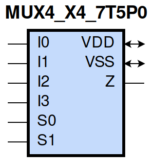
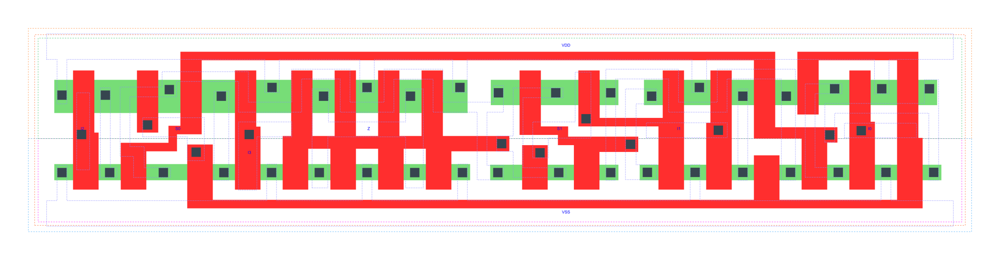

=======================================
gf180mcu_fd_sc_mcu7t5v0__mux4_x4
=======================================

**gf180mcu_fd_sc_mcu7t5v0__mux4_x4 symbol**

**gf180mcu_fd_sc_mcu7t5v0__mux4_x4 schematic**

**gf180mcu_fd_sc_mcu7t5v0__mux4_x4 layout**

.. include:: images.rst

MUX4_X4 is a 4-to-1 multiplexer, 4X drive strength
|
| Attributes

============= ======================
**Attribute** **Value**
area          83.417600 µm\ :sup:`2`
============= ======================

|
| OUTPUT FUNCTIONS

============== =========================================================
**Output Pin** **Function**
Z              ((I0&(!S0)&(!S1))|(I1&S0&(!S1))|(I2&(!S0)&S1)|(I3&S0&S1))
============== =========================================================

|
| TRUTH TABLE FOR Z

====== ====== ====== ====== ====== ====== =====
**I0** **I1** **I2** **I3** **S0** **S1** **Z**
1      ?      ?      ?      0      0      1
?      1      ?      ?      1      0      1
?      ?      1      ?      0      1      1
?      ?      ?      1      1      1      1
0      ?      ?      ?      0      0      0
?      0      ?      ?      1      0      0
?      ?      0      ?      0      1      0
?      ?      ?      0      1      1      0
====== ====== ====== ====== ====== ====== =====

|
| FUNCTIONAL SCHEMATIC
| |image461|
| PIN CAPACITANCE (pf)

======= ======== ====================
**Pin** **Type** **Capacitance (pf)**
I2      input    0.0031
S0      input    0.0110
I3      input    0.0034
S1      input    0.0058
I1      input    0.0029
I0      input    0.0028
======= ======== ====================

|
| DELAY AND OUTPUT TRANSITION TIME corresponding to min slew and load

+---------------+------------+---------------------+--------------+-------------------+----------------+---------------+
| **Input Pin** | **Output** | **When Condition**  | **Tin (ns)** | **Out Load (pf)** | **Delay (ns)** | **Tout (ns)** |
+---------------+------------+---------------------+--------------+-------------------+----------------+---------------+
| I2(HL)        | Z(HL)      | !I0&!I1&!I3&!S0&S1  | 0.0100       | 0.0010            | 0.5595         | 0.0964        |
+---------------+------------+---------------------+--------------+-------------------+----------------+---------------+
| I2(HL)        | Z(HL)      | !I0&!I1&I3&!S0&S1   | 0.0100       | 0.0010            | 0.5597         | 0.0965        |
+---------------+------------+---------------------+--------------+-------------------+----------------+---------------+
| I2(HL)        | Z(HL)      | !I0&I1&!I3&!S0&S1   | 0.0100       | 0.0010            | 0.5597         | 0.0964        |
+---------------+------------+---------------------+--------------+-------------------+----------------+---------------+
| I2(HL)        | Z(HL)      | !I0&I1&I3&!S0&S1    | 0.0100       | 0.0010            | 0.5597         | 0.0965        |
+---------------+------------+---------------------+--------------+-------------------+----------------+---------------+
| I2(HL)        | Z(HL)      | I0&!I1&!I3&!S0&S1   | 0.0100       | 0.0010            | 0.5595         | 0.0963        |
+---------------+------------+---------------------+--------------+-------------------+----------------+---------------+
| I2(HL)        | Z(HL)      | I0&!I1&I3&!S0&S1    | 0.0100       | 0.0010            | 0.5598         | 0.0963        |
+---------------+------------+---------------------+--------------+-------------------+----------------+---------------+
| I2(HL)        | Z(HL)      | I0&I1&!I3&!S0&S1    | 0.0100       | 0.0010            | 0.5595         | 0.0964        |
+---------------+------------+---------------------+--------------+-------------------+----------------+---------------+
| I2(HL)        | Z(HL)      | I0&I1&I3&!S0&S1     | 0.0100       | 0.0010            | 0.5597         | 0.0965        |
+---------------+------------+---------------------+--------------+-------------------+----------------+---------------+
| I2(LH)        | Z(LH)      | !I0&!I1&!I3&!S0&S1  | 0.0100       | 0.0010            | 0.5966         | 0.0778        |
+---------------+------------+---------------------+--------------+-------------------+----------------+---------------+
| I2(LH)        | Z(LH)      | !I0&!I1&I3&!S0&S1   | 0.0100       | 0.0010            | 0.5966         | 0.0778        |
+---------------+------------+---------------------+--------------+-------------------+----------------+---------------+
| I2(LH)        | Z(LH)      | !I0&I1&!I3&!S0&S1   | 0.0100       | 0.0010            | 0.5966         | 0.0778        |
+---------------+------------+---------------------+--------------+-------------------+----------------+---------------+
| I2(LH)        | Z(LH)      | !I0&I1&I3&!S0&S1    | 0.0100       | 0.0010            | 0.5966         | 0.0778        |
+---------------+------------+---------------------+--------------+-------------------+----------------+---------------+
| I2(LH)        | Z(LH)      | I0&!I1&!I3&!S0&S1   | 0.0100       | 0.0010            | 0.5966         | 0.0778        |
+---------------+------------+---------------------+--------------+-------------------+----------------+---------------+
| I2(LH)        | Z(LH)      | I0&!I1&I3&!S0&S1    | 0.0100       | 0.0010            | 0.5966         | 0.0778        |
+---------------+------------+---------------------+--------------+-------------------+----------------+---------------+
| I2(LH)        | Z(LH)      | I0&I1&!I3&!S0&S1    | 0.0100       | 0.0010            | 0.5966         | 0.0778        |
+---------------+------------+---------------------+--------------+-------------------+----------------+---------------+
| I2(LH)        | Z(LH)      | I0&I1&I3&!S0&S1     | 0.0100       | 0.0010            | 0.5966         | 0.0778        |
+---------------+------------+---------------------+--------------+-------------------+----------------+---------------+
| S0(HL)        | Z(LH)      | !I0&!I1&I2&!I3&S1   | 0.0100       | 0.0010            | 0.6921         | 0.0784        |
+---------------+------------+---------------------+--------------+-------------------+----------------+---------------+
| S0(HL)        | Z(LH)      | !I0&I1&I2&!I3&S1    | 0.0100       | 0.0010            | 0.6807         | 0.0787        |
+---------------+------------+---------------------+--------------+-------------------+----------------+---------------+
| S0(HL)        | Z(LH)      | I0&!I1&!I2&!I3&!S1  | 0.0100       | 0.0010            | 0.6776         | 0.0771        |
+---------------+------------+---------------------+--------------+-------------------+----------------+---------------+
| S0(HL)        | Z(LH)      | I0&!I1&!I2&I3&!S1   | 0.0100       | 0.0010            | 0.6626         | 0.0770        |
+---------------+------------+---------------------+--------------+-------------------+----------------+---------------+
| S0(HL)        | Z(LH)      | I0&!I1&I2&!I3&!S1   | 0.0100       | 0.0010            | 0.6863         | 0.0773        |
+---------------+------------+---------------------+--------------+-------------------+----------------+---------------+
| S0(HL)        | Z(LH)      | I0&!I1&I2&!I3&S1    | 0.0100       | 0.0010            | 0.7000         | 0.0785        |
+---------------+------------+---------------------+--------------+-------------------+----------------+---------------+
| S0(HL)        | Z(LH)      | I0&!I1&I2&I3&!S1    | 0.0100       | 0.0010            | 0.6717         | 0.0771        |
+---------------+------------+---------------------+--------------+-------------------+----------------+---------------+
| S0(HL)        | Z(LH)      | I0&I1&I2&!I3&S1     | 0.0100       | 0.0010            | 0.6887         | 0.0784        |
+---------------+------------+---------------------+--------------+-------------------+----------------+---------------+
| S0(HL)        | Z(HL)      | !I0&!I1&!I2&I3&S1   | 0.0100       | 0.0010            | 0.5909         | 0.0969        |
+---------------+------------+---------------------+--------------+-------------------+----------------+---------------+
| S0(HL)        | Z(HL)      | !I0&I1&!I2&!I3&!S1  | 0.0100       | 0.0010            | 0.6342         | 0.1044        |
+---------------+------------+---------------------+--------------+-------------------+----------------+---------------+
| S0(HL)        | Z(HL)      | !I0&I1&!I2&I3&!S1   | 0.0100       | 0.0010            | 0.6235         | 0.1040        |
+---------------+------------+---------------------+--------------+-------------------+----------------+---------------+
| S0(HL)        | Z(HL)      | !I0&I1&!I2&I3&S1    | 0.0100       | 0.0010            | 0.5842         | 0.0967        |
+---------------+------------+---------------------+--------------+-------------------+----------------+---------------+
| S0(HL)        | Z(HL)      | !I0&I1&I2&!I3&!S1   | 0.0100       | 0.0010            | 0.6408         | 0.1044        |
+---------------+------------+---------------------+--------------+-------------------+----------------+---------------+
| S0(HL)        | Z(HL)      | !I0&I1&I2&I3&!S1    | 0.0100       | 0.0010            | 0.6303         | 0.1044        |
+---------------+------------+---------------------+--------------+-------------------+----------------+---------------+
| S0(HL)        | Z(HL)      | I0&!I1&!I2&I3&S1    | 0.0100       | 0.0010            | 0.5955         | 0.0972        |
+---------------+------------+---------------------+--------------+-------------------+----------------+---------------+
| S0(HL)        | Z(HL)      | I0&I1&!I2&I3&S1     | 0.0100       | 0.0010            | 0.5891         | 0.0969        |
+---------------+------------+---------------------+--------------+-------------------+----------------+---------------+
| S0(LH)        | Z(LH)      | !I0&!I1&!I2&I3&S1   | 0.0100       | 0.0010            | 0.5633         | 0.0777        |
+---------------+------------+---------------------+--------------+-------------------+----------------+---------------+
| S0(LH)        | Z(LH)      | !I0&I1&!I2&!I3&!S1  | 0.0100       | 0.0010            | 0.5356         | 0.0757        |
+---------------+------------+---------------------+--------------+-------------------+----------------+---------------+
| S0(LH)        | Z(LH)      | !I0&I1&!I2&I3&!S1   | 0.0100       | 0.0010            | 0.5349         | 0.0762        |
+---------------+------------+---------------------+--------------+-------------------+----------------+---------------+
| S0(LH)        | Z(LH)      | !I0&I1&!I2&I3&S1    | 0.0100       | 0.0010            | 0.5618         | 0.0773        |
+---------------+------------+---------------------+--------------+-------------------+----------------+---------------+
| S0(LH)        | Z(LH)      | !I0&I1&I2&!I3&!S1   | 0.0100       | 0.0010            | 0.5357         | 0.0758        |
+---------------+------------+---------------------+--------------+-------------------+----------------+---------------+
| S0(LH)        | Z(LH)      | !I0&I1&I2&I3&!S1    | 0.0100       | 0.0010            | 0.5355         | 0.0762        |
+---------------+------------+---------------------+--------------+-------------------+----------------+---------------+
| S0(LH)        | Z(LH)      | I0&!I1&!I2&I3&S1    | 0.0100       | 0.0010            | 0.5639         | 0.0774        |
+---------------+------------+---------------------+--------------+-------------------+----------------+---------------+
| S0(LH)        | Z(LH)      | I0&I1&!I2&I3&S1     | 0.0100       | 0.0010            | 0.5631         | 0.0773        |
+---------------+------------+---------------------+--------------+-------------------+----------------+---------------+
| S0(LH)        | Z(HL)      | !I0&!I1&I2&!I3&S1   | 0.0100       | 0.0010            | 0.5627         | 0.0966        |
+---------------+------------+---------------------+--------------+-------------------+----------------+---------------+
| S0(LH)        | Z(HL)      | !I0&I1&I2&!I3&S1    | 0.0100       | 0.0010            | 0.5581         | 0.0967        |
+---------------+------------+---------------------+--------------+-------------------+----------------+---------------+
| S0(LH)        | Z(HL)      | I0&!I1&!I2&!I3&!S1  | 0.0100       | 0.0010            | 0.5906         | 0.1040        |
+---------------+------------+---------------------+--------------+-------------------+----------------+---------------+
| S0(LH)        | Z(HL)      | I0&!I1&!I2&I3&!S1   | 0.0100       | 0.0010            | 0.5858         | 0.1040        |
+---------------+------------+---------------------+--------------+-------------------+----------------+---------------+
| S0(LH)        | Z(HL)      | I0&!I1&I2&!I3&!S1   | 0.0100       | 0.0010            | 0.5917         | 0.1043        |
+---------------+------------+---------------------+--------------+-------------------+----------------+---------------+
| S0(LH)        | Z(HL)      | I0&!I1&I2&!I3&S1    | 0.0100       | 0.0010            | 0.5646         | 0.0966        |
+---------------+------------+---------------------+--------------+-------------------+----------------+---------------+
| S0(LH)        | Z(HL)      | I0&!I1&I2&I3&!S1    | 0.0100       | 0.0010            | 0.5895         | 0.1041        |
+---------------+------------+---------------------+--------------+-------------------+----------------+---------------+
| S0(LH)        | Z(HL)      | I0&I1&I2&!I3&S1     | 0.0100       | 0.0010            | 0.5623         | 0.0966        |
+---------------+------------+---------------------+--------------+-------------------+----------------+---------------+
| I3(LH)        | Z(LH)      | !I0&!I1&!I2&S0&S1   | 0.0100       | 0.0010            | 0.5910         | 0.0778        |
+---------------+------------+---------------------+--------------+-------------------+----------------+---------------+
| I3(LH)        | Z(LH)      | !I0&!I1&I2&S0&S1    | 0.0100       | 0.0010            | 0.5909         | 0.0778        |
+---------------+------------+---------------------+--------------+-------------------+----------------+---------------+
| I3(LH)        | Z(LH)      | !I0&I1&!I2&S0&S1    | 0.0100       | 0.0010            | 0.5907         | 0.0776        |
+---------------+------------+---------------------+--------------+-------------------+----------------+---------------+
| I3(LH)        | Z(LH)      | !I0&I1&I2&S0&S1     | 0.0100       | 0.0010            | 0.5909         | 0.0778        |
+---------------+------------+---------------------+--------------+-------------------+----------------+---------------+
| I3(LH)        | Z(LH)      | I0&!I1&!I2&S0&S1    | 0.0100       | 0.0010            | 0.5909         | 0.0778        |
+---------------+------------+---------------------+--------------+-------------------+----------------+---------------+
| I3(LH)        | Z(LH)      | I0&!I1&I2&S0&S1     | 0.0100       | 0.0010            | 0.5909         | 0.0778        |
+---------------+------------+---------------------+--------------+-------------------+----------------+---------------+
| I3(LH)        | Z(LH)      | I0&I1&!I2&S0&S1     | 0.0100       | 0.0010            | 0.5907         | 0.0776        |
+---------------+------------+---------------------+--------------+-------------------+----------------+---------------+
| I3(LH)        | Z(LH)      | I0&I1&I2&S0&S1      | 0.0100       | 0.0010            | 0.5909         | 0.0778        |
+---------------+------------+---------------------+--------------+-------------------+----------------+---------------+
| I3(HL)        | Z(HL)      | !I0&!I1&!I2&S0&S1   | 0.0100       | 0.0010            | 0.5607         | 0.0963        |
+---------------+------------+---------------------+--------------+-------------------+----------------+---------------+
| I3(HL)        | Z(HL)      | !I0&!I1&I2&S0&S1    | 0.0100       | 0.0010            | 0.5607         | 0.0963        |
+---------------+------------+---------------------+--------------+-------------------+----------------+---------------+
| I3(HL)        | Z(HL)      | !I0&I1&!I2&S0&S1    | 0.0100       | 0.0010            | 0.5607         | 0.0963        |
+---------------+------------+---------------------+--------------+-------------------+----------------+---------------+
| I3(HL)        | Z(HL)      | !I0&I1&I2&S0&S1     | 0.0100       | 0.0010            | 0.5607         | 0.0963        |
+---------------+------------+---------------------+--------------+-------------------+----------------+---------------+
| I3(HL)        | Z(HL)      | I0&!I1&!I2&S0&S1    | 0.0100       | 0.0010            | 0.5607         | 0.0963        |
+---------------+------------+---------------------+--------------+-------------------+----------------+---------------+
| I3(HL)        | Z(HL)      | I0&!I1&I2&S0&S1     | 0.0100       | 0.0010            | 0.5607         | 0.0963        |
+---------------+------------+---------------------+--------------+-------------------+----------------+---------------+
| I3(HL)        | Z(HL)      | I0&I1&!I2&S0&S1     | 0.0100       | 0.0010            | 0.5607         | 0.0963        |
+---------------+------------+---------------------+--------------+-------------------+----------------+---------------+
| I3(HL)        | Z(HL)      | I0&I1&I2&S0&S1      | 0.0100       | 0.0010            | 0.5607         | 0.0963        |
+---------------+------------+---------------------+--------------+-------------------+----------------+---------------+
| S1(LH)        | Z(HL)      | !I0&I1&!I2&!I3&S0   | 0.0100       | 0.0010            | 0.3338         | 0.0858        |
+---------------+------------+---------------------+--------------+-------------------+----------------+---------------+
| S1(LH)        | Z(HL)      | !I0&I1&I2&!I3&S0    | 0.0100       | 0.0010            | 0.3338         | 0.0855        |
+---------------+------------+---------------------+--------------+-------------------+----------------+---------------+
| S1(LH)        | Z(HL)      | I0&!I1&!I2&!I3&!S0  | 0.0100       | 0.0010            | 0.3344         | 0.0857        |
+---------------+------------+---------------------+--------------+-------------------+----------------+---------------+
| S1(LH)        | Z(HL)      | I0&!I1&!I2&I3&!S0   | 0.0100       | 0.0010            | 0.3343         | 0.0859        |
+---------------+------------+---------------------+--------------+-------------------+----------------+---------------+
| S1(LH)        | Z(HL)      | I0&I1&!I2&!I3&!S0   | 0.0100       | 0.0010            | 0.3343         | 0.0858        |
+---------------+------------+---------------------+--------------+-------------------+----------------+---------------+
| S1(LH)        | Z(HL)      | I0&I1&!I2&!I3&S0    | 0.0100       | 0.0010            | 0.3338         | 0.0855        |
+---------------+------------+---------------------+--------------+-------------------+----------------+---------------+
| S1(LH)        | Z(HL)      | I0&I1&!I2&I3&!S0    | 0.0100       | 0.0010            | 0.3344         | 0.0857        |
+---------------+------------+---------------------+--------------+-------------------+----------------+---------------+
| S1(LH)        | Z(HL)      | I0&I1&I2&!I3&S0     | 0.0100       | 0.0010            | 0.3338         | 0.0857        |
+---------------+------------+---------------------+--------------+-------------------+----------------+---------------+
| S1(LH)        | Z(LH)      | !I0&!I1&!I2&I3&S0   | 0.0100       | 0.0010            | 0.3508         | 0.0761        |
+---------------+------------+---------------------+--------------+-------------------+----------------+---------------+
| S1(LH)        | Z(LH)      | !I0&!I1&I2&!I3&!S0  | 0.0100       | 0.0010            | 0.3505         | 0.0756        |
+---------------+------------+---------------------+--------------+-------------------+----------------+---------------+
| S1(LH)        | Z(LH)      | !I0&!I1&I2&I3&!S0   | 0.0100       | 0.0010            | 0.3505         | 0.0756        |
+---------------+------------+---------------------+--------------+-------------------+----------------+---------------+
| S1(LH)        | Z(LH)      | !I0&!I1&I2&I3&S0    | 0.0100       | 0.0010            | 0.3510         | 0.0756        |
+---------------+------------+---------------------+--------------+-------------------+----------------+---------------+
| S1(LH)        | Z(LH)      | !I0&I1&I2&!I3&!S0   | 0.0100       | 0.0010            | 0.3505         | 0.0756        |
+---------------+------------+---------------------+--------------+-------------------+----------------+---------------+
| S1(LH)        | Z(LH)      | !I0&I1&I2&I3&!S0    | 0.0100       | 0.0010            | 0.3505         | 0.0756        |
+---------------+------------+---------------------+--------------+-------------------+----------------+---------------+
| S1(LH)        | Z(LH)      | I0&!I1&!I2&I3&S0    | 0.0100       | 0.0010            | 0.3510         | 0.0756        |
+---------------+------------+---------------------+--------------+-------------------+----------------+---------------+
| S1(LH)        | Z(LH)      | I0&!I1&I2&I3&S0     | 0.0100       | 0.0010            | 0.3510         | 0.0756        |
+---------------+------------+---------------------+--------------+-------------------+----------------+---------------+
| S1(HL)        | Z(HL)      | !I0&!I1&!I2&I3&S0   | 0.0100       | 0.0010            | 0.3931         | 0.0936        |
+---------------+------------+---------------------+--------------+-------------------+----------------+---------------+
| S1(HL)        | Z(HL)      | !I0&!I1&I2&!I3&!S0  | 0.0100       | 0.0010            | 0.3927         | 0.0936        |
+---------------+------------+---------------------+--------------+-------------------+----------------+---------------+
| S1(HL)        | Z(HL)      | !I0&!I1&I2&I3&!S0   | 0.0100       | 0.0010            | 0.3927         | 0.0936        |
+---------------+------------+---------------------+--------------+-------------------+----------------+---------------+
| S1(HL)        | Z(HL)      | !I0&!I1&I2&I3&S0    | 0.0100       | 0.0010            | 0.3931         | 0.0936        |
+---------------+------------+---------------------+--------------+-------------------+----------------+---------------+
| S1(HL)        | Z(HL)      | !I0&I1&I2&!I3&!S0   | 0.0100       | 0.0010            | 0.3927         | 0.0936        |
+---------------+------------+---------------------+--------------+-------------------+----------------+---------------+
| S1(HL)        | Z(HL)      | !I0&I1&I2&I3&!S0    | 0.0100       | 0.0010            | 0.3927         | 0.0936        |
+---------------+------------+---------------------+--------------+-------------------+----------------+---------------+
| S1(HL)        | Z(HL)      | I0&!I1&!I2&I3&S0    | 0.0100       | 0.0010            | 0.3931         | 0.0936        |
+---------------+------------+---------------------+--------------+-------------------+----------------+---------------+
| S1(HL)        | Z(HL)      | I0&!I1&I2&I3&S0     | 0.0100       | 0.0010            | 0.3931         | 0.0936        |
+---------------+------------+---------------------+--------------+-------------------+----------------+---------------+
| S1(HL)        | Z(LH)      | !I0&I1&!I2&!I3&S0   | 0.0100       | 0.0010            | 0.4412         | 0.0749        |
+---------------+------------+---------------------+--------------+-------------------+----------------+---------------+
| S1(HL)        | Z(LH)      | !I0&I1&I2&!I3&S0    | 0.0100       | 0.0010            | 0.4412         | 0.0749        |
+---------------+------------+---------------------+--------------+-------------------+----------------+---------------+
| S1(HL)        | Z(LH)      | I0&!I1&!I2&!I3&!S0  | 0.0100       | 0.0010            | 0.4405         | 0.0750        |
+---------------+------------+---------------------+--------------+-------------------+----------------+---------------+
| S1(HL)        | Z(LH)      | I0&!I1&!I2&I3&!S0   | 0.0100       | 0.0010            | 0.4405         | 0.0750        |
+---------------+------------+---------------------+--------------+-------------------+----------------+---------------+
| S1(HL)        | Z(LH)      | I0&I1&!I2&!I3&!S0   | 0.0100       | 0.0010            | 0.4405         | 0.0750        |
+---------------+------------+---------------------+--------------+-------------------+----------------+---------------+
| S1(HL)        | Z(LH)      | I0&I1&!I2&!I3&S0    | 0.0100       | 0.0010            | 0.4412         | 0.0749        |
+---------------+------------+---------------------+--------------+-------------------+----------------+---------------+
| S1(HL)        | Z(LH)      | I0&I1&!I2&I3&!S0    | 0.0100       | 0.0010            | 0.4405         | 0.0750        |
+---------------+------------+---------------------+--------------+-------------------+----------------+---------------+
| S1(HL)        | Z(LH)      | I0&I1&I2&!I3&S0     | 0.0100       | 0.0010            | 0.4412         | 0.0749        |
+---------------+------------+---------------------+--------------+-------------------+----------------+---------------+
| I1(LH)        | Z(LH)      | !I0&!I2&!I3&S0&!S1  | 0.0100       | 0.0010            | 0.5569         | 0.0762        |
+---------------+------------+---------------------+--------------+-------------------+----------------+---------------+
| I1(LH)        | Z(LH)      | !I0&!I2&I3&S0&!S1   | 0.0100       | 0.0010            | 0.5568         | 0.0761        |
+---------------+------------+---------------------+--------------+-------------------+----------------+---------------+
| I1(LH)        | Z(LH)      | !I0&I2&!I3&S0&!S1   | 0.0100       | 0.0010            | 0.5569         | 0.0761        |
+---------------+------------+---------------------+--------------+-------------------+----------------+---------------+
| I1(LH)        | Z(LH)      | !I0&I2&I3&S0&!S1    | 0.0100       | 0.0010            | 0.5568         | 0.0761        |
+---------------+------------+---------------------+--------------+-------------------+----------------+---------------+
| I1(LH)        | Z(LH)      | I0&!I2&!I3&S0&!S1   | 0.0100       | 0.0010            | 0.5569         | 0.0761        |
+---------------+------------+---------------------+--------------+-------------------+----------------+---------------+
| I1(LH)        | Z(LH)      | I0&!I2&I3&S0&!S1    | 0.0100       | 0.0010            | 0.5568         | 0.0761        |
+---------------+------------+---------------------+--------------+-------------------+----------------+---------------+
| I1(LH)        | Z(LH)      | I0&I2&!I3&S0&!S1    | 0.0100       | 0.0010            | 0.5569         | 0.0761        |
+---------------+------------+---------------------+--------------+-------------------+----------------+---------------+
| I1(LH)        | Z(LH)      | I0&I2&I3&S0&!S1     | 0.0100       | 0.0010            | 0.5568         | 0.0761        |
+---------------+------------+---------------------+--------------+-------------------+----------------+---------------+
| I1(HL)        | Z(HL)      | !I0&!I2&!I3&S0&!S1  | 0.0100       | 0.0010            | 0.5981         | 0.1039        |
+---------------+------------+---------------------+--------------+-------------------+----------------+---------------+
| I1(HL)        | Z(HL)      | !I0&!I2&I3&S0&!S1   | 0.0100       | 0.0010            | 0.5979         | 0.1042        |
+---------------+------------+---------------------+--------------+-------------------+----------------+---------------+
| I1(HL)        | Z(HL)      | !I0&I2&!I3&S0&!S1   | 0.0100       | 0.0010            | 0.5979         | 0.1042        |
+---------------+------------+---------------------+--------------+-------------------+----------------+---------------+
| I1(HL)        | Z(HL)      | !I0&I2&I3&S0&!S1    | 0.0100       | 0.0010            | 0.5979         | 0.1042        |
+---------------+------------+---------------------+--------------+-------------------+----------------+---------------+
| I1(HL)        | Z(HL)      | I0&!I2&!I3&S0&!S1   | 0.0100       | 0.0010            | 0.5979         | 0.1042        |
+---------------+------------+---------------------+--------------+-------------------+----------------+---------------+
| I1(HL)        | Z(HL)      | I0&!I2&I3&S0&!S1    | 0.0100       | 0.0010            | 0.5980         | 0.1041        |
+---------------+------------+---------------------+--------------+-------------------+----------------+---------------+
| I1(HL)        | Z(HL)      | I0&I2&!I3&S0&!S1    | 0.0100       | 0.0010            | 0.5981         | 0.1039        |
+---------------+------------+---------------------+--------------+-------------------+----------------+---------------+
| I1(HL)        | Z(HL)      | I0&I2&I3&S0&!S1     | 0.0100       | 0.0010            | 0.5981         | 0.1039        |
+---------------+------------+---------------------+--------------+-------------------+----------------+---------------+
| I0(LH)        | Z(LH)      | !I1&!I2&!I3&!S0&!S1 | 0.0100       | 0.0010            | 0.5663         | 0.0763        |
+---------------+------------+---------------------+--------------+-------------------+----------------+---------------+
| I0(LH)        | Z(LH)      | !I1&!I2&I3&!S0&!S1  | 0.0100       | 0.0010            | 0.5663         | 0.0764        |
+---------------+------------+---------------------+--------------+-------------------+----------------+---------------+
| I0(LH)        | Z(LH)      | !I1&I2&!I3&!S0&!S1  | 0.0100       | 0.0010            | 0.5662         | 0.0763        |
+---------------+------------+---------------------+--------------+-------------------+----------------+---------------+
| I0(LH)        | Z(LH)      | !I1&I2&I3&!S0&!S1   | 0.0100       | 0.0010            | 0.5662         | 0.0763        |
+---------------+------------+---------------------+--------------+-------------------+----------------+---------------+
| I0(LH)        | Z(LH)      | I1&!I2&!I3&!S0&!S1  | 0.0100       | 0.0010            | 0.5663         | 0.0763        |
+---------------+------------+---------------------+--------------+-------------------+----------------+---------------+
| I0(LH)        | Z(LH)      | I1&!I2&I3&!S0&!S1   | 0.0100       | 0.0010            | 0.5665         | 0.0762        |
+---------------+------------+---------------------+--------------+-------------------+----------------+---------------+
| I0(LH)        | Z(LH)      | I1&I2&!I3&!S0&!S1   | 0.0100       | 0.0010            | 0.5663         | 0.0763        |
+---------------+------------+---------------------+--------------+-------------------+----------------+---------------+
| I0(LH)        | Z(LH)      | I1&I2&I3&!S0&!S1    | 0.0100       | 0.0010            | 0.5662         | 0.0763        |
+---------------+------------+---------------------+--------------+-------------------+----------------+---------------+
| I0(HL)        | Z(HL)      | !I1&!I2&!I3&!S0&!S1 | 0.0100       | 0.0010            | 0.6047         | 0.1042        |
+---------------+------------+---------------------+--------------+-------------------+----------------+---------------+
| I0(HL)        | Z(HL)      | !I1&!I2&I3&!S0&!S1  | 0.0100       | 0.0010            | 0.6047         | 0.1042        |
+---------------+------------+---------------------+--------------+-------------------+----------------+---------------+
| I0(HL)        | Z(HL)      | !I1&I2&!I3&!S0&!S1  | 0.0100       | 0.0010            | 0.6045         | 0.1042        |
+---------------+------------+---------------------+--------------+-------------------+----------------+---------------+
| I0(HL)        | Z(HL)      | !I1&I2&I3&!S0&!S1   | 0.0100       | 0.0010            | 0.6045         | 0.1042        |
+---------------+------------+---------------------+--------------+-------------------+----------------+---------------+
| I0(HL)        | Z(HL)      | I1&!I2&!I3&!S0&!S1  | 0.0100       | 0.0010            | 0.6047         | 0.1042        |
+---------------+------------+---------------------+--------------+-------------------+----------------+---------------+
| I0(HL)        | Z(HL)      | I1&!I2&I3&!S0&!S1   | 0.0100       | 0.0010            | 0.6047         | 0.1042        |
+---------------+------------+---------------------+--------------+-------------------+----------------+---------------+
| I0(HL)        | Z(HL)      | I1&I2&!I3&!S0&!S1   | 0.0100       | 0.0010            | 0.6045         | 0.1042        |
+---------------+------------+---------------------+--------------+-------------------+----------------+---------------+
| I0(HL)        | Z(HL)      | I1&I2&I3&!S0&!S1    | 0.0100       | 0.0010            | 0.6045         | 0.1042        |
+---------------+------------+---------------------+--------------+-------------------+----------------+---------------+

|
| DYNAMIC ENERGY

+---------------+---------------------+--------------+------------+-------------------+---------------------+
| **Input Pin** | **When Condition**  | **Tin (ns)** | **Output** | **Out Load (pf)** | **Energy (uW/MHz)** |
+---------------+---------------------+--------------+------------+-------------------+---------------------+
| S1            | !I0&I1&!I2&!I3&S0   | 0.0100       | Z(HL)      | 0.0010            | 0.6478              |
+---------------+---------------------+--------------+------------+-------------------+---------------------+
| S1            | !I0&I1&I2&!I3&S0    | 0.0100       | Z(HL)      | 0.0010            | 0.6478              |
+---------------+---------------------+--------------+------------+-------------------+---------------------+
| S1            | I0&!I1&!I2&!I3&!S0  | 0.0100       | Z(HL)      | 0.0010            | 0.6485              |
+---------------+---------------------+--------------+------------+-------------------+---------------------+
| S1            | I0&!I1&!I2&I3&!S0   | 0.0100       | Z(HL)      | 0.0010            | 0.6486              |
+---------------+---------------------+--------------+------------+-------------------+---------------------+
| S1            | I0&I1&!I2&!I3&!S0   | 0.0100       | Z(HL)      | 0.0010            | 0.6485              |
+---------------+---------------------+--------------+------------+-------------------+---------------------+
| S1            | I0&I1&!I2&!I3&S0    | 0.0100       | Z(HL)      | 0.0010            | 0.6478              |
+---------------+---------------------+--------------+------------+-------------------+---------------------+
| S1            | I0&I1&!I2&I3&!S0    | 0.0100       | Z(HL)      | 0.0010            | 0.6486              |
+---------------+---------------------+--------------+------------+-------------------+---------------------+
| S1            | I0&I1&I2&!I3&S0     | 0.0100       | Z(HL)      | 0.0010            | 0.6478              |
+---------------+---------------------+--------------+------------+-------------------+---------------------+
| S1            | !I0&!I1&!I2&I3&S0   | 0.0100       | Z(HL)      | 0.0010            | 0.7847              |
+---------------+---------------------+--------------+------------+-------------------+---------------------+
| S1            | !I0&!I1&I2&!I3&!S0  | 0.0100       | Z(HL)      | 0.0010            | 0.7848              |
+---------------+---------------------+--------------+------------+-------------------+---------------------+
| S1            | !I0&!I1&I2&I3&!S0   | 0.0100       | Z(HL)      | 0.0010            | 0.7848              |
+---------------+---------------------+--------------+------------+-------------------+---------------------+
| S1            | !I0&!I1&I2&I3&S0    | 0.0100       | Z(HL)      | 0.0010            | 0.7847              |
+---------------+---------------------+--------------+------------+-------------------+---------------------+
| S1            | !I0&I1&I2&!I3&!S0   | 0.0100       | Z(HL)      | 0.0010            | 0.7848              |
+---------------+---------------------+--------------+------------+-------------------+---------------------+
| S1            | !I0&I1&I2&I3&!S0    | 0.0100       | Z(HL)      | 0.0010            | 0.7848              |
+---------------+---------------------+--------------+------------+-------------------+---------------------+
| S1            | I0&!I1&!I2&I3&S0    | 0.0100       | Z(HL)      | 0.0010            | 0.7847              |
+---------------+---------------------+--------------+------------+-------------------+---------------------+
| S1            | I0&!I1&I2&I3&S0     | 0.0100       | Z(HL)      | 0.0010            | 0.7847              |
+---------------+---------------------+--------------+------------+-------------------+---------------------+
| S1            | !I0&!I1&!I2&I3&S0   | 0.0100       | Z(LH)      | 0.0010            | 0.4821              |
+---------------+---------------------+--------------+------------+-------------------+---------------------+
| S1            | !I0&!I1&I2&!I3&!S0  | 0.0100       | Z(LH)      | 0.0010            | 0.4815              |
+---------------+---------------------+--------------+------------+-------------------+---------------------+
| S1            | !I0&!I1&I2&I3&!S0   | 0.0100       | Z(LH)      | 0.0010            | 0.4815              |
+---------------+---------------------+--------------+------------+-------------------+---------------------+
| S1            | !I0&!I1&I2&I3&S0    | 0.0100       | Z(LH)      | 0.0010            | 0.4818              |
+---------------+---------------------+--------------+------------+-------------------+---------------------+
| S1            | !I0&I1&I2&!I3&!S0   | 0.0100       | Z(LH)      | 0.0010            | 0.4815              |
+---------------+---------------------+--------------+------------+-------------------+---------------------+
| S1            | !I0&I1&I2&I3&!S0    | 0.0100       | Z(LH)      | 0.0010            | 0.4815              |
+---------------+---------------------+--------------+------------+-------------------+---------------------+
| S1            | I0&!I1&!I2&I3&S0    | 0.0100       | Z(LH)      | 0.0010            | 0.4818              |
+---------------+---------------------+--------------+------------+-------------------+---------------------+
| S1            | I0&!I1&I2&I3&S0     | 0.0100       | Z(LH)      | 0.0010            | 0.4818              |
+---------------+---------------------+--------------+------------+-------------------+---------------------+
| S1            | !I0&I1&!I2&!I3&S0   | 0.0100       | Z(LH)      | 0.0010            | 0.6288              |
+---------------+---------------------+--------------+------------+-------------------+---------------------+
| S1            | !I0&I1&I2&!I3&S0    | 0.0100       | Z(LH)      | 0.0010            | 0.6288              |
+---------------+---------------------+--------------+------------+-------------------+---------------------+
| S1            | I0&!I1&!I2&!I3&!S0  | 0.0100       | Z(LH)      | 0.0010            | 0.6288              |
+---------------+---------------------+--------------+------------+-------------------+---------------------+
| S1            | I0&!I1&!I2&I3&!S0   | 0.0100       | Z(LH)      | 0.0010            | 0.6288              |
+---------------+---------------------+--------------+------------+-------------------+---------------------+
| S1            | I0&I1&!I2&!I3&!S0   | 0.0100       | Z(LH)      | 0.0010            | 0.6288              |
+---------------+---------------------+--------------+------------+-------------------+---------------------+
| S1            | I0&I1&!I2&!I3&S0    | 0.0100       | Z(LH)      | 0.0010            | 0.6288              |
+---------------+---------------------+--------------+------------+-------------------+---------------------+
| S1            | I0&I1&!I2&I3&!S0    | 0.0100       | Z(LH)      | 0.0010            | 0.6288              |
+---------------+---------------------+--------------+------------+-------------------+---------------------+
| S1            | I0&I1&I2&!I3&S0     | 0.0100       | Z(LH)      | 0.0010            | 0.6288              |
+---------------+---------------------+--------------+------------+-------------------+---------------------+
| I0            | !I1&!I2&!I3&!S0&!S1 | 0.0100       | Z(LH)      | 0.0010            | 0.5778              |
+---------------+---------------------+--------------+------------+-------------------+---------------------+
| I0            | !I1&!I2&I3&!S0&!S1  | 0.0100       | Z(LH)      | 0.0010            | 0.5777              |
+---------------+---------------------+--------------+------------+-------------------+---------------------+
| I0            | !I1&I2&!I3&!S0&!S1  | 0.0100       | Z(LH)      | 0.0010            | 0.5778              |
+---------------+---------------------+--------------+------------+-------------------+---------------------+
| I0            | !I1&I2&I3&!S0&!S1   | 0.0100       | Z(LH)      | 0.0010            | 0.5778              |
+---------------+---------------------+--------------+------------+-------------------+---------------------+
| I0            | I1&!I2&!I3&!S0&!S1  | 0.0100       | Z(LH)      | 0.0010            | 0.5778              |
+---------------+---------------------+--------------+------------+-------------------+---------------------+
| I0            | I1&!I2&I3&!S0&!S1   | 0.0100       | Z(LH)      | 0.0010            | 0.5778              |
+---------------+---------------------+--------------+------------+-------------------+---------------------+
| I0            | I1&I2&!I3&!S0&!S1   | 0.0100       | Z(LH)      | 0.0010            | 0.5776              |
+---------------+---------------------+--------------+------------+-------------------+---------------------+
| I0            | I1&I2&I3&!S0&!S1    | 0.0100       | Z(LH)      | 0.0010            | 0.5778              |
+---------------+---------------------+--------------+------------+-------------------+---------------------+
| I3            | !I0&!I1&!I2&S0&S1   | 0.0100       | Z(LH)      | 0.0010            | 0.5680              |
+---------------+---------------------+--------------+------------+-------------------+---------------------+
| I3            | !I0&!I1&I2&S0&S1    | 0.0100       | Z(LH)      | 0.0010            | 0.5680              |
+---------------+---------------------+--------------+------------+-------------------+---------------------+
| I3            | !I0&I1&!I2&S0&S1    | 0.0100       | Z(LH)      | 0.0010            | 0.5679              |
+---------------+---------------------+--------------+------------+-------------------+---------------------+
| I3            | !I0&I1&I2&S0&S1     | 0.0100       | Z(LH)      | 0.0010            | 0.5680              |
+---------------+---------------------+--------------+------------+-------------------+---------------------+
| I3            | I0&!I1&!I2&S0&S1    | 0.0100       | Z(LH)      | 0.0010            | 0.5680              |
+---------------+---------------------+--------------+------------+-------------------+---------------------+
| I3            | I0&!I1&I2&S0&S1     | 0.0100       | Z(LH)      | 0.0010            | 0.5680              |
+---------------+---------------------+--------------+------------+-------------------+---------------------+
| I3            | I0&I1&!I2&S0&S1     | 0.0100       | Z(LH)      | 0.0010            | 0.5679              |
+---------------+---------------------+--------------+------------+-------------------+---------------------+
| I3            | I0&I1&I2&S0&S1      | 0.0100       | Z(LH)      | 0.0010            | 0.5680              |
+---------------+---------------------+--------------+------------+-------------------+---------------------+
| I2            | !I0&!I1&!I3&!S0&S1  | 0.0100       | Z(HL)      | 0.0010            | 0.9426              |
+---------------+---------------------+--------------+------------+-------------------+---------------------+
| I2            | !I0&!I1&I3&!S0&S1   | 0.0100       | Z(HL)      | 0.0010            | 0.9426              |
+---------------+---------------------+--------------+------------+-------------------+---------------------+
| I2            | !I0&I1&!I3&!S0&S1   | 0.0100       | Z(HL)      | 0.0010            | 0.9426              |
+---------------+---------------------+--------------+------------+-------------------+---------------------+
| I2            | !I0&I1&I3&!S0&S1    | 0.0100       | Z(HL)      | 0.0010            | 0.9426              |
+---------------+---------------------+--------------+------------+-------------------+---------------------+
| I2            | I0&!I1&!I3&!S0&S1   | 0.0100       | Z(HL)      | 0.0010            | 0.9426              |
+---------------+---------------------+--------------+------------+-------------------+---------------------+
| I2            | I0&!I1&I3&!S0&S1    | 0.0100       | Z(HL)      | 0.0010            | 0.9426              |
+---------------+---------------------+--------------+------------+-------------------+---------------------+
| I2            | I0&I1&!I3&!S0&S1    | 0.0100       | Z(HL)      | 0.0010            | 0.9426              |
+---------------+---------------------+--------------+------------+-------------------+---------------------+
| I2            | I0&I1&I3&!S0&S1     | 0.0100       | Z(HL)      | 0.0010            | 0.9426              |
+---------------+---------------------+--------------+------------+-------------------+---------------------+
| I1            | !I0&!I2&!I3&S0&!S1  | 0.0100       | Z(LH)      | 0.0010            | 0.5585              |
+---------------+---------------------+--------------+------------+-------------------+---------------------+
| I1            | !I0&!I2&I3&S0&!S1   | 0.0100       | Z(LH)      | 0.0010            | 0.5584              |
+---------------+---------------------+--------------+------------+-------------------+---------------------+
| I1            | !I0&I2&!I3&S0&!S1   | 0.0100       | Z(LH)      | 0.0010            | 0.5585              |
+---------------+---------------------+--------------+------------+-------------------+---------------------+
| I1            | !I0&I2&I3&S0&!S1    | 0.0100       | Z(LH)      | 0.0010            | 0.5584              |
+---------------+---------------------+--------------+------------+-------------------+---------------------+
| I1            | I0&!I2&!I3&S0&!S1   | 0.0100       | Z(LH)      | 0.0010            | 0.5585              |
+---------------+---------------------+--------------+------------+-------------------+---------------------+
| I1            | I0&!I2&I3&S0&!S1    | 0.0100       | Z(LH)      | 0.0010            | 0.5584              |
+---------------+---------------------+--------------+------------+-------------------+---------------------+
| I1            | I0&I2&!I3&S0&!S1    | 0.0100       | Z(LH)      | 0.0010            | 0.5585              |
+---------------+---------------------+--------------+------------+-------------------+---------------------+
| I1            | I0&I2&I3&S0&!S1     | 0.0100       | Z(LH)      | 0.0010            | 0.5584              |
+---------------+---------------------+--------------+------------+-------------------+---------------------+
| I3            | !I0&!I1&!I2&S0&S1   | 0.0100       | Z(HL)      | 0.0010            | 0.9602              |
+---------------+---------------------+--------------+------------+-------------------+---------------------+
| I3            | !I0&!I1&I2&S0&S1    | 0.0100       | Z(HL)      | 0.0010            | 0.9602              |
+---------------+---------------------+--------------+------------+-------------------+---------------------+
| I3            | !I0&I1&!I2&S0&S1    | 0.0100       | Z(HL)      | 0.0010            | 0.9602              |
+---------------+---------------------+--------------+------------+-------------------+---------------------+
| I3            | !I0&I1&I2&S0&S1     | 0.0100       | Z(HL)      | 0.0010            | 0.9602              |
+---------------+---------------------+--------------+------------+-------------------+---------------------+
| I3            | I0&!I1&!I2&S0&S1    | 0.0100       | Z(HL)      | 0.0010            | 0.9602              |
+---------------+---------------------+--------------+------------+-------------------+---------------------+
| I3            | I0&!I1&I2&S0&S1     | 0.0100       | Z(HL)      | 0.0010            | 0.9602              |
+---------------+---------------------+--------------+------------+-------------------+---------------------+
| I3            | I0&I1&!I2&S0&S1     | 0.0100       | Z(HL)      | 0.0010            | 0.9602              |
+---------------+---------------------+--------------+------------+-------------------+---------------------+
| I3            | I0&I1&I2&S0&S1      | 0.0100       | Z(HL)      | 0.0010            | 0.9602              |
+---------------+---------------------+--------------+------------+-------------------+---------------------+
| I0            | !I1&!I2&!I3&!S0&!S1 | 0.0100       | Z(HL)      | 0.0010            | 0.9395              |
+---------------+---------------------+--------------+------------+-------------------+---------------------+
| I0            | !I1&!I2&I3&!S0&!S1  | 0.0100       | Z(HL)      | 0.0010            | 0.9395              |
+---------------+---------------------+--------------+------------+-------------------+---------------------+
| I0            | !I1&I2&!I3&!S0&!S1  | 0.0100       | Z(HL)      | 0.0010            | 0.9395              |
+---------------+---------------------+--------------+------------+-------------------+---------------------+
| I0            | !I1&I2&I3&!S0&!S1   | 0.0100       | Z(HL)      | 0.0010            | 0.9395              |
+---------------+---------------------+--------------+------------+-------------------+---------------------+
| I0            | I1&!I2&!I3&!S0&!S1  | 0.0100       | Z(HL)      | 0.0010            | 0.9395              |
+---------------+---------------------+--------------+------------+-------------------+---------------------+
| I0            | I1&!I2&I3&!S0&!S1   | 0.0100       | Z(HL)      | 0.0010            | 0.9395              |
+---------------+---------------------+--------------+------------+-------------------+---------------------+
| I0            | I1&I2&!I3&!S0&!S1   | 0.0100       | Z(HL)      | 0.0010            | 0.9395              |
+---------------+---------------------+--------------+------------+-------------------+---------------------+
| I0            | I1&I2&I3&!S0&!S1    | 0.0100       | Z(HL)      | 0.0010            | 0.9395              |
+---------------+---------------------+--------------+------------+-------------------+---------------------+
| S0            | !I0&!I1&I2&!I3&S1   | 0.0100       | Z(LH)      | 0.0010            | 0.8473              |
+---------------+---------------------+--------------+------------+-------------------+---------------------+
| S0            | !I0&I1&I2&!I3&S1    | 0.0100       | Z(LH)      | 0.0010            | 0.9477              |
+---------------+---------------------+--------------+------------+-------------------+---------------------+
| S0            | I0&!I1&!I2&!I3&!S1  | 0.0100       | Z(LH)      | 0.0010            | 0.8317              |
+---------------+---------------------+--------------+------------+-------------------+---------------------+
| S0            | I0&!I1&!I2&I3&!S1   | 0.0100       | Z(LH)      | 0.0010            | 0.9725              |
+---------------+---------------------+--------------+------------+-------------------+---------------------+
| S0            | I0&!I1&I2&!I3&!S1   | 0.0100       | Z(LH)      | 0.0010            | 0.9277              |
+---------------+---------------------+--------------+------------+-------------------+---------------------+
| S0            | I0&!I1&I2&!I3&S1    | 0.0100       | Z(LH)      | 0.0010            | 0.9230              |
+---------------+---------------------+--------------+------------+-------------------+---------------------+
| S0            | I0&!I1&I2&I3&!S1    | 0.0100       | Z(LH)      | 0.0010            | 0.8240              |
+---------------+---------------------+--------------+------------+-------------------+---------------------+
| S0            | I0&I1&I2&!I3&S1     | 0.0100       | Z(LH)      | 0.0010            | 0.8433              |
+---------------+---------------------+--------------+------------+-------------------+---------------------+
| S0            | !I0&!I1&!I2&I3&S1   | 0.0100       | Z(LH)      | 0.0010            | 0.5507              |
+---------------+---------------------+--------------+------------+-------------------+---------------------+
| S0            | !I0&I1&!I2&!I3&!S1  | 0.0100       | Z(LH)      | 0.0010            | 0.5487              |
+---------------+---------------------+--------------+------------+-------------------+---------------------+
| S0            | !I0&I1&!I2&I3&!S1   | 0.0100       | Z(LH)      | 0.0010            | 0.5778              |
+---------------+---------------------+--------------+------------+-------------------+---------------------+
| S0            | !I0&I1&!I2&I3&S1    | 0.0100       | Z(LH)      | 0.0010            | 0.5723              |
+---------------+---------------------+--------------+------------+-------------------+---------------------+
| S0            | !I0&I1&I2&!I3&!S1   | 0.0100       | Z(LH)      | 0.0010            | 0.7599              |
+---------------+---------------------+--------------+------------+-------------------+---------------------+
| S0            | !I0&I1&I2&I3&!S1    | 0.0100       | Z(LH)      | 0.0010            | 0.5488              |
+---------------+---------------------+--------------+------------+-------------------+---------------------+
| S0            | I0&!I1&!I2&I3&S1    | 0.0100       | Z(LH)      | 0.0010            | 0.7163              |
+---------------+---------------------+--------------+------------+-------------------+---------------------+
| S0            | I0&I1&!I2&I3&S1     | 0.0100       | Z(LH)      | 0.0010            | 0.5505              |
+---------------+---------------------+--------------+------------+-------------------+---------------------+
| I2            | !I0&!I1&!I3&!S0&S1  | 0.0100       | Z(LH)      | 0.0010            | 0.5889              |
+---------------+---------------------+--------------+------------+-------------------+---------------------+
| I2            | !I0&!I1&I3&!S0&S1   | 0.0100       | Z(LH)      | 0.0010            | 0.5889              |
+---------------+---------------------+--------------+------------+-------------------+---------------------+
| I2            | !I0&I1&!I3&!S0&S1   | 0.0100       | Z(LH)      | 0.0010            | 0.5889              |
+---------------+---------------------+--------------+------------+-------------------+---------------------+
| I2            | !I0&I1&I3&!S0&S1    | 0.0100       | Z(LH)      | 0.0010            | 0.5889              |
+---------------+---------------------+--------------+------------+-------------------+---------------------+
| I2            | I0&!I1&!I3&!S0&S1   | 0.0100       | Z(LH)      | 0.0010            | 0.5889              |
+---------------+---------------------+--------------+------------+-------------------+---------------------+
| I2            | I0&!I1&I3&!S0&S1    | 0.0100       | Z(LH)      | 0.0010            | 0.5889              |
+---------------+---------------------+--------------+------------+-------------------+---------------------+
| I2            | I0&I1&!I3&!S0&S1    | 0.0100       | Z(LH)      | 0.0010            | 0.5889              |
+---------------+---------------------+--------------+------------+-------------------+---------------------+
| I2            | I0&I1&I3&!S0&S1     | 0.0100       | Z(LH)      | 0.0010            | 0.5889              |
+---------------+---------------------+--------------+------------+-------------------+---------------------+
| S0            | !I0&!I1&!I2&I3&S1   | 0.0100       | Z(HL)      | 0.0010            | 1.0971              |
+---------------+---------------------+--------------+------------+-------------------+---------------------+
| S0            | !I0&I1&!I2&!I3&!S1  | 0.0100       | Z(HL)      | 0.0010            | 1.0953              |
+---------------+---------------------+--------------+------------+-------------------+---------------------+
| S0            | !I0&I1&!I2&I3&!S1   | 0.0100       | Z(HL)      | 0.0010            | 1.2384              |
+---------------+---------------------+--------------+------------+-------------------+---------------------+
| S0            | !I0&I1&!I2&I3&S1    | 0.0100       | Z(HL)      | 0.0010            | 1.1996              |
+---------------+---------------------+--------------+------------+-------------------+---------------------+
| S0            | !I0&I1&I2&!I3&!S1   | 0.0100       | Z(HL)      | 0.0010            | 1.1866              |
+---------------+---------------------+--------------+------------+-------------------+---------------------+
| S0            | !I0&I1&I2&I3&!S1    | 0.0100       | Z(HL)      | 0.0010            | 1.0892              |
+---------------+---------------------+--------------+------------+-------------------+---------------------+
| S0            | I0&!I1&!I2&I3&S1    | 0.0100       | Z(HL)      | 0.0010            | 1.1670              |
+---------------+---------------------+--------------+------------+-------------------+---------------------+
| S0            | I0&I1&!I2&I3&S1     | 0.0100       | Z(HL)      | 0.0010            | 1.0940              |
+---------------+---------------------+--------------+------------+-------------------+---------------------+
| S0            | !I0&!I1&I2&!I3&S1   | 0.0100       | Z(HL)      | 0.0010            | 0.9296              |
+---------------+---------------------+--------------+------------+-------------------+---------------------+
| S0            | !I0&I1&I2&!I3&S1    | 0.0100       | Z(HL)      | 0.0010            | 0.9477              |
+---------------+---------------------+--------------+------------+-------------------+---------------------+
| S0            | I0&!I1&!I2&!I3&!S1  | 0.0100       | Z(HL)      | 0.0010            | 0.9248              |
+---------------+---------------------+--------------+------------+-------------------+---------------------+
| S0            | I0&!I1&!I2&I3&!S1   | 0.0100       | Z(HL)      | 0.0010            | 0.9501              |
+---------------+---------------------+--------------+------------+-------------------+---------------------+
| S0            | I0&!I1&I2&!I3&!S1   | 0.0100       | Z(HL)      | 0.0010            | 1.1403              |
+---------------+---------------------+--------------+------------+-------------------+---------------------+
| S0            | I0&!I1&I2&!I3&S1    | 0.0100       | Z(HL)      | 0.0010            | 1.1006              |
+---------------+---------------------+--------------+------------+-------------------+---------------------+
| S0            | I0&!I1&I2&I3&!S1    | 0.0100       | Z(HL)      | 0.0010            | 0.9242              |
+---------------+---------------------+--------------+------------+-------------------+---------------------+
| S0            | I0&I1&I2&!I3&S1     | 0.0100       | Z(HL)      | 0.0010            | 0.9296              |
+---------------+---------------------+--------------+------------+-------------------+---------------------+
| I1            | !I0&!I2&!I3&S0&!S1  | 0.0100       | Z(HL)      | 0.0010            | 0.9455              |
+---------------+---------------------+--------------+------------+-------------------+---------------------+
| I1            | !I0&!I2&I3&S0&!S1   | 0.0100       | Z(HL)      | 0.0010            | 0.9456              |
+---------------+---------------------+--------------+------------+-------------------+---------------------+
| I1            | !I0&I2&!I3&S0&!S1   | 0.0100       | Z(HL)      | 0.0010            | 0.9455              |
+---------------+---------------------+--------------+------------+-------------------+---------------------+
| I1            | !I0&I2&I3&S0&!S1    | 0.0100       | Z(HL)      | 0.0010            | 0.9455              |
+---------------+---------------------+--------------+------------+-------------------+---------------------+
| I1            | I0&!I2&!I3&S0&!S1   | 0.0100       | Z(HL)      | 0.0010            | 0.9455              |
+---------------+---------------------+--------------+------------+-------------------+---------------------+
| I1            | I0&!I2&I3&S0&!S1    | 0.0100       | Z(HL)      | 0.0010            | 0.9455              |
+---------------+---------------------+--------------+------------+-------------------+---------------------+
| I1            | I0&I2&!I3&S0&!S1    | 0.0100       | Z(HL)      | 0.0010            | 0.9455              |
+---------------+---------------------+--------------+------------+-------------------+---------------------+
| I1            | I0&I2&I3&S0&!S1     | 0.0100       | Z(HL)      | 0.0010            | 0.9455              |
+---------------+---------------------+--------------+------------+-------------------+---------------------+
| I3(HL)        | !I0&!I1&!I2&!S0&!S1 | 0.0100       | n/a        | n/a               | 0.0684              |
+---------------+---------------------+--------------+------------+-------------------+---------------------+
| I3(HL)        | !I0&!I1&!I2&!S0&S1  | 0.0100       | n/a        | n/a               | 0.0684              |
+---------------+---------------------+--------------+------------+-------------------+---------------------+
| I3(HL)        | !I0&!I1&!I2&S0&!S1  | 0.0100       | n/a        | n/a               | 0.2415              |
+---------------+---------------------+--------------+------------+-------------------+---------------------+
| I3(HL)        | !I0&!I1&I2&!S0&!S1  | 0.0100       | n/a        | n/a               | 0.0684              |
+---------------+---------------------+--------------+------------+-------------------+---------------------+
| I3(HL)        | !I0&!I1&I2&S0&!S1   | 0.0100       | n/a        | n/a               | 0.2415              |
+---------------+---------------------+--------------+------------+-------------------+---------------------+
| I3(HL)        | !I0&I1&!I2&!S0&!S1  | 0.0100       | n/a        | n/a               | 0.0684              |
+---------------+---------------------+--------------+------------+-------------------+---------------------+
| I3(HL)        | !I0&I1&!I2&!S0&S1   | 0.0100       | n/a        | n/a               | 0.0684              |
+---------------+---------------------+--------------+------------+-------------------+---------------------+
| I3(HL)        | !I0&I1&I2&!S0&!S1   | 0.0100       | n/a        | n/a               | 0.0684              |
+---------------+---------------------+--------------+------------+-------------------+---------------------+
| I3(HL)        | I0&!I1&!I2&!S0&S1   | 0.0100       | n/a        | n/a               | 0.0684              |
+---------------+---------------------+--------------+------------+-------------------+---------------------+
| I3(HL)        | I0&!I1&!I2&S0&!S1   | 0.0100       | n/a        | n/a               | 0.2415              |
+---------------+---------------------+--------------+------------+-------------------+---------------------+
| I3(HL)        | I0&!I1&I2&S0&!S1    | 0.0100       | n/a        | n/a               | 0.2415              |
+---------------+---------------------+--------------+------------+-------------------+---------------------+
| I3(HL)        | I0&I1&!I2&!S0&S1    | 0.0100       | n/a        | n/a               | 0.0684              |
+---------------+---------------------+--------------+------------+-------------------+---------------------+
| I3(HL)        | !I0&!I1&I2&!S0&S1   | 0.0100       | n/a        | n/a               | 0.0684              |
+---------------+---------------------+--------------+------------+-------------------+---------------------+
| I3(HL)        | !I0&I1&!I2&S0&!S1   | 0.0100       | n/a        | n/a               | 0.2415              |
+---------------+---------------------+--------------+------------+-------------------+---------------------+
| I3(HL)        | !I0&I1&I2&!S0&S1    | 0.0100       | n/a        | n/a               | 0.0684              |
+---------------+---------------------+--------------+------------+-------------------+---------------------+
| I3(HL)        | !I0&I1&I2&S0&!S1    | 0.0100       | n/a        | n/a               | 0.2415              |
+---------------+---------------------+--------------+------------+-------------------+---------------------+
| I3(HL)        | I0&!I1&!I2&!S0&!S1  | 0.0100       | n/a        | n/a               | 0.0684              |
+---------------+---------------------+--------------+------------+-------------------+---------------------+
| I3(HL)        | I0&!I1&I2&!S0&!S1   | 0.0100       | n/a        | n/a               | 0.0684              |
+---------------+---------------------+--------------+------------+-------------------+---------------------+
| I3(HL)        | I0&!I1&I2&!S0&S1    | 0.0100       | n/a        | n/a               | 0.0684              |
+---------------+---------------------+--------------+------------+-------------------+---------------------+
| I3(HL)        | I0&I1&!I2&!S0&!S1   | 0.0100       | n/a        | n/a               | 0.0684              |
+---------------+---------------------+--------------+------------+-------------------+---------------------+
| I3(HL)        | I0&I1&!I2&S0&!S1    | 0.0100       | n/a        | n/a               | 0.2415              |
+---------------+---------------------+--------------+------------+-------------------+---------------------+
| I3(HL)        | I0&I1&I2&!S0&!S1    | 0.0100       | n/a        | n/a               | 0.0684              |
+---------------+---------------------+--------------+------------+-------------------+---------------------+
| I3(HL)        | I0&I1&I2&!S0&S1     | 0.0100       | n/a        | n/a               | 0.0684              |
+---------------+---------------------+--------------+------------+-------------------+---------------------+
| I3(HL)        | I0&I1&I2&S0&!S1     | 0.0100       | n/a        | n/a               | 0.2415              |
+---------------+---------------------+--------------+------------+-------------------+---------------------+
| I2(LH)        | !I0&!I1&!I3&!S0&!S1 | 0.0100       | n/a        | n/a               | 0.0666              |
+---------------+---------------------+--------------+------------+-------------------+---------------------+
| I2(LH)        | !I0&!I1&!I3&S0&!S1  | 0.0100       | n/a        | n/a               | 0.0117              |
+---------------+---------------------+--------------+------------+-------------------+---------------------+
| I2(LH)        | !I0&!I1&!I3&S0&S1   | 0.0100       | n/a        | n/a               | 0.0119              |
+---------------+---------------------+--------------+------------+-------------------+---------------------+
| I2(LH)        | !I0&!I1&I3&!S0&!S1  | 0.0100       | n/a        | n/a               | 0.0667              |
+---------------+---------------------+--------------+------------+-------------------+---------------------+
| I2(LH)        | !I0&!I1&I3&S0&!S1   | 0.0100       | n/a        | n/a               | 0.0119              |
+---------------+---------------------+--------------+------------+-------------------+---------------------+
| I2(LH)        | !I0&I1&!I3&!S0&!S1  | 0.0100       | n/a        | n/a               | 0.0666              |
+---------------+---------------------+--------------+------------+-------------------+---------------------+
| I2(LH)        | !I0&I1&!I3&S0&S1    | 0.0100       | n/a        | n/a               | 0.0119              |
+---------------+---------------------+--------------+------------+-------------------+---------------------+
| I2(LH)        | !I0&I1&I3&!S0&!S1   | 0.0100       | n/a        | n/a               | 0.0667              |
+---------------+---------------------+--------------+------------+-------------------+---------------------+
| I2(LH)        | I0&!I1&!I3&S0&!S1   | 0.0100       | n/a        | n/a               | 0.0118              |
+---------------+---------------------+--------------+------------+-------------------+---------------------+
| I2(LH)        | I0&!I1&!I3&S0&S1    | 0.0100       | n/a        | n/a               | 0.0117              |
+---------------+---------------------+--------------+------------+-------------------+---------------------+
| I2(LH)        | I0&!I1&I3&S0&!S1    | 0.0100       | n/a        | n/a               | 0.0118              |
+---------------+---------------------+--------------+------------+-------------------+---------------------+
| I2(LH)        | I0&I1&!I3&S0&S1     | 0.0100       | n/a        | n/a               | 0.0118              |
+---------------+---------------------+--------------+------------+-------------------+---------------------+
| I2(LH)        | !I0&!I1&I3&S0&S1    | 0.0100       | n/a        | n/a               | 0.0118              |
+---------------+---------------------+--------------+------------+-------------------+---------------------+
| I2(LH)        | !I0&I1&!I3&S0&!S1   | 0.0100       | n/a        | n/a               | 0.0117              |
+---------------+---------------------+--------------+------------+-------------------+---------------------+
| I2(LH)        | !I0&I1&I3&S0&!S1    | 0.0100       | n/a        | n/a               | 0.0118              |
+---------------+---------------------+--------------+------------+-------------------+---------------------+
| I2(LH)        | !I0&I1&I3&S0&S1     | 0.0100       | n/a        | n/a               | 0.0118              |
+---------------+---------------------+--------------+------------+-------------------+---------------------+
| I2(LH)        | I0&!I1&!I3&!S0&!S1  | 0.0100       | n/a        | n/a               | 0.0667              |
+---------------+---------------------+--------------+------------+-------------------+---------------------+
| I2(LH)        | I0&!I1&I3&!S0&!S1   | 0.0100       | n/a        | n/a               | 0.0667              |
+---------------+---------------------+--------------+------------+-------------------+---------------------+
| I2(LH)        | I0&!I1&I3&S0&S1     | 0.0100       | n/a        | n/a               | 0.0117              |
+---------------+---------------------+--------------+------------+-------------------+---------------------+
| I2(LH)        | I0&I1&!I3&!S0&!S1   | 0.0100       | n/a        | n/a               | 0.0666              |
+---------------+---------------------+--------------+------------+-------------------+---------------------+
| I2(LH)        | I0&I1&!I3&S0&!S1    | 0.0100       | n/a        | n/a               | 0.0118              |
+---------------+---------------------+--------------+------------+-------------------+---------------------+
| I2(LH)        | I0&I1&I3&!S0&!S1    | 0.0100       | n/a        | n/a               | 0.0667              |
+---------------+---------------------+--------------+------------+-------------------+---------------------+
| I2(LH)        | I0&I1&I3&S0&!S1     | 0.0100       | n/a        | n/a               | 0.0117              |
+---------------+---------------------+--------------+------------+-------------------+---------------------+
| I2(LH)        | I0&I1&I3&S0&S1      | 0.0100       | n/a        | n/a               | 0.0119              |
+---------------+---------------------+--------------+------------+-------------------+---------------------+
| I1(LH)        | !I0&!I2&!I3&!S0&!S1 | 0.0100       | n/a        | n/a               | 0.0052              |
+---------------+---------------------+--------------+------------+-------------------+---------------------+
| I1(LH)        | !I0&!I2&!I3&!S0&S1  | 0.0100       | n/a        | n/a               | 0.0053              |
+---------------+---------------------+--------------+------------+-------------------+---------------------+
| I1(LH)        | !I0&!I2&!I3&S0&S1   | 0.0100       | n/a        | n/a               | 0.0321              |
+---------------+---------------------+--------------+------------+-------------------+---------------------+
| I1(LH)        | !I0&!I2&I3&!S0&!S1  | 0.0100       | n/a        | n/a               | 0.0052              |
+---------------+---------------------+--------------+------------+-------------------+---------------------+
| I1(LH)        | !I0&!I2&I3&!S0&S1   | 0.0100       | n/a        | n/a               | 0.0053              |
+---------------+---------------------+--------------+------------+-------------------+---------------------+
| I1(LH)        | !I0&I2&!I3&!S0&!S1  | 0.0100       | n/a        | n/a               | 0.0052              |
+---------------+---------------------+--------------+------------+-------------------+---------------------+
| I1(LH)        | !I0&I2&!I3&S0&S1    | 0.0100       | n/a        | n/a               | 0.0321              |
+---------------+---------------------+--------------+------------+-------------------+---------------------+
| I1(LH)        | !I0&I2&I3&!S0&!S1   | 0.0100       | n/a        | n/a               | 0.0053              |
+---------------+---------------------+--------------+------------+-------------------+---------------------+
| I1(LH)        | I0&!I2&!I3&!S0&S1   | 0.0100       | n/a        | n/a               | 0.0053              |
+---------------+---------------------+--------------+------------+-------------------+---------------------+
| I1(LH)        | I0&!I2&!I3&S0&S1    | 0.0100       | n/a        | n/a               | 0.0321              |
+---------------+---------------------+--------------+------------+-------------------+---------------------+
| I1(LH)        | I0&!I2&I3&!S0&S1    | 0.0100       | n/a        | n/a               | 0.0053              |
+---------------+---------------------+--------------+------------+-------------------+---------------------+
| I1(LH)        | I0&I2&!I3&S0&S1     | 0.0100       | n/a        | n/a               | 0.0321              |
+---------------+---------------------+--------------+------------+-------------------+---------------------+
| I1(LH)        | !I0&!I2&I3&S0&S1    | 0.0100       | n/a        | n/a               | 0.0321              |
+---------------+---------------------+--------------+------------+-------------------+---------------------+
| I1(LH)        | !I0&I2&!I3&!S0&S1   | 0.0100       | n/a        | n/a               | 0.0053              |
+---------------+---------------------+--------------+------------+-------------------+---------------------+
| I1(LH)        | !I0&I2&I3&!S0&S1    | 0.0100       | n/a        | n/a               | 0.0053              |
+---------------+---------------------+--------------+------------+-------------------+---------------------+
| I1(LH)        | !I0&I2&I3&S0&S1     | 0.0100       | n/a        | n/a               | 0.0321              |
+---------------+---------------------+--------------+------------+-------------------+---------------------+
| I1(LH)        | I0&!I2&!I3&!S0&!S1  | 0.0100       | n/a        | n/a               | 0.0053              |
+---------------+---------------------+--------------+------------+-------------------+---------------------+
| I1(LH)        | I0&!I2&I3&!S0&!S1   | 0.0100       | n/a        | n/a               | 0.0053              |
+---------------+---------------------+--------------+------------+-------------------+---------------------+
| I1(LH)        | I0&!I2&I3&S0&S1     | 0.0100       | n/a        | n/a               | 0.0321              |
+---------------+---------------------+--------------+------------+-------------------+---------------------+
| I1(LH)        | I0&I2&!I3&!S0&!S1   | 0.0100       | n/a        | n/a               | 0.0052              |
+---------------+---------------------+--------------+------------+-------------------+---------------------+
| I1(LH)        | I0&I2&!I3&!S0&S1    | 0.0100       | n/a        | n/a               | 0.0053              |
+---------------+---------------------+--------------+------------+-------------------+---------------------+
| I1(LH)        | I0&I2&I3&!S0&!S1    | 0.0100       | n/a        | n/a               | 0.0052              |
+---------------+---------------------+--------------+------------+-------------------+---------------------+
| I1(LH)        | I0&I2&I3&!S0&S1     | 0.0100       | n/a        | n/a               | 0.0053              |
+---------------+---------------------+--------------+------------+-------------------+---------------------+
| I1(LH)        | I0&I2&I3&S0&S1      | 0.0100       | n/a        | n/a               | 0.0321              |
+---------------+---------------------+--------------+------------+-------------------+---------------------+
| S0(HL)        | !I0&!I1&!I2&!I3&!S1 | 0.0100       | n/a        | n/a               | 0.2263              |
+---------------+---------------------+--------------+------------+-------------------+---------------------+
| S0(HL)        | !I0&!I1&!I2&!I3&S1  | 0.0100       | n/a        | n/a               | 0.2264              |
+---------------+---------------------+--------------+------------+-------------------+---------------------+
| S0(HL)        | !I0&!I1&!I2&I3&!S1  | 0.0100       | n/a        | n/a               | 0.3728              |
+---------------+---------------------+--------------+------------+-------------------+---------------------+
| S0(HL)        | !I0&!I1&I2&!I3&!S1  | 0.0100       | n/a        | n/a               | 0.3172              |
+---------------+---------------------+--------------+------------+-------------------+---------------------+
| S0(HL)        | !I0&!I1&I2&I3&!S1   | 0.0100       | n/a        | n/a               | 0.2207              |
+---------------+---------------------+--------------+------------+-------------------+---------------------+
| S0(HL)        | !I0&I1&!I2&!I3&S1   | 0.0100       | n/a        | n/a               | 0.3317              |
+---------------+---------------------+--------------+------------+-------------------+---------------------+
| S0(HL)        | I0&!I1&!I2&!I3&S1   | 0.0100       | n/a        | n/a               | 0.2964              |
+---------------+---------------------+--------------+------------+-------------------+---------------------+
| S0(HL)        | I0&I1&!I2&!I3&S1    | 0.0100       | n/a        | n/a               | 0.2236              |
+---------------+---------------------+--------------+------------+-------------------+---------------------+
| S0(HL)        | !I0&!I1&I2&I3&S1    | 0.0100       | n/a        | n/a               | 0.2207              |
+---------------+---------------------+--------------+------------+-------------------+---------------------+
| S0(HL)        | !I0&I1&I2&I3&S1     | 0.0100       | n/a        | n/a               | 0.3262              |
+---------------+---------------------+--------------+------------+-------------------+---------------------+
| S0(HL)        | I0&!I1&I2&I3&S1     | 0.0100       | n/a        | n/a               | 0.2894              |
+---------------+---------------------+--------------+------------+-------------------+---------------------+
| S0(HL)        | I0&I1&!I2&!I3&!S1   | 0.0100       | n/a        | n/a               | 0.2237              |
+---------------+---------------------+--------------+------------+-------------------+---------------------+
| S0(HL)        | I0&I1&!I2&I3&!S1    | 0.0100       | n/a        | n/a               | 0.3702              |
+---------------+---------------------+--------------+------------+-------------------+---------------------+
| S0(HL)        | I0&I1&I2&!I3&!S1    | 0.0100       | n/a        | n/a               | 0.3133              |
+---------------+---------------------+--------------+------------+-------------------+---------------------+
| S0(HL)        | I0&I1&I2&I3&!S1     | 0.0100       | n/a        | n/a               | 0.2181              |
+---------------+---------------------+--------------+------------+-------------------+---------------------+
| S0(HL)        | I0&I1&I2&I3&S1      | 0.0100       | n/a        | n/a               | 0.2182              |
+---------------+---------------------+--------------+------------+-------------------+---------------------+
| I1(HL)        | !I0&!I2&!I3&!S0&!S1 | 0.0100       | n/a        | n/a               | 0.0575              |
+---------------+---------------------+--------------+------------+-------------------+---------------------+
| I1(HL)        | !I0&!I2&!I3&!S0&S1  | 0.0100       | n/a        | n/a               | 0.0575              |
+---------------+---------------------+--------------+------------+-------------------+---------------------+
| I1(HL)        | !I0&!I2&!I3&S0&S1   | 0.0100       | n/a        | n/a               | 0.1855              |
+---------------+---------------------+--------------+------------+-------------------+---------------------+
| I1(HL)        | !I0&!I2&I3&!S0&!S1  | 0.0100       | n/a        | n/a               | 0.0575              |
+---------------+---------------------+--------------+------------+-------------------+---------------------+
| I1(HL)        | !I0&!I2&I3&!S0&S1   | 0.0100       | n/a        | n/a               | 0.0575              |
+---------------+---------------------+--------------+------------+-------------------+---------------------+
| I1(HL)        | !I0&I2&!I3&!S0&!S1  | 0.0100       | n/a        | n/a               | 0.0575              |
+---------------+---------------------+--------------+------------+-------------------+---------------------+
| I1(HL)        | !I0&I2&!I3&S0&S1    | 0.0100       | n/a        | n/a               | 0.1855              |
+---------------+---------------------+--------------+------------+-------------------+---------------------+
| I1(HL)        | !I0&I2&I3&!S0&!S1   | 0.0100       | n/a        | n/a               | 0.0575              |
+---------------+---------------------+--------------+------------+-------------------+---------------------+
| I1(HL)        | I0&!I2&!I3&!S0&S1   | 0.0100       | n/a        | n/a               | 0.0575              |
+---------------+---------------------+--------------+------------+-------------------+---------------------+
| I1(HL)        | I0&!I2&!I3&S0&S1    | 0.0100       | n/a        | n/a               | 0.1855              |
+---------------+---------------------+--------------+------------+-------------------+---------------------+
| I1(HL)        | I0&!I2&I3&!S0&S1    | 0.0100       | n/a        | n/a               | 0.0575              |
+---------------+---------------------+--------------+------------+-------------------+---------------------+
| I1(HL)        | I0&I2&!I3&S0&S1     | 0.0100       | n/a        | n/a               | 0.1855              |
+---------------+---------------------+--------------+------------+-------------------+---------------------+
| I1(HL)        | !I0&!I2&I3&S0&S1    | 0.0100       | n/a        | n/a               | 0.1855              |
+---------------+---------------------+--------------+------------+-------------------+---------------------+
| I1(HL)        | !I0&I2&!I3&!S0&S1   | 0.0100       | n/a        | n/a               | 0.0575              |
+---------------+---------------------+--------------+------------+-------------------+---------------------+
| I1(HL)        | !I0&I2&I3&!S0&S1    | 0.0100       | n/a        | n/a               | 0.0575              |
+---------------+---------------------+--------------+------------+-------------------+---------------------+
| I1(HL)        | !I0&I2&I3&S0&S1     | 0.0100       | n/a        | n/a               | 0.1855              |
+---------------+---------------------+--------------+------------+-------------------+---------------------+
| I1(HL)        | I0&!I2&!I3&!S0&!S1  | 0.0100       | n/a        | n/a               | 0.0575              |
+---------------+---------------------+--------------+------------+-------------------+---------------------+
| I1(HL)        | I0&!I2&I3&!S0&!S1   | 0.0100       | n/a        | n/a               | 0.0575              |
+---------------+---------------------+--------------+------------+-------------------+---------------------+
| I1(HL)        | I0&!I2&I3&S0&S1     | 0.0100       | n/a        | n/a               | 0.1855              |
+---------------+---------------------+--------------+------------+-------------------+---------------------+
| I1(HL)        | I0&I2&!I3&!S0&!S1   | 0.0100       | n/a        | n/a               | 0.0575              |
+---------------+---------------------+--------------+------------+-------------------+---------------------+
| I1(HL)        | I0&I2&!I3&!S0&S1    | 0.0100       | n/a        | n/a               | 0.0575              |
+---------------+---------------------+--------------+------------+-------------------+---------------------+
| I1(HL)        | I0&I2&I3&!S0&!S1    | 0.0100       | n/a        | n/a               | 0.0575              |
+---------------+---------------------+--------------+------------+-------------------+---------------------+
| I1(HL)        | I0&I2&I3&!S0&S1     | 0.0100       | n/a        | n/a               | 0.0575              |
+---------------+---------------------+--------------+------------+-------------------+---------------------+
| I1(HL)        | I0&I2&I3&S0&S1      | 0.0100       | n/a        | n/a               | 0.1855              |
+---------------+---------------------+--------------+------------+-------------------+---------------------+
| I3(LH)        | !I0&!I1&!I2&!S0&!S1 | 0.0100       | n/a        | n/a               | 0.0106              |
+---------------+---------------------+--------------+------------+-------------------+---------------------+
| I3(LH)        | !I0&!I1&!I2&!S0&S1  | 0.0100       | n/a        | n/a               | 0.0107              |
+---------------+---------------------+--------------+------------+-------------------+---------------------+
| I3(LH)        | !I0&!I1&!I2&S0&!S1  | 0.0100       | n/a        | n/a               | 0.0470              |
+---------------+---------------------+--------------+------------+-------------------+---------------------+
| I3(LH)        | !I0&!I1&I2&!S0&!S1  | 0.0100       | n/a        | n/a               | 0.0107              |
+---------------+---------------------+--------------+------------+-------------------+---------------------+
| I3(LH)        | !I0&!I1&I2&S0&!S1   | 0.0100       | n/a        | n/a               | 0.0470              |
+---------------+---------------------+--------------+------------+-------------------+---------------------+
| I3(LH)        | !I0&I1&!I2&!S0&!S1  | 0.0100       | n/a        | n/a               | 0.0106              |
+---------------+---------------------+--------------+------------+-------------------+---------------------+
| I3(LH)        | !I0&I1&!I2&!S0&S1   | 0.0100       | n/a        | n/a               | 0.0106              |
+---------------+---------------------+--------------+------------+-------------------+---------------------+
| I3(LH)        | !I0&I1&I2&!S0&!S1   | 0.0100       | n/a        | n/a               | 0.0107              |
+---------------+---------------------+--------------+------------+-------------------+---------------------+
| I3(LH)        | I0&!I1&!I2&!S0&S1   | 0.0100       | n/a        | n/a               | 0.0107              |
+---------------+---------------------+--------------+------------+-------------------+---------------------+
| I3(LH)        | I0&!I1&!I2&S0&!S1   | 0.0100       | n/a        | n/a               | 0.0470              |
+---------------+---------------------+--------------+------------+-------------------+---------------------+
| I3(LH)        | I0&!I1&I2&S0&!S1    | 0.0100       | n/a        | n/a               | 0.0469              |
+---------------+---------------------+--------------+------------+-------------------+---------------------+
| I3(LH)        | I0&I1&!I2&!S0&S1    | 0.0100       | n/a        | n/a               | 0.0107              |
+---------------+---------------------+--------------+------------+-------------------+---------------------+
| I3(LH)        | !I0&!I1&I2&!S0&S1   | 0.0100       | n/a        | n/a               | 0.0106              |
+---------------+---------------------+--------------+------------+-------------------+---------------------+
| I3(LH)        | !I0&I1&!I2&S0&!S1   | 0.0100       | n/a        | n/a               | 0.0470              |
+---------------+---------------------+--------------+------------+-------------------+---------------------+
| I3(LH)        | !I0&I1&I2&!S0&S1    | 0.0100       | n/a        | n/a               | 0.0107              |
+---------------+---------------------+--------------+------------+-------------------+---------------------+
| I3(LH)        | !I0&I1&I2&S0&!S1    | 0.0100       | n/a        | n/a               | 0.0470              |
+---------------+---------------------+--------------+------------+-------------------+---------------------+
| I3(LH)        | I0&!I1&!I2&!S0&!S1  | 0.0100       | n/a        | n/a               | 0.0106              |
+---------------+---------------------+--------------+------------+-------------------+---------------------+
| I3(LH)        | I0&!I1&I2&!S0&!S1   | 0.0100       | n/a        | n/a               | 0.0106              |
+---------------+---------------------+--------------+------------+-------------------+---------------------+
| I3(LH)        | I0&!I1&I2&!S0&S1    | 0.0100       | n/a        | n/a               | 0.0106              |
+---------------+---------------------+--------------+------------+-------------------+---------------------+
| I3(LH)        | I0&I1&!I2&!S0&!S1   | 0.0100       | n/a        | n/a               | 0.0106              |
+---------------+---------------------+--------------+------------+-------------------+---------------------+
| I3(LH)        | I0&I1&!I2&S0&!S1    | 0.0100       | n/a        | n/a               | 0.0470              |
+---------------+---------------------+--------------+------------+-------------------+---------------------+
| I3(LH)        | I0&I1&I2&!S0&!S1    | 0.0100       | n/a        | n/a               | 0.0106              |
+---------------+---------------------+--------------+------------+-------------------+---------------------+
| I3(LH)        | I0&I1&I2&!S0&S1     | 0.0100       | n/a        | n/a               | 0.0106              |
+---------------+---------------------+--------------+------------+-------------------+---------------------+
| I3(LH)        | I0&I1&I2&S0&!S1     | 0.0100       | n/a        | n/a               | 0.0470              |
+---------------+---------------------+--------------+------------+-------------------+---------------------+
| I0(HL)        | !I1&!I2&!I3&!S0&S1  | 0.0100       | n/a        | n/a               | 0.1775              |
+---------------+---------------------+--------------+------------+-------------------+---------------------+
| I0(HL)        | !I1&!I2&!I3&S0&!S1  | 0.0100       | n/a        | n/a               | 0.0663              |
+---------------+---------------------+--------------+------------+-------------------+---------------------+
| I0(HL)        | !I1&!I2&!I3&S0&S1   | 0.0100       | n/a        | n/a               | 0.0663              |
+---------------+---------------------+--------------+------------+-------------------+---------------------+
| I0(HL)        | !I1&!I2&I3&!S0&S1   | 0.0100       | n/a        | n/a               | 0.1775              |
+---------------+---------------------+--------------+------------+-------------------+---------------------+
| I0(HL)        | !I1&!I2&I3&S0&!S1   | 0.0100       | n/a        | n/a               | 0.0663              |
+---------------+---------------------+--------------+------------+-------------------+---------------------+
| I0(HL)        | !I1&I2&!I3&S0&!S1   | 0.0100       | n/a        | n/a               | 0.0663              |
+---------------+---------------------+--------------+------------+-------------------+---------------------+
| I0(HL)        | !I1&I2&!I3&S0&S1    | 0.0100       | n/a        | n/a               | 0.0663              |
+---------------+---------------------+--------------+------------+-------------------+---------------------+
| I0(HL)        | !I1&I2&I3&S0&!S1    | 0.0100       | n/a        | n/a               | 0.0663              |
+---------------+---------------------+--------------+------------+-------------------+---------------------+
| I0(HL)        | I1&!I2&!I3&!S0&S1   | 0.0100       | n/a        | n/a               | 0.1775              |
+---------------+---------------------+--------------+------------+-------------------+---------------------+
| I0(HL)        | I1&!I2&!I3&S0&S1    | 0.0100       | n/a        | n/a               | 0.0663              |
+---------------+---------------------+--------------+------------+-------------------+---------------------+
| I0(HL)        | I1&!I2&I3&!S0&S1    | 0.0100       | n/a        | n/a               | 0.1775              |
+---------------+---------------------+--------------+------------+-------------------+---------------------+
| I0(HL)        | I1&I2&!I3&S0&S1     | 0.0100       | n/a        | n/a               | 0.0663              |
+---------------+---------------------+--------------+------------+-------------------+---------------------+
| I0(HL)        | !I1&!I2&I3&S0&S1    | 0.0100       | n/a        | n/a               | 0.0663              |
+---------------+---------------------+--------------+------------+-------------------+---------------------+
| I0(HL)        | !I1&I2&!I3&!S0&S1   | 0.0100       | n/a        | n/a               | 0.1775              |
+---------------+---------------------+--------------+------------+-------------------+---------------------+
| I0(HL)        | !I1&I2&I3&!S0&S1    | 0.0100       | n/a        | n/a               | 0.1775              |
+---------------+---------------------+--------------+------------+-------------------+---------------------+
| I0(HL)        | !I1&I2&I3&S0&S1     | 0.0100       | n/a        | n/a               | 0.0663              |
+---------------+---------------------+--------------+------------+-------------------+---------------------+
| I0(HL)        | I1&!I2&!I3&S0&!S1   | 0.0100       | n/a        | n/a               | 0.0663              |
+---------------+---------------------+--------------+------------+-------------------+---------------------+
| I0(HL)        | I1&!I2&I3&S0&!S1    | 0.0100       | n/a        | n/a               | 0.0663              |
+---------------+---------------------+--------------+------------+-------------------+---------------------+
| I0(HL)        | I1&!I2&I3&S0&S1     | 0.0100       | n/a        | n/a               | 0.0663              |
+---------------+---------------------+--------------+------------+-------------------+---------------------+
| I0(HL)        | I1&I2&!I3&!S0&S1    | 0.0100       | n/a        | n/a               | 0.1775              |
+---------------+---------------------+--------------+------------+-------------------+---------------------+
| I0(HL)        | I1&I2&!I3&S0&!S1    | 0.0100       | n/a        | n/a               | 0.0663              |
+---------------+---------------------+--------------+------------+-------------------+---------------------+
| I0(HL)        | I1&I2&I3&!S0&S1     | 0.0100       | n/a        | n/a               | 0.1775              |
+---------------+---------------------+--------------+------------+-------------------+---------------------+
| I0(HL)        | I1&I2&I3&S0&!S1     | 0.0100       | n/a        | n/a               | 0.0663              |
+---------------+---------------------+--------------+------------+-------------------+---------------------+
| I0(HL)        | I1&I2&I3&S0&S1      | 0.0100       | n/a        | n/a               | 0.0663              |
+---------------+---------------------+--------------+------------+-------------------+---------------------+
| S1(HL)        | !I0&!I1&!I2&!I3&!S0 | 0.0100       | n/a        | n/a               | 0.1128              |
+---------------+---------------------+--------------+------------+-------------------+---------------------+
| S1(HL)        | !I0&!I1&!I2&!I3&S0  | 0.0100       | n/a        | n/a               | 0.1128              |
+---------------+---------------------+--------------+------------+-------------------+---------------------+
| S1(HL)        | !I0&!I1&!I2&I3&!S0  | 0.0100       | n/a        | n/a               | 0.1128              |
+---------------+---------------------+--------------+------------+-------------------+---------------------+
| S1(HL)        | !I0&!I1&I2&!I3&S0   | 0.0100       | n/a        | n/a               | 0.1128              |
+---------------+---------------------+--------------+------------+-------------------+---------------------+
| S1(HL)        | !I0&I1&!I2&!I3&!S0  | 0.0100       | n/a        | n/a               | 0.1128              |
+---------------+---------------------+--------------+------------+-------------------+---------------------+
| S1(HL)        | !I0&I1&!I2&I3&!S0   | 0.0100       | n/a        | n/a               | 0.1128              |
+---------------+---------------------+--------------+------------+-------------------+---------------------+
| S1(HL)        | I0&!I1&!I2&!I3&S0   | 0.0100       | n/a        | n/a               | 0.1128              |
+---------------+---------------------+--------------+------------+-------------------+---------------------+
| S1(HL)        | I0&!I1&I2&!I3&S0    | 0.0100       | n/a        | n/a               | 0.1128              |
+---------------+---------------------+--------------+------------+-------------------+---------------------+
| S1(HL)        | !I0&I1&!I2&I3&S0    | 0.0100       | n/a        | n/a               | 0.1103              |
+---------------+---------------------+--------------+------------+-------------------+---------------------+
| S1(HL)        | !I0&I1&I2&I3&S0     | 0.0100       | n/a        | n/a               | 0.1103              |
+---------------+---------------------+--------------+------------+-------------------+---------------------+
| S1(HL)        | I0&!I1&I2&!I3&!S0   | 0.0100       | n/a        | n/a               | 0.1103              |
+---------------+---------------------+--------------+------------+-------------------+---------------------+
| S1(HL)        | I0&!I1&I2&I3&!S0    | 0.0100       | n/a        | n/a               | 0.1103              |
+---------------+---------------------+--------------+------------+-------------------+---------------------+
| S1(HL)        | I0&I1&!I2&I3&S0     | 0.0100       | n/a        | n/a               | 0.1103              |
+---------------+---------------------+--------------+------------+-------------------+---------------------+
| S1(HL)        | I0&I1&I2&!I3&!S0    | 0.0100       | n/a        | n/a               | 0.1103              |
+---------------+---------------------+--------------+------------+-------------------+---------------------+
| S1(HL)        | I0&I1&I2&I3&!S0     | 0.0100       | n/a        | n/a               | 0.1103              |
+---------------+---------------------+--------------+------------+-------------------+---------------------+
| S1(HL)        | I0&I1&I2&I3&S0      | 0.0100       | n/a        | n/a               | 0.1103              |
+---------------+---------------------+--------------+------------+-------------------+---------------------+
| I0(LH)        | !I1&!I2&!I3&!S0&S1  | 0.0100       | n/a        | n/a               | 0.0497              |
+---------------+---------------------+--------------+------------+-------------------+---------------------+
| I0(LH)        | !I1&!I2&!I3&S0&!S1  | 0.0100       | n/a        | n/a               | 0.0062              |
+---------------+---------------------+--------------+------------+-------------------+---------------------+
| I0(LH)        | !I1&!I2&!I3&S0&S1   | 0.0100       | n/a        | n/a               | 0.0062              |
+---------------+---------------------+--------------+------------+-------------------+---------------------+
| I0(LH)        | !I1&!I2&I3&!S0&S1   | 0.0100       | n/a        | n/a               | 0.0497              |
+---------------+---------------------+--------------+------------+-------------------+---------------------+
| I0(LH)        | !I1&!I2&I3&S0&!S1   | 0.0100       | n/a        | n/a               | 0.0063              |
+---------------+---------------------+--------------+------------+-------------------+---------------------+
| I0(LH)        | !I1&I2&!I3&S0&!S1   | 0.0100       | n/a        | n/a               | 0.0062              |
+---------------+---------------------+--------------+------------+-------------------+---------------------+
| I0(LH)        | !I1&I2&!I3&S0&S1    | 0.0100       | n/a        | n/a               | 0.0062              |
+---------------+---------------------+--------------+------------+-------------------+---------------------+
| I0(LH)        | !I1&I2&I3&S0&!S1    | 0.0100       | n/a        | n/a               | 0.0063              |
+---------------+---------------------+--------------+------------+-------------------+---------------------+
| I0(LH)        | I1&!I2&!I3&!S0&S1   | 0.0100       | n/a        | n/a               | 0.0497              |
+---------------+---------------------+--------------+------------+-------------------+---------------------+
| I0(LH)        | I1&!I2&!I3&S0&S1    | 0.0100       | n/a        | n/a               | 0.0062              |
+---------------+---------------------+--------------+------------+-------------------+---------------------+
| I0(LH)        | I1&!I2&I3&!S0&S1    | 0.0100       | n/a        | n/a               | 0.0497              |
+---------------+---------------------+--------------+------------+-------------------+---------------------+
| I0(LH)        | I1&I2&!I3&S0&S1     | 0.0100       | n/a        | n/a               | 0.0062              |
+---------------+---------------------+--------------+------------+-------------------+---------------------+
| I0(LH)        | !I1&!I2&I3&S0&S1    | 0.0100       | n/a        | n/a               | 0.0063              |
+---------------+---------------------+--------------+------------+-------------------+---------------------+
| I0(LH)        | !I1&I2&!I3&!S0&S1   | 0.0100       | n/a        | n/a               | 0.0497              |
+---------------+---------------------+--------------+------------+-------------------+---------------------+
| I0(LH)        | !I1&I2&I3&!S0&S1    | 0.0100       | n/a        | n/a               | 0.0497              |
+---------------+---------------------+--------------+------------+-------------------+---------------------+
| I0(LH)        | !I1&I2&I3&S0&S1     | 0.0100       | n/a        | n/a               | 0.0063              |
+---------------+---------------------+--------------+------------+-------------------+---------------------+
| I0(LH)        | I1&!I2&!I3&S0&!S1   | 0.0100       | n/a        | n/a               | 0.0063              |
+---------------+---------------------+--------------+------------+-------------------+---------------------+
| I0(LH)        | I1&!I2&I3&S0&!S1    | 0.0100       | n/a        | n/a               | 0.0062              |
+---------------+---------------------+--------------+------------+-------------------+---------------------+
| I0(LH)        | I1&!I2&I3&S0&S1     | 0.0100       | n/a        | n/a               | 0.0063              |
+---------------+---------------------+--------------+------------+-------------------+---------------------+
| I0(LH)        | I1&I2&!I3&!S0&S1    | 0.0100       | n/a        | n/a               | 0.0497              |
+---------------+---------------------+--------------+------------+-------------------+---------------------+
| I0(LH)        | I1&I2&!I3&S0&!S1    | 0.0100       | n/a        | n/a               | 0.0063              |
+---------------+---------------------+--------------+------------+-------------------+---------------------+
| I0(LH)        | I1&I2&I3&!S0&S1     | 0.0100       | n/a        | n/a               | 0.0497              |
+---------------+---------------------+--------------+------------+-------------------+---------------------+
| I0(LH)        | I1&I2&I3&S0&!S1     | 0.0100       | n/a        | n/a               | 0.0063              |
+---------------+---------------------+--------------+------------+-------------------+---------------------+
| I0(LH)        | I1&I2&I3&S0&S1      | 0.0100       | n/a        | n/a               | 0.0063              |
+---------------+---------------------+--------------+------------+-------------------+---------------------+
| S0(LH)        | !I0&!I1&!I2&!I3&!S1 | 0.0100       | n/a        | n/a               | 0.0014              |
+---------------+---------------------+--------------+------------+-------------------+---------------------+
| S0(LH)        | !I0&!I1&!I2&!I3&S1  | 0.0100       | n/a        | n/a               | 0.0014              |
+---------------+---------------------+--------------+------------+-------------------+---------------------+
| S0(LH)        | !I0&!I1&!I2&I3&!S1  | 0.0100       | n/a        | n/a               | 0.0307              |
+---------------+---------------------+--------------+------------+-------------------+---------------------+
| S0(LH)        | !I0&!I1&I2&!I3&!S1  | 0.0100       | n/a        | n/a               | 0.2154              |
+---------------+---------------------+--------------+------------+-------------------+---------------------+
| S0(LH)        | !I0&!I1&I2&I3&!S1   | 0.0100       | n/a        | n/a               | 0.0014              |
+---------------+---------------------+--------------+------------+-------------------+---------------------+
| S0(LH)        | !I0&I1&!I2&!I3&S1   | 0.0100       | n/a        | n/a               | 0.0232              |
+---------------+---------------------+--------------+------------+-------------------+---------------------+
| S0(LH)        | I0&!I1&!I2&!I3&S1   | 0.0100       | n/a        | n/a               | 0.1706              |
+---------------+---------------------+--------------+------------+-------------------+---------------------+
| S0(LH)        | I0&I1&!I2&!I3&S1    | 0.0100       | n/a        | n/a               | 0.0015              |
+---------------+---------------------+--------------+------------+-------------------+---------------------+
| S0(LH)        | !I0&!I1&I2&I3&S1    | 0.0100       | n/a        | n/a               | 0.0014              |
+---------------+---------------------+--------------+------------+-------------------+---------------------+
| S0(LH)        | !I0&I1&I2&I3&S1     | 0.0100       | n/a        | n/a               | 0.0232              |
+---------------+---------------------+--------------+------------+-------------------+---------------------+
| S0(LH)        | I0&!I1&I2&I3&S1     | 0.0100       | n/a        | n/a               | 0.1701              |
+---------------+---------------------+--------------+------------+-------------------+---------------------+
| S0(LH)        | I0&I1&!I2&!I3&!S1   | 0.0100       | n/a        | n/a               | 0.0014              |
+---------------+---------------------+--------------+------------+-------------------+---------------------+
| S0(LH)        | I0&I1&!I2&I3&!S1    | 0.0100       | n/a        | n/a               | 0.0307              |
+---------------+---------------------+--------------+------------+-------------------+---------------------+
| S0(LH)        | I0&I1&I2&!I3&!S1    | 0.0100       | n/a        | n/a               | 0.2154              |
+---------------+---------------------+--------------+------------+-------------------+---------------------+
| S0(LH)        | I0&I1&I2&I3&!S1     | 0.0100       | n/a        | n/a               | 0.0014              |
+---------------+---------------------+--------------+------------+-------------------+---------------------+
| S0(LH)        | I0&I1&I2&I3&S1      | 0.0100       | n/a        | n/a               | 0.0015              |
+---------------+---------------------+--------------+------------+-------------------+---------------------+
| I2(HL)        | !I0&!I1&!I3&!S0&!S1 | 0.0100       | n/a        | n/a               | 0.2249              |
+---------------+---------------------+--------------+------------+-------------------+---------------------+
| I2(HL)        | !I0&!I1&!I3&S0&!S1  | 0.0100       | n/a        | n/a               | 0.0704              |
+---------------+---------------------+--------------+------------+-------------------+---------------------+
| I2(HL)        | !I0&!I1&!I3&S0&S1   | 0.0100       | n/a        | n/a               | 0.0704              |
+---------------+---------------------+--------------+------------+-------------------+---------------------+
| I2(HL)        | !I0&!I1&I3&!S0&!S1  | 0.0100       | n/a        | n/a               | 0.2249              |
+---------------+---------------------+--------------+------------+-------------------+---------------------+
| I2(HL)        | !I0&!I1&I3&S0&!S1   | 0.0100       | n/a        | n/a               | 0.0703              |
+---------------+---------------------+--------------+------------+-------------------+---------------------+
| I2(HL)        | !I0&I1&!I3&!S0&!S1  | 0.0100       | n/a        | n/a               | 0.2249              |
+---------------+---------------------+--------------+------------+-------------------+---------------------+
| I2(HL)        | !I0&I1&!I3&S0&S1    | 0.0100       | n/a        | n/a               | 0.0704              |
+---------------+---------------------+--------------+------------+-------------------+---------------------+
| I2(HL)        | !I0&I1&I3&!S0&!S1   | 0.0100       | n/a        | n/a               | 0.2249              |
+---------------+---------------------+--------------+------------+-------------------+---------------------+
| I2(HL)        | I0&!I1&!I3&S0&!S1   | 0.0100       | n/a        | n/a               | 0.0704              |
+---------------+---------------------+--------------+------------+-------------------+---------------------+
| I2(HL)        | I0&!I1&!I3&S0&S1    | 0.0100       | n/a        | n/a               | 0.0704              |
+---------------+---------------------+--------------+------------+-------------------+---------------------+
| I2(HL)        | I0&!I1&I3&S0&!S1    | 0.0100       | n/a        | n/a               | 0.0704              |
+---------------+---------------------+--------------+------------+-------------------+---------------------+
| I2(HL)        | I0&I1&!I3&S0&S1     | 0.0100       | n/a        | n/a               | 0.0703              |
+---------------+---------------------+--------------+------------+-------------------+---------------------+
| I2(HL)        | !I0&!I1&I3&S0&S1    | 0.0100       | n/a        | n/a               | 0.0704              |
+---------------+---------------------+--------------+------------+-------------------+---------------------+
| I2(HL)        | !I0&I1&!I3&S0&!S1   | 0.0100       | n/a        | n/a               | 0.0704              |
+---------------+---------------------+--------------+------------+-------------------+---------------------+
| I2(HL)        | !I0&I1&I3&S0&!S1    | 0.0100       | n/a        | n/a               | 0.0704              |
+---------------+---------------------+--------------+------------+-------------------+---------------------+
| I2(HL)        | !I0&I1&I3&S0&S1     | 0.0100       | n/a        | n/a               | 0.0704              |
+---------------+---------------------+--------------+------------+-------------------+---------------------+
| I2(HL)        | I0&!I1&!I3&!S0&!S1  | 0.0100       | n/a        | n/a               | 0.2249              |
+---------------+---------------------+--------------+------------+-------------------+---------------------+
| I2(HL)        | I0&!I1&I3&!S0&!S1   | 0.0100       | n/a        | n/a               | 0.2249              |
+---------------+---------------------+--------------+------------+-------------------+---------------------+
| I2(HL)        | I0&!I1&I3&S0&S1     | 0.0100       | n/a        | n/a               | 0.0704              |
+---------------+---------------------+--------------+------------+-------------------+---------------------+
| I2(HL)        | I0&I1&!I3&!S0&!S1   | 0.0100       | n/a        | n/a               | 0.2249              |
+---------------+---------------------+--------------+------------+-------------------+---------------------+
| I2(HL)        | I0&I1&!I3&S0&!S1    | 0.0100       | n/a        | n/a               | 0.0703              |
+---------------+---------------------+--------------+------------+-------------------+---------------------+
| I2(HL)        | I0&I1&I3&!S0&!S1    | 0.0100       | n/a        | n/a               | 0.2249              |
+---------------+---------------------+--------------+------------+-------------------+---------------------+
| I2(HL)        | I0&I1&I3&S0&!S1     | 0.0100       | n/a        | n/a               | 0.0704              |
+---------------+---------------------+--------------+------------+-------------------+---------------------+
| I2(HL)        | I0&I1&I3&S0&S1      | 0.0100       | n/a        | n/a               | 0.0703              |
+---------------+---------------------+--------------+------------+-------------------+---------------------+
| S1(LH)        | !I0&!I1&!I2&!I3&!S0 | 0.0100       | n/a        | n/a               | 0.0012              |
+---------------+---------------------+--------------+------------+-------------------+---------------------+
| S1(LH)        | !I0&!I1&!I2&!I3&S0  | 0.0100       | n/a        | n/a               | 0.0012              |
+---------------+---------------------+--------------+------------+-------------------+---------------------+
| S1(LH)        | !I0&!I1&!I2&I3&!S0  | 0.0100       | n/a        | n/a               | 0.0012              |
+---------------+---------------------+--------------+------------+-------------------+---------------------+
| S1(LH)        | !I0&!I1&I2&!I3&S0   | 0.0100       | n/a        | n/a               | 0.0012              |
+---------------+---------------------+--------------+------------+-------------------+---------------------+
| S1(LH)        | !I0&I1&!I2&!I3&!S0  | 0.0100       | n/a        | n/a               | 0.0012              |
+---------------+---------------------+--------------+------------+-------------------+---------------------+
| S1(LH)        | !I0&I1&!I2&I3&!S0   | 0.0100       | n/a        | n/a               | 0.0012              |
+---------------+---------------------+--------------+------------+-------------------+---------------------+
| S1(LH)        | I0&!I1&!I2&!I3&S0   | 0.0100       | n/a        | n/a               | 0.0012              |
+---------------+---------------------+--------------+------------+-------------------+---------------------+
| S1(LH)        | I0&!I1&I2&!I3&S0    | 0.0100       | n/a        | n/a               | 0.0012              |
+---------------+---------------------+--------------+------------+-------------------+---------------------+
| S1(LH)        | !I0&I1&!I2&I3&S0    | 0.0100       | n/a        | n/a               | 0.0012              |
+---------------+---------------------+--------------+------------+-------------------+---------------------+
| S1(LH)        | !I0&I1&I2&I3&S0     | 0.0100       | n/a        | n/a               | 0.0012              |
+---------------+---------------------+--------------+------------+-------------------+---------------------+
| S1(LH)        | I0&!I1&I2&!I3&!S0   | 0.0100       | n/a        | n/a               | 0.0012              |
+---------------+---------------------+--------------+------------+-------------------+---------------------+
| S1(LH)        | I0&!I1&I2&I3&!S0    | 0.0100       | n/a        | n/a               | 0.0012              |
+---------------+---------------------+--------------+------------+-------------------+---------------------+
| S1(LH)        | I0&I1&!I2&I3&S0     | 0.0100       | n/a        | n/a               | 0.0012              |
+---------------+---------------------+--------------+------------+-------------------+---------------------+
| S1(LH)        | I0&I1&I2&!I3&!S0    | 0.0100       | n/a        | n/a               | 0.0012              |
+---------------+---------------------+--------------+------------+-------------------+---------------------+
| S1(LH)        | I0&I1&I2&I3&!S0     | 0.0100       | n/a        | n/a               | 0.0012              |
+---------------+---------------------+--------------+------------+-------------------+---------------------+
| S1(LH)        | I0&I1&I2&I3&S0      | 0.0100       | n/a        | n/a               | 0.0012              |
+---------------+---------------------+--------------+------------+-------------------+---------------------+

|
| LEAKAGE POWER

======================= ==============
**When Condition**      **Power (nW)**
!I0&!I1&!I2&!I3&!S0&!S1 0.6179
!I0&!I1&!I2&!I3&!S0&S1  0.6167
!I0&!I1&!I2&!I3&S0&!S1  0.6167
!I0&!I1&!I2&!I3&S0&S1   0.6155
!I0&!I1&!I2&I3&!S0&!S1  0.6204
!I0&!I1&!I2&I3&!S0&S1   0.6191
!I0&!I1&!I2&I3&S0&!S1   0.6226
!I0&!I1&I2&!I3&!S0&!S1  0.6238
!I0&!I1&I2&!I3&S0&!S1   0.6191
!I0&!I1&I2&!I3&S0&S1    0.6179
!I0&!I1&I2&I3&!S0&!S1   0.6226
!I0&!I1&I2&I3&S0&!S1    0.6214
!I0&I1&!I2&!I3&!S0&!S1  0.6201
!I0&I1&!I2&!I3&!S0&S1   0.6189
!I0&I1&!I2&!I3&S0&S1    0.6211
!I0&I1&!I2&I3&!S0&!S1   0.6226
!I0&I1&!I2&I3&!S0&S1    0.6213
!I0&I1&I2&!I3&!S0&!S1   0.6260
!I0&I1&I2&!I3&S0&S1     0.6236
!I0&I1&I2&I3&!S0&!S1    0.6249
I0&!I1&!I2&!I3&!S0&S1   0.6223
I0&!I1&!I2&!I3&S0&!S1   0.6189
I0&!I1&!I2&!I3&S0&S1    0.6177
I0&!I1&!I2&I3&!S0&S1    0.6248
I0&!I1&!I2&I3&S0&!S1    0.6248
I0&!I1&I2&!I3&S0&!S1    0.6213
I0&!I1&I2&!I3&S0&S1     0.6201
I0&!I1&I2&I3&S0&!S1     0.6236
I0&I1&!I2&!I3&!S0&S1    0.6199
I0&I1&!I2&!I3&S0&S1     0.6186
I0&I1&!I2&I3&!S0&S1     0.6223
I0&I1&I2&!I3&S0&S1      0.6211
!I0&!I1&!I2&I3&S0&S1    0.6237
!I0&!I1&I2&!I3&!S0&S1   0.6249
!I0&!I1&I2&I3&!S0&S1    0.6238
!I0&!I1&I2&I3&S0&S1     0.6225
!I0&I1&!I2&!I3&S0&!S1   0.6247
!I0&I1&!I2&I3&S0&!S1    0.6260
!I0&I1&!I2&I3&S0&S1     0.6247
!I0&I1&I2&!I3&!S0&S1    0.6271
!I0&I1&I2&!I3&S0&!S1    0.6271
!I0&I1&I2&I3&!S0&S1     0.6260
!I0&I1&I2&I3&S0&!S1     0.6247
!I0&I1&I2&I3&S0&S1      0.6235
I0&!I1&!I2&!I3&!S0&!S1  0.6260
I0&!I1&!I2&I3&!S0&!S1   0.6284
I0&!I1&!I2&I3&S0&S1     0.6260
I0&!I1&I2&!I3&!S0&!S1   0.6271
I0&!I1&I2&!I3&!S0&S1    0.6260
I0&!I1&I2&I3&!S0&!S1    0.6260
I0&!I1&I2&I3&!S0&S1     0.6247
I0&!I1&I2&I3&S0&S1      0.6247
I0&I1&!I2&!I3&!S0&!S1   0.6235
I0&I1&!I2&!I3&S0&!S1    0.6222
I0&I1&!I2&I3&!S0&!S1    0.6260
I0&I1&!I2&I3&S0&!S1     0.6234
I0&I1&!I2&I3&S0&S1      0.6222
I0&I1&I2&!I3&!S0&!S1    0.6247
I0&I1&I2&!I3&!S0&S1     0.6234
I0&I1&I2&!I3&S0&!S1     0.6247
I0&I1&I2&I3&!S0&!S1     0.6235
I0&I1&I2&I3&!S0&S1      0.6222
I0&I1&I2&I3&S0&!S1      0.6222
I0&I1&I2&I3&S0&S1       0.6210
======================= ==============

