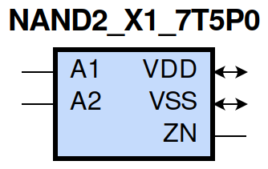
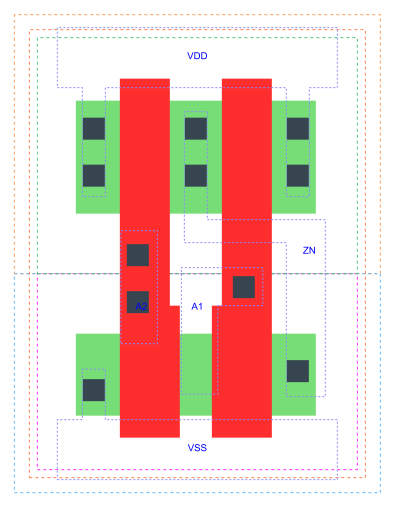

=======================================
gf180mcu_fd_sc_mcu7t5v0__nand2_x1
=======================================

**gf180mcu_fd_sc_mcu7t5v0__nand2_x1 symbol**

**gf180mcu_fd_sc_mcu7t5v0__nand2_x1 schematic**

.. image:: sc7_sch/NAND2_X1_sch.png
    :height: 300px
    :width: 500 px
    :align: center
    :alt: gf180mcu_fd_sc_mcu7t5v0__nand2_x1 schematic

**gf180mcu_fd_sc_mcu7t5v0__nand2_x1 layout**

.. include:: images.rst

NAND2_X1 is a 2-input NAND, NAND(A1,A2), 1X drive strength

|
| Attributes

============= ======================
**Attribute** **Value**
area          10.976000 µm\ :sup:`2`
============= ======================

|
| OUTPUT FUNCTIONS

============== =============
**Output Pin** **Function**
ZN             ((!A1)|(!A2))
============== =============

|
| TRUTH TABLE FOR ZN

====== ====== ======
**A1** **A2** **ZN**
0      ?      1
?      0      1
1      1      0
====== ====== ======

|
| FUNCTIONAL SCHEMATIC
| |image464|
| PIN CAPACITANCE (pf)

======= ======== ====================
**Pin** **Type** **Capacitance (pf)**
A2      input    0.0045
A1      input    0.0048
======= ======== ====================

|
| DELAY AND OUTPUT TRANSITION TIME corresponding to min slew and load

+---------------+------------+--------------------+--------------+-------------------+----------------+---------------+
| **Input Pin** | **Output** | **When Condition** | **Tin (ns)** | **Out Load (pf)** | **Delay (ns)** | **Tout (ns)** |
+---------------+------------+--------------------+--------------+-------------------+----------------+---------------+
| A2(HL)        | ZN(LH)     | A1                 | 0.0100       | 0.0010            | 0.0798         | 0.0564        |
+---------------+------------+--------------------+--------------+-------------------+----------------+---------------+
| A2(LH)        | ZN(HL)     | A1                 | 0.0100       | 0.0010            | 0.0692         | 0.0341        |
+---------------+------------+--------------------+--------------+-------------------+----------------+---------------+
| A1(HL)        | ZN(LH)     | A2                 | 0.0100       | 0.0010            | 0.0616         | 0.0399        |
+---------------+------------+--------------------+--------------+-------------------+----------------+---------------+
| A1(LH)        | ZN(HL)     | A2                 | 0.0100       | 0.0010            | 0.0579         | 0.0342        |
+---------------+------------+--------------------+--------------+-------------------+----------------+---------------+

|
| DYNAMIC ENERGY

+---------------+--------------------+--------------+------------+-------------------+---------------------+
| **Input Pin** | **When Condition** | **Tin (ns)** | **Output** | **Out Load (pf)** | **Energy (uW/MHz)** |
+---------------+--------------------+--------------+------------+-------------------+---------------------+
| A1            | A2                 | 0.0100       | ZN(LH)     | 0.0010            | 0.1082              |
+---------------+--------------------+--------------+------------+-------------------+---------------------+
| A2            | A1                 | 0.0100       | ZN(LH)     | 0.0010            | 0.1450              |
+---------------+--------------------+--------------+------------+-------------------+---------------------+
| A1            | A2                 | 0.0100       | ZN(HL)     | 0.0010            | 0.0023              |
+---------------+--------------------+--------------+------------+-------------------+---------------------+
| A2            | A1                 | 0.0100       | ZN(HL)     | 0.0010            | 0.0021              |
+---------------+--------------------+--------------+------------+-------------------+---------------------+
| A2(LH)        | !A1                | 0.0100       | n/a        | n/a               | -0.0367             |
+---------------+--------------------+--------------+------------+-------------------+---------------------+
| A1(LH)        | !A2                | 0.0100       | n/a        | n/a               | -0.0262             |
+---------------+--------------------+--------------+------------+-------------------+---------------------+
| A2(HL)        | !A1                | 0.0100       | n/a        | n/a               | 0.0408              |
+---------------+--------------------+--------------+------------+-------------------+---------------------+
| A1(HL)        | !A2                | 0.0100       | n/a        | n/a               | 0.0416              |
+---------------+--------------------+--------------+------------+-------------------+---------------------+

|
| LEAKAGE POWER

================== ==============
**When Condition** **Power (nW)**
!A1&!A2            0.0752
!A1&A2             0.0754
A1&!A2             0.1154
A1&A2              0.1029
================== ==============

