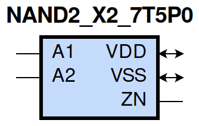
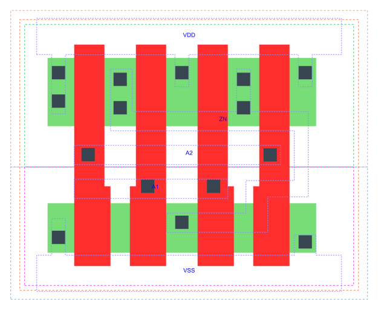

=======================================
gf180mcu_fd_sc_mcu7t5v0__nand2_x2
=======================================

**gf180mcu_fd_sc_mcu7t5v0__nand2_x2 symbol**

**gf180mcu_fd_sc_mcu7t5v0__nand2_x2 schematic**

.. image:: sc7_sch/NAND2_X2_sch.png
    :height: 300px
    :width: 500 px
    :align: center
    :alt: gf180mcu_fd_sc_mcu7t5v0__nand2_x2 schematic

**gf180mcu_fd_sc_mcu7t5v0__nand2_x2 layout**

.. include:: images.rst

NAND2_X2 is a 2-input NAND, NAND(A1,A2), 2X drive strength

|
| Attributes

============= ======================
**Attribute** **Value**
area          19.756800 µm\ :sup:`2`
============= ======================

|
| OUTPUT FUNCTIONS

============== =============
**Output Pin** **Function**
ZN             ((!A1)|(!A2))
============== =============

|
| TRUTH TABLE FOR ZN

====== ====== ======
**A1** **A2** **ZN**
0      ?      1
?      0      1
1      1      0
====== ====== ======

|
| FUNCTIONAL SCHEMATIC
| |image467|
| PIN CAPACITANCE (pf)

======= ======== ====================
**Pin** **Type** **Capacitance (pf)**
A1      input    0.0092
A2      input    0.0096
======= ======== ====================

|
| DELAY AND OUTPUT TRANSITION TIME corresponding to min slew and load

+---------------+------------+--------------------+--------------+-------------------+----------------+---------------+
| **Input Pin** | **Output** | **When Condition** | **Tin (ns)** | **Out Load (pf)** | **Delay (ns)** | **Tout (ns)** |
+---------------+------------+--------------------+--------------+-------------------+----------------+---------------+
| A1(HL)        | ZN(LH)     | A2                 | 0.0100       | 0.0010            | 0.0536         | 0.0335        |
+---------------+------------+--------------------+--------------+-------------------+----------------+---------------+
| A1(LH)        | ZN(HL)     | A2                 | 0.0100       | 0.0010            | 0.0514         | 0.0286        |
+---------------+------------+--------------------+--------------+-------------------+----------------+---------------+
| A2(HL)        | ZN(LH)     | A1                 | 0.0100       | 0.0010            | 0.0718         | 0.0499        |
+---------------+------------+--------------------+--------------+-------------------+----------------+---------------+
| A2(LH)        | ZN(HL)     | A1                 | 0.0100       | 0.0010            | 0.0628         | 0.0286        |
+---------------+------------+--------------------+--------------+-------------------+----------------+---------------+

|
| DYNAMIC ENERGY

+---------------+--------------------+--------------+------------+-------------------+---------------------+
| **Input Pin** | **When Condition** | **Tin (ns)** | **Output** | **Out Load (pf)** | **Energy (uW/MHz)** |
+---------------+--------------------+--------------+------------+-------------------+---------------------+
| A1            | A2                 | 0.0100       | ZN(LH)     | 0.0010            | 0.2028              |
+---------------+--------------------+--------------+------------+-------------------+---------------------+
| A2            | A1                 | 0.0100       | ZN(LH)     | 0.0010            | 0.2780              |
+---------------+--------------------+--------------+------------+-------------------+---------------------+
| A1            | A2                 | 0.0100       | ZN(HL)     | 0.0010            | 0.0040              |
+---------------+--------------------+--------------+------------+-------------------+---------------------+
| A2            | A1                 | 0.0100       | ZN(HL)     | 0.0010            | 0.0039              |
+---------------+--------------------+--------------+------------+-------------------+---------------------+
| A2(LH)        | !A1                | 0.0100       | n/a        | n/a               | -0.0733             |
+---------------+--------------------+--------------+------------+-------------------+---------------------+
| A1(LH)        | !A2                | 0.0100       | n/a        | n/a               | -0.0524             |
+---------------+--------------------+--------------+------------+-------------------+---------------------+
| A2(HL)        | !A1                | 0.0100       | n/a        | n/a               | 0.0816              |
+---------------+--------------------+--------------+------------+-------------------+---------------------+
| A1(HL)        | !A2                | 0.0100       | n/a        | n/a               | 0.0829              |
+---------------+--------------------+--------------+------------+-------------------+---------------------+

|
| LEAKAGE POWER

================== ==============
**When Condition** **Power (nW)**
!A1&!A2            0.1004
!A1&A2             0.1009
A1&!A2             0.1807
A1&A2              0.1558
================== ==============

