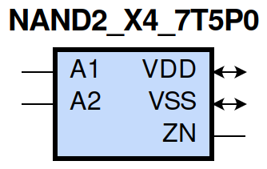
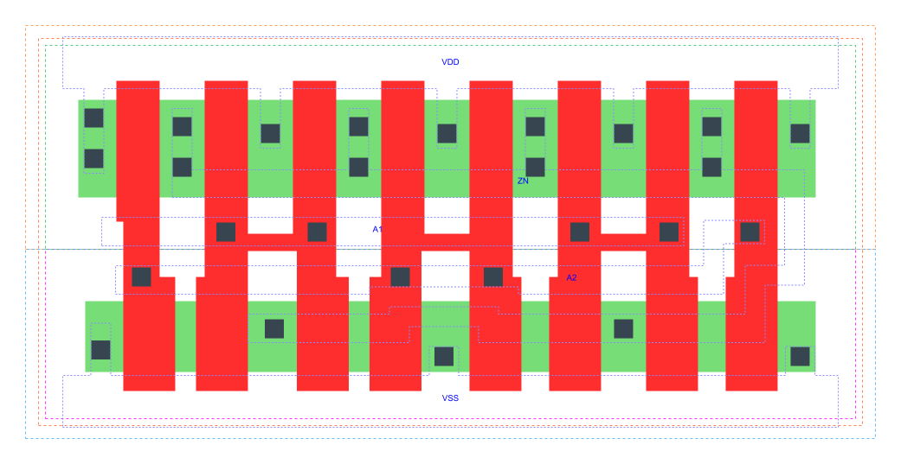

=======================================
gf180mcu_fd_sc_mcu7t5v0__nand2_x4
=======================================

**gf180mcu_fd_sc_mcu7t5v0__nand2_x4 symbol**

**gf180mcu_fd_sc_mcu7t5v0__nand2_x4 schematic**

.. image:: sc7_sch/NAND2_X4_sch.png
    :height: 300px
    :width: 500 px
    :align: center
    :alt: gf180mcu_fd_sc_mcu7t5v0__nand2_x4 schematic

**gf180mcu_fd_sc_mcu7t5v0__nand2_x4 layout**

.. include:: images.rst

NAND2_X4 is a 2-input NAND, NAND(A1,A2), 4X drive strength

|
| Attributes

============= ======================
**Attribute** **Value**
area          35.123200 µm\ :sup:`2`
============= ======================

|
| OUTPUT FUNCTIONS

============== =============
**Output Pin** **Function**
ZN             ((!A1)|(!A2))
============== =============

|
| TRUTH TABLE FOR ZN

====== ====== ======
**A1** **A2** **ZN**
0      ?      1
?      0      1
1      1      0
====== ====== ======

|
| FUNCTIONAL SCHEMATIC
| |image470|
| PIN CAPACITANCE (pf)

======= ======== ====================
**Pin** **Type** **Capacitance (pf)**
A1      input    0.0191
A2      input    0.0193
======= ======== ====================

|
| DELAY AND OUTPUT TRANSITION TIME corresponding to min slew and load

+---------------+------------+--------------------+--------------+-------------------+----------------+---------------+
| **Input Pin** | **Output** | **When Condition** | **Tin (ns)** | **Out Load (pf)** | **Delay (ns)** | **Tout (ns)** |
+---------------+------------+--------------------+--------------+-------------------+----------------+---------------+
| A1(HL)        | ZN(LH)     | A2                 | 0.0100       | 0.0010            | 0.0524         | 0.0325        |
+---------------+------------+--------------------+--------------+-------------------+----------------+---------------+
| A1(LH)        | ZN(HL)     | A2                 | 0.0100       | 0.0010            | 0.0505         | 0.0278        |
+---------------+------------+--------------------+--------------+-------------------+----------------+---------------+
| A2(HL)        | ZN(LH)     | A1                 | 0.0100       | 0.0010            | 0.0706         | 0.0488        |
+---------------+------------+--------------------+--------------+-------------------+----------------+---------------+
| A2(LH)        | ZN(HL)     | A1                 | 0.0100       | 0.0010            | 0.0616         | 0.0278        |
+---------------+------------+--------------------+--------------+-------------------+----------------+---------------+

|
| DYNAMIC ENERGY

+---------------+--------------------+--------------+------------+-------------------+---------------------+
| **Input Pin** | **When Condition** | **Tin (ns)** | **Output** | **Out Load (pf)** | **Energy (uW/MHz)** |
+---------------+--------------------+--------------+------------+-------------------+---------------------+
| A1            | A2                 | 0.0100       | ZN(LH)     | 0.0010            | 0.4191              |
+---------------+--------------------+--------------+------------+-------------------+---------------------+
| A2            | A1                 | 0.0100       | ZN(LH)     | 0.0010            | 0.5676              |
+---------------+--------------------+--------------+------------+-------------------+---------------------+
| A1            | A2                 | 0.0100       | ZN(HL)     | 0.0010            | 0.0076              |
+---------------+--------------------+--------------+------------+-------------------+---------------------+
| A2            | A1                 | 0.0100       | ZN(HL)     | 0.0010            | 0.0078              |
+---------------+--------------------+--------------+------------+-------------------+---------------------+
| A2(LH)        | !A1                | 0.0100       | n/a        | n/a               | -0.1461             |
+---------------+--------------------+--------------+------------+-------------------+---------------------+
| A1(LH)        | !A2                | 0.0100       | n/a        | n/a               | -0.1072             |
+---------------+--------------------+--------------+------------+-------------------+---------------------+
| A2(HL)        | !A1                | 0.0100       | n/a        | n/a               | 0.1629              |
+---------------+--------------------+--------------+------------+-------------------+---------------------+
| A1(HL)        | !A2                | 0.0100       | n/a        | n/a               | 0.1652              |
+---------------+--------------------+--------------+------------+-------------------+---------------------+

|
| LEAKAGE POWER

================== ==============
**When Condition** **Power (nW)**
!A1&!A2            0.1509
!A1&A2             0.1518
A1&!A2             0.3114
A1&A2              0.2615
================== ==============

