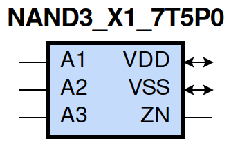
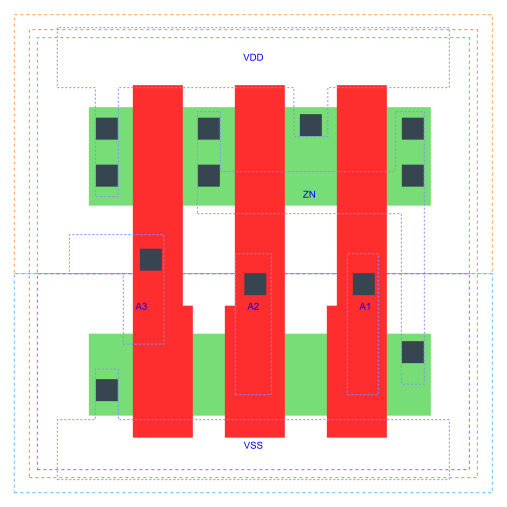

=======================================
gf180mcu_fd_sc_mcu7t5v0__nand3_x1
=======================================

**gf180mcu_fd_sc_mcu7t5v0__nand3_x1 symbol**

**gf180mcu_fd_sc_mcu7t5v0__nand3_x1 schematic**

.. image:: sc7_sch/NAND3_X1_sch.png
    :height: 300px
    :width: 500 px
    :align: center
    :alt: gf180mcu_fd_sc_mcu7t5v0__nand3_x1 schematic

**gf180mcu_fd_sc_mcu7t5v0__nand3_x1 layout**

.. include:: images.rst

NAND3_X1 is a 3-input NAND, NAND(A1,A2,A3), 1X drive strength

|
| Attributes

============= ======================
**Attribute** **Value**
area          15.366400 µm\ :sup:`2`
============= ======================

|
| OUTPUT FUNCTIONS

============== ===================
**Output Pin** **Function**
ZN             ((!A1)|(!A2)|(!A3))
============== ===================

|
| TRUTH TABLE FOR ZN

====== ====== ====== ======
**A1** **A2** **A3** **ZN**
0      ?      ?      1
?      0      ?      1
?      ?      0      1
1      1      1      0
====== ====== ====== ======

|
| FUNCTIONAL SCHEMATIC
| |image473|
| PIN CAPACITANCE (pf)

======= ======== ====================
**Pin** **Type** **Capacitance (pf)**
A3      input    0.0043
A2      input    0.0042
A1      input    0.0044
======= ======== ====================

|
| DELAY AND OUTPUT TRANSITION TIME corresponding to min slew and load

+---------------+------------+--------------------+--------------+-------------------+----------------+---------------+
| **Input Pin** | **Output** | **When Condition** | **Tin (ns)** | **Out Load (pf)** | **Delay (ns)** | **Tout (ns)** |
+---------------+------------+--------------------+--------------+-------------------+----------------+---------------+
| A3(LH)        | ZN(HL)     | A1&A2              | 0.0100       | 0.0010            | 0.1135         | 0.0588        |
+---------------+------------+--------------------+--------------+-------------------+----------------+---------------+
| A3(HL)        | ZN(LH)     | A1&A2              | 0.0100       | 0.0010            | 0.1224         | 0.0923        |
+---------------+------------+--------------------+--------------+-------------------+----------------+---------------+
| A2(HL)        | ZN(LH)     | A1&A3              | 0.0100       | 0.0010            | 0.1060         | 0.0754        |
+---------------+------------+--------------------+--------------+-------------------+----------------+---------------+
| A2(LH)        | ZN(HL)     | A1&A3              | 0.0100       | 0.0010            | 0.1027         | 0.0587        |
+---------------+------------+--------------------+--------------+-------------------+----------------+---------------+
| A1(HL)        | ZN(LH)     | A2&A3              | 0.0100       | 0.0010            | 0.0816         | 0.0555        |
+---------------+------------+--------------------+--------------+-------------------+----------------+---------------+
| A1(LH)        | ZN(HL)     | A2&A3              | 0.0100       | 0.0010            | 0.0818         | 0.0587        |
+---------------+------------+--------------------+--------------+-------------------+----------------+---------------+

|
| DYNAMIC ENERGY

+---------------+--------------------+--------------+------------+-------------------+---------------------+
| **Input Pin** | **When Condition** | **Tin (ns)** | **Output** | **Out Load (pf)** | **Energy (uW/MHz)** |
+---------------+--------------------+--------------+------------+-------------------+---------------------+
| A1            | A2&A3              | 0.0100       | ZN(LH)     | 0.0010            | 0.1148              |
+---------------+--------------------+--------------+------------+-------------------+---------------------+
| A2            | A1&A3              | 0.0100       | ZN(LH)     | 0.0010            | 0.1558              |
+---------------+--------------------+--------------+------------+-------------------+---------------------+
| A3            | A1&A2              | 0.0100       | ZN(HL)     | 0.0010            | 0.0206              |
+---------------+--------------------+--------------+------------+-------------------+---------------------+
| A1            | A2&A3              | 0.0100       | ZN(HL)     | 0.0010            | 0.0205              |
+---------------+--------------------+--------------+------------+-------------------+---------------------+
| A2            | A1&A3              | 0.0100       | ZN(HL)     | 0.0010            | 0.0207              |
+---------------+--------------------+--------------+------------+-------------------+---------------------+
| A3            | A1&A2              | 0.0100       | ZN(LH)     | 0.0010            | 0.1907              |
+---------------+--------------------+--------------+------------+-------------------+---------------------+
| A3(LH)        | !A1&!A2            | 0.0100       | n/a        | n/a               | -0.0320             |
+---------------+--------------------+--------------+------------+-------------------+---------------------+
| A3(LH)        | !A1&A2             | 0.0100       | n/a        | n/a               | -0.0319             |
+---------------+--------------------+--------------+------------+-------------------+---------------------+
| A3(LH)        | A1&!A2             | 0.0100       | n/a        | n/a               | -0.0320             |
+---------------+--------------------+--------------+------------+-------------------+---------------------+
| A2(LH)        | !A1&!A3            | 0.0100       | n/a        | n/a               | -0.0320             |
+---------------+--------------------+--------------+------------+-------------------+---------------------+
| A2(LH)        | !A1&A3             | 0.0100       | n/a        | n/a               | -0.0319             |
+---------------+--------------------+--------------+------------+-------------------+---------------------+
| A2(LH)        | A1&!A3             | 0.0100       | n/a        | n/a               | -0.0237             |
+---------------+--------------------+--------------+------------+-------------------+---------------------+
| A1(LH)        | !A2&!A3            | 0.0100       | n/a        | n/a               | -0.0200             |
+---------------+--------------------+--------------+------------+-------------------+---------------------+
| A1(LH)        | !A2&A3             | 0.0100       | n/a        | n/a               | -0.0201             |
+---------------+--------------------+--------------+------------+-------------------+---------------------+
| A1(LH)        | A2&!A3             | 0.0100       | n/a        | n/a               | 0.0202              |
+---------------+--------------------+--------------+------------+-------------------+---------------------+
| A3(HL)        | !A1&!A2            | 0.0100       | n/a        | n/a               | 0.0313              |
+---------------+--------------------+--------------+------------+-------------------+---------------------+
| A3(HL)        | !A1&A2             | 0.0100       | n/a        | n/a               | 0.0356              |
+---------------+--------------------+--------------+------------+-------------------+---------------------+
| A3(HL)        | A1&!A2             | 0.0100       | n/a        | n/a               | 0.0340              |
+---------------+--------------------+--------------+------------+-------------------+---------------------+
| A2(HL)        | !A1&!A3            | 0.0100       | n/a        | n/a               | 0.0443              |
+---------------+--------------------+--------------+------------+-------------------+---------------------+
| A2(HL)        | !A1&A3             | 0.0100       | n/a        | n/a               | 0.0388              |
+---------------+--------------------+--------------+------------+-------------------+---------------------+
| A2(HL)        | A1&!A3             | 0.0100       | n/a        | n/a               | 0.0359              |
+---------------+--------------------+--------------+------------+-------------------+---------------------+
| A1(HL)        | !A2&!A3            | 0.0100       | n/a        | n/a               | 0.0369              |
+---------------+--------------------+--------------+------------+-------------------+---------------------+
| A1(HL)        | !A2&A3             | 0.0100       | n/a        | n/a               | 0.0367              |
+---------------+--------------------+--------------+------------+-------------------+---------------------+
| A1(HL)        | A2&!A3             | 0.0100       | n/a        | n/a               | 0.0356              |
+---------------+--------------------+--------------+------------+-------------------+---------------------+

|
| LEAKAGE POWER

================== ==============
**When Condition** **Power (nW)**
!A1&!A2&!A3        0.0752
!A1&!A2&A3         0.0752
!A1&A2&!A3         0.0753
!A1&A2&A3          0.0754
A1&!A2&!A3         0.1152
A1&!A2&A3          0.1154
A1&A2&!A3          0.1545
A1&A2&A3           0.1291
================== ==============

