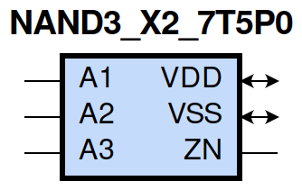
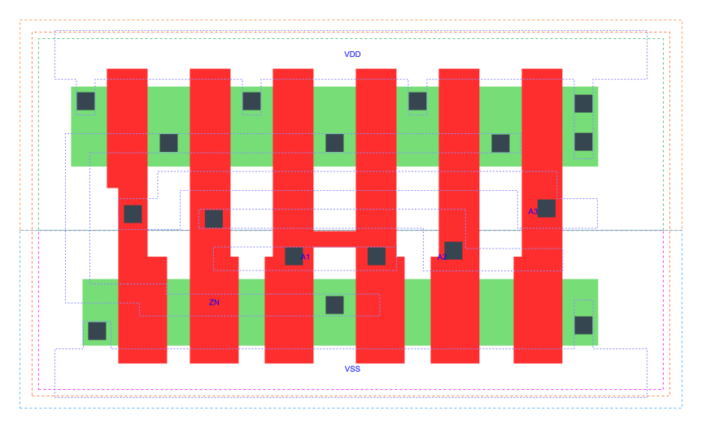

=======================================
gf180mcu_fd_sc_mcu7t5v0__nand3_x2
=======================================

**gf180mcu_fd_sc_mcu7t5v0__nand3_x2 symbol**

**gf180mcu_fd_sc_mcu7t5v0__nand3_x2 schematic**

**gf180mcu_fd_sc_mcu7t5v0__nand3_x2 layout**

.. include:: images.rst

NAND3_X2 is a 3-input NAND, NAND(A1,A2,A3), 2X drive strength

|
| Attributes

============= ======================
**Attribute** **Value**
area          28.537600 µm\ :sup:`2`
============= ======================

|
| OUTPUT FUNCTIONS

============== ===================
**Output Pin** **Function**
ZN             ((!A1)|(!A2)|(!A3))
============== ===================

|
| TRUTH TABLE FOR ZN

====== ====== ====== ======
**A1** **A2** **A3** **ZN**
0      ?      ?      1
?      0      ?      1
?      ?      0      1
1      1      1      0
====== ====== ====== ======

|
| FUNCTIONAL SCHEMATIC
| |image476|
| PIN CAPACITANCE (pf)

======= ======== ====================
**Pin** **Type** **Capacitance (pf)**
A3      input    0.0097
A2      input    0.0093
A1      input    0.0087
======= ======== ====================

|
| DELAY AND OUTPUT TRANSITION TIME corresponding to min slew and load

+---------------+------------+--------------------+--------------+-------------------+----------------+---------------+
| **Input Pin** | **Output** | **When Condition** | **Tin (ns)** | **Out Load (pf)** | **Delay (ns)** | **Tout (ns)** |
+---------------+------------+--------------------+--------------+-------------------+----------------+---------------+
| A3(LH)        | ZN(HL)     | A1&A2              | 0.0100       | 0.0010            | 0.1010         | 0.0486        |
+---------------+------------+--------------------+--------------+-------------------+----------------+---------------+
| A3(HL)        | ZN(LH)     | A1&A2              | 0.0100       | 0.0010            | 0.1096         | 0.0814        |
+---------------+------------+--------------------+--------------+-------------------+----------------+---------------+
| A2(HL)        | ZN(LH)     | A1&A3              | 0.0100       | 0.0010            | 0.0932         | 0.0644        |
+---------------+------------+--------------------+--------------+-------------------+----------------+---------------+
| A2(LH)        | ZN(HL)     | A1&A3              | 0.0100       | 0.0010            | 0.0900         | 0.0484        |
+---------------+------------+--------------------+--------------+-------------------+----------------+---------------+
| A1(HL)        | ZN(LH)     | A2&A3              | 0.0100       | 0.0010            | 0.0694         | 0.0452        |
+---------------+------------+--------------------+--------------+-------------------+----------------+---------------+
| A1(LH)        | ZN(HL)     | A2&A3              | 0.0100       | 0.0010            | 0.0700         | 0.0482        |
+---------------+------------+--------------------+--------------+-------------------+----------------+---------------+

|
| DYNAMIC ENERGY

+---------------+--------------------+--------------+------------+-------------------+---------------------+
| **Input Pin** | **When Condition** | **Tin (ns)** | **Output** | **Out Load (pf)** | **Energy (uW/MHz)** |
+---------------+--------------------+--------------+------------+-------------------+---------------------+
| A1            | A2&A3              | 0.0100       | ZN(LH)     | 0.0010            | 0.2167              |
+---------------+--------------------+--------------+------------+-------------------+---------------------+
| A2            | A1&A3              | 0.0100       | ZN(LH)     | 0.0010            | 0.2966              |
+---------------+--------------------+--------------+------------+-------------------+---------------------+
| A3            | A1&A2              | 0.0100       | ZN(HL)     | 0.0010            | 0.0265              |
+---------------+--------------------+--------------+------------+-------------------+---------------------+
| A1            | A2&A3              | 0.0100       | ZN(HL)     | 0.0010            | 0.0264              |
+---------------+--------------------+--------------+------------+-------------------+---------------------+
| A2            | A1&A3              | 0.0100       | ZN(HL)     | 0.0010            | 0.0265              |
+---------------+--------------------+--------------+------------+-------------------+---------------------+
| A3            | A1&A2              | 0.0100       | ZN(LH)     | 0.0010            | 0.3697              |
+---------------+--------------------+--------------+------------+-------------------+---------------------+
| A3(LH)        | !A1&!A2            | 0.0100       | n/a        | n/a               | -0.0637             |
+---------------+--------------------+--------------+------------+-------------------+---------------------+
| A3(LH)        | !A1&A2             | 0.0100       | n/a        | n/a               | -0.0635             |
+---------------+--------------------+--------------+------------+-------------------+---------------------+
| A3(LH)        | A1&!A2             | 0.0100       | n/a        | n/a               | -0.0636             |
+---------------+--------------------+--------------+------------+-------------------+---------------------+
| A2(LH)        | !A1&!A3            | 0.0100       | n/a        | n/a               | -0.0639             |
+---------------+--------------------+--------------+------------+-------------------+---------------------+
| A2(LH)        | !A1&A3             | 0.0100       | n/a        | n/a               | -0.0635             |
+---------------+--------------------+--------------+------------+-------------------+---------------------+
| A2(LH)        | A1&!A3             | 0.0100       | n/a        | n/a               | -0.0459             |
+---------------+--------------------+--------------+------------+-------------------+---------------------+
| A1(LH)        | !A2&!A3            | 0.0100       | n/a        | n/a               | -0.0428             |
+---------------+--------------------+--------------+------------+-------------------+---------------------+
| A1(LH)        | !A2&A3             | 0.0100       | n/a        | n/a               | -0.0428             |
+---------------+--------------------+--------------+------------+-------------------+---------------------+
| A1(LH)        | A2&!A3             | 0.0100       | n/a        | n/a               | 0.0386              |
+---------------+--------------------+--------------+------------+-------------------+---------------------+
| A3(HL)        | !A1&!A2            | 0.0100       | n/a        | n/a               | 0.0637              |
+---------------+--------------------+--------------+------------+-------------------+---------------------+
| A3(HL)        | !A1&A2             | 0.0100       | n/a        | n/a               | 0.0709              |
+---------------+--------------------+--------------+------------+-------------------+---------------------+
| A3(HL)        | A1&!A2             | 0.0100       | n/a        | n/a               | 0.0691              |
+---------------+--------------------+--------------+------------+-------------------+---------------------+
| A2(HL)        | !A1&!A3            | 0.0100       | n/a        | n/a               | 0.0884              |
+---------------+--------------------+--------------+------------+-------------------+---------------------+
| A2(HL)        | !A1&A3             | 0.0100       | n/a        | n/a               | 0.0774              |
+---------------+--------------------+--------------+------------+-------------------+---------------------+
| A2(HL)        | A1&!A3             | 0.0100       | n/a        | n/a               | 0.0718              |
+---------------+--------------------+--------------+------------+-------------------+---------------------+
| A1(HL)        | !A2&!A3            | 0.0100       | n/a        | n/a               | 0.0733              |
+---------------+--------------------+--------------+------------+-------------------+---------------------+
| A1(HL)        | !A2&A3             | 0.0100       | n/a        | n/a               | 0.0732              |
+---------------+--------------------+--------------+------------+-------------------+---------------------+
| A1(HL)        | A2&!A3             | 0.0100       | n/a        | n/a               | 0.0724              |
+---------------+--------------------+--------------+------------+-------------------+---------------------+

|
| LEAKAGE POWER

================== ==============
**When Condition** **Power (nW)**
!A1&!A2&!A3        0.1004
!A1&!A2&A3         0.1004
!A1&A2&!A3         0.1006
!A1&A2&A3          0.1009
A1&!A2&!A3         0.1804
A1&!A2&A3          0.1807
A1&A2&!A3          0.2590
A1&A2&A3           0.2081
================== ==============

