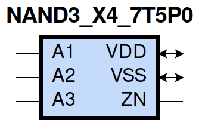
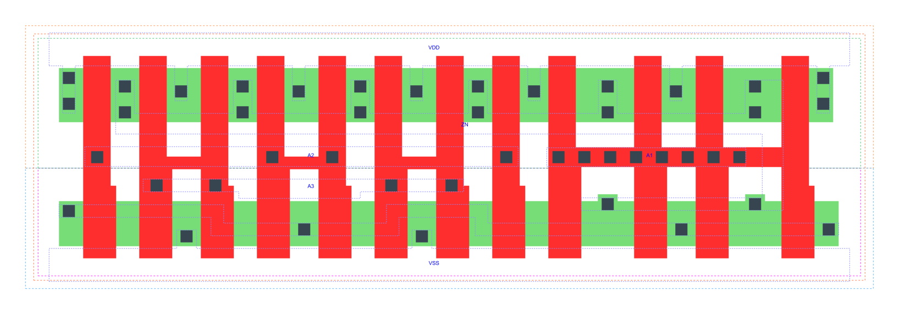

=======================================
gf180mcu_fd_sc_mcu7t5v0__nand3_x4
=======================================

**gf180mcu_fd_sc_mcu7t5v0__nand3_x4 symbol**

**gf180mcu_fd_sc_mcu7t5v0__nand3_x4 schematic**

.. image:: sc7_sch/NAND3_X4_sch.png
    :height: 300px
    :width: 500 px
    :align: center
    :alt: gf180mcu_fd_sc_mcu7t5v0__nand3_x4 schematic

**gf180mcu_fd_sc_mcu7t5v0__nand3_x4 layout**

.. include:: images.rst

NAND3_X4 is a 3-input NAND, NAND(A1,A2,A3), 4X drive strength

|
| Attributes

============= ======================
**Attribute** **Value**
area          57.075200 µm\ :sup:`2`
============= ======================

|
| OUTPUT FUNCTIONS

============== ===================
**Output Pin** **Function**
ZN             ((!A1)|(!A2)|(!A3))
============== ===================

|
| TRUTH TABLE FOR ZN

====== ====== ====== ======
**A1** **A2** **A3** **ZN**
0      ?      ?      1
?      0      ?      1
?      ?      0      1
1      1      1      0
====== ====== ====== ======

|
| FUNCTIONAL SCHEMATIC
| |image479|
| PIN CAPACITANCE (pf)

======= ======== ====================
**Pin** **Type** **Capacitance (pf)**
A2      input    0.0182
A3      input    0.0175
A1      input    0.0170
======= ======== ====================

|
| DELAY AND OUTPUT TRANSITION TIME corresponding to min slew and load

+---------------+------------+--------------------+--------------+-------------------+----------------+---------------+
| **Input Pin** | **Output** | **When Condition** | **Tin (ns)** | **Out Load (pf)** | **Delay (ns)** | **Tout (ns)** |
+---------------+------------+--------------------+--------------+-------------------+----------------+---------------+
| A2(HL)        | ZN(LH)     | A1&A3              | 0.0100       | 0.0010            | 0.1076         | 0.0761        |
+---------------+------------+--------------------+--------------+-------------------+----------------+---------------+
| A2(LH)        | ZN(HL)     | A1&A3              | 0.0100       | 0.0010            | 0.1028         | 0.0522        |
+---------------+------------+--------------------+--------------+-------------------+----------------+---------------+
| A3(LH)        | ZN(HL)     | A1&A2              | 0.0100       | 0.0010            | 0.1141         | 0.0524        |
+---------------+------------+--------------------+--------------+-------------------+----------------+---------------+
| A3(HL)        | ZN(LH)     | A1&A2              | 0.0100       | 0.0010            | 0.1233         | 0.0931        |
+---------------+------------+--------------------+--------------+-------------------+----------------+---------------+
| A1(HL)        | ZN(LH)     | A2&A3              | 0.0100       | 0.0010            | 0.0711         | 0.0471        |
+---------------+------------+--------------------+--------------+-------------------+----------------+---------------+
| A1(LH)        | ZN(HL)     | A2&A3              | 0.0100       | 0.0010            | 0.0686         | 0.0506        |
+---------------+------------+--------------------+--------------+-------------------+----------------+---------------+

|
| DYNAMIC ENERGY

+---------------+--------------------+--------------+------------+-------------------+---------------------+
| **Input Pin** | **When Condition** | **Tin (ns)** | **Output** | **Out Load (pf)** | **Energy (uW/MHz)** |
+---------------+--------------------+--------------+------------+-------------------+---------------------+
| A1            | A2&A3              | 0.0100       | ZN(LH)     | 0.0010            | 0.4523              |
+---------------+--------------------+--------------+------------+-------------------+---------------------+
| A2            | A1&A3              | 0.0100       | ZN(LH)     | 0.0010            | 0.7119              |
+---------------+--------------------+--------------+------------+-------------------+---------------------+
| A3            | A1&A2              | 0.0100       | ZN(HL)     | 0.0010            | 0.0766              |
+---------------+--------------------+--------------+------------+-------------------+---------------------+
| A1            | A2&A3              | 0.0100       | ZN(HL)     | 0.0010            | 0.0767              |
+---------------+--------------------+--------------+------------+-------------------+---------------------+
| A2            | A1&A3              | 0.0100       | ZN(HL)     | 0.0010            | 0.0763              |
+---------------+--------------------+--------------+------------+-------------------+---------------------+
| A3            | A1&A2              | 0.0100       | ZN(LH)     | 0.0010            | 0.8597              |
+---------------+--------------------+--------------+------------+-------------------+---------------------+
| A3(LH)        | !A1&!A2            | 0.0100       | n/a        | n/a               | -0.1270             |
+---------------+--------------------+--------------+------------+-------------------+---------------------+
| A3(LH)        | !A1&A2             | 0.0100       | n/a        | n/a               | -0.1266             |
+---------------+--------------------+--------------+------------+-------------------+---------------------+
| A3(LH)        | A1&!A2             | 0.0100       | n/a        | n/a               | -0.1270             |
+---------------+--------------------+--------------+------------+-------------------+---------------------+
| A2(LH)        | !A1&!A3            | 0.0100       | n/a        | n/a               | -0.1272             |
+---------------+--------------------+--------------+------------+-------------------+---------------------+
| A2(LH)        | !A1&A3             | 0.0100       | n/a        | n/a               | -0.1266             |
+---------------+--------------------+--------------+------------+-------------------+---------------------+
| A2(LH)        | A1&!A3             | 0.0100       | n/a        | n/a               | -0.0927             |
+---------------+--------------------+--------------+------------+-------------------+---------------------+
| A1(LH)        | !A2&!A3            | 0.0100       | n/a        | n/a               | 0.0080              |
+---------------+--------------------+--------------+------------+-------------------+---------------------+
| A1(LH)        | !A2&A3             | 0.0100       | n/a        | n/a               | 0.0081              |
+---------------+--------------------+--------------+------------+-------------------+---------------------+
| A1(LH)        | A2&!A3             | 0.0100       | n/a        | n/a               | 0.1753              |
+---------------+--------------------+--------------+------------+-------------------+---------------------+
| A3(HL)        | !A1&!A2            | 0.0100       | n/a        | n/a               | 0.1273              |
+---------------+--------------------+--------------+------------+-------------------+---------------------+
| A3(HL)        | !A1&A2             | 0.0100       | n/a        | n/a               | 0.1355              |
+---------------+--------------------+--------------+------------+-------------------+---------------------+
| A3(HL)        | A1&!A2             | 0.0100       | n/a        | n/a               | 0.1338              |
+---------------+--------------------+--------------+------------+-------------------+---------------------+
| A2(HL)        | !A1&!A3            | 0.0100       | n/a        | n/a               | 0.1849              |
+---------------+--------------------+--------------+------------+-------------------+---------------------+
| A2(HL)        | !A1&A3             | 0.0100       | n/a        | n/a               | 0.1564              |
+---------------+--------------------+--------------+------------+-------------------+---------------------+
| A2(HL)        | A1&!A3             | 0.0100       | n/a        | n/a               | 0.1387              |
+---------------+--------------------+--------------+------------+-------------------+---------------------+
| A1(HL)        | !A2&!A3            | 0.0100       | n/a        | n/a               | 0.1462              |
+---------------+--------------------+--------------+------------+-------------------+---------------------+
| A1(HL)        | !A2&A3             | 0.0100       | n/a        | n/a               | 0.1460              |
+---------------+--------------------+--------------+------------+-------------------+---------------------+
| A1(HL)        | A2&!A3             | 0.0100       | n/a        | n/a               | 0.1447              |
+---------------+--------------------+--------------+------------+-------------------+---------------------+

|
| LEAKAGE POWER

================== ==============
**When Condition** **Power (nW)**
!A1&!A2&!A3        0.1509
!A1&!A2&A3         0.1509
!A1&A2&!A3         0.1511
!A1&A2&A3          0.1518
A1&!A2&!A3         0.3102
A1&!A2&A3          0.3108
A1&A2&!A3          0.4675
A1&A2&A3           0.3662
================== ==============

