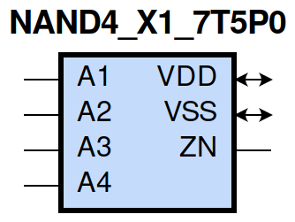
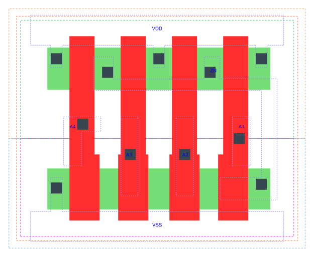

=======================================
gf180mcu_fd_sc_mcu7t5v0__nand4_x1
=======================================

**gf180mcu_fd_sc_mcu7t5v0__nand4_x1 symbol**

**gf180mcu_fd_sc_mcu7t5v0__nand4_x1 schematic**

.. image:: sc7_sch/NAND4_X1_sch.png
    :height: 300px
    :width: 500 px
    :align: center
    :alt: gf180mcu_fd_sc_mcu7t5v0__nand4_x1 schematic

**gf180mcu_fd_sc_mcu7t5v0__nand4_x1 layout**

.. include:: images.rst

NAND4_X1 is a 4-input NAND, NAND(A1,A2,A3,A4), 1X drive strength

|
| Attributes

============= ======================
**Attribute** **Value**
area          19.756800 µm\ :sup:`2`
============= ======================

|
| OUTPUT FUNCTIONS

============== =========================
**Output Pin** **Function**
ZN             ((!A1)|(!A2)|(!A3)|(!A4))
============== =========================

|
| TRUTH TABLE FOR ZN

====== ====== ====== ====== ======
**A1** **A2** **A3** **A4** **ZN**
0      ?      ?      ?      1
?      0      ?      ?      1
?      ?      0      ?      1
?      ?      ?      0      1
1      1      1      1      0
====== ====== ====== ====== ======

|
| FUNCTIONAL SCHEMATIC
| |image482|
| PIN CAPACITANCE (pf)

======= ======== ====================
**Pin** **Type** **Capacitance (pf)**
A4      input    0.0039
A3      input    0.0039
A2      input    0.0040
A1      input    0.0041
======= ======== ====================

|
| DELAY AND OUTPUT TRANSITION TIME corresponding to min slew and load

+---------------+------------+--------------------+--------------+-------------------+----------------+---------------+
| **Input Pin** | **Output** | **When Condition** | **Tin (ns)** | **Out Load (pf)** | **Delay (ns)** | **Tout (ns)** |
+---------------+------------+--------------------+--------------+-------------------+----------------+---------------+
| A4(LH)        | ZN(HL)     | A1&A2&A3           | 0.0100       | 0.0010            | 0.1569         | 0.0827        |
+---------------+------------+--------------------+--------------+-------------------+----------------+---------------+
| A4(HL)        | ZN(LH)     | A1&A2&A3           | 0.0100       | 0.0010            | 0.1686         | 0.1315        |
+---------------+------------+--------------------+--------------+-------------------+----------------+---------------+
| A3(LH)        | ZN(HL)     | A1&A2&A4           | 0.0100       | 0.0010            | 0.1460         | 0.0828        |
+---------------+------------+--------------------+--------------+-------------------+----------------+---------------+
| A3(HL)        | ZN(LH)     | A1&A2&A4           | 0.0100       | 0.0010            | 0.1519         | 0.1121        |
+---------------+------------+--------------------+--------------+-------------------+----------------+---------------+
| A2(HL)        | ZN(LH)     | A1&A3&A4           | 0.0100       | 0.0010            | 0.1274         | 0.0913        |
+---------------+------------+--------------------+--------------+-------------------+----------------+---------------+
| A2(LH)        | ZN(HL)     | A1&A3&A4           | 0.0100       | 0.0010            | 0.1260         | 0.0826        |
+---------------+------------+--------------------+--------------+-------------------+----------------+---------------+
| A1(HL)        | ZN(LH)     | A2&A3&A4           | 0.0100       | 0.0010            | 0.0987         | 0.0684        |
+---------------+------------+--------------------+--------------+-------------------+----------------+---------------+
| A1(LH)        | ZN(HL)     | A2&A3&A4           | 0.0100       | 0.0010            | 0.0964         | 0.0815        |
+---------------+------------+--------------------+--------------+-------------------+----------------+---------------+

|
| DYNAMIC ENERGY

+---------------+--------------------+--------------+------------+-------------------+---------------------+
| **Input Pin** | **When Condition** | **Tin (ns)** | **Output** | **Out Load (pf)** | **Energy (uW/MHz)** |
+---------------+--------------------+--------------+------------+-------------------+---------------------+
| A1            | A2&A3&A4           | 0.0100       | ZN(LH)     | 0.0010            | 0.1208              |
+---------------+--------------------+--------------+------------+-------------------+---------------------+
| A4            | A1&A2&A3           | 0.0100       | ZN(HL)     | 0.0010            | 0.0218              |
+---------------+--------------------+--------------+------------+-------------------+---------------------+
| A2            | A1&A3&A4           | 0.0100       | ZN(LH)     | 0.0010            | 0.1616              |
+---------------+--------------------+--------------+------------+-------------------+---------------------+
| A3            | A1&A2&A4           | 0.0100       | ZN(HL)     | 0.0010            | 0.0218              |
+---------------+--------------------+--------------+------------+-------------------+---------------------+
| A1            | A2&A3&A4           | 0.0100       | ZN(HL)     | 0.0010            | 0.0218              |
+---------------+--------------------+--------------+------------+-------------------+---------------------+
| A2            | A1&A3&A4           | 0.0100       | ZN(HL)     | 0.0010            | 0.0218              |
+---------------+--------------------+--------------+------------+-------------------+---------------------+
| A4            | A1&A2&A3           | 0.0100       | ZN(LH)     | 0.0010            | 0.2381              |
+---------------+--------------------+--------------+------------+-------------------+---------------------+
| A3            | A1&A2&A4           | 0.0100       | ZN(LH)     | 0.0010            | 0.2017              |
+---------------+--------------------+--------------+------------+-------------------+---------------------+
| A3(LH)        | !A1&!A2&!A4        | 0.0100       | n/a        | n/a               | -0.0275             |
+---------------+--------------------+--------------+------------+-------------------+---------------------+
| A3(LH)        | !A1&!A2&A4         | 0.0100       | n/a        | n/a               | -0.0273             |
+---------------+--------------------+--------------+------------+-------------------+---------------------+
| A3(LH)        | !A1&A2&!A4         | 0.0100       | n/a        | n/a               | -0.0274             |
+---------------+--------------------+--------------+------------+-------------------+---------------------+
| A3(LH)        | !A1&A2&A4          | 0.0100       | n/a        | n/a               | -0.0272             |
+---------------+--------------------+--------------+------------+-------------------+---------------------+
| A3(LH)        | A1&!A2&!A4         | 0.0100       | n/a        | n/a               | -0.0275             |
+---------------+--------------------+--------------+------------+-------------------+---------------------+
| A3(LH)        | A1&!A2&A4          | 0.0100       | n/a        | n/a               | -0.0273             |
+---------------+--------------------+--------------+------------+-------------------+---------------------+
| A3(LH)        | A1&A2&!A4          | 0.0100       | n/a        | n/a               | -0.0198             |
+---------------+--------------------+--------------+------------+-------------------+---------------------+
| A2(LH)        | !A1&!A3&!A4        | 0.0100       | n/a        | n/a               | -0.0274             |
+---------------+--------------------+--------------+------------+-------------------+---------------------+
| A2(LH)        | !A1&!A3&A4         | 0.0100       | n/a        | n/a               | -0.0274             |
+---------------+--------------------+--------------+------------+-------------------+---------------------+
| A2(LH)        | !A1&A3&!A4         | 0.0100       | n/a        | n/a               | -0.0274             |
+---------------+--------------------+--------------+------------+-------------------+---------------------+
| A2(LH)        | !A1&A3&A4          | 0.0100       | n/a        | n/a               | -0.0272             |
+---------------+--------------------+--------------+------------+-------------------+---------------------+
| A2(LH)        | A1&!A3&!A4         | 0.0100       | n/a        | n/a               | -0.0176             |
+---------------+--------------------+--------------+------------+-------------------+---------------------+
| A2(LH)        | A1&!A3&A4          | 0.0100       | n/a        | n/a               | -0.0176             |
+---------------+--------------------+--------------+------------+-------------------+---------------------+
| A2(LH)        | A1&A3&!A4          | 0.0100       | n/a        | n/a               | 0.0230              |
+---------------+--------------------+--------------+------------+-------------------+---------------------+
| A1(LH)        | !A2&!A3&!A4        | 0.0100       | n/a        | n/a               | -0.0163             |
+---------------+--------------------+--------------+------------+-------------------+---------------------+
| A1(LH)        | !A2&!A3&A4         | 0.0100       | n/a        | n/a               | -0.0163             |
+---------------+--------------------+--------------+------------+-------------------+---------------------+
| A1(LH)        | !A2&A3&!A4         | 0.0100       | n/a        | n/a               | -0.0163             |
+---------------+--------------------+--------------+------------+-------------------+---------------------+
| A1(LH)        | !A2&A3&A4          | 0.0100       | n/a        | n/a               | -0.0163             |
+---------------+--------------------+--------------+------------+-------------------+---------------------+
| A1(LH)        | A2&!A3&!A4         | 0.0100       | n/a        | n/a               | 0.0253              |
+---------------+--------------------+--------------+------------+-------------------+---------------------+
| A1(LH)        | A2&!A3&A4          | 0.0100       | n/a        | n/a               | 0.0254              |
+---------------+--------------------+--------------+------------+-------------------+---------------------+
| A1(LH)        | A2&A3&!A4          | 0.0100       | n/a        | n/a               | 0.0658              |
+---------------+--------------------+--------------+------------+-------------------+---------------------+
| A3(HL)        | !A1&!A2&!A4        | 0.0100       | n/a        | n/a               | 0.0326              |
+---------------+--------------------+--------------+------------+-------------------+---------------------+
| A3(HL)        | !A1&!A2&A4         | 0.0100       | n/a        | n/a               | 0.0287              |
+---------------+--------------------+--------------+------------+-------------------+---------------------+
| A3(HL)        | !A1&A2&!A4         | 0.0100       | n/a        | n/a               | 0.0418              |
+---------------+--------------------+--------------+------------+-------------------+---------------------+
| A3(HL)        | !A1&A2&A4          | 0.0100       | n/a        | n/a               | 0.0340              |
+---------------+--------------------+--------------+------------+-------------------+---------------------+
| A3(HL)        | A1&!A2&!A4         | 0.0100       | n/a        | n/a               | 0.0368              |
+---------------+--------------------+--------------+------------+-------------------+---------------------+
| A3(HL)        | A1&!A2&A4          | 0.0100       | n/a        | n/a               | 0.0323              |
+---------------+--------------------+--------------+------------+-------------------+---------------------+
| A3(HL)        | A1&A2&!A4          | 0.0100       | n/a        | n/a               | 0.0303              |
+---------------+--------------------+--------------+------------+-------------------+---------------------+
| A2(HL)        | !A1&!A3&!A4        | 0.0100       | n/a        | n/a               | 0.0409              |
+---------------+--------------------+--------------+------------+-------------------+---------------------+
| A2(HL)        | !A1&!A3&A4         | 0.0100       | n/a        | n/a               | 0.0397              |
+---------------+--------------------+--------------+------------+-------------------+---------------------+
| A2(HL)        | !A1&A3&!A4         | 0.0100       | n/a        | n/a               | 0.0405              |
+---------------+--------------------+--------------+------------+-------------------+---------------------+
| A2(HL)        | !A1&A3&A4          | 0.0100       | n/a        | n/a               | 0.0349              |
+---------------+--------------------+--------------+------------+-------------------+---------------------+
| A2(HL)        | A1&!A3&!A4         | 0.0100       | n/a        | n/a               | 0.0313              |
+---------------+--------------------+--------------+------------+-------------------+---------------------+
| A2(HL)        | A1&!A3&A4          | 0.0100       | n/a        | n/a               | 0.0313              |
+---------------+--------------------+--------------+------------+-------------------+---------------------+
| A2(HL)        | A1&A3&!A4          | 0.0100       | n/a        | n/a               | 0.0314              |
+---------------+--------------------+--------------+------------+-------------------+---------------------+
| A4(LH)        | !A1&!A2&!A3        | 0.0100       | n/a        | n/a               | -0.0274             |
+---------------+--------------------+--------------+------------+-------------------+---------------------+
| A4(LH)        | !A1&!A2&A3         | 0.0100       | n/a        | n/a               | -0.0273             |
+---------------+--------------------+--------------+------------+-------------------+---------------------+
| A4(LH)        | !A1&A2&!A3         | 0.0100       | n/a        | n/a               | -0.0274             |
+---------------+--------------------+--------------+------------+-------------------+---------------------+
| A4(LH)        | !A1&A2&A3          | 0.0100       | n/a        | n/a               | -0.0273             |
+---------------+--------------------+--------------+------------+-------------------+---------------------+
| A4(LH)        | A1&!A2&!A3         | 0.0100       | n/a        | n/a               | -0.0274             |
+---------------+--------------------+--------------+------------+-------------------+---------------------+
| A4(LH)        | A1&!A2&A3          | 0.0100       | n/a        | n/a               | -0.0274             |
+---------------+--------------------+--------------+------------+-------------------+---------------------+
| A4(LH)        | A1&A2&!A3          | 0.0100       | n/a        | n/a               | -0.0274             |
+---------------+--------------------+--------------+------------+-------------------+---------------------+
| A1(HL)        | !A2&!A3&!A4        | 0.0100       | n/a        | n/a               | 0.0322              |
+---------------+--------------------+--------------+------------+-------------------+---------------------+
| A1(HL)        | !A2&!A3&A4         | 0.0100       | n/a        | n/a               | 0.0321              |
+---------------+--------------------+--------------+------------+-------------------+---------------------+
| A1(HL)        | !A2&A3&!A4         | 0.0100       | n/a        | n/a               | 0.0322              |
+---------------+--------------------+--------------+------------+-------------------+---------------------+
| A1(HL)        | !A2&A3&A4          | 0.0100       | n/a        | n/a               | 0.0321              |
+---------------+--------------------+--------------+------------+-------------------+---------------------+
| A1(HL)        | A2&!A3&!A4         | 0.0100       | n/a        | n/a               | 0.0317              |
+---------------+--------------------+--------------+------------+-------------------+---------------------+
| A1(HL)        | A2&!A3&A4          | 0.0100       | n/a        | n/a               | 0.0317              |
+---------------+--------------------+--------------+------------+-------------------+---------------------+
| A1(HL)        | A2&A3&!A4          | 0.0100       | n/a        | n/a               | 0.0316              |
+---------------+--------------------+--------------+------------+-------------------+---------------------+
| A4(HL)        | !A1&!A2&!A3        | 0.0100       | n/a        | n/a               | 0.0272              |
+---------------+--------------------+--------------+------------+-------------------+---------------------+
| A4(HL)        | !A1&!A2&A3         | 0.0100       | n/a        | n/a               | 0.0275              |
+---------------+--------------------+--------------+------------+-------------------+---------------------+
| A4(HL)        | !A1&A2&!A3         | 0.0100       | n/a        | n/a               | 0.0272              |
+---------------+--------------------+--------------+------------+-------------------+---------------------+
| A4(HL)        | !A1&A2&A3          | 0.0100       | n/a        | n/a               | 0.0279              |
+---------------+--------------------+--------------+------------+-------------------+---------------------+
| A4(HL)        | A1&!A2&!A3         | 0.0100       | n/a        | n/a               | 0.0272              |
+---------------+--------------------+--------------+------------+-------------------+---------------------+
| A4(HL)        | A1&!A2&A3          | 0.0100       | n/a        | n/a               | 0.0294              |
+---------------+--------------------+--------------+------------+-------------------+---------------------+
| A4(HL)        | A1&A2&!A3          | 0.0100       | n/a        | n/a               | 0.0290              |
+---------------+--------------------+--------------+------------+-------------------+---------------------+

|
| LEAKAGE POWER

================== ==============
**When Condition** **Power (nW)**
!A1&!A2&!A3&!A4    0.0752
!A1&!A2&!A3&A4     0.0752
!A1&!A2&A3&!A4     0.0752
!A1&!A2&A3&A4      0.0752
!A1&A2&!A3&!A4     0.0753
!A1&A2&!A3&A4      0.0753
!A1&A2&A3&!A4      0.0753
!A1&A2&A3&A4       0.0754
A1&!A2&!A3&!A4     0.1152
A1&!A2&!A3&A4      0.1152
A1&!A2&A3&!A4      0.1152
A1&!A2&A3&A4       0.1154
A1&A2&!A3&!A4      0.1544
A1&A2&!A3&A4       0.1545
A1&A2&A3&!A4       0.1933
A1&A2&A3&A4        0.1551
================== ==============

