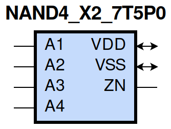
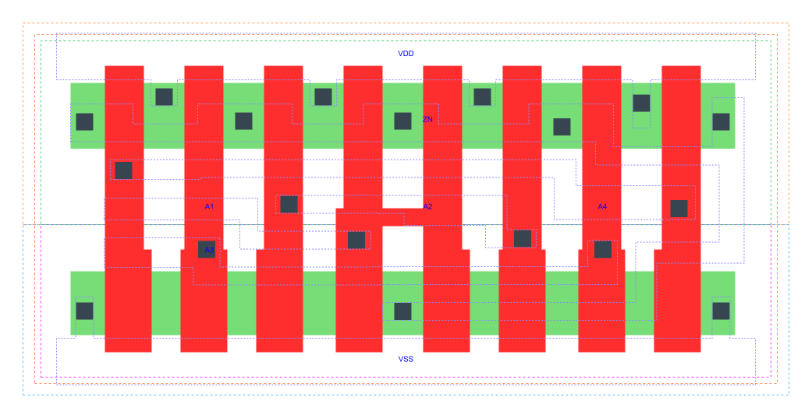

=======================================
gf180mcu_fd_sc_mcu7t5v0__nand4_x2
=======================================

**gf180mcu_fd_sc_mcu7t5v0__nand4_x2 symbol**

**gf180mcu_fd_sc_mcu7t5v0__nand4_x2 schematic**

.. image:: sc7_sch/NAND4_X2_sch.png
    :height: 300px
    :width: 500 px
    :align: center
    :alt: gf180mcu_fd_sc_mcu7t5v0__nand4_x2 schematic

**gf180mcu_fd_sc_mcu7t5v0__nand4_x2 layout**

.. include:: images.rst

NAND4_X2 is a 4-input NAND, NAND(A1,A2,A3,A4), 2X drive strength

|
| Attributes

============= ======================
**Attribute** **Value**
area          35.123200 µm\ :sup:`2`
============= ======================

|
| OUTPUT FUNCTIONS

============== =========================
**Output Pin** **Function**
ZN             ((!A1)|(!A2)|(!A3)|(!A4))
============== =========================

|
| TRUTH TABLE FOR ZN

====== ====== ====== ====== ======
**A1** **A2** **A3** **A4** **ZN**
0      ?      ?      ?      1
?      0      ?      ?      1
?      ?      0      ?      1
?      ?      ?      0      1
1      1      1      1      0
====== ====== ====== ====== ======

|
| FUNCTIONAL SCHEMATIC
| |image485|
| PIN CAPACITANCE (pf)

======= ======== ====================
**Pin** **Type** **Capacitance (pf)**
A3      input    0.0092
A1      input    0.0088
A4      input    0.0098
A2      input    0.0085
======= ======== ====================

|
| DELAY AND OUTPUT TRANSITION TIME corresponding to min slew and load

+---------------+------------+--------------------+--------------+-------------------+----------------+---------------+
| **Input Pin** | **Output** | **When Condition** | **Tin (ns)** | **Out Load (pf)** | **Delay (ns)** | **Tout (ns)** |
+---------------+------------+--------------------+--------------+-------------------+----------------+---------------+
| A3(LH)        | ZN(HL)     | A1&A2&A4           | 0.0100       | 0.0010            | 0.1478         | 0.0837        |
+---------------+------------+--------------------+--------------+-------------------+----------------+---------------+
| A3(HL)        | ZN(LH)     | A1&A2&A4           | 0.0100       | 0.0010            | 0.1529         | 0.1132        |
+---------------+------------+--------------------+--------------+-------------------+----------------+---------------+
| A1(HL)        | ZN(LH)     | A2&A3&A4           | 0.0100       | 0.0010            | 0.0994         | 0.0694        |
+---------------+------------+--------------------+--------------+-------------------+----------------+---------------+
| A1(LH)        | ZN(HL)     | A2&A3&A4           | 0.0100       | 0.0010            | 0.0980         | 0.0828        |
+---------------+------------+--------------------+--------------+-------------------+----------------+---------------+
| A4(LH)        | ZN(HL)     | A1&A2&A3           | 0.0100       | 0.0010            | 0.1588         | 0.0837        |
+---------------+------------+--------------------+--------------+-------------------+----------------+---------------+
| A4(HL)        | ZN(LH)     | A1&A2&A3           | 0.0100       | 0.0010            | 0.1695         | 0.1328        |
+---------------+------------+--------------------+--------------+-------------------+----------------+---------------+
| A2(HL)        | ZN(LH)     | A1&A3&A4           | 0.0100       | 0.0010            | 0.1286         | 0.0925        |
+---------------+------------+--------------------+--------------+-------------------+----------------+---------------+
| A2(LH)        | ZN(HL)     | A1&A3&A4           | 0.0100       | 0.0010            | 0.1281         | 0.0838        |
+---------------+------------+--------------------+--------------+-------------------+----------------+---------------+

|
| DYNAMIC ENERGY

+---------------+--------------------+--------------+------------+-------------------+---------------------+
| **Input Pin** | **When Condition** | **Tin (ns)** | **Output** | **Out Load (pf)** | **Energy (uW/MHz)** |
+---------------+--------------------+--------------+------------+-------------------+---------------------+
| A1            | A2&A3&A4           | 0.0100       | ZN(LH)     | 0.0010            | 0.2581              |
+---------------+--------------------+--------------+------------+-------------------+---------------------+
| A4            | A1&A2&A3           | 0.0100       | ZN(HL)     | 0.0010            | 0.0562              |
+---------------+--------------------+--------------+------------+-------------------+---------------------+
| A2            | A1&A3&A4           | 0.0100       | ZN(LH)     | 0.0010            | 0.3407              |
+---------------+--------------------+--------------+------------+-------------------+---------------------+
| A3            | A1&A2&A4           | 0.0100       | ZN(HL)     | 0.0010            | 0.0562              |
+---------------+--------------------+--------------+------------+-------------------+---------------------+
| A1            | A2&A3&A4           | 0.0100       | ZN(HL)     | 0.0010            | 0.0563              |
+---------------+--------------------+--------------+------------+-------------------+---------------------+
| A2            | A1&A3&A4           | 0.0100       | ZN(HL)     | 0.0010            | 0.0562              |
+---------------+--------------------+--------------+------------+-------------------+---------------------+
| A4            | A1&A2&A3           | 0.0100       | ZN(LH)     | 0.0010            | 0.4937              |
+---------------+--------------------+--------------+------------+-------------------+---------------------+
| A3            | A1&A2&A4           | 0.0100       | ZN(LH)     | 0.0010            | 0.4205              |
+---------------+--------------------+--------------+------------+-------------------+---------------------+
| A3(LH)        | !A1&!A2&!A4        | 0.0100       | n/a        | n/a               | -0.0549             |
+---------------+--------------------+--------------+------------+-------------------+---------------------+
| A3(LH)        | !A1&!A2&A4         | 0.0100       | n/a        | n/a               | -0.0543             |
+---------------+--------------------+--------------+------------+-------------------+---------------------+
| A3(LH)        | !A1&A2&!A4         | 0.0100       | n/a        | n/a               | -0.0546             |
+---------------+--------------------+--------------+------------+-------------------+---------------------+
| A3(LH)        | !A1&A2&A4          | 0.0100       | n/a        | n/a               | -0.0543             |
+---------------+--------------------+--------------+------------+-------------------+---------------------+
| A3(LH)        | A1&!A2&!A4         | 0.0100       | n/a        | n/a               | -0.0547             |
+---------------+--------------------+--------------+------------+-------------------+---------------------+
| A3(LH)        | A1&!A2&A4          | 0.0100       | n/a        | n/a               | -0.0544             |
+---------------+--------------------+--------------+------------+-------------------+---------------------+
| A3(LH)        | A1&A2&!A4          | 0.0100       | n/a        | n/a               | -0.0389             |
+---------------+--------------------+--------------+------------+-------------------+---------------------+
| A2(LH)        | !A1&!A3&!A4        | 0.0100       | n/a        | n/a               | -0.0549             |
+---------------+--------------------+--------------+------------+-------------------+---------------------+
| A2(LH)        | !A1&!A3&A4         | 0.0100       | n/a        | n/a               | -0.0547             |
+---------------+--------------------+--------------+------------+-------------------+---------------------+
| A2(LH)        | !A1&A3&!A4         | 0.0100       | n/a        | n/a               | -0.0545             |
+---------------+--------------------+--------------+------------+-------------------+---------------------+
| A2(LH)        | !A1&A3&A4          | 0.0100       | n/a        | n/a               | -0.0543             |
+---------------+--------------------+--------------+------------+-------------------+---------------------+
| A2(LH)        | A1&!A3&!A4         | 0.0100       | n/a        | n/a               | -0.0357             |
+---------------+--------------------+--------------+------------+-------------------+---------------------+
| A2(LH)        | A1&!A3&A4          | 0.0100       | n/a        | n/a               | -0.0357             |
+---------------+--------------------+--------------+------------+-------------------+---------------------+
| A2(LH)        | A1&A3&!A4          | 0.0100       | n/a        | n/a               | 0.0460              |
+---------------+--------------------+--------------+------------+-------------------+---------------------+
| A1(LH)        | !A2&!A3&!A4        | 0.0100       | n/a        | n/a               | -0.0313             |
+---------------+--------------------+--------------+------------+-------------------+---------------------+
| A1(LH)        | !A2&!A3&A4         | 0.0100       | n/a        | n/a               | -0.0313             |
+---------------+--------------------+--------------+------------+-------------------+---------------------+
| A1(LH)        | !A2&A3&!A4         | 0.0100       | n/a        | n/a               | -0.0313             |
+---------------+--------------------+--------------+------------+-------------------+---------------------+
| A1(LH)        | !A2&A3&A4          | 0.0100       | n/a        | n/a               | -0.0313             |
+---------------+--------------------+--------------+------------+-------------------+---------------------+
| A1(LH)        | A2&!A3&!A4         | 0.0100       | n/a        | n/a               | 0.0513              |
+---------------+--------------------+--------------+------------+-------------------+---------------------+
| A1(LH)        | A2&!A3&A4          | 0.0100       | n/a        | n/a               | 0.0514              |
+---------------+--------------------+--------------+------------+-------------------+---------------------+
| A1(LH)        | A2&A3&!A4          | 0.0100       | n/a        | n/a               | 0.1328              |
+---------------+--------------------+--------------+------------+-------------------+---------------------+
| A3(HL)        | !A1&!A2&!A4        | 0.0100       | n/a        | n/a               | 0.0652              |
+---------------+--------------------+--------------+------------+-------------------+---------------------+
| A3(HL)        | !A1&!A2&A4         | 0.0100       | n/a        | n/a               | 0.0574              |
+---------------+--------------------+--------------+------------+-------------------+---------------------+
| A3(HL)        | !A1&A2&!A4         | 0.0100       | n/a        | n/a               | 0.0836              |
+---------------+--------------------+--------------+------------+-------------------+---------------------+
| A3(HL)        | !A1&A2&A4          | 0.0100       | n/a        | n/a               | 0.0679              |
+---------------+--------------------+--------------+------------+-------------------+---------------------+
| A3(HL)        | A1&!A2&!A4         | 0.0100       | n/a        | n/a               | 0.0736              |
+---------------+--------------------+--------------+------------+-------------------+---------------------+
| A3(HL)        | A1&!A2&A4          | 0.0100       | n/a        | n/a               | 0.0645              |
+---------------+--------------------+--------------+------------+-------------------+---------------------+
| A3(HL)        | A1&A2&!A4          | 0.0100       | n/a        | n/a               | 0.0605              |
+---------------+--------------------+--------------+------------+-------------------+---------------------+
| A2(HL)        | !A1&!A3&!A4        | 0.0100       | n/a        | n/a               | 0.0819              |
+---------------+--------------------+--------------+------------+-------------------+---------------------+
| A2(HL)        | !A1&!A3&A4         | 0.0100       | n/a        | n/a               | 0.0795              |
+---------------+--------------------+--------------+------------+-------------------+---------------------+
| A2(HL)        | !A1&A3&!A4         | 0.0100       | n/a        | n/a               | 0.0810              |
+---------------+--------------------+--------------+------------+-------------------+---------------------+
| A2(HL)        | !A1&A3&A4          | 0.0100       | n/a        | n/a               | 0.0698              |
+---------------+--------------------+--------------+------------+-------------------+---------------------+
| A2(HL)        | A1&!A3&!A4         | 0.0100       | n/a        | n/a               | 0.0626              |
+---------------+--------------------+--------------+------------+-------------------+---------------------+
| A2(HL)        | A1&!A3&A4          | 0.0100       | n/a        | n/a               | 0.0626              |
+---------------+--------------------+--------------+------------+-------------------+---------------------+
| A2(HL)        | A1&A3&!A4          | 0.0100       | n/a        | n/a               | 0.0627              |
+---------------+--------------------+--------------+------------+-------------------+---------------------+
| A4(LH)        | !A1&!A2&!A3        | 0.0100       | n/a        | n/a               | -0.0545             |
+---------------+--------------------+--------------+------------+-------------------+---------------------+
| A4(LH)        | !A1&!A2&A3         | 0.0100       | n/a        | n/a               | -0.0543             |
+---------------+--------------------+--------------+------------+-------------------+---------------------+
| A4(LH)        | !A1&A2&!A3         | 0.0100       | n/a        | n/a               | -0.0545             |
+---------------+--------------------+--------------+------------+-------------------+---------------------+
| A4(LH)        | !A1&A2&A3          | 0.0100       | n/a        | n/a               | -0.0542             |
+---------------+--------------------+--------------+------------+-------------------+---------------------+
| A4(LH)        | A1&!A2&!A3         | 0.0100       | n/a        | n/a               | -0.0546             |
+---------------+--------------------+--------------+------------+-------------------+---------------------+
| A4(LH)        | A1&!A2&A3          | 0.0100       | n/a        | n/a               | -0.0543             |
+---------------+--------------------+--------------+------------+-------------------+---------------------+
| A4(LH)        | A1&A2&!A3          | 0.0100       | n/a        | n/a               | -0.0545             |
+---------------+--------------------+--------------+------------+-------------------+---------------------+
| A1(HL)        | !A2&!A3&!A4        | 0.0100       | n/a        | n/a               | 0.0642              |
+---------------+--------------------+--------------+------------+-------------------+---------------------+
| A1(HL)        | !A2&!A3&A4         | 0.0100       | n/a        | n/a               | 0.0642              |
+---------------+--------------------+--------------+------------+-------------------+---------------------+
| A1(HL)        | !A2&A3&!A4         | 0.0100       | n/a        | n/a               | 0.0642              |
+---------------+--------------------+--------------+------------+-------------------+---------------------+
| A1(HL)        | !A2&A3&A4          | 0.0100       | n/a        | n/a               | 0.0640              |
+---------------+--------------------+--------------+------------+-------------------+---------------------+
| A1(HL)        | A2&!A3&!A4         | 0.0100       | n/a        | n/a               | 0.0633              |
+---------------+--------------------+--------------+------------+-------------------+---------------------+
| A1(HL)        | A2&!A3&A4          | 0.0100       | n/a        | n/a               | 0.0633              |
+---------------+--------------------+--------------+------------+-------------------+---------------------+
| A1(HL)        | A2&A3&!A4          | 0.0100       | n/a        | n/a               | 0.0633              |
+---------------+--------------------+--------------+------------+-------------------+---------------------+
| A4(HL)        | !A1&!A2&!A3        | 0.0100       | n/a        | n/a               | 0.0543              |
+---------------+--------------------+--------------+------------+-------------------+---------------------+
| A4(HL)        | !A1&!A2&A3         | 0.0100       | n/a        | n/a               | 0.0547              |
+---------------+--------------------+--------------+------------+-------------------+---------------------+
| A4(HL)        | !A1&A2&!A3         | 0.0100       | n/a        | n/a               | 0.0543              |
+---------------+--------------------+--------------+------------+-------------------+---------------------+
| A4(HL)        | !A1&A2&A3          | 0.0100       | n/a        | n/a               | 0.0556              |
+---------------+--------------------+--------------+------------+-------------------+---------------------+
| A4(HL)        | A1&!A2&!A3         | 0.0100       | n/a        | n/a               | 0.0543              |
+---------------+--------------------+--------------+------------+-------------------+---------------------+
| A4(HL)        | A1&!A2&A3          | 0.0100       | n/a        | n/a               | 0.0585              |
+---------------+--------------------+--------------+------------+-------------------+---------------------+
| A4(HL)        | A1&A2&!A3          | 0.0100       | n/a        | n/a               | 0.0578              |
+---------------+--------------------+--------------+------------+-------------------+---------------------+

|
| LEAKAGE POWER

================== ==============
**When Condition** **Power (nW)**
!A1&!A2&!A3&!A4    0.1004
!A1&!A2&!A3&A4     0.1004
!A1&!A2&A3&!A4     0.1004
!A1&!A2&A3&A4      0.1004
!A1&A2&!A3&!A4     0.1006
!A1&A2&!A3&A4      0.1006
!A1&A2&A3&!A4      0.1006
!A1&A2&A3&A4       0.1009
A1&!A2&!A3&!A4     0.1804
A1&!A2&!A3&A4      0.1804
A1&!A2&A3&!A4      0.1805
A1&!A2&A3&A4       0.1807
A1&A2&!A3&!A4      0.2587
A1&A2&!A3&A4       0.2590
A1&A2&A3&!A4       0.3366
A1&A2&A3&A4        0.2601
================== ==============

