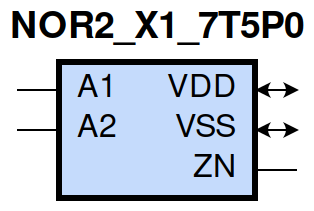
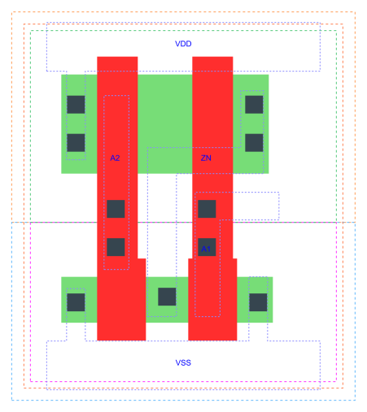

=======================================
gf180mcu_fd_sc_mcu7t5v0__nor2_x1
=======================================

**gf180mcu_fd_sc_mcu7t5v0__nor2_x1 symbol**

**gf180mcu_fd_sc_mcu7t5v0__nor2_x1 schematic**

.. image:: sc7_sch/NOR2_X1_sch.png
    :height: 300px
    :width: 500 px
    :align: center
    :alt: gf180mcu_fd_sc_mcu7t5v0__nor2_x1 schematic

**gf180mcu_fd_sc_mcu7t5v0__nor2_x1 layout**

.. include:: images.rst

NOR2_X1 is a 2-input NOR, NOR(A1,A2), 1X drive strength

|
| Attributes

============= ======================
**Attribute** **Value**
area          13.171200 µm\ :sup:`2`
============= ======================

|
| OUTPUT FUNCTIONS

============== =============
**Output Pin** **Function**
ZN             ((!A1)&(!A2))
============== =============

|
| TRUTH TABLE FOR ZN

====== ====== ======
**A1** **A2** **ZN**
0      0      1
1      ?      0
?      1      0
====== ====== ======

|
| FUNCTIONAL SCHEMATIC
| |image491|
| PIN CAPACITANCE (pf)

======= ======== ====================
**Pin** **Type** **Capacitance (pf)**
A2      input    0.0042
A1      input    0.0045
======= ======== ====================

|
| DELAY AND OUTPUT TRANSITION TIME corresponding to min slew and load

+---------------+------------+--------------------+--------------+-------------------+----------------+---------------+
| **Input Pin** | **Output** | **When Condition** | **Tin (ns)** | **Out Load (pf)** | **Delay (ns)** | **Tout (ns)** |
+---------------+------------+--------------------+--------------+-------------------+----------------+---------------+
| A2(HL)        | ZN(LH)     | !A1                | 0.0100       | 0.0010            | 0.1157         | 0.0728        |
+---------------+------------+--------------------+--------------+-------------------+----------------+---------------+
| A2(LH)        | ZN(HL)     | !A1                | 0.0100       | 0.0010            | 0.0734         | 0.0440        |
+---------------+------------+--------------------+--------------+-------------------+----------------+---------------+
| A1(HL)        | ZN(LH)     | !A2                | 0.0100       | 0.0010            | 0.0889         | 0.0720        |
+---------------+------------+--------------------+--------------+-------------------+----------------+---------------+
| A1(LH)        | ZN(HL)     | !A2                | 0.0100       | 0.0010            | 0.0542         | 0.0289        |
+---------------+------------+--------------------+--------------+-------------------+----------------+---------------+

|
| DYNAMIC ENERGY

+---------------+--------------------+--------------+------------+-------------------+---------------------+
| **Input Pin** | **When Condition** | **Tin (ns)** | **Output** | **Out Load (pf)** | **Energy (uW/MHz)** |
+---------------+--------------------+--------------+------------+-------------------+---------------------+
| A1            | !A2                | 0.0100       | ZN(LH)     | 0.0010            | 0.1021              |
+---------------+--------------------+--------------+------------+-------------------+---------------------+
| A2            | !A1                | 0.0100       | ZN(LH)     | 0.0010            | 0.1331              |
+---------------+--------------------+--------------+------------+-------------------+---------------------+
| A1            | !A2                | 0.0100       | ZN(HL)     | 0.0010            | 0.0005              |
+---------------+--------------------+--------------+------------+-------------------+---------------------+
| A2            | !A1                | 0.0100       | ZN(HL)     | 0.0010            | 0.0256              |
+---------------+--------------------+--------------+------------+-------------------+---------------------+
| A2(LH)        | A1                 | 0.0100       | n/a        | n/a               | -0.0327             |
+---------------+--------------------+--------------+------------+-------------------+---------------------+
| A1(LH)        | A2                 | 0.0100       | n/a        | n/a               | -0.0112             |
+---------------+--------------------+--------------+------------+-------------------+---------------------+
| A2(HL)        | A1                 | 0.0100       | n/a        | n/a               | 0.0393              |
+---------------+--------------------+--------------+------------+-------------------+---------------------+
| A1(HL)        | A2                 | 0.0100       | n/a        | n/a               | 0.0288              |
+---------------+--------------------+--------------+------------+-------------------+---------------------+

|
| LEAKAGE POWER

================== ==============
**When Condition** **Power (nW)**
!A1&!A2            0.1010
!A1&A2             0.1121
A1&!A2             0.0765
A1&A2              0.0765
================== ==============

