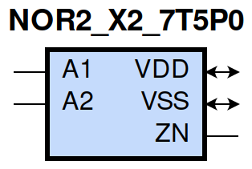
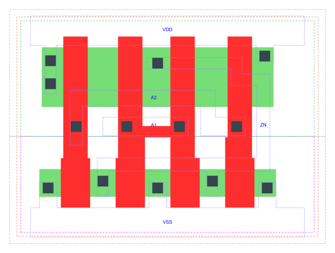

=======================================
gf180mcu_fd_sc_mcu7t5v0__nor2_x2
=======================================

**gf180mcu_fd_sc_mcu7t5v0__nor2_x2 symbol**

**gf180mcu_fd_sc_mcu7t5v0__nor2_x2 schematic**

.. image:: sc7_sch/NOR2_X2_sch.png
    :height: 300px
    :width: 500 px
    :align: center
    :alt: gf180mcu_fd_sc_mcu7t5v0__nor2_x2 schematic

**gf180mcu_fd_sc_mcu7t5v0__nor2_x2 layout**

.. include:: images.rst

NOR2_X2 is a 2-input NOR, NOR(A1,A2), 2X drive strength

|
| Attributes

============= ======================
**Attribute** **Value**
area          21.952000 µm\ :sup:`2`
============= ======================

|
| OUTPUT FUNCTIONS

============== =============
**Output Pin** **Function**
ZN             ((!A1)&(!A2))
============== =============

|
| TRUTH TABLE FOR ZN

====== ====== ======
**A1** **A2** **ZN**
0      0      1
1      ?      0
?      1      0
====== ====== ======

|
| FUNCTIONAL SCHEMATIC
| |image494|
| PIN CAPACITANCE (pf)

======= ======== ====================
**Pin** **Type** **Capacitance (pf)**
A2      input    0.0086
A1      input    0.0083
======= ======== ====================

|
| DELAY AND OUTPUT TRANSITION TIME corresponding to min slew and load

+---------------+------------+--------------------+--------------+-------------------+----------------+---------------+
| **Input Pin** | **Output** | **When Condition** | **Tin (ns)** | **Out Load (pf)** | **Delay (ns)** | **Tout (ns)** |
+---------------+------------+--------------------+--------------+-------------------+----------------+---------------+
| A2(HL)        | ZN(LH)     | !A1                | 0.0100       | 0.0010            | 0.0990         | 0.0588        |
+---------------+------------+--------------------+--------------+-------------------+----------------+---------------+
| A2(LH)        | ZN(HL)     | !A1                | 0.0100       | 0.0010            | 0.0642         | 0.0366        |
+---------------+------------+--------------------+--------------+-------------------+----------------+---------------+
| A1(HL)        | ZN(LH)     | !A2                | 0.0100       | 0.0010            | 0.0728         | 0.0575        |
+---------------+------------+--------------------+--------------+-------------------+----------------+---------------+
| A1(LH)        | ZN(HL)     | !A2                | 0.0100       | 0.0010            | 0.0457         | 0.0222        |
+---------------+------------+--------------------+--------------+-------------------+----------------+---------------+

|
| DYNAMIC ENERGY

+---------------+--------------------+--------------+------------+-------------------+---------------------+
| **Input Pin** | **When Condition** | **Tin (ns)** | **Output** | **Out Load (pf)** | **Energy (uW/MHz)** |
+---------------+--------------------+--------------+------------+-------------------+---------------------+
| A1            | !A2                | 0.0100       | ZN(LH)     | 0.0010            | 0.1974              |
+---------------+--------------------+--------------+------------+-------------------+---------------------+
| A2            | !A1                | 0.0100       | ZN(LH)     | 0.0010            | 0.2582              |
+---------------+--------------------+--------------+------------+-------------------+---------------------+
| A1            | !A2                | 0.0100       | ZN(HL)     | 0.0010            | -0.0163             |
+---------------+--------------------+--------------+------------+-------------------+---------------------+
| A2            | !A1                | 0.0100       | ZN(HL)     | 0.0010            | 0.0339              |
+---------------+--------------------+--------------+------------+-------------------+---------------------+
| A2(LH)        | A1                 | 0.0100       | n/a        | n/a               | -0.0654             |
+---------------+--------------------+--------------+------------+-------------------+---------------------+
| A1(LH)        | A2                 | 0.0100       | n/a        | n/a               | -0.0224             |
+---------------+--------------------+--------------+------------+-------------------+---------------------+
| A2(HL)        | A1                 | 0.0100       | n/a        | n/a               | 0.0786              |
+---------------+--------------------+--------------+------------+-------------------+---------------------+
| A1(HL)        | A2                 | 0.0100       | n/a        | n/a               | 0.0573              |
+---------------+--------------------+--------------+------------+-------------------+---------------------+

|
| LEAKAGE POWER

================== ==============
**When Condition** **Power (nW)**
!A1&!A2            0.1520
!A1&A2             0.1743
A1&!A2             0.1030
A1&A2              0.1030
================== ==============

