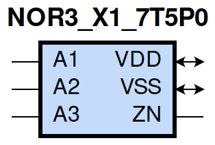
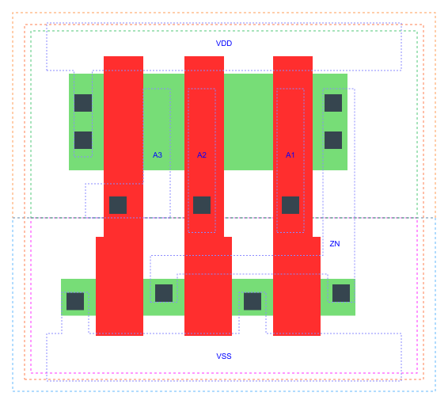

=======================================
gf180mcu_fd_sc_mcu7t5v0__nor3_x1
=======================================

**gf180mcu_fd_sc_mcu7t5v0__nor3_x1 symbol**

**gf180mcu_fd_sc_mcu7t5v0__nor3_x1 schematic**

**gf180mcu_fd_sc_mcu7t5v0__nor3_x1 layout**

.. include:: images.rst

NOR3_X1 is a 3-input NOR, NOR(A1,A2,A3), 1X drive strength

|
| Attributes

============= ======================
**Attribute** **Value**
area          17.561600 µm\ :sup:`2`
============= ======================

|
| OUTPUT FUNCTIONS

============== ===================
**Output Pin** **Function**
ZN             ((!A1)&(!A2)&(!A3))
============== ===================

|
| TRUTH TABLE FOR ZN

====== ====== ====== ======
**A1** **A2** **A3** **ZN**
0      0      0      1
1      ?      ?      0
?      1      ?      0
?      ?      1      0
====== ====== ====== ======

|
| FUNCTIONAL SCHEMATIC
| |image500|
| PIN CAPACITANCE (pf)

======= ======== ====================
**Pin** **Type** **Capacitance (pf)**
A3      input    0.0041
A2      input    0.0040
A1      input    0.0042
======= ======== ====================

|
| DELAY AND OUTPUT TRANSITION TIME corresponding to min slew and load

+---------------+------------+--------------------+--------------+-------------------+----------------+---------------+
| **Input Pin** | **Output** | **When Condition** | **Tin (ns)** | **Out Load (pf)** | **Delay (ns)** | **Tout (ns)** |
+---------------+------------+--------------------+--------------+-------------------+----------------+---------------+
| A3(LH)        | ZN(HL)     | !A1&!A2            | 0.0100       | 0.0010            | 0.1023         | 0.0707        |
+---------------+------------+--------------------+--------------+-------------------+----------------+---------------+
| A3(HL)        | ZN(LH)     | !A1&!A2            | 0.0100       | 0.0010            | 0.2082         | 0.1288        |
+---------------+------------+--------------------+--------------+-------------------+----------------+---------------+
| A2(HL)        | ZN(LH)     | !A1&!A3            | 0.0100       | 0.0010            | 0.1850         | 0.1286        |
+---------------+------------+--------------------+--------------+-------------------+----------------+---------------+
| A2(LH)        | ZN(HL)     | !A1&!A3            | 0.0100       | 0.0010            | 0.0939         | 0.0566        |
+---------------+------------+--------------------+--------------+-------------------+----------------+---------------+
| A1(HL)        | ZN(LH)     | !A2&!A3            | 0.0100       | 0.0010            | 0.1264         | 0.1249        |
+---------------+------------+--------------------+--------------+-------------------+----------------+---------------+
| A1(LH)        | ZN(HL)     | !A2&!A3            | 0.0100       | 0.0010            | 0.0683         | 0.0387        |
+---------------+------------+--------------------+--------------+-------------------+----------------+---------------+

|
| DYNAMIC ENERGY

+---------------+--------------------+--------------+------------+-------------------+---------------------+
| **Input Pin** | **When Condition** | **Tin (ns)** | **Output** | **Out Load (pf)** | **Energy (uW/MHz)** |
+---------------+--------------------+--------------+------------+-------------------+---------------------+
| A1            | !A2&!A3            | 0.0100       | ZN(LH)     | 0.0010            | 0.1168              |
+---------------+--------------------+--------------+------------+-------------------+---------------------+
| A2            | !A1&!A3            | 0.0100       | ZN(LH)     | 0.0010            | 0.1468              |
+---------------+--------------------+--------------+------------+-------------------+---------------------+
| A3            | !A1&!A2            | 0.0100       | ZN(HL)     | 0.0010            | 0.0485              |
+---------------+--------------------+--------------+------------+-------------------+---------------------+
| A1            | !A2&!A3            | 0.0100       | ZN(HL)     | 0.0010            | 0.0010              |
+---------------+--------------------+--------------+------------+-------------------+---------------------+
| A2            | !A1&!A3            | 0.0100       | ZN(HL)     | 0.0010            | 0.0269              |
+---------------+--------------------+--------------+------------+-------------------+---------------------+
| A3            | !A1&!A2            | 0.0100       | ZN(LH)     | 0.0010            | 0.1760              |
+---------------+--------------------+--------------+------------+-------------------+---------------------+
| A3(LH)        | !A1&A2             | 0.0100       | n/a        | n/a               | -0.0341             |
+---------------+--------------------+--------------+------------+-------------------+---------------------+
| A3(LH)        | A1&!A2             | 0.0100       | n/a        | n/a               | -0.0326             |
+---------------+--------------------+--------------+------------+-------------------+---------------------+
| A3(LH)        | A1&A2              | 0.0100       | n/a        | n/a               | -0.0372             |
+---------------+--------------------+--------------+------------+-------------------+---------------------+
| A2(LH)        | !A1&A3             | 0.0100       | n/a        | n/a               | -0.0119             |
+---------------+--------------------+--------------+------------+-------------------+---------------------+
| A2(LH)        | A1&!A3             | 0.0100       | n/a        | n/a               | -0.0327             |
+---------------+--------------------+--------------+------------+-------------------+---------------------+
| A2(LH)        | A1&A3              | 0.0100       | n/a        | n/a               | -0.0290             |
+---------------+--------------------+--------------+------------+-------------------+---------------------+
| A1(LH)        | !A2&A3             | 0.0100       | n/a        | n/a               | -0.0109             |
+---------------+--------------------+--------------+------------+-------------------+---------------------+
| A1(LH)        | A2&!A3             | 0.0100       | n/a        | n/a               | -0.0112             |
+---------------+--------------------+--------------+------------+-------------------+---------------------+
| A1(LH)        | A2&A3              | 0.0100       | n/a        | n/a               | -0.0112             |
+---------------+--------------------+--------------+------------+-------------------+---------------------+
| A3(HL)        | !A1&A2             | 0.0100       | n/a        | n/a               | 0.0392              |
+---------------+--------------------+--------------+------------+-------------------+---------------------+
| A3(HL)        | A1&!A2             | 0.0100       | n/a        | n/a               | 0.0393              |
+---------------+--------------------+--------------+------------+-------------------+---------------------+
| A3(HL)        | A1&A2              | 0.0100       | n/a        | n/a               | 0.0392              |
+---------------+--------------------+--------------+------------+-------------------+---------------------+
| A2(HL)        | !A1&A3             | 0.0100       | n/a        | n/a               | 0.0250              |
+---------------+--------------------+--------------+------------+-------------------+---------------------+
| A2(HL)        | A1&!A3             | 0.0100       | n/a        | n/a               | 0.0394              |
+---------------+--------------------+--------------+------------+-------------------+---------------------+
| A2(HL)        | A1&A3              | 0.0100       | n/a        | n/a               | 0.0235              |
+---------------+--------------------+--------------+------------+-------------------+---------------------+
| A1(HL)        | !A2&A3             | 0.0100       | n/a        | n/a               | 0.0526              |
+---------------+--------------------+--------------+------------+-------------------+---------------------+
| A1(HL)        | A2&!A3             | 0.0100       | n/a        | n/a               | 0.0282              |
+---------------+--------------------+--------------+------------+-------------------+---------------------+
| A1(HL)        | A2&A3              | 0.0100       | n/a        | n/a               | 0.0282              |
+---------------+--------------------+--------------+------------+-------------------+---------------------+

|
| LEAKAGE POWER

================== ==============
**When Condition** **Power (nW)**
!A1&!A2&!A3        0.1272
!A1&!A2&A3         0.1475
!A1&A2&!A3         0.1121
!A1&A2&A3          0.1121
A1&!A2&!A3         0.0765
A1&!A2&A3          0.0765
A1&A2&!A3          0.0765
A1&A2&A3           0.0765
================== ==============

