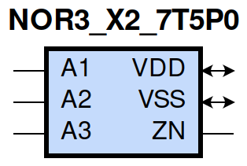
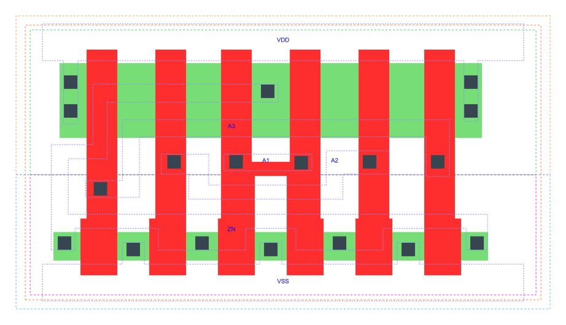

=======================================
gf180mcu_fd_sc_mcu7t5v0__nor3_x2
=======================================

**gf180mcu_fd_sc_mcu7t5v0__nor3_x2 symbol**

**gf180mcu_fd_sc_mcu7t5v0__nor3_x2 schematic**

.. image:: sc7_sch/NOR3_X2_sch.png
    :height: 300px
    :width: 500 px
    :align: center
    :alt: gf180mcu_fd_sc_mcu7t5v0__nor3_x2 schematic

**gf180mcu_fd_sc_mcu7t5v0__nor3_x2 layout**

.. include:: images.rst

NOR3_X2 is a 3-input NOR, NOR(A1,A2,A3), 2X drive strength

|
| Attributes

============= ======================
**Attribute** **Value**
area          30.732800 µm\ :sup:`2`
============= ======================

|
| OUTPUT FUNCTIONS

============== ===================
**Output Pin** **Function**
ZN             ((!A1)&(!A2)&(!A3))
============== ===================

|
| TRUTH TABLE FOR ZN

====== ====== ====== ======
**A1** **A2** **A3** **ZN**
0      0      0      1
1      ?      ?      0
?      1      ?      0
?      ?      1      0
====== ====== ====== ======

|
| FUNCTIONAL SCHEMATIC
| |image503|
| PIN CAPACITANCE (pf)

======= ======== ====================
**Pin** **Type** **Capacitance (pf)**
A3      input    0.0088
A2      input    0.0084
A1      input    0.0080
======= ======== ====================

|
| DELAY AND OUTPUT TRANSITION TIME corresponding to min slew and load

+---------------+------------+--------------------+--------------+-------------------+----------------+---------------+
| **Input Pin** | **Output** | **When Condition** | **Tin (ns)** | **Out Load (pf)** | **Delay (ns)** | **Tout (ns)** |
+---------------+------------+--------------------+--------------+-------------------+----------------+---------------+
| A3(LH)        | ZN(HL)     | !A1&!A2            | 0.0100       | 0.0010            | 0.0975         | 0.0675        |
+---------------+------------+--------------------+--------------+-------------------+----------------+---------------+
| A3(HL)        | ZN(LH)     | !A1&!A2            | 0.0100       | 0.0010            | 0.1998         | 0.1206        |
+---------------+------------+--------------------+--------------+-------------------+----------------+---------------+
| A2(HL)        | ZN(LH)     | !A1&!A3            | 0.0100       | 0.0010            | 0.1754         | 0.1203        |
+---------------+------------+--------------------+--------------+-------------------+----------------+---------------+
| A2(LH)        | ZN(HL)     | !A1&!A3            | 0.0100       | 0.0010            | 0.0894         | 0.0533        |
+---------------+------------+--------------------+--------------+-------------------+----------------+---------------+
| A1(HL)        | ZN(LH)     | !A2&!A3            | 0.0100       | 0.0010            | 0.1175         | 0.1160        |
+---------------+------------+--------------------+--------------+-------------------+----------------+---------------+
| A1(LH)        | ZN(HL)     | !A2&!A3            | 0.0100       | 0.0010            | 0.0642         | 0.0357        |
+---------------+------------+--------------------+--------------+-------------------+----------------+---------------+

|
| DYNAMIC ENERGY

+---------------+--------------------+--------------+------------+-------------------+---------------------+
| **Input Pin** | **When Condition** | **Tin (ns)** | **Output** | **Out Load (pf)** | **Energy (uW/MHz)** |
+---------------+--------------------+--------------+------------+-------------------+---------------------+
| A1            | !A2&!A3            | 0.0100       | ZN(LH)     | 0.0010            | 0.2539              |
+---------------+--------------------+--------------+------------+-------------------+---------------------+
| A2            | !A1&!A3            | 0.0100       | ZN(LH)     | 0.0010            | 0.3141              |
+---------------+--------------------+--------------+------------+-------------------+---------------------+
| A3            | !A1&!A2            | 0.0100       | ZN(HL)     | 0.0010            | 0.0844              |
+---------------+--------------------+--------------+------------+-------------------+---------------------+
| A1            | !A2&!A3            | 0.0100       | ZN(HL)     | 0.0010            | -0.0131             |
+---------------+--------------------+--------------+------------+-------------------+---------------------+
| A2            | !A1&!A3            | 0.0100       | ZN(HL)     | 0.0010            | 0.0380              |
+---------------+--------------------+--------------+------------+-------------------+---------------------+
| A3            | !A1&!A2            | 0.0100       | ZN(LH)     | 0.0010            | 0.3721              |
+---------------+--------------------+--------------+------------+-------------------+---------------------+
| A3(LH)        | !A1&A2             | 0.0100       | n/a        | n/a               | -0.0681             |
+---------------+--------------------+--------------+------------+-------------------+---------------------+
| A3(LH)        | A1&!A2             | 0.0100       | n/a        | n/a               | -0.0655             |
+---------------+--------------------+--------------+------------+-------------------+---------------------+
| A3(LH)        | A1&A2              | 0.0100       | n/a        | n/a               | -0.0743             |
+---------------+--------------------+--------------+------------+-------------------+---------------------+
| A2(LH)        | !A1&A3             | 0.0100       | n/a        | n/a               | -0.0239             |
+---------------+--------------------+--------------+------------+-------------------+---------------------+
| A2(LH)        | A1&!A3             | 0.0100       | n/a        | n/a               | -0.0654             |
+---------------+--------------------+--------------+------------+-------------------+---------------------+
| A2(LH)        | A1&A3              | 0.0100       | n/a        | n/a               | -0.0578             |
+---------------+--------------------+--------------+------------+-------------------+---------------------+
| A1(LH)        | !A2&A3             | 0.0100       | n/a        | n/a               | -0.0219             |
+---------------+--------------------+--------------+------------+-------------------+---------------------+
| A1(LH)        | A2&!A3             | 0.0100       | n/a        | n/a               | -0.0224             |
+---------------+--------------------+--------------+------------+-------------------+---------------------+
| A1(LH)        | A2&A3              | 0.0100       | n/a        | n/a               | -0.0224             |
+---------------+--------------------+--------------+------------+-------------------+---------------------+
| A3(HL)        | !A1&A2             | 0.0100       | n/a        | n/a               | 0.0787              |
+---------------+--------------------+--------------+------------+-------------------+---------------------+
| A3(HL)        | A1&!A2             | 0.0100       | n/a        | n/a               | 0.0787              |
+---------------+--------------------+--------------+------------+-------------------+---------------------+
| A3(HL)        | A1&A2              | 0.0100       | n/a        | n/a               | 0.0787              |
+---------------+--------------------+--------------+------------+-------------------+---------------------+
| A2(HL)        | !A1&A3             | 0.0100       | n/a        | n/a               | 0.0527              |
+---------------+--------------------+--------------+------------+-------------------+---------------------+
| A2(HL)        | A1&!A3             | 0.0100       | n/a        | n/a               | 0.0788              |
+---------------+--------------------+--------------+------------+-------------------+---------------------+
| A2(HL)        | A1&A3              | 0.0100       | n/a        | n/a               | 0.0473              |
+---------------+--------------------+--------------+------------+-------------------+---------------------+
| A1(HL)        | !A2&A3             | 0.0100       | n/a        | n/a               | 0.1069              |
+---------------+--------------------+--------------+------------+-------------------+---------------------+
| A1(HL)        | A2&!A3             | 0.0100       | n/a        | n/a               | 0.0555              |
+---------------+--------------------+--------------+------------+-------------------+---------------------+
| A1(HL)        | A2&A3              | 0.0100       | n/a        | n/a               | 0.0555              |
+---------------+--------------------+--------------+------------+-------------------+---------------------+

|
| LEAKAGE POWER

================== ==============
**When Condition** **Power (nW)**
!A1&!A2&!A3        0.2044
!A1&!A2&A3         0.2449
!A1&A2&!A3         0.1743
!A1&A2&A3          0.1743
A1&!A2&!A3         0.1030
A1&!A2&A3          0.1030
A1&A2&!A3          0.1030
A1&A2&A3           0.1030
================== ==============

