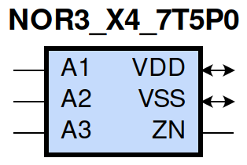
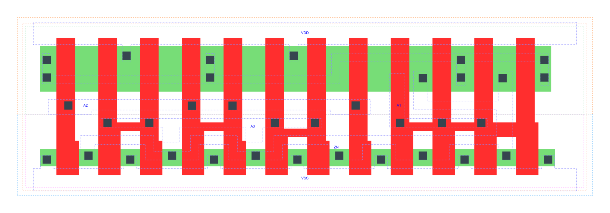

=======================================
gf180mcu_fd_sc_mcu7t5v0__nor3_x4
=======================================

**gf180mcu_fd_sc_mcu7t5v0__nor3_x4 symbol**

**gf180mcu_fd_sc_mcu7t5v0__nor3_x4 schematic**

.. image:: sc7_sch/NOR3_X4_sch.png
    :height: 300px
    :width: 500 px
    :align: center
    :alt: gf180mcu_fd_sc_mcu7t5v0__nor3_x4 schematic

**gf180mcu_fd_sc_mcu7t5v0__nor3_x4 layout**

.. include:: images.rst

NOR3_X4 is a 3-input NOR, NOR(A1,A2,A3), 4X drive strength

|
| Attributes

============= ======================
**Attribute** **Value**
area          57.075200 µm\ :sup:`2`
============= ======================

|
| OUTPUT FUNCTIONS

============== ===================
**Output Pin** **Function**
ZN             ((!A1)&(!A2)&(!A3))
============== ===================

|
| TRUTH TABLE FOR ZN

====== ====== ====== ======
**A1** **A2** **A3** **ZN**
0      0      0      1
1      ?      ?      0
?      1      ?      0
?      ?      1      0
====== ====== ====== ======

|
| FUNCTIONAL SCHEMATIC
| |image506|
| PIN CAPACITANCE (pf)

======= ======== ====================
**Pin** **Type** **Capacitance (pf)**
A2      input    0.0165
A3      input    0.0160
A1      input    0.0160
======= ======== ====================

|
| DELAY AND OUTPUT TRANSITION TIME corresponding to min slew and load

+---------------+------------+--------------------+--------------+-------------------+----------------+---------------+
| **Input Pin** | **Output** | **When Condition** | **Tin (ns)** | **Out Load (pf)** | **Delay (ns)** | **Tout (ns)** |
+---------------+------------+--------------------+--------------+-------------------+----------------+---------------+
| A2(HL)        | ZN(LH)     | !A1&!A3            | 0.0100       | 0.0010            | 0.1661         | 0.1061        |
+---------------+------------+--------------------+--------------+-------------------+----------------+---------------+
| A2(LH)        | ZN(HL)     | !A1&!A3            | 0.0100       | 0.0010            | 0.0840         | 0.0501        |
+---------------+------------+--------------------+--------------+-------------------+----------------+---------------+
| A3(LH)        | ZN(HL)     | !A1&!A2            | 0.0100       | 0.0010            | 0.0891         | 0.0628        |
+---------------+------------+--------------------+--------------+-------------------+----------------+---------------+
| A3(HL)        | ZN(LH)     | !A1&!A2            | 0.0100       | 0.0010            | 0.1910         | 0.1065        |
+---------------+------------+--------------------+--------------+-------------------+----------------+---------------+
| A1(HL)        | ZN(LH)     | !A2&!A3            | 0.0100       | 0.0010            | 0.0877         | 0.0930        |
+---------------+------------+--------------------+--------------+-------------------+----------------+---------------+
| A1(LH)        | ZN(HL)     | !A2&!A3            | 0.0100       | 0.0010            | 0.0548         | 0.0283        |
+---------------+------------+--------------------+--------------+-------------------+----------------+---------------+

|
| DYNAMIC ENERGY

+---------------+--------------------+--------------+------------+-------------------+---------------------+
| **Input Pin** | **When Condition** | **Tin (ns)** | **Output** | **Out Load (pf)** | **Energy (uW/MHz)** |
+---------------+--------------------+--------------+------------+-------------------+---------------------+
| A1            | !A2&!A3            | 0.0100       | ZN(LH)     | 0.0010            | 0.4410              |
+---------------+--------------------+--------------+------------+-------------------+---------------------+
| A2            | !A1&!A3            | 0.0100       | ZN(LH)     | 0.0010            | 0.6252              |
+---------------+--------------------+--------------+------------+-------------------+---------------------+
| A3            | !A1&!A2            | 0.0100       | ZN(HL)     | 0.0010            | 0.1827              |
+---------------+--------------------+--------------+------------+-------------------+---------------------+
| A1            | !A2&!A3            | 0.0100       | ZN(HL)     | 0.0010            | -0.0298             |
+---------------+--------------------+--------------+------------+-------------------+---------------------+
| A2            | !A1&!A3            | 0.0100       | ZN(HL)     | 0.0010            | 0.0893              |
+---------------+--------------------+--------------+------------+-------------------+---------------------+
| A3            | !A1&!A2            | 0.0100       | ZN(LH)     | 0.0010            | 0.7432              |
+---------------+--------------------+--------------+------------+-------------------+---------------------+
| A3(LH)        | !A1&A2             | 0.0100       | n/a        | n/a               | -0.1368             |
+---------------+--------------------+--------------+------------+-------------------+---------------------+
| A3(LH)        | A1&!A2             | 0.0100       | n/a        | n/a               | -0.1285             |
+---------------+--------------------+--------------+------------+-------------------+---------------------+
| A3(LH)        | A1&A2              | 0.0100       | n/a        | n/a               | -0.1458             |
+---------------+--------------------+--------------+------------+-------------------+---------------------+
| A2(LH)        | !A1&A3             | 0.0100       | n/a        | n/a               | -0.0486             |
+---------------+--------------------+--------------+------------+-------------------+---------------------+
| A2(LH)        | A1&!A3             | 0.0100       | n/a        | n/a               | -0.1213             |
+---------------+--------------------+--------------+------------+-------------------+---------------------+
| A2(LH)        | A1&A3              | 0.0100       | n/a        | n/a               | -0.1038             |
+---------------+--------------------+--------------+------------+-------------------+---------------------+
| A1(LH)        | !A2&A3             | 0.0100       | n/a        | n/a               | -0.0414             |
+---------------+--------------------+--------------+------------+-------------------+---------------------+
| A1(LH)        | A2&!A3             | 0.0100       | n/a        | n/a               | -0.0405             |
+---------------+--------------------+--------------+------------+-------------------+---------------------+
| A1(LH)        | A2&A3              | 0.0100       | n/a        | n/a               | -0.0406             |
+---------------+--------------------+--------------+------------+-------------------+---------------------+
| A3(HL)        | !A1&A2             | 0.0100       | n/a        | n/a               | 0.1571              |
+---------------+--------------------+--------------+------------+-------------------+---------------------+
| A3(HL)        | A1&!A2             | 0.0100       | n/a        | n/a               | 0.1576              |
+---------------+--------------------+--------------+------------+-------------------+---------------------+
| A3(HL)        | A1&A2              | 0.0100       | n/a        | n/a               | 0.1571              |
+---------------+--------------------+--------------+------------+-------------------+---------------------+
| A2(HL)        | !A1&A3             | 0.0100       | n/a        | n/a               | 0.1061              |
+---------------+--------------------+--------------+------------+-------------------+---------------------+
| A2(HL)        | A1&!A3             | 0.0100       | n/a        | n/a               | 0.1576              |
+---------------+--------------------+--------------+------------+-------------------+---------------------+
| A2(HL)        | A1&A3              | 0.0100       | n/a        | n/a               | 0.0856              |
+---------------+--------------------+--------------+------------+-------------------+---------------------+
| A1(HL)        | !A2&A3             | 0.0100       | n/a        | n/a               | 0.2271              |
+---------------+--------------------+--------------+------------+-------------------+---------------------+
| A1(HL)        | A2&!A3             | 0.0100       | n/a        | n/a               | 0.1227              |
+---------------+--------------------+--------------+------------+-------------------+---------------------+
| A1(HL)        | A2&A3              | 0.0100       | n/a        | n/a               | 0.1227              |
+---------------+--------------------+--------------+------------+-------------------+---------------------+

|
| LEAKAGE POWER

================== ==============
**When Condition** **Power (nW)**
!A1&!A2&!A3        0.3589
!A1&!A2&A3         0.4398
!A1&A2&!A3         0.2985
!A1&A2&A3          0.2985
A1&!A2&!A3         0.1560
A1&!A2&A3          0.1561
A1&A2&!A3          0.1561
A1&A2&A3           0.1561
================== ==============

