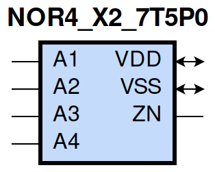
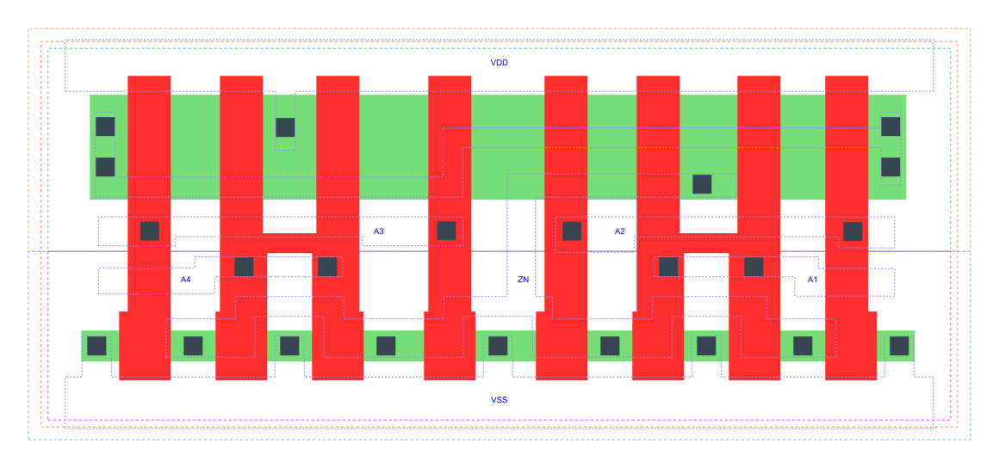

=======================================
gf180mcu_fd_sc_mcu7t5v0__nor4_x2
=======================================

**gf180mcu_fd_sc_mcu7t5v0__nor4_x2 symbol**

**gf180mcu_fd_sc_mcu7t5v0__nor4_x2 schematic**

.. image:: sc7_sch/NOR4_X2_sch.png
    :height: 300px
    :width: 500 px
    :align: center
    :alt: gf180mcu_fd_sc_mcu7t5v0__nor4_x2 schematic

**gf180mcu_fd_sc_mcu7t5v0__nor4_x2 layout**

.. include:: images.rst

NOR4_X2 is a 4-input NOR, NOR(A1,A2,A3,A4), 2X drive strength

|
| Attributes

============= ======================
**Attribute** **Value**
area          39.513600 µm\ :sup:`2`
============= ======================

|
| OUTPUT FUNCTIONS

============== =========================
**Output Pin** **Function**
ZN             ((!A1)&(!A2)&(!A3)&(!A4))
============== =========================

|
| TRUTH TABLE FOR ZN

====== ====== ====== ====== ======
**A1** **A2** **A3** **A4** **ZN**
0      0      0      0      1
1      ?      ?      ?      0
?      1      ?      ?      0
?      ?      1      ?      0
?      ?      ?      1      0
====== ====== ====== ====== ======

|
| FUNCTIONAL SCHEMATIC
| |image512|
| PIN CAPACITANCE (pf)

======= ======== ====================
**Pin** **Type** **Capacitance (pf)**
A4      input    0.0074
A3      input    0.0079
A2      input    0.0079
A1      input    0.0079
======= ======== ====================

|
| DELAY AND OUTPUT TRANSITION TIME corresponding to min slew and load

+---------------+------------+--------------------+--------------+-------------------+----------------+---------------+
| **Input Pin** | **Output** | **When Condition** | **Tin (ns)** | **Out Load (pf)** | **Delay (ns)** | **Tout (ns)** |
+---------------+------------+--------------------+--------------+-------------------+----------------+---------------+
| A4(LH)        | ZN(HL)     | !A1&!A2&!A3        | 0.0100       | 0.0010            | 0.1307         | 0.1039        |
+---------------+------------+--------------------+--------------+-------------------+----------------+---------------+
| A4(HL)        | ZN(LH)     | !A1&!A2&!A3        | 0.0100       | 0.0010            | 0.3263         | 0.1836        |
+---------------+------------+--------------------+--------------+-------------------+----------------+---------------+
| A3(LH)        | ZN(HL)     | !A1&!A2&!A4        | 0.0100       | 0.0010            | 0.1304         | 0.0925        |
+---------------+------------+--------------------+--------------+-------------------+----------------+---------------+
| A3(HL)        | ZN(LH)     | !A1&!A2&!A4        | 0.0100       | 0.0010            | 0.3007         | 0.1835        |
+---------------+------------+--------------------+--------------+-------------------+----------------+---------------+
| A2(HL)        | ZN(LH)     | !A1&!A3&!A4        | 0.0100       | 0.0010            | 0.2082         | 0.1762        |
+---------------+------------+--------------------+--------------+-------------------+----------------+---------------+
| A2(LH)        | ZN(HL)     | !A1&!A3&!A4        | 0.0100       | 0.0010            | 0.1102         | 0.0668        |
+---------------+------------+--------------------+--------------+-------------------+----------------+---------------+
| A1(HL)        | ZN(LH)     | !A2&!A3&!A4        | 0.0100       | 0.0010            | 0.1262         | 0.1527        |
+---------------+------------+--------------------+--------------+-------------------+----------------+---------------+
| A1(LH)        | ZN(HL)     | !A2&!A3&!A4        | 0.0100       | 0.0010            | 0.0785         | 0.0451        |
+---------------+------------+--------------------+--------------+-------------------+----------------+---------------+

|
| DYNAMIC ENERGY

+---------------+--------------------+--------------+------------+-------------------+---------------------+
| **Input Pin** | **When Condition** | **Tin (ns)** | **Output** | **Out Load (pf)** | **Energy (uW/MHz)** |
+---------------+--------------------+--------------+------------+-------------------+---------------------+
| A1            | !A2&!A3&!A4        | 0.0100       | ZN(LH)     | 0.0010            | 0.2587              |
+---------------+--------------------+--------------+------------+-------------------+---------------------+
| A4            | !A1&!A2&!A3        | 0.0100       | ZN(HL)     | 0.0010            | 0.1523              |
+---------------+--------------------+--------------+------------+-------------------+---------------------+
| A2            | !A1&!A3&!A4        | 0.0100       | ZN(LH)     | 0.0010            | 0.3188              |
+---------------+--------------------+--------------+------------+-------------------+---------------------+
| A3            | !A1&!A2&!A4        | 0.0100       | ZN(HL)     | 0.0010            | 0.1043              |
+---------------+--------------------+--------------+------------+-------------------+---------------------+
| A1            | !A2&!A3&!A4        | 0.0100       | ZN(HL)     | 0.0010            | -0.0116             |
+---------------+--------------------+--------------+------------+-------------------+---------------------+
| A2            | !A1&!A3&!A4        | 0.0100       | ZN(HL)     | 0.0010            | 0.0370              |
+---------------+--------------------+--------------+------------+-------------------+---------------------+
| A4            | !A1&!A2&!A3        | 0.0100       | ZN(LH)     | 0.0010            | 0.4794              |
+---------------+--------------------+--------------+------------+-------------------+---------------------+
| A3            | !A1&!A2&!A4        | 0.0100       | ZN(LH)     | 0.0010            | 0.4206              |
+---------------+--------------------+--------------+------------+-------------------+---------------------+
| A3(LH)        | !A1&!A2&A4         | 0.0100       | n/a        | n/a               | -0.0264             |
+---------------+--------------------+--------------+------------+-------------------+---------------------+
| A3(LH)        | !A1&A2&!A4         | 0.0100       | n/a        | n/a               | -0.0631             |
+---------------+--------------------+--------------+------------+-------------------+---------------------+
| A3(LH)        | !A1&A2&A4          | 0.0100       | n/a        | n/a               | -0.0545             |
+---------------+--------------------+--------------+------------+-------------------+---------------------+
| A3(LH)        | A1&!A2&!A4         | 0.0100       | n/a        | n/a               | -0.0612             |
+---------------+--------------------+--------------+------------+-------------------+---------------------+
| A3(LH)        | A1&!A2&A4          | 0.0100       | n/a        | n/a               | -0.0524             |
+---------------+--------------------+--------------+------------+-------------------+---------------------+
| A3(LH)        | A1&A2&!A4          | 0.0100       | n/a        | n/a               | -0.0689             |
+---------------+--------------------+--------------+------------+-------------------+---------------------+
| A3(LH)        | A1&A2&A4           | 0.0100       | n/a        | n/a               | -0.0633             |
+---------------+--------------------+--------------+------------+-------------------+---------------------+
| A2(LH)        | !A1&!A3&A4         | 0.0100       | n/a        | n/a               | -0.0221             |
+---------------+--------------------+--------------+------------+-------------------+---------------------+
| A2(LH)        | !A1&A3&!A4         | 0.0100       | n/a        | n/a               | -0.0222             |
+---------------+--------------------+--------------+------------+-------------------+---------------------+
| A2(LH)        | !A1&A3&A4          | 0.0100       | n/a        | n/a               | -0.0222             |
+---------------+--------------------+--------------+------------+-------------------+---------------------+
| A2(LH)        | A1&!A3&!A4         | 0.0100       | n/a        | n/a               | -0.0656             |
+---------------+--------------------+--------------+------------+-------------------+---------------------+
| A2(LH)        | A1&!A3&A4          | 0.0100       | n/a        | n/a               | -0.0462             |
+---------------+--------------------+--------------+------------+-------------------+---------------------+
| A2(LH)        | A1&A3&!A4          | 0.0100       | n/a        | n/a               | -0.0511             |
+---------------+--------------------+--------------+------------+-------------------+---------------------+
| A2(LH)        | A1&A3&A4           | 0.0100       | n/a        | n/a               | -0.0486             |
+---------------+--------------------+--------------+------------+-------------------+---------------------+
| A1(LH)        | !A2&!A3&A4         | 0.0100       | n/a        | n/a               | -0.0209             |
+---------------+--------------------+--------------+------------+-------------------+---------------------+
| A1(LH)        | !A2&A3&!A4         | 0.0100       | n/a        | n/a               | -0.0209             |
+---------------+--------------------+--------------+------------+-------------------+---------------------+
| A1(LH)        | !A2&A3&A4          | 0.0100       | n/a        | n/a               | -0.0209             |
+---------------+--------------------+--------------+------------+-------------------+---------------------+
| A1(LH)        | A2&!A3&!A4         | 0.0100       | n/a        | n/a               | -0.0223             |
+---------------+--------------------+--------------+------------+-------------------+---------------------+
| A1(LH)        | A2&!A3&A4          | 0.0100       | n/a        | n/a               | -0.0223             |
+---------------+--------------------+--------------+------------+-------------------+---------------------+
| A1(LH)        | A2&A3&!A4          | 0.0100       | n/a        | n/a               | -0.0223             |
+---------------+--------------------+--------------+------------+-------------------+---------------------+
| A1(LH)        | A2&A3&A4           | 0.0100       | n/a        | n/a               | -0.0222             |
+---------------+--------------------+--------------+------------+-------------------+---------------------+
| A3(HL)        | !A1&!A2&A4         | 0.0100       | n/a        | n/a               | 0.0520              |
+---------------+--------------------+--------------+------------+-------------------+---------------------+
| A3(HL)        | !A1&A2&!A4         | 0.0100       | n/a        | n/a               | 0.0787              |
+---------------+--------------------+--------------+------------+-------------------+---------------------+
| A3(HL)        | !A1&A2&A4          | 0.0100       | n/a        | n/a               | 0.0439              |
+---------------+--------------------+--------------+------------+-------------------+---------------------+
| A3(HL)        | A1&!A2&!A4         | 0.0100       | n/a        | n/a               | 0.0788              |
+---------------+--------------------+--------------+------------+-------------------+---------------------+
| A3(HL)        | A1&!A2&A4          | 0.0100       | n/a        | n/a               | 0.0434              |
+---------------+--------------------+--------------+------------+-------------------+---------------------+
| A3(HL)        | A1&A2&!A4          | 0.0100       | n/a        | n/a               | 0.0787              |
+---------------+--------------------+--------------+------------+-------------------+---------------------+
| A3(HL)        | A1&A2&A4           | 0.0100       | n/a        | n/a               | 0.0439              |
+---------------+--------------------+--------------+------------+-------------------+---------------------+
| A2(HL)        | !A1&!A3&A4         | 0.0100       | n/a        | n/a               | 0.1212              |
+---------------+--------------------+--------------+------------+-------------------+---------------------+
| A2(HL)        | !A1&A3&!A4         | 0.0100       | n/a        | n/a               | 0.0676              |
+---------------+--------------------+--------------+------------+-------------------+---------------------+
| A2(HL)        | !A1&A3&A4          | 0.0100       | n/a        | n/a               | 0.0676              |
+---------------+--------------------+--------------+------------+-------------------+---------------------+
| A2(HL)        | A1&!A3&!A4         | 0.0100       | n/a        | n/a               | 0.0785              |
+---------------+--------------------+--------------+------------+-------------------+---------------------+
| A2(HL)        | A1&!A3&A4          | 0.0100       | n/a        | n/a               | 0.0435              |
+---------------+--------------------+--------------+------------+-------------------+---------------------+
| A2(HL)        | A1&A3&!A4          | 0.0100       | n/a        | n/a               | 0.0431              |
+---------------+--------------------+--------------+------------+-------------------+---------------------+
| A2(HL)        | A1&A3&A4           | 0.0100       | n/a        | n/a               | 0.0431              |
+---------------+--------------------+--------------+------------+-------------------+---------------------+
| A4(LH)        | !A1&!A2&A3         | 0.0100       | n/a        | n/a               | -0.0700             |
+---------------+--------------------+--------------+------------+-------------------+---------------------+
| A4(LH)        | !A1&A2&!A3         | 0.0100       | n/a        | n/a               | -0.0649             |
+---------------+--------------------+--------------+------------+-------------------+---------------------+
| A4(LH)        | !A1&A2&A3          | 0.0100       | n/a        | n/a               | -0.0730             |
+---------------+--------------------+--------------+------------+-------------------+---------------------+
| A4(LH)        | A1&!A2&!A3         | 0.0100       | n/a        | n/a               | -0.0642             |
+---------------+--------------------+--------------+------------+-------------------+---------------------+
| A4(LH)        | A1&!A2&A3          | 0.0100       | n/a        | n/a               | -0.0725             |
+---------------+--------------------+--------------+------------+-------------------+---------------------+
| A4(LH)        | A1&A2&!A3          | 0.0100       | n/a        | n/a               | -0.0649             |
+---------------+--------------------+--------------+------------+-------------------+---------------------+
| A4(LH)        | A1&A2&A3           | 0.0100       | n/a        | n/a               | -0.0730             |
+---------------+--------------------+--------------+------------+-------------------+---------------------+
| A1(HL)        | !A2&!A3&A4         | 0.0100       | n/a        | n/a               | 0.1734              |
+---------------+--------------------+--------------+------------+-------------------+---------------------+
| A1(HL)        | !A2&A3&!A4         | 0.0100       | n/a        | n/a               | 0.1199              |
+---------------+--------------------+--------------+------------+-------------------+---------------------+
| A1(HL)        | !A2&A3&A4          | 0.0100       | n/a        | n/a               | 0.1199              |
+---------------+--------------------+--------------+------------+-------------------+---------------------+
| A1(HL)        | A2&!A3&!A4         | 0.0100       | n/a        | n/a               | 0.0537              |
+---------------+--------------------+--------------+------------+-------------------+---------------------+
| A1(HL)        | A2&!A3&A4          | 0.0100       | n/a        | n/a               | 0.0537              |
+---------------+--------------------+--------------+------------+-------------------+---------------------+
| A1(HL)        | A2&A3&!A4          | 0.0100       | n/a        | n/a               | 0.0537              |
+---------------+--------------------+--------------+------------+-------------------+---------------------+
| A1(HL)        | A2&A3&A4           | 0.0100       | n/a        | n/a               | 0.0537              |
+---------------+--------------------+--------------+------------+-------------------+---------------------+
| A4(HL)        | !A1&!A2&A3         | 0.0100       | n/a        | n/a               | 0.0786              |
+---------------+--------------------+--------------+------------+-------------------+---------------------+
| A4(HL)        | !A1&A2&!A3         | 0.0100       | n/a        | n/a               | 0.0787              |
+---------------+--------------------+--------------+------------+-------------------+---------------------+
| A4(HL)        | !A1&A2&A3          | 0.0100       | n/a        | n/a               | 0.0786              |
+---------------+--------------------+--------------+------------+-------------------+---------------------+
| A4(HL)        | A1&!A2&!A3         | 0.0100       | n/a        | n/a               | 0.0787              |
+---------------+--------------------+--------------+------------+-------------------+---------------------+
| A4(HL)        | A1&!A2&A3          | 0.0100       | n/a        | n/a               | 0.0786              |
+---------------+--------------------+--------------+------------+-------------------+---------------------+
| A4(HL)        | A1&A2&!A3          | 0.0100       | n/a        | n/a               | 0.0787              |
+---------------+--------------------+--------------+------------+-------------------+---------------------+
| A4(HL)        | A1&A2&A3           | 0.0100       | n/a        | n/a               | 0.0786              |
+---------------+--------------------+--------------+------------+-------------------+---------------------+

|
| LEAKAGE POWER

================== ==============
**When Condition** **Power (nW)**
!A1&!A2&!A3&!A4    0.2707
!A1&!A2&!A3&A4     0.3150
!A1&!A2&A3&!A4     0.2450
!A1&!A2&A3&A4      0.2450
!A1&A2&!A3&!A4     0.1743
!A1&A2&!A3&A4      0.1742
!A1&A2&A3&!A4      0.1742
!A1&A2&A3&A4       0.1742
A1&!A2&!A3&!A4     0.1030
A1&!A2&!A3&A4      0.1029
A1&!A2&A3&!A4      0.1029
A1&!A2&A3&A4       0.1029
A1&A2&!A3&!A4      0.1030
A1&A2&!A3&A4       0.1029
A1&A2&A3&!A4       0.1029
A1&A2&A3&A4        0.1029
================== ==============

