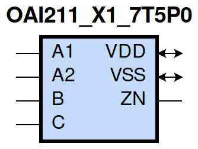
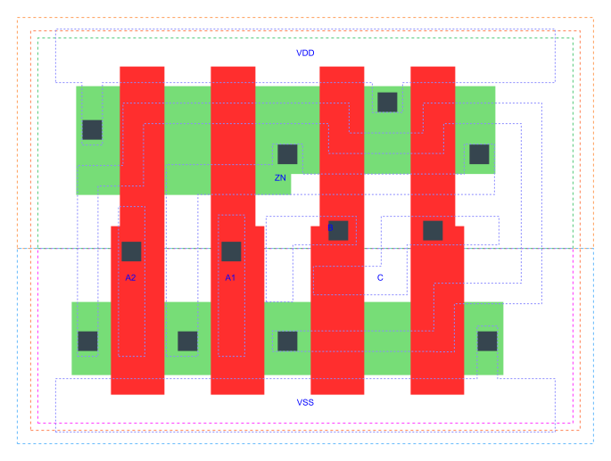

=======================================
gf180mcu_fd_sc_mcu7t5v0__oai211_x1
=======================================

**gf180mcu_fd_sc_mcu7t5v0__oai211_x1 symbol**

**gf180mcu_fd_sc_mcu7t5v0__oai211_x1 schematic**

.. image:: sc7_sch/OAI211_X1_sch.png
    :height: 300px
    :width: 500 px
    :align: center
    :alt: gf180mcu_fd_sc_mcu7t5v0__oai211_x1 schematic

**gf180mcu_fd_sc_mcu7t5v0__oai211_x1 layout**

.. include:: images.rst

OAI211_X1 is a 2-input OR into 3-input NAND, NAND[OR(A1,A2),B,C], 1X drive strength

|
| Attributes

============= ======================
**Attribute** **Value**
area          21.952000 µm\ :sup:`2`
============= ======================

|
| OUTPUT FUNCTIONS

============== =========================
**Output Pin** **Function**
ZN             (((!A1)&(!A2))|(!B)|(!C))
============== =========================

|
| TRUTH TABLE FOR ZN

====== ====== ===== ===== ======
**A1** **A2** **B** **C** **ZN**
0      0      ?     ?     1
?      ?      0     ?     1
?      ?      ?     0     1
1      ?      1     1     0
?      1      1     1     0
====== ====== ===== ===== ======

|
| FUNCTIONAL SCHEMATIC
| |image518|
| PIN CAPACITANCE (pf)

======= ======== ====================
**Pin** **Type** **Capacitance (pf)**
A2      input    0.0048
A1      input    0.0049
B       input    0.0045
C       input    0.0047
======= ======== ====================

|
| DELAY AND OUTPUT TRANSITION TIME corresponding to min slew and load

+---------------+------------+--------------------+--------------+-------------------+----------------+---------------+
| **Input Pin** | **Output** | **When Condition** | **Tin (ns)** | **Out Load (pf)** | **Delay (ns)** | **Tout (ns)** |
+---------------+------------+--------------------+--------------+-------------------+----------------+---------------+
| A2(HL)        | ZN(LH)     | !A1&B&C            | 0.0100       | 0.0010            | 0.1605         | 0.1068        |
+---------------+------------+--------------------+--------------+-------------------+----------------+---------------+
| A2(LH)        | ZN(HL)     | !A1&B&C            | 0.0100       | 0.0010            | 0.1166         | 0.0968        |
+---------------+------------+--------------------+--------------+-------------------+----------------+---------------+
| A1(HL)        | ZN(LH)     | !A2&B&C            | 0.0100       | 0.0010            | 0.1360         | 0.1067        |
+---------------+------------+--------------------+--------------+-------------------+----------------+---------------+
| A1(LH)        | ZN(HL)     | !A2&B&C            | 0.0100       | 0.0010            | 0.0877         | 0.0716        |
+---------------+------------+--------------------+--------------+-------------------+----------------+---------------+
| B(LH)         | ZN(HL)     | !A1&A2&C           | 0.0100       | 0.0010            | 0.1830         | 0.0990        |
+---------------+------------+--------------------+--------------+-------------------+----------------+---------------+
| B(LH)         | ZN(HL)     | A1&!A2&C           | 0.0100       | 0.0010            | 0.1498         | 0.0766        |
+---------------+------------+--------------------+--------------+-------------------+----------------+---------------+
| B(LH)         | ZN(HL)     | A1&A2&C            | 0.0100       | 0.0010            | 0.1310         | 0.0820        |
+---------------+------------+--------------------+--------------+-------------------+----------------+---------------+
| B(HL)         | ZN(LH)     | !A1&A2&C           | 0.0100       | 0.0010            | 0.1686         | 0.1494        |
+---------------+------------+--------------------+--------------+-------------------+----------------+---------------+
| B(HL)         | ZN(LH)     | A1&!A2&C           | 0.0100       | 0.0010            | 0.1602         | 0.1195        |
+---------------+------------+--------------------+--------------+-------------------+----------------+---------------+
| B(HL)         | ZN(LH)     | A1&A2&C            | 0.0100       | 0.0010            | 0.1793         | 0.1326        |
+---------------+------------+--------------------+--------------+-------------------+----------------+---------------+
| C(HL)         | ZN(LH)     | !A1&A2&B           | 0.0100       | 0.0010            | 0.1845         | 0.1687        |
+---------------+------------+--------------------+--------------+-------------------+----------------+---------------+
| C(HL)         | ZN(LH)     | A1&!A2&B           | 0.0100       | 0.0010            | 0.1749         | 0.1367        |
+---------------+------------+--------------------+--------------+-------------------+----------------+---------------+
| C(HL)         | ZN(LH)     | A1&A2&B            | 0.0100       | 0.0010            | 0.1975         | 0.1509        |
+---------------+------------+--------------------+--------------+-------------------+----------------+---------------+
| C(LH)         | ZN(HL)     | !A1&A2&B           | 0.0100       | 0.0010            | 0.1949         | 0.0995        |
+---------------+------------+--------------------+--------------+-------------------+----------------+---------------+
| C(LH)         | ZN(HL)     | A1&!A2&B           | 0.0100       | 0.0010            | 0.1617         | 0.0766        |
+---------------+------------+--------------------+--------------+-------------------+----------------+---------------+
| C(LH)         | ZN(HL)     | A1&A2&B            | 0.0100       | 0.0010            | 0.1430         | 0.0820        |
+---------------+------------+--------------------+--------------+-------------------+----------------+---------------+

|
| DYNAMIC ENERGY

+---------------+--------------------+--------------+------------+-------------------+---------------------+
| **Input Pin** | **When Condition** | **Tin (ns)** | **Output** | **Out Load (pf)** | **Energy (uW/MHz)** |
+---------------+--------------------+--------------+------------+-------------------+---------------------+
| C             | !A1&A2&B           | 0.0100       | ZN(LH)     | 0.0010            | 0.3249              |
+---------------+--------------------+--------------+------------+-------------------+---------------------+
| C             | A1&!A2&B           | 0.0100       | ZN(LH)     | 0.0010            | 0.2953              |
+---------------+--------------------+--------------+------------+-------------------+---------------------+
| C             | A1&A2&B            | 0.0100       | ZN(LH)     | 0.0010            | 0.3174              |
+---------------+--------------------+--------------+------------+-------------------+---------------------+
| C             | !A1&A2&B           | 0.0100       | ZN(HL)     | 0.0010            | 0.0536              |
+---------------+--------------------+--------------+------------+-------------------+---------------------+
| C             | A1&!A2&B           | 0.0100       | ZN(HL)     | 0.0010            | 0.0288              |
+---------------+--------------------+--------------+------------+-------------------+---------------------+
| C             | A1&A2&B            | 0.0100       | ZN(HL)     | 0.0010            | 0.0288              |
+---------------+--------------------+--------------+------------+-------------------+---------------------+
| A1            | !A2&B&C            | 0.0100       | ZN(LH)     | 0.0010            | 0.1432              |
+---------------+--------------------+--------------+------------+-------------------+---------------------+
| B             | !A1&A2&C           | 0.0100       | ZN(HL)     | 0.0010            | 0.0536              |
+---------------+--------------------+--------------+------------+-------------------+---------------------+
| B             | A1&!A2&C           | 0.0100       | ZN(HL)     | 0.0010            | 0.0288              |
+---------------+--------------------+--------------+------------+-------------------+---------------------+
| B             | A1&A2&C            | 0.0100       | ZN(HL)     | 0.0010            | 0.0287              |
+---------------+--------------------+--------------+------------+-------------------+---------------------+
| A2            | !A1&B&C            | 0.0100       | ZN(LH)     | 0.0010            | 0.1733              |
+---------------+--------------------+--------------+------------+-------------------+---------------------+
| A1            | !A2&B&C            | 0.0100       | ZN(HL)     | 0.0010            | 0.0269              |
+---------------+--------------------+--------------+------------+-------------------+---------------------+
| B             | !A1&A2&C           | 0.0100       | ZN(LH)     | 0.0010            | 0.2875              |
+---------------+--------------------+--------------+------------+-------------------+---------------------+
| B             | A1&!A2&C           | 0.0100       | ZN(LH)     | 0.0010            | 0.2579              |
+---------------+--------------------+--------------+------------+-------------------+---------------------+
| B             | A1&A2&C            | 0.0100       | ZN(LH)     | 0.0010            | 0.2802              |
+---------------+--------------------+--------------+------------+-------------------+---------------------+
| A2            | !A1&B&C            | 0.0100       | ZN(HL)     | 0.0010            | 0.0481              |
+---------------+--------------------+--------------+------------+-------------------+---------------------+
| B(HL)         | !A1&!A2&!C         | 0.0100       | n/a        | n/a               | 0.0464              |
+---------------+--------------------+--------------+------------+-------------------+---------------------+
| B(HL)         | !A1&!A2&C          | 0.0100       | n/a        | n/a               | 0.0392              |
+---------------+--------------------+--------------+------------+-------------------+---------------------+
| B(HL)         | !A1&A2&!C          | 0.0100       | n/a        | n/a               | 0.0324              |
+---------------+--------------------+--------------+------------+-------------------+---------------------+
| B(HL)         | A1&!A2&!C          | 0.0100       | n/a        | n/a               | 0.0326              |
+---------------+--------------------+--------------+------------+-------------------+---------------------+
| B(HL)         | A1&A2&!C           | 0.0100       | n/a        | n/a               | 0.0326              |
+---------------+--------------------+--------------+------------+-------------------+---------------------+
| A2(LH)        | !A1&!B&!C          | 0.0100       | n/a        | n/a               | 0.0498              |
+---------------+--------------------+--------------+------------+-------------------+---------------------+
| A2(LH)        | !A1&!B&C           | 0.0100       | n/a        | n/a               | 0.0499              |
+---------------+--------------------+--------------+------------+-------------------+---------------------+
| A2(LH)        | !A1&B&!C           | 0.0100       | n/a        | n/a               | 0.0932              |
+---------------+--------------------+--------------+------------+-------------------+---------------------+
| A2(LH)        | A1&!B&!C           | 0.0100       | n/a        | n/a               | -0.0426             |
+---------------+--------------------+--------------+------------+-------------------+---------------------+
| A2(LH)        | A1&!B&C            | 0.0100       | n/a        | n/a               | -0.0426             |
+---------------+--------------------+--------------+------------+-------------------+---------------------+
| A2(LH)        | A1&B&!C            | 0.0100       | n/a        | n/a               | -0.0426             |
+---------------+--------------------+--------------+------------+-------------------+---------------------+
| A2(LH)        | A1&B&C             | 0.0100       | n/a        | n/a               | -0.0329             |
+---------------+--------------------+--------------+------------+-------------------+---------------------+
| A1(LH)        | !A2&!B&!C          | 0.0100       | n/a        | n/a               | 0.0493              |
+---------------+--------------------+--------------+------------+-------------------+---------------------+
| A1(LH)        | !A2&!B&C           | 0.0100       | n/a        | n/a               | 0.0494              |
+---------------+--------------------+--------------+------------+-------------------+---------------------+
| A1(LH)        | !A2&B&!C           | 0.0100       | n/a        | n/a               | 0.0928              |
+---------------+--------------------+--------------+------------+-------------------+---------------------+
| A1(LH)        | A2&!B&!C           | 0.0100       | n/a        | n/a               | -0.0431             |
+---------------+--------------------+--------------+------------+-------------------+---------------------+
| A1(LH)        | A2&!B&C            | 0.0100       | n/a        | n/a               | -0.0430             |
+---------------+--------------------+--------------+------------+-------------------+---------------------+
| A1(LH)        | A2&B&!C            | 0.0100       | n/a        | n/a               | -0.0430             |
+---------------+--------------------+--------------+------------+-------------------+---------------------+
| A1(LH)        | A2&B&C             | 0.0100       | n/a        | n/a               | -0.0111             |
+---------------+--------------------+--------------+------------+-------------------+---------------------+
| C(HL)         | !A1&!A2&!B         | 0.0100       | n/a        | n/a               | 0.0318              |
+---------------+--------------------+--------------+------------+-------------------+---------------------+
| C(HL)         | !A1&!A2&B          | 0.0100       | n/a        | n/a               | 0.0322              |
+---------------+--------------------+--------------+------------+-------------------+---------------------+
| C(HL)         | !A1&A2&!B          | 0.0100       | n/a        | n/a               | 0.0320              |
+---------------+--------------------+--------------+------------+-------------------+---------------------+
| C(HL)         | A1&!A2&!B          | 0.0100       | n/a        | n/a               | 0.0320              |
+---------------+--------------------+--------------+------------+-------------------+---------------------+
| C(HL)         | A1&A2&!B           | 0.0100       | n/a        | n/a               | 0.0320              |
+---------------+--------------------+--------------+------------+-------------------+---------------------+
| A2(HL)        | !A1&!B&!C          | 0.0100       | n/a        | n/a               | 0.0441              |
+---------------+--------------------+--------------+------------+-------------------+---------------------+
| A2(HL)        | !A1&!B&C           | 0.0100       | n/a        | n/a               | 0.0441              |
+---------------+--------------------+--------------+------------+-------------------+---------------------+
| A2(HL)        | !A1&B&!C           | 0.0100       | n/a        | n/a               | 0.0441              |
+---------------+--------------------+--------------+------------+-------------------+---------------------+
| A2(HL)        | A1&!B&!C           | 0.0100       | n/a        | n/a               | 0.0441              |
+---------------+--------------------+--------------+------------+-------------------+---------------------+
| A2(HL)        | A1&!B&C            | 0.0100       | n/a        | n/a               | 0.0441              |
+---------------+--------------------+--------------+------------+-------------------+---------------------+
| A2(HL)        | A1&B&!C            | 0.0100       | n/a        | n/a               | 0.0442              |
+---------------+--------------------+--------------+------------+-------------------+---------------------+
| A2(HL)        | A1&B&C             | 0.0100       | n/a        | n/a               | 0.0393              |
+---------------+--------------------+--------------+------------+-------------------+---------------------+
| B(LH)         | !A1&!A2&!C         | 0.0100       | n/a        | n/a               | -0.0319             |
+---------------+--------------------+--------------+------------+-------------------+---------------------+
| B(LH)         | !A1&!A2&C          | 0.0100       | n/a        | n/a               | -0.0318             |
+---------------+--------------------+--------------+------------+-------------------+---------------------+
| B(LH)         | !A1&A2&!C          | 0.0100       | n/a        | n/a               | -0.0249             |
+---------------+--------------------+--------------+------------+-------------------+---------------------+
| B(LH)         | A1&!A2&!C          | 0.0100       | n/a        | n/a               | -0.0249             |
+---------------+--------------------+--------------+------------+-------------------+---------------------+
| B(LH)         | A1&A2&!C           | 0.0100       | n/a        | n/a               | -0.0249             |
+---------------+--------------------+--------------+------------+-------------------+---------------------+
| A1(HL)        | !A2&!B&!C          | 0.0100       | n/a        | n/a               | 0.0443              |
+---------------+--------------------+--------------+------------+-------------------+---------------------+
| A1(HL)        | !A2&!B&C           | 0.0100       | n/a        | n/a               | 0.0443              |
+---------------+--------------------+--------------+------------+-------------------+---------------------+
| A1(HL)        | !A2&B&!C           | 0.0100       | n/a        | n/a               | 0.0443              |
+---------------+--------------------+--------------+------------+-------------------+---------------------+
| A1(HL)        | A2&!B&!C           | 0.0100       | n/a        | n/a               | 0.0442              |
+---------------+--------------------+--------------+------------+-------------------+---------------------+
| A1(HL)        | A2&!B&C            | 0.0100       | n/a        | n/a               | 0.0442              |
+---------------+--------------------+--------------+------------+-------------------+---------------------+
| A1(HL)        | A2&B&!C            | 0.0100       | n/a        | n/a               | 0.0443              |
+---------------+--------------------+--------------+------------+-------------------+---------------------+
| A1(HL)        | A2&B&C             | 0.0100       | n/a        | n/a               | 0.0264              |
+---------------+--------------------+--------------+------------+-------------------+---------------------+
| C(LH)         | !A1&!A2&!B         | 0.0100       | n/a        | n/a               | -0.0320             |
+---------------+--------------------+--------------+------------+-------------------+---------------------+
| C(LH)         | !A1&!A2&B          | 0.0100       | n/a        | n/a               | -0.0318             |
+---------------+--------------------+--------------+------------+-------------------+---------------------+
| C(LH)         | !A1&A2&!B          | 0.0100       | n/a        | n/a               | -0.0319             |
+---------------+--------------------+--------------+------------+-------------------+---------------------+
| C(LH)         | A1&!A2&!B          | 0.0100       | n/a        | n/a               | -0.0320             |
+---------------+--------------------+--------------+------------+-------------------+---------------------+
| C(LH)         | A1&A2&!B           | 0.0100       | n/a        | n/a               | -0.0320             |
+---------------+--------------------+--------------+------------+-------------------+---------------------+

|
| LEAKAGE POWER

================== ==============
**When Condition** **Power (nW)**
!A1&!A2&!B&!C      0.1004
!A1&!A2&!B&C       0.1004
!A1&!A2&B&!C       0.1005
!A1&!A2&B&C        0.1009
!A1&A2&!B&!C       0.1618
!A1&A2&!B&C        0.1620
!A1&A2&B&!C        0.2010
A1&!A2&!B&!C       0.1618
A1&!A2&!B&C        0.1620
A1&!A2&B&!C        0.2010
A1&A2&!B&!C        0.1622
A1&A2&!B&C         0.1629
A1&A2&B&!C         0.2014
!A1&A2&B&C         0.1648
A1&!A2&B&C         0.1292
A1&A2&B&C          0.1292
================== ==============

