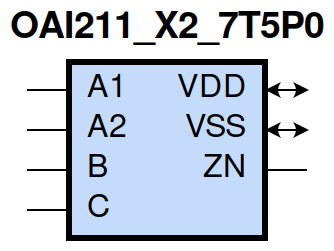
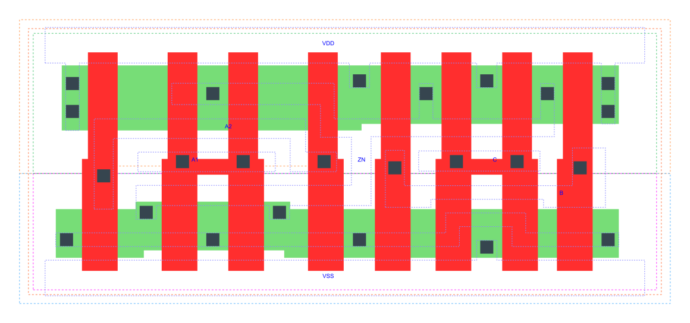

=======================================
gf180mcu_fd_sc_mcu7t5v0__oai211_x2
=======================================

**gf180mcu_fd_sc_mcu7t5v0__oai211_x2 symbol**

**gf180mcu_fd_sc_mcu7t5v0__oai211_x2 schematic**

**gf180mcu_fd_sc_mcu7t5v0__oai211_x2 layout**

.. include:: images.rst

OAI211_X2 is a 2-input OR into 3-input NAND, NAND[OR(A1,A2),B,C], 2X drive strength

|
| Attributes

============= ======================
**Attribute** **Value**
area          39.513600 µm\ :sup:`2`
============= ======================

|
| OUTPUT FUNCTIONS

============== =========================
**Output Pin** **Function**
ZN             (((!A1)&(!A2))|(!B)|(!C))
============== =========================

|
| TRUTH TABLE FOR ZN

====== ====== ===== ===== ======
**A1** **A2** **B** **C** **ZN**
0      0      ?     ?     1
?      ?      0     ?     1
?      ?      ?     0     1
1      ?      1     1     0
?      1      1     1     0
====== ====== ===== ===== ======

|
| FUNCTIONAL SCHEMATIC
| |image521|
| PIN CAPACITANCE (pf)

======= ======== ====================
**Pin** **Type** **Capacitance (pf)**
A2      input    0.0095
A1      input    0.0091
B       input    0.0091
C       input    0.0086
======= ======== ====================

|
| DELAY AND OUTPUT TRANSITION TIME corresponding to min slew and load

+---------------+------------+--------------------+--------------+-------------------+----------------+---------------+
| **Input Pin** | **Output** | **When Condition** | **Tin (ns)** | **Out Load (pf)** | **Delay (ns)** | **Tout (ns)** |
+---------------+------------+--------------------+--------------+-------------------+----------------+---------------+
| A2(HL)        | ZN(LH)     | !A1&B&C            | 0.0100       | 0.0010            | 0.1608         | 0.1014        |
+---------------+------------+--------------------+--------------+-------------------+----------------+---------------+
| A2(LH)        | ZN(HL)     | !A1&B&C            | 0.0100       | 0.0010            | 0.1071         | 0.0859        |
+---------------+------------+--------------------+--------------+-------------------+----------------+---------------+
| A1(HL)        | ZN(LH)     | !A2&B&C            | 0.0100       | 0.0010            | 0.1317         | 0.1012        |
+---------------+------------+--------------------+--------------+-------------------+----------------+---------------+
| A1(LH)        | ZN(HL)     | !A2&B&C            | 0.0100       | 0.0010            | 0.0789         | 0.0613        |
+---------------+------------+--------------------+--------------+-------------------+----------------+---------------+
| B(LH)         | ZN(HL)     | !A1&A2&C           | 0.0100       | 0.0010            | 0.1538         | 0.0864        |
+---------------+------------+--------------------+--------------+-------------------+----------------+---------------+
| B(LH)         | ZN(HL)     | A1&!A2&C           | 0.0100       | 0.0010            | 0.1223         | 0.0640        |
+---------------+------------+--------------------+--------------+-------------------+----------------+---------------+
| B(LH)         | ZN(HL)     | A1&A2&C            | 0.0100       | 0.0010            | 0.1081         | 0.0678        |
+---------------+------------+--------------------+--------------+-------------------+----------------+---------------+
| B(HL)         | ZN(LH)     | !A1&A2&C           | 0.0100       | 0.0010            | 0.1388         | 0.1222        |
+---------------+------------+--------------------+--------------+-------------------+----------------+---------------+
| B(HL)         | ZN(LH)     | A1&!A2&C           | 0.0100       | 0.0010            | 0.1323         | 0.0950        |
+---------------+------------+--------------------+--------------+-------------------+----------------+---------------+
| B(HL)         | ZN(LH)     | A1&A2&C            | 0.0100       | 0.0010            | 0.1491         | 0.1070        |
+---------------+------------+--------------------+--------------+-------------------+----------------+---------------+
| C(HL)         | ZN(LH)     | !A1&A2&B           | 0.0100       | 0.0010            | 0.1544         | 0.1414        |
+---------------+------------+--------------------+--------------+-------------------+----------------+---------------+
| C(HL)         | ZN(LH)     | A1&!A2&B           | 0.0100       | 0.0010            | 0.1467         | 0.1114        |
+---------------+------------+--------------------+--------------+-------------------+----------------+---------------+
| C(HL)         | ZN(LH)     | A1&A2&B            | 0.0100       | 0.0010            | 0.1666         | 0.1246        |
+---------------+------------+--------------------+--------------+-------------------+----------------+---------------+
| C(LH)         | ZN(HL)     | !A1&A2&B           | 0.0100       | 0.0010            | 0.1649         | 0.0862        |
+---------------+------------+--------------------+--------------+-------------------+----------------+---------------+
| C(LH)         | ZN(HL)     | A1&!A2&B           | 0.0100       | 0.0010            | 0.1334         | 0.0637        |
+---------------+------------+--------------------+--------------+-------------------+----------------+---------------+
| C(LH)         | ZN(HL)     | A1&A2&B            | 0.0100       | 0.0010            | 0.1192         | 0.0677        |
+---------------+------------+--------------------+--------------+-------------------+----------------+---------------+

|
| DYNAMIC ENERGY

+---------------+--------------------+--------------+------------+-------------------+---------------------+
| **Input Pin** | **When Condition** | **Tin (ns)** | **Output** | **Out Load (pf)** | **Energy (uW/MHz)** |
+---------------+--------------------+--------------+------------+-------------------+---------------------+
| C             | !A1&A2&B           | 0.0100       | ZN(LH)     | 0.0010            | 0.5726              |
+---------------+--------------------+--------------+------------+-------------------+---------------------+
| C             | A1&!A2&B           | 0.0100       | ZN(LH)     | 0.0010            | 0.5180              |
+---------------+--------------------+--------------+------------+-------------------+---------------------+
| C             | A1&A2&B            | 0.0100       | ZN(LH)     | 0.0010            | 0.5622              |
+---------------+--------------------+--------------+------------+-------------------+---------------------+
| C             | !A1&A2&B           | 0.0100       | ZN(HL)     | 0.0010            | 0.0848              |
+---------------+--------------------+--------------+------------+-------------------+---------------------+
| C             | A1&!A2&B           | 0.0100       | ZN(HL)     | 0.0010            | 0.0289              |
+---------------+--------------------+--------------+------------+-------------------+---------------------+
| C             | A1&A2&B            | 0.0100       | ZN(HL)     | 0.0010            | 0.0289              |
+---------------+--------------------+--------------+------------+-------------------+---------------------+
| A1            | !A2&B&C            | 0.0100       | ZN(LH)     | 0.0010            | 0.2805              |
+---------------+--------------------+--------------+------------+-------------------+---------------------+
| B             | !A1&A2&C           | 0.0100       | ZN(HL)     | 0.0010            | 0.0848              |
+---------------+--------------------+--------------+------------+-------------------+---------------------+
| B             | A1&!A2&C           | 0.0100       | ZN(HL)     | 0.0010            | 0.0290              |
+---------------+--------------------+--------------+------------+-------------------+---------------------+
| B             | A1&A2&C            | 0.0100       | ZN(HL)     | 0.0010            | 0.0289              |
+---------------+--------------------+--------------+------------+-------------------+---------------------+
| A2            | !A1&B&C            | 0.0100       | ZN(LH)     | 0.0010            | 0.3349              |
+---------------+--------------------+--------------+------------+-------------------+---------------------+
| A1            | !A2&B&C            | 0.0100       | ZN(HL)     | 0.0010            | 0.0289              |
+---------------+--------------------+--------------+------------+-------------------+---------------------+
| B             | !A1&A2&C           | 0.0100       | ZN(LH)     | 0.0010            | 0.5019              |
+---------------+--------------------+--------------+------------+-------------------+---------------------+
| B             | A1&!A2&C           | 0.0100       | ZN(LH)     | 0.0010            | 0.4476              |
+---------------+--------------------+--------------+------------+-------------------+---------------------+
| B             | A1&A2&C            | 0.0100       | ZN(LH)     | 0.0010            | 0.4932              |
+---------------+--------------------+--------------+------------+-------------------+---------------------+
| A2            | !A1&B&C            | 0.0100       | ZN(HL)     | 0.0010            | 0.0794              |
+---------------+--------------------+--------------+------------+-------------------+---------------------+
| B(HL)         | !A1&!A2&!C         | 0.0100       | n/a        | n/a               | 0.0980              |
+---------------+--------------------+--------------+------------+-------------------+---------------------+
| B(HL)         | !A1&!A2&C          | 0.0100       | n/a        | n/a               | 0.0808              |
+---------------+--------------------+--------------+------------+-------------------+---------------------+
| B(HL)         | !A1&A2&!C          | 0.0100       | n/a        | n/a               | 0.0677              |
+---------------+--------------------+--------------+------------+-------------------+---------------------+
| B(HL)         | A1&!A2&!C          | 0.0100       | n/a        | n/a               | 0.0681              |
+---------------+--------------------+--------------+------------+-------------------+---------------------+
| B(HL)         | A1&A2&!C           | 0.0100       | n/a        | n/a               | 0.0679              |
+---------------+--------------------+--------------+------------+-------------------+---------------------+
| A2(LH)        | !A1&!B&!C          | 0.0100       | n/a        | n/a               | 0.0391              |
+---------------+--------------------+--------------+------------+-------------------+---------------------+
| A2(LH)        | !A1&!B&C           | 0.0100       | n/a        | n/a               | 0.0392              |
+---------------+--------------------+--------------+------------+-------------------+---------------------+
| A2(LH)        | !A1&B&!C           | 0.0100       | n/a        | n/a               | 0.1209              |
+---------------+--------------------+--------------+------------+-------------------+---------------------+
| A2(LH)        | A1&!B&!C           | 0.0100       | n/a        | n/a               | -0.0771             |
+---------------+--------------------+--------------+------------+-------------------+---------------------+
| A2(LH)        | A1&!B&C            | 0.0100       | n/a        | n/a               | -0.0770             |
+---------------+--------------------+--------------+------------+-------------------+---------------------+
| A2(LH)        | A1&B&!C            | 0.0100       | n/a        | n/a               | -0.0770             |
+---------------+--------------------+--------------+------------+-------------------+---------------------+
| A2(LH)        | A1&B&C             | 0.0100       | n/a        | n/a               | -0.0584             |
+---------------+--------------------+--------------+------------+-------------------+---------------------+
| A1(LH)        | !A2&!B&!C          | 0.0100       | n/a        | n/a               | 0.0385              |
+---------------+--------------------+--------------+------------+-------------------+---------------------+
| A1(LH)        | !A2&!B&C           | 0.0100       | n/a        | n/a               | 0.0386              |
+---------------+--------------------+--------------+------------+-------------------+---------------------+
| A1(LH)        | !A2&B&!C           | 0.0100       | n/a        | n/a               | 0.1203              |
+---------------+--------------------+--------------+------------+-------------------+---------------------+
| A1(LH)        | A2&!B&!C           | 0.0100       | n/a        | n/a               | -0.0780             |
+---------------+--------------------+--------------+------------+-------------------+---------------------+
| A1(LH)        | A2&!B&C            | 0.0100       | n/a        | n/a               | -0.0778             |
+---------------+--------------------+--------------+------------+-------------------+---------------------+
| A1(LH)        | A2&B&!C            | 0.0100       | n/a        | n/a               | -0.0778             |
+---------------+--------------------+--------------+------------+-------------------+---------------------+
| A1(LH)        | A2&B&C             | 0.0100       | n/a        | n/a               | -0.0203             |
+---------------+--------------------+--------------+------------+-------------------+---------------------+
| C(HL)         | !A1&!A2&!B         | 0.0100       | n/a        | n/a               | 0.0636              |
+---------------+--------------------+--------------+------------+-------------------+---------------------+
| C(HL)         | !A1&!A2&B          | 0.0100       | n/a        | n/a               | 0.0659              |
+---------------+--------------------+--------------+------------+-------------------+---------------------+
| C(HL)         | !A1&A2&!B          | 0.0100       | n/a        | n/a               | 0.0654              |
+---------------+--------------------+--------------+------------+-------------------+---------------------+
| C(HL)         | A1&!A2&!B          | 0.0100       | n/a        | n/a               | 0.0654              |
+---------------+--------------------+--------------+------------+-------------------+---------------------+
| C(HL)         | A1&A2&!B           | 0.0100       | n/a        | n/a               | 0.0653              |
+---------------+--------------------+--------------+------------+-------------------+---------------------+
| A2(HL)        | !A1&!B&!C          | 0.0100       | n/a        | n/a               | 0.0796              |
+---------------+--------------------+--------------+------------+-------------------+---------------------+
| A2(HL)        | !A1&!B&C           | 0.0100       | n/a        | n/a               | 0.0797              |
+---------------+--------------------+--------------+------------+-------------------+---------------------+
| A2(HL)        | !A1&B&!C           | 0.0100       | n/a        | n/a               | 0.0797              |
+---------------+--------------------+--------------+------------+-------------------+---------------------+
| A2(HL)        | A1&!B&!C           | 0.0100       | n/a        | n/a               | 0.0824              |
+---------------+--------------------+--------------+------------+-------------------+---------------------+
| A2(HL)        | A1&!B&C            | 0.0100       | n/a        | n/a               | 0.0824              |
+---------------+--------------------+--------------+------------+-------------------+---------------------+
| A2(HL)        | A1&B&!C            | 0.0100       | n/a        | n/a               | 0.0824              |
+---------------+--------------------+--------------+------------+-------------------+---------------------+
| A2(HL)        | A1&B&C             | 0.0100       | n/a        | n/a               | 0.0703              |
+---------------+--------------------+--------------+------------+-------------------+---------------------+
| B(LH)         | !A1&!A2&!C         | 0.0100       | n/a        | n/a               | -0.0637             |
+---------------+--------------------+--------------+------------+-------------------+---------------------+
| B(LH)         | !A1&!A2&C          | 0.0100       | n/a        | n/a               | -0.0635             |
+---------------+--------------------+--------------+------------+-------------------+---------------------+
| B(LH)         | !A1&A2&!C          | 0.0100       | n/a        | n/a               | -0.0503             |
+---------------+--------------------+--------------+------------+-------------------+---------------------+
| B(LH)         | A1&!A2&!C          | 0.0100       | n/a        | n/a               | -0.0503             |
+---------------+--------------------+--------------+------------+-------------------+---------------------+
| B(LH)         | A1&A2&!C           | 0.0100       | n/a        | n/a               | -0.0503             |
+---------------+--------------------+--------------+------------+-------------------+---------------------+
| A1(HL)        | !A2&!B&!C          | 0.0100       | n/a        | n/a               | 0.0799              |
+---------------+--------------------+--------------+------------+-------------------+---------------------+
| A1(HL)        | !A2&!B&C           | 0.0100       | n/a        | n/a               | 0.0799              |
+---------------+--------------------+--------------+------------+-------------------+---------------------+
| A1(HL)        | !A2&B&!C           | 0.0100       | n/a        | n/a               | 0.0799              |
+---------------+--------------------+--------------+------------+-------------------+---------------------+
| A1(HL)        | A2&!B&!C           | 0.0100       | n/a        | n/a               | 0.0824              |
+---------------+--------------------+--------------+------------+-------------------+---------------------+
| A1(HL)        | A2&!B&C            | 0.0100       | n/a        | n/a               | 0.0824              |
+---------------+--------------------+--------------+------------+-------------------+---------------------+
| A1(HL)        | A2&B&!C            | 0.0100       | n/a        | n/a               | 0.0823              |
+---------------+--------------------+--------------+------------+-------------------+---------------------+
| A1(HL)        | A2&B&C             | 0.0100       | n/a        | n/a               | 0.0586              |
+---------------+--------------------+--------------+------------+-------------------+---------------------+
| C(LH)         | !A1&!A2&!B         | 0.0100       | n/a        | n/a               | -0.0637             |
+---------------+--------------------+--------------+------------+-------------------+---------------------+
| C(LH)         | !A1&!A2&B          | 0.0100       | n/a        | n/a               | -0.0634             |
+---------------+--------------------+--------------+------------+-------------------+---------------------+
| C(LH)         | !A1&A2&!B          | 0.0100       | n/a        | n/a               | -0.0635             |
+---------------+--------------------+--------------+------------+-------------------+---------------------+
| C(LH)         | A1&!A2&!B          | 0.0100       | n/a        | n/a               | -0.0637             |
+---------------+--------------------+--------------+------------+-------------------+---------------------+
| C(LH)         | A1&A2&!B           | 0.0100       | n/a        | n/a               | -0.0637             |
+---------------+--------------------+--------------+------------+-------------------+---------------------+

|
| LEAKAGE POWER

================== ==============
**When Condition** **Power (nW)**
!A1&!A2&!B&!C      0.1508
!A1&!A2&!B&C       0.1508
!A1&!A2&B&!C       0.1509
!A1&!A2&B&C        0.1518
!A1&A2&!B&!C       0.2717
!A1&A2&!B&C        0.2720
!A1&A2&B&!C        0.3501
A1&!A2&!B&!C       0.2717
A1&!A2&!B&C        0.2721
A1&!A2&B&!C        0.3501
A1&A2&!B&!C        0.2723
A1&A2&!B&C         0.2727
A1&A2&B&!C         0.3508
!A1&A2&B&C         0.2796
A1&!A2&B&C         0.2082
A1&A2&B&C          0.2082
================== ==============

