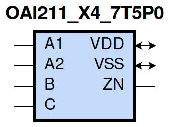
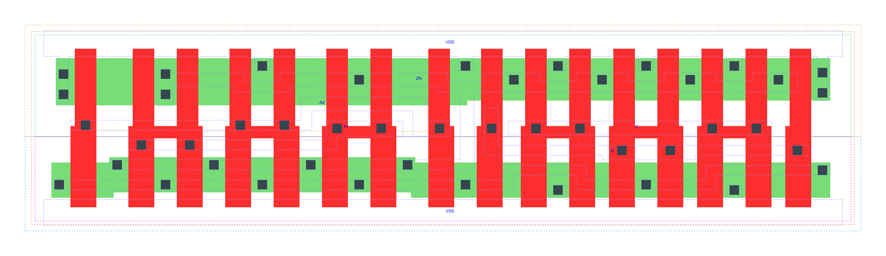

=======================================
gf180mcu_fd_sc_mcu7t5v0__oai211_x4
=======================================

**gf180mcu_fd_sc_mcu7t5v0__oai211_x4 symbol**

**gf180mcu_fd_sc_mcu7t5v0__oai211_x4 schematic**

.. image:: sc7_sch/OAI211_X4_sch.png
    :height: 300px
    :width: 500 px
    :align: center
    :alt: gf180mcu_fd_sc_mcu7t5v0__oai211_x4 schematic

**gf180mcu_fd_sc_mcu7t5v0__oai211_x4 layout**

.. include:: images.rst

OAI211_X4 is a 2-input OR into 3-input NAND, NAND[OR(A1,A2),B,C], 4X drive strength

|
| Attributes

============= ======================
**Attribute** **Value**
area          72.441600 µm\ :sup:`2`
============= ======================

|
| OUTPUT FUNCTIONS

============== =========================
**Output Pin** **Function**
ZN             (((!A1)&(!A2))|(!B)|(!C))
============== =========================

|
| TRUTH TABLE FOR ZN

====== ====== ===== ===== ======
**A1** **A2** **B** **C** **ZN**
0      0      ?     ?     1
?      ?      0     ?     1
?      ?      ?     0     1
1      ?      1     1     0
?      1      1     1     0
====== ====== ===== ===== ======

|
| FUNCTIONAL SCHEMATIC
| |image524|
| PIN CAPACITANCE (pf)

======= ======== ====================
**Pin** **Type** **Capacitance (pf)**
A2      input    0.0186
A1      input    0.0185
B       input    0.0181
C       input    0.0172
======= ======== ====================

|
| DELAY AND OUTPUT TRANSITION TIME corresponding to min slew and load

+---------------+------------+--------------------+--------------+-------------------+----------------+---------------+
| **Input Pin** | **Output** | **When Condition** | **Tin (ns)** | **Out Load (pf)** | **Delay (ns)** | **Tout (ns)** |
+---------------+------------+--------------------+--------------+-------------------+----------------+---------------+
| A2(HL)        | ZN(LH)     | !A1&B&C            | 0.0100       | 0.0010            | 0.1530         | 0.0953        |
+---------------+------------+--------------------+--------------+-------------------+----------------+---------------+
| A2(LH)        | ZN(HL)     | !A1&B&C            | 0.0100       | 0.0010            | 0.1028         | 0.0816        |
+---------------+------------+--------------------+--------------+-------------------+----------------+---------------+
| A1(HL)        | ZN(LH)     | !A2&B&C            | 0.0100       | 0.0010            | 0.1246         | 0.0951        |
+---------------+------------+--------------------+--------------+-------------------+----------------+---------------+
| A1(LH)        | ZN(HL)     | !A2&B&C            | 0.0100       | 0.0010            | 0.0752         | 0.0575        |
+---------------+------------+--------------------+--------------+-------------------+----------------+---------------+
| B(LH)         | ZN(HL)     | !A1&A2&C           | 0.0100       | 0.0010            | 0.1483         | 0.0823        |
+---------------+------------+--------------------+--------------+-------------------+----------------+---------------+
| B(LH)         | ZN(HL)     | A1&!A2&C           | 0.0100       | 0.0010            | 0.1173         | 0.0600        |
+---------------+------------+--------------------+--------------+-------------------+----------------+---------------+
| B(LH)         | ZN(HL)     | A1&A2&C            | 0.0100       | 0.0010            | 0.1040         | 0.0644        |
+---------------+------------+--------------------+--------------+-------------------+----------------+---------------+
| B(HL)         | ZN(LH)     | !A1&A2&C           | 0.0100       | 0.0010            | 0.1331         | 0.1171        |
+---------------+------------+--------------------+--------------+-------------------+----------------+---------------+
| B(HL)         | ZN(LH)     | A1&!A2&C           | 0.0100       | 0.0010            | 0.1265         | 0.0904        |
+---------------+------------+--------------------+--------------+-------------------+----------------+---------------+
| B(HL)         | ZN(LH)     | A1&A2&C            | 0.0100       | 0.0010            | 0.1435         | 0.1025        |
+---------------+------------+--------------------+--------------+-------------------+----------------+---------------+
| C(HL)         | ZN(LH)     | !A1&A2&B           | 0.0100       | 0.0010            | 0.1487         | 0.1362        |
+---------------+------------+--------------------+--------------+-------------------+----------------+---------------+
| C(HL)         | ZN(LH)     | A1&!A2&B           | 0.0100       | 0.0010            | 0.1407         | 0.1065        |
+---------------+------------+--------------------+--------------+-------------------+----------------+---------------+
| C(HL)         | ZN(LH)     | A1&A2&B            | 0.0100       | 0.0010            | 0.1607         | 0.1198        |
+---------------+------------+--------------------+--------------+-------------------+----------------+---------------+
| C(LH)         | ZN(HL)     | !A1&A2&B           | 0.0100       | 0.0010            | 0.1592         | 0.0822        |
+---------------+------------+--------------------+--------------+-------------------+----------------+---------------+
| C(LH)         | ZN(HL)     | A1&!A2&B           | 0.0100       | 0.0010            | 0.1283         | 0.0600        |
+---------------+------------+--------------------+--------------+-------------------+----------------+---------------+
| C(LH)         | ZN(HL)     | A1&A2&B            | 0.0100       | 0.0010            | 0.1149         | 0.0645        |
+---------------+------------+--------------------+--------------+-------------------+----------------+---------------+

|
| DYNAMIC ENERGY

+---------------+--------------------+--------------+------------+-------------------+---------------------+
| **Input Pin** | **When Condition** | **Tin (ns)** | **Output** | **Out Load (pf)** | **Energy (uW/MHz)** |
+---------------+--------------------+--------------+------------+-------------------+---------------------+
| C             | !A1&A2&B           | 0.0100       | ZN(LH)     | 0.0010            | 1.1239              |
+---------------+--------------------+--------------+------------+-------------------+---------------------+
| C             | A1&!A2&B           | 0.0100       | ZN(LH)     | 0.0010            | 1.0149              |
+---------------+--------------------+--------------+------------+-------------------+---------------------+
| C             | A1&A2&B            | 0.0100       | ZN(LH)     | 0.0010            | 1.1039              |
+---------------+--------------------+--------------+------------+-------------------+---------------------+
| C             | !A1&A2&B           | 0.0100       | ZN(HL)     | 0.0010            | 0.1655              |
+---------------+--------------------+--------------+------------+-------------------+---------------------+
| C             | A1&!A2&B           | 0.0100       | ZN(HL)     | 0.0010            | 0.0575              |
+---------------+--------------------+--------------+------------+-------------------+---------------------+
| C             | A1&A2&B            | 0.0100       | ZN(HL)     | 0.0010            | 0.0578              |
+---------------+--------------------+--------------+------------+-------------------+---------------------+
| A1            | !A2&B&C            | 0.0100       | ZN(LH)     | 0.0010            | 0.5484              |
+---------------+--------------------+--------------+------------+-------------------+---------------------+
| B             | !A1&A2&C           | 0.0100       | ZN(HL)     | 0.0010            | 0.1653              |
+---------------+--------------------+--------------+------------+-------------------+---------------------+
| B             | A1&!A2&C           | 0.0100       | ZN(HL)     | 0.0010            | 0.0575              |
+---------------+--------------------+--------------+------------+-------------------+---------------------+
| B             | A1&A2&C            | 0.0100       | ZN(HL)     | 0.0010            | 0.0574              |
+---------------+--------------------+--------------+------------+-------------------+---------------------+
| A2            | !A1&B&C            | 0.0100       | ZN(LH)     | 0.0010            | 0.6572              |
+---------------+--------------------+--------------+------------+-------------------+---------------------+
| A1            | !A2&B&C            | 0.0100       | ZN(HL)     | 0.0010            | 0.0576              |
+---------------+--------------------+--------------+------------+-------------------+---------------------+
| B             | !A1&A2&C           | 0.0100       | ZN(LH)     | 0.0010            | 0.9836              |
+---------------+--------------------+--------------+------------+-------------------+---------------------+
| B             | A1&!A2&C           | 0.0100       | ZN(LH)     | 0.0010            | 0.8750              |
+---------------+--------------------+--------------+------------+-------------------+---------------------+
| B             | A1&A2&C            | 0.0100       | ZN(LH)     | 0.0010            | 0.9662              |
+---------------+--------------------+--------------+------------+-------------------+---------------------+
| A2            | !A1&B&C            | 0.0100       | ZN(HL)     | 0.0010            | 0.1543              |
+---------------+--------------------+--------------+------------+-------------------+---------------------+
| B(HL)         | !A1&!A2&!C         | 0.0100       | n/a        | n/a               | 0.1963              |
+---------------+--------------------+--------------+------------+-------------------+---------------------+
| B(HL)         | !A1&!A2&C          | 0.0100       | n/a        | n/a               | 0.1615              |
+---------------+--------------------+--------------+------------+-------------------+---------------------+
| B(HL)         | !A1&A2&!C          | 0.0100       | n/a        | n/a               | 0.1357              |
+---------------+--------------------+--------------+------------+-------------------+---------------------+
| B(HL)         | A1&!A2&!C          | 0.0100       | n/a        | n/a               | 0.1364              |
+---------------+--------------------+--------------+------------+-------------------+---------------------+
| B(HL)         | A1&A2&!C           | 0.0100       | n/a        | n/a               | 0.1360              |
+---------------+--------------------+--------------+------------+-------------------+---------------------+
| A2(LH)        | !A1&!B&!C          | 0.0100       | n/a        | n/a               | 0.0700              |
+---------------+--------------------+--------------+------------+-------------------+---------------------+
| A2(LH)        | !A1&!B&C           | 0.0100       | n/a        | n/a               | 0.0702              |
+---------------+--------------------+--------------+------------+-------------------+---------------------+
| A2(LH)        | !A1&B&!C           | 0.0100       | n/a        | n/a               | 0.2323              |
+---------------+--------------------+--------------+------------+-------------------+---------------------+
| A2(LH)        | A1&!B&!C           | 0.0100       | n/a        | n/a               | -0.1542             |
+---------------+--------------------+--------------+------------+-------------------+---------------------+
| A2(LH)        | A1&!B&C            | 0.0100       | n/a        | n/a               | -0.1540             |
+---------------+--------------------+--------------+------------+-------------------+---------------------+
| A2(LH)        | A1&B&!C            | 0.0100       | n/a        | n/a               | -0.1540             |
+---------------+--------------------+--------------+------------+-------------------+---------------------+
| A2(LH)        | A1&B&C             | 0.0100       | n/a        | n/a               | -0.1170             |
+---------------+--------------------+--------------+------------+-------------------+---------------------+
| A1(LH)        | !A2&!B&!C          | 0.0100       | n/a        | n/a               | 0.0689              |
+---------------+--------------------+--------------+------------+-------------------+---------------------+
| A1(LH)        | !A2&!B&C           | 0.0100       | n/a        | n/a               | 0.0690              |
+---------------+--------------------+--------------+------------+-------------------+---------------------+
| A1(LH)        | !A2&B&!C           | 0.0100       | n/a        | n/a               | 0.2310              |
+---------------+--------------------+--------------+------------+-------------------+---------------------+
| A1(LH)        | A2&!B&!C           | 0.0100       | n/a        | n/a               | -0.1560             |
+---------------+--------------------+--------------+------------+-------------------+---------------------+
| A1(LH)        | A2&!B&C            | 0.0100       | n/a        | n/a               | -0.1556             |
+---------------+--------------------+--------------+------------+-------------------+---------------------+
| A1(LH)        | A2&B&!C            | 0.0100       | n/a        | n/a               | -0.1556             |
+---------------+--------------------+--------------+------------+-------------------+---------------------+
| A1(LH)        | A2&B&C             | 0.0100       | n/a        | n/a               | -0.0404             |
+---------------+--------------------+--------------+------------+-------------------+---------------------+
| C(HL)         | !A1&!A2&!B         | 0.0100       | n/a        | n/a               | 0.1271              |
+---------------+--------------------+--------------+------------+-------------------+---------------------+
| C(HL)         | !A1&!A2&B          | 0.0100       | n/a        | n/a               | 0.1321              |
+---------------+--------------------+--------------+------------+-------------------+---------------------+
| C(HL)         | !A1&A2&!B          | 0.0100       | n/a        | n/a               | 0.1311              |
+---------------+--------------------+--------------+------------+-------------------+---------------------+
| C(HL)         | A1&!A2&!B          | 0.0100       | n/a        | n/a               | 0.1311              |
+---------------+--------------------+--------------+------------+-------------------+---------------------+
| C(HL)         | A1&A2&!B           | 0.0100       | n/a        | n/a               | 0.1309              |
+---------------+--------------------+--------------+------------+-------------------+---------------------+
| A2(HL)        | !A1&!B&!C          | 0.0100       | n/a        | n/a               | 0.1589              |
+---------------+--------------------+--------------+------------+-------------------+---------------------+
| A2(HL)        | !A1&!B&C           | 0.0100       | n/a        | n/a               | 0.1589              |
+---------------+--------------------+--------------+------------+-------------------+---------------------+
| A2(HL)        | !A1&B&!C           | 0.0100       | n/a        | n/a               | 0.1589              |
+---------------+--------------------+--------------+------------+-------------------+---------------------+
| A2(HL)        | A1&!B&!C           | 0.0100       | n/a        | n/a               | 0.1648              |
+---------------+--------------------+--------------+------------+-------------------+---------------------+
| A2(HL)        | A1&!B&C            | 0.0100       | n/a        | n/a               | 0.1649              |
+---------------+--------------------+--------------+------------+-------------------+---------------------+
| A2(HL)        | A1&B&!C            | 0.0100       | n/a        | n/a               | 0.1647              |
+---------------+--------------------+--------------+------------+-------------------+---------------------+
| A2(HL)        | A1&B&C             | 0.0100       | n/a        | n/a               | 0.1407              |
+---------------+--------------------+--------------+------------+-------------------+---------------------+
| B(LH)         | !A1&!A2&!C         | 0.0100       | n/a        | n/a               | -0.1269             |
+---------------+--------------------+--------------+------------+-------------------+---------------------+
| B(LH)         | !A1&!A2&C          | 0.0100       | n/a        | n/a               | -0.1265             |
+---------------+--------------------+--------------+------------+-------------------+---------------------+
| B(LH)         | !A1&A2&!C          | 0.0100       | n/a        | n/a               | -0.1013             |
+---------------+--------------------+--------------+------------+-------------------+---------------------+
| B(LH)         | A1&!A2&!C          | 0.0100       | n/a        | n/a               | -0.1012             |
+---------------+--------------------+--------------+------------+-------------------+---------------------+
| B(LH)         | A1&A2&!C           | 0.0100       | n/a        | n/a               | -0.1013             |
+---------------+--------------------+--------------+------------+-------------------+---------------------+
| A1(HL)        | !A2&!B&!C          | 0.0100       | n/a        | n/a               | 0.1597              |
+---------------+--------------------+--------------+------------+-------------------+---------------------+
| A1(HL)        | !A2&!B&C           | 0.0100       | n/a        | n/a               | 0.1597              |
+---------------+--------------------+--------------+------------+-------------------+---------------------+
| A1(HL)        | !A2&B&!C           | 0.0100       | n/a        | n/a               | 0.1597              |
+---------------+--------------------+--------------+------------+-------------------+---------------------+
| A1(HL)        | A2&!B&!C           | 0.0100       | n/a        | n/a               | 0.1651              |
+---------------+--------------------+--------------+------------+-------------------+---------------------+
| A1(HL)        | A2&!B&C            | 0.0100       | n/a        | n/a               | 0.1651              |
+---------------+--------------------+--------------+------------+-------------------+---------------------+
| A1(HL)        | A2&B&!C            | 0.0100       | n/a        | n/a               | 0.1649              |
+---------------+--------------------+--------------+------------+-------------------+---------------------+
| A1(HL)        | A2&B&C             | 0.0100       | n/a        | n/a               | 0.1131              |
+---------------+--------------------+--------------+------------+-------------------+---------------------+
| C(LH)         | !A1&!A2&!B         | 0.0100       | n/a        | n/a               | -0.1271             |
+---------------+--------------------+--------------+------------+-------------------+---------------------+
| C(LH)         | !A1&!A2&B          | 0.0100       | n/a        | n/a               | -0.1267             |
+---------------+--------------------+--------------+------------+-------------------+---------------------+
| C(LH)         | !A1&A2&!B          | 0.0100       | n/a        | n/a               | -0.1269             |
+---------------+--------------------+--------------+------------+-------------------+---------------------+
| C(LH)         | A1&!A2&!B          | 0.0100       | n/a        | n/a               | -0.1271             |
+---------------+--------------------+--------------+------------+-------------------+---------------------+
| C(LH)         | A1&A2&!B           | 0.0100       | n/a        | n/a               | -0.1271             |
+---------------+--------------------+--------------+------------+-------------------+---------------------+

|
| LEAKAGE POWER

================== ==============
**When Condition** **Power (nW)**
!A1&!A2&!B&!C      0.2515
!A1&!A2&!B&C       0.2515
!A1&!A2&B&!C       0.2519
!A1&!A2&B&C        0.2536
!A1&A2&!B&!C       0.4924
!A1&A2&!B&C        0.4930
!A1&A2&B&!C        0.6493
A1&!A2&!B&!C       0.4924
A1&!A2&!B&C        0.4930
A1&!A2&B&!C        0.6493
A1&A2&!B&!C        0.4936
A1&A2&!B&C         0.4943
A1&A2&B&!C         0.6507
!A1&A2&B&C         0.5092
A1&!A2&B&C         0.3665
A1&A2&B&C          0.3665
================== ==============

