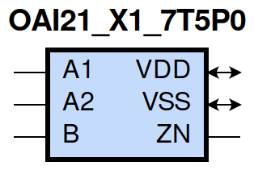
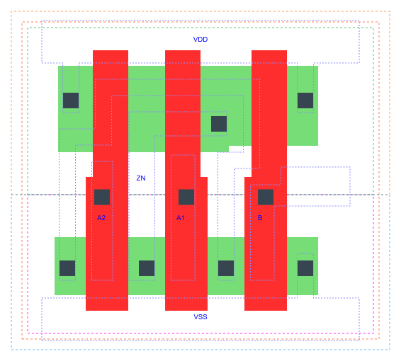

=======================================
gf180mcu_fd_sc_mcu7t5v0__oai21_x1
=======================================

**gf180mcu_fd_sc_mcu7t5v0__oai21_x1 symbol**

**gf180mcu_fd_sc_mcu7t5v0__oai21_x1 schematic**

.. image:: sc7_sch/OAI21_X1_sch.png
    :height: 300px
    :width: 500 px
    :align: center
    :alt: gf180mcu_fd_sc_mcu7t5v0__oai21_x1 schematic

**gf180mcu_fd_sc_mcu7t5v0__oai21_x1 layout**

.. include:: images.rst

OAI21_X1 is a 2-input OR into 2-input NAND, NAND[OR(A1,A2),B], 1X drive strength

|
| Attributes

============= ======================
**Attribute** **Value**
area          17.561600 µm\ :sup:`2`
============= ======================

|
| OUTPUT FUNCTIONS

============== ====================
**Output Pin** **Function**
ZN             (((!A1)&(!A2))|(!B))
============== ====================

|
| TRUTH TABLE FOR ZN

====== ====== ===== ======
**A1** **A2** **B** **ZN**
0      0      ?     1
?      ?      0     1
1      ?      1     0
?      1      1     0
====== ====== ===== ======

|
| FUNCTIONAL SCHEMATIC
| |image527|
| PIN CAPACITANCE (pf)

======= ======== ====================
**Pin** **Type** **Capacitance (pf)**
A2      input    0.0048
A1      input    0.0050
B       input    0.0048
======= ======== ====================

|
| DELAY AND OUTPUT TRANSITION TIME corresponding to min slew and load

+---------------+------------+--------------------+--------------+-------------------+----------------+---------------+
| **Input Pin** | **Output** | **When Condition** | **Tin (ns)** | **Out Load (pf)** | **Delay (ns)** | **Tout (ns)** |
+---------------+------------+--------------------+--------------+-------------------+----------------+---------------+
| A2(HL)        | ZN(LH)     | !A1&B              | 0.0100       | 0.0010            | 0.1359         | 0.0852        |
+---------------+------------+--------------------+--------------+-------------------+----------------+---------------+
| A2(LH)        | ZN(HL)     | !A1&B              | 0.0100       | 0.0010            | 0.0836         | 0.0565        |
+---------------+------------+--------------------+--------------+-------------------+----------------+---------------+
| A1(HL)        | ZN(LH)     | !A2&B              | 0.0100       | 0.0010            | 0.1115         | 0.0848        |
+---------------+------------+--------------------+--------------+-------------------+----------------+---------------+
| A1(LH)        | ZN(HL)     | !A2&B              | 0.0100       | 0.0010            | 0.0633         | 0.0398        |
+---------------+------------+--------------------+--------------+-------------------+----------------+---------------+
| B(LH)         | ZN(HL)     | !A1&A2             | 0.0100       | 0.0010            | 0.1179         | 0.0564        |
+---------------+------------+--------------------+--------------+-------------------+----------------+---------------+
| B(LH)         | ZN(HL)     | A1&!A2             | 0.0100       | 0.0010            | 0.0949         | 0.0409        |
+---------------+------------+--------------------+--------------+-------------------+----------------+---------------+
| B(LH)         | ZN(HL)     | A1&A2              | 0.0100       | 0.0010            | 0.0814         | 0.0392        |
+---------------+------------+--------------------+--------------+-------------------+----------------+---------------+
| B(HL)         | ZN(LH)     | !A1&A2             | 0.0100       | 0.0010            | 0.1198         | 0.1084        |
+---------------+------------+--------------------+--------------+-------------------+----------------+---------------+
| B(HL)         | ZN(LH)     | A1&!A2             | 0.0100       | 0.0010            | 0.1130         | 0.0836        |
+---------------+------------+--------------------+--------------+-------------------+----------------+---------------+
| B(HL)         | ZN(LH)     | A1&A2              | 0.0100       | 0.0010            | 0.1295         | 0.0949        |
+---------------+------------+--------------------+--------------+-------------------+----------------+---------------+

|
| DYNAMIC ENERGY

+---------------+--------------------+--------------+------------+-------------------+---------------------+
| **Input Pin** | **When Condition** | **Tin (ns)** | **Output** | **Out Load (pf)** | **Energy (uW/MHz)** |
+---------------+--------------------+--------------+------------+-------------------+---------------------+
| A1            | !A2&B              | 0.0100       | ZN(LH)     | 0.0010            | 0.1224              |
+---------------+--------------------+--------------+------------+-------------------+---------------------+
| B             | !A1&A2             | 0.0100       | ZN(HL)     | 0.0010            | 0.0335              |
+---------------+--------------------+--------------+------------+-------------------+---------------------+
| B             | A1&!A2             | 0.0100       | ZN(HL)     | 0.0010            | 0.0086              |
+---------------+--------------------+--------------+------------+-------------------+---------------------+
| B             | A1&A2              | 0.0100       | ZN(HL)     | 0.0010            | 0.0086              |
+---------------+--------------------+--------------+------------+-------------------+---------------------+
| A2            | !A1&B              | 0.0100       | ZN(LH)     | 0.0010            | 0.1524              |
+---------------+--------------------+--------------+------------+-------------------+---------------------+
| A1            | !A2&B              | 0.0100       | ZN(HL)     | 0.0010            | 0.0094              |
+---------------+--------------------+--------------+------------+-------------------+---------------------+
| B             | !A1&A2             | 0.0100       | ZN(LH)     | 0.0010            | 0.2483              |
+---------------+--------------------+--------------+------------+-------------------+---------------------+
| B             | A1&!A2             | 0.0100       | ZN(LH)     | 0.0010            | 0.2185              |
+---------------+--------------------+--------------+------------+-------------------+---------------------+
| B             | A1&A2              | 0.0100       | ZN(LH)     | 0.0010            | 0.2411              |
+---------------+--------------------+--------------+------------+-------------------+---------------------+
| A2            | !A1&B              | 0.0100       | ZN(HL)     | 0.0010            | 0.0311              |
+---------------+--------------------+--------------+------------+-------------------+---------------------+
| B(HL)         | !A1&!A2            | 0.0100       | n/a        | n/a               | 0.0410              |
+---------------+--------------------+--------------+------------+-------------------+---------------------+
| A2(LH)        | !A1&!B             | 0.0100       | n/a        | n/a               | 0.0305              |
+---------------+--------------------+--------------+------------+-------------------+---------------------+
| A2(LH)        | A1&!B              | 0.0100       | n/a        | n/a               | -0.0426             |
+---------------+--------------------+--------------+------------+-------------------+---------------------+
| A2(LH)        | A1&B               | 0.0100       | n/a        | n/a               | -0.0329             |
+---------------+--------------------+--------------+------------+-------------------+---------------------+
| A1(LH)        | !A2&!B             | 0.0100       | n/a        | n/a               | 0.0300              |
+---------------+--------------------+--------------+------------+-------------------+---------------------+
| A1(LH)        | A2&!B              | 0.0100       | n/a        | n/a               | -0.0431             |
+---------------+--------------------+--------------+------------+-------------------+---------------------+
| A1(LH)        | A2&B               | 0.0100       | n/a        | n/a               | -0.0111             |
+---------------+--------------------+--------------+------------+-------------------+---------------------+
| A2(HL)        | !A1&!B             | 0.0100       | n/a        | n/a               | 0.0441              |
+---------------+--------------------+--------------+------------+-------------------+---------------------+
| A2(HL)        | A1&!B              | 0.0100       | n/a        | n/a               | 0.0446              |
+---------------+--------------------+--------------+------------+-------------------+---------------------+
| A2(HL)        | A1&B               | 0.0100       | n/a        | n/a               | 0.0392              |
+---------------+--------------------+--------------+------------+-------------------+---------------------+
| B(LH)         | !A1&!A2            | 0.0100       | n/a        | n/a               | -0.0367             |
+---------------+--------------------+--------------+------------+-------------------+---------------------+
| A1(HL)        | !A2&!B             | 0.0100       | n/a        | n/a               | 0.0443              |
+---------------+--------------------+--------------+------------+-------------------+---------------------+
| A1(HL)        | A2&!B              | 0.0100       | n/a        | n/a               | 0.0447              |
+---------------+--------------------+--------------+------------+-------------------+---------------------+
| A1(HL)        | A2&B               | 0.0100       | n/a        | n/a               | 0.0264              |
+---------------+--------------------+--------------+------------+-------------------+---------------------+

|
| LEAKAGE POWER

================== ==============
**When Condition** **Power (nW)**
!A1&!A2&!B         0.1004
!A1&!A2&B          0.1009
!A1&A2&!B          0.1596
A1&!A2&!B          0.1596
A1&A2&!B           0.1599
!A1&A2&B           0.1386
A1&!A2&B           0.1029
A1&A2&B            0.1029
================== ==============

