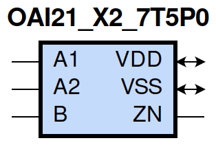
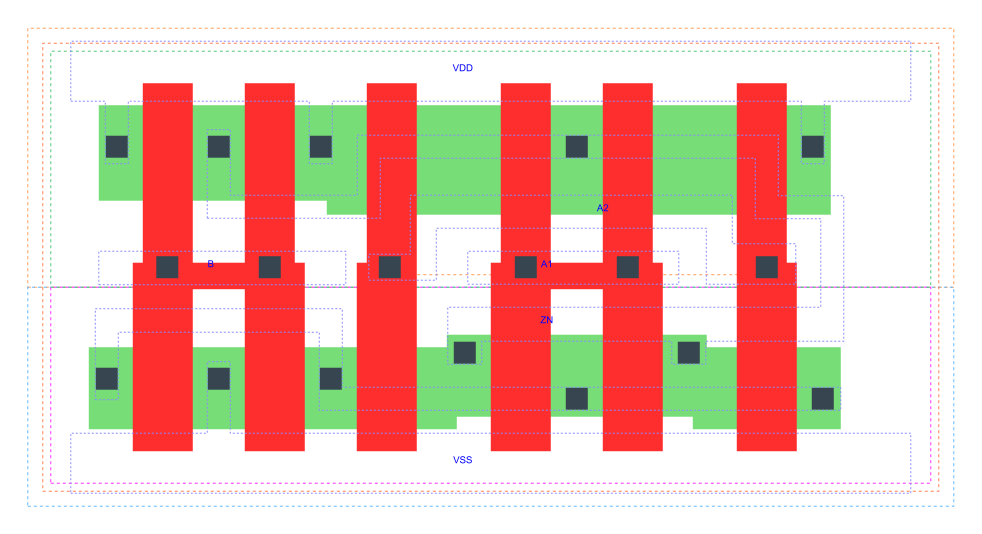

=======================================
gf180mcu_fd_sc_mcu7t5v0__oai21_x2
=======================================

**gf180mcu_fd_sc_mcu7t5v0__oai21_x2 symbol**

**gf180mcu_fd_sc_mcu7t5v0__oai21_x2 schematic**

.. image:: sc7_sch/OAI21_X2_sch.png
    :height: 300px
    :width: 500 px
    :align: center
    :alt: gf180mcu_fd_sc_mcu7t5v0__oai21_x2 schematic

**gf180mcu_fd_sc_mcu7t5v0__oai21_x2 layout**

.. include:: images.rst

OAI21_X2 is a 2-input OR into 2-input NAND, NAND[OR(A1,A2),B], 2X drive strength

|
| Attributes

============= ======================
**Attribute** **Value**
area          32.928000 µm\ :sup:`2`
============= ======================

|
| OUTPUT FUNCTIONS

============== ====================
**Output Pin** **Function**
ZN             (((!A1)&(!A2))|(!B))
============== ====================

|
| TRUTH TABLE FOR ZN

====== ====== ===== ======
**A1** **A2** **B** **ZN**
0      0      ?     1
?      ?      0     1
1      ?      1     0
?      1      1     0
====== ====== ===== ======

|
| FUNCTIONAL SCHEMATIC
| |image530|
| PIN CAPACITANCE (pf)

======= ======== ====================
**Pin** **Type** **Capacitance (pf)**
B       input    0.0085
A2      input    0.0095
A1      input    0.0091
======= ======== ====================

|
| DELAY AND OUTPUT TRANSITION TIME corresponding to min slew and load

+---------------+------------+--------------------+--------------+-------------------+----------------+---------------+
| **Input Pin** | **Output** | **When Condition** | **Tin (ns)** | **Out Load (pf)** | **Delay (ns)** | **Tout (ns)** |
+---------------+------------+--------------------+--------------+-------------------+----------------+---------------+
| B(LH)         | ZN(HL)     | !A1&A2             | 0.0100       | 0.0010            | 0.1064         | 0.0541        |
+---------------+------------+--------------------+--------------+-------------------+----------------+---------------+
| B(LH)         | ZN(HL)     | A1&!A2             | 0.0100       | 0.0010            | 0.0847         | 0.0386        |
+---------------+------------+--------------------+--------------+-------------------+----------------+---------------+
| B(LH)         | ZN(HL)     | A1&A2              | 0.0100       | 0.0010            | 0.0730         | 0.0366        |
+---------------+------------+--------------------+--------------+-------------------+----------------+---------------+
| B(HL)         | ZN(LH)     | !A1&A2             | 0.0100       | 0.0010            | 0.1295         | 0.1168        |
+---------------+------------+--------------------+--------------+-------------------+----------------+---------------+
| B(HL)         | ZN(LH)     | A1&!A2             | 0.0100       | 0.0010            | 0.1227         | 0.0891        |
+---------------+------------+--------------------+--------------+-------------------+----------------+---------------+
| B(HL)         | ZN(LH)     | A1&A2              | 0.0100       | 0.0010            | 0.1400         | 0.1014        |
+---------------+------------+--------------------+--------------+-------------------+----------------+---------------+
| A2(HL)        | ZN(LH)     | !A1&B              | 0.0100       | 0.0010            | 0.1475         | 0.0899        |
+---------------+------------+--------------------+--------------+-------------------+----------------+---------------+
| A2(LH)        | ZN(HL)     | !A1&B              | 0.0100       | 0.0010            | 0.0796         | 0.0545        |
+---------------+------------+--------------------+--------------+-------------------+----------------+---------------+
| A1(HL)        | ZN(LH)     | !A2&B              | 0.0100       | 0.0010            | 0.1184         | 0.0896        |
+---------------+------------+--------------------+--------------+-------------------+----------------+---------------+
| A1(LH)        | ZN(HL)     | !A2&B              | 0.0100       | 0.0010            | 0.0603         | 0.0380        |
+---------------+------------+--------------------+--------------+-------------------+----------------+---------------+

|
| DYNAMIC ENERGY

+---------------+--------------------+--------------+------------+-------------------+---------------------+
| **Input Pin** | **When Condition** | **Tin (ns)** | **Output** | **Out Load (pf)** | **Energy (uW/MHz)** |
+---------------+--------------------+--------------+------------+-------------------+---------------------+
| A1            | !A2&B              | 0.0100       | ZN(LH)     | 0.0010            | 0.2649              |
+---------------+--------------------+--------------+------------+-------------------+---------------------+
| B             | !A1&A2             | 0.0100       | ZN(HL)     | 0.0010            | 0.0640              |
+---------------+--------------------+--------------+------------+-------------------+---------------------+
| B             | A1&!A2             | 0.0100       | ZN(HL)     | 0.0010            | 0.0080              |
+---------------+--------------------+--------------+------------+-------------------+---------------------+
| B             | A1&A2              | 0.0100       | ZN(HL)     | 0.0010            | 0.0081              |
+---------------+--------------------+--------------+------------+-------------------+---------------------+
| A2            | !A1&B              | 0.0100       | ZN(LH)     | 0.0010            | 0.3191              |
+---------------+--------------------+--------------+------------+-------------------+---------------------+
| A1            | !A2&B              | 0.0100       | ZN(HL)     | 0.0010            | 0.0067              |
+---------------+--------------------+--------------+------------+-------------------+---------------------+
| B             | !A1&A2             | 0.0100       | ZN(LH)     | 0.0010            | 0.4705              |
+---------------+--------------------+--------------+------------+-------------------+---------------------+
| B             | A1&!A2             | 0.0100       | ZN(LH)     | 0.0010            | 0.4164              |
+---------------+--------------------+--------------+------------+-------------------+---------------------+
| B             | A1&A2              | 0.0100       | ZN(LH)     | 0.0010            | 0.4613              |
+---------------+--------------------+--------------+------------+-------------------+---------------------+
| A2            | !A1&B              | 0.0100       | ZN(HL)     | 0.0010            | 0.0577              |
+---------------+--------------------+--------------+------------+-------------------+---------------------+
| B(HL)         | !A1&!A2            | 0.0100       | n/a        | n/a               | 0.0717              |
+---------------+--------------------+--------------+------------+-------------------+---------------------+
| A2(LH)        | !A1&!B             | 0.0100       | n/a        | n/a               | 0.0324              |
+---------------+--------------------+--------------+------------+-------------------+---------------------+
| A2(LH)        | A1&!B              | 0.0100       | n/a        | n/a               | -0.0770             |
+---------------+--------------------+--------------+------------+-------------------+---------------------+
| A2(LH)        | A1&B               | 0.0100       | n/a        | n/a               | -0.0584             |
+---------------+--------------------+--------------+------------+-------------------+---------------------+
| A1(LH)        | !A2&!B             | 0.0100       | n/a        | n/a               | 0.0318              |
+---------------+--------------------+--------------+------------+-------------------+---------------------+
| A1(LH)        | A2&!B              | 0.0100       | n/a        | n/a               | -0.0779             |
+---------------+--------------------+--------------+------------+-------------------+---------------------+
| A1(LH)        | A2&B               | 0.0100       | n/a        | n/a               | -0.0203             |
+---------------+--------------------+--------------+------------+-------------------+---------------------+
| A2(HL)        | !A1&!B             | 0.0100       | n/a        | n/a               | 0.0795              |
+---------------+--------------------+--------------+------------+-------------------+---------------------+
| A2(HL)        | A1&!B              | 0.0100       | n/a        | n/a               | 0.0826              |
+---------------+--------------------+--------------+------------+-------------------+---------------------+
| A2(HL)        | A1&B               | 0.0100       | n/a        | n/a               | 0.0704              |
+---------------+--------------------+--------------+------------+-------------------+---------------------+
| B(LH)         | !A1&!A2            | 0.0100       | n/a        | n/a               | -0.0616             |
+---------------+--------------------+--------------+------------+-------------------+---------------------+
| A1(HL)        | !A2&!B             | 0.0100       | n/a        | n/a               | 0.0799              |
+---------------+--------------------+--------------+------------+-------------------+---------------------+
| A1(HL)        | A2&!B              | 0.0100       | n/a        | n/a               | 0.0829              |
+---------------+--------------------+--------------+------------+-------------------+---------------------+
| A1(HL)        | A2&B               | 0.0100       | n/a        | n/a               | 0.0585              |
+---------------+--------------------+--------------+------------+-------------------+---------------------+

|
| LEAKAGE POWER

================== ==============
**When Condition** **Power (nW)**
!A1&!A2&!B         0.1508
!A1&!A2&B          0.1518
!A1&A2&!B          0.2704
A1&!A2&!B          0.2704
A1&A2&!B           0.2710
!A1&A2&B           0.2269
A1&!A2&B           0.1555
A1&A2&B            0.1555
================== ==============

